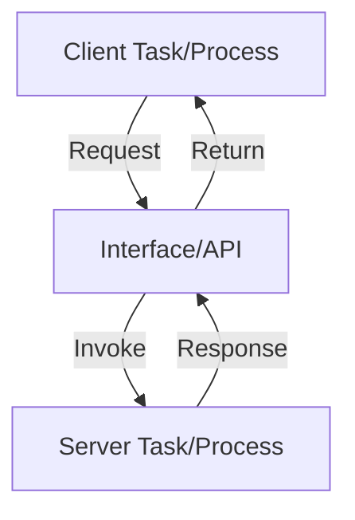
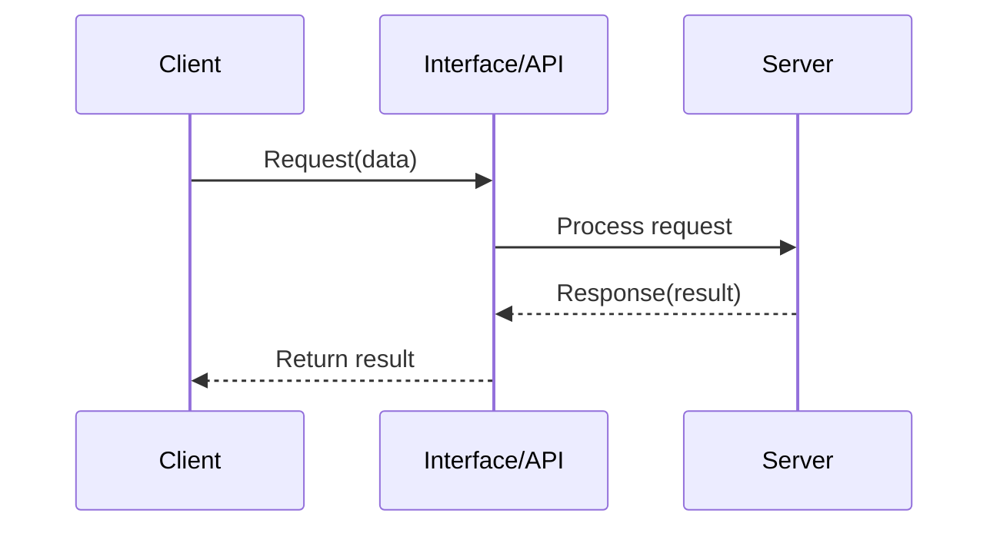
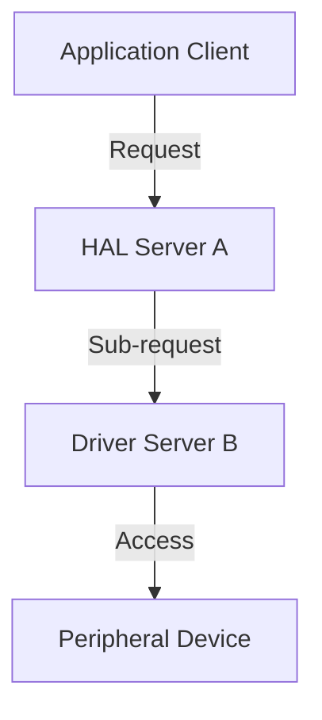

# Client–Server Pattern in Embedded Systems

## Introduction

The client–server pattern specifies a clear and structured separation between requesters (clients) and providers (servers) of resources or services. This model is widely applied in embedded systems, especially in scenarios involving sensor networks, control applications, distributed data acquisition, and communication systems. Understanding this pattern is essential for embedded engineers designing software or firmware architectures where modularity, scalability, or resource control is critical.

This primer explains the client–server paradigm as it applies to embedded systems, its components, workflows, and usage trade-offs. Emphasis is placed on technical formalism, relevant standards, and practical engineering concerns.

## Concept and Context

### Definition

In the client–server pattern, two roles are established:

- **Client**: Initiates requests for resources or services.
- **Server**: Provides resources or services in response to client requests.

This separation enables modularity, clearer lifecycle management, and often improves maintainability and scalability of embedded software.

### Applicability in Embedded Systems

Unlike enterprise or cloud environments where client–server architectures are often distributed over networks, embedded system implementations are frequently local: clients and servers may exist within the same device, connected via intraprocess or interprocess communication, or even as different tasks on a real-time operating system (RTOS). Nevertheless, the logical distinction persists.

Key application domains include:

- Distributed sensor data collection (client: aggregator; server: sensor node)
- Control systems (client: controller; server: actuator interface)
- Communication stacks (client: user logic; server: network protocol handler)
- Peripheral device access (client: application; server: HAL or driver)

### Comparison to Related Patterns

#### Broker Pattern

The client–server model should be distinguished from the broker pattern, where a broker mediates between entities. Whereas brokers decouple communication to facilitate interaction among multiple, possibly unknown participants, the client–server pattern typically supports direct, well-known, synchronous or asynchronous interactions between identified endpoints.

#### Event-driven Software

While event-driven architectures are compatible with client–server logic, they emphasize the propagation of state changes (events) instead of explicit service requests.

## Core Structure and Components

### Basic Architecture

The client and server engage in a defined exchange protocol, often encapsulated in function calls, message passing, or protocol exchanges. Embedded systems may use various interconnect mechanisms, depending on physical connectivity and performance requirements.

#### Key Components

1. **Client entities**: Application logic, tasks, or processes that need to consume data, control hardware, or access shared resources.
2. **Server entities**: Service providers such as task handlers, device drivers, middleware modules, or even external subsystems.
3. **Interface**: The protocol, Application Programming Interface (API), or message schema defining the client–server communication.

#### Typical Communication Models

- **Synchronous calls**: Client blocks until response is received (common for hardware abstraction).
- **Asynchronous requests**: Client sends request and proceeds; response delivered via callback, event, or notification.

### Minimal Model: Diagram



## Interaction Workflow

### Sequence of Operations

The following Mermaid sequence diagram illustrates the typical synchronous request-response flow:



Asynchronous variations may use messages or events instead of direct procedure calls.

### Practical Example: Sensor Data Query

- **Client**: Data aggregator (e.g., main application task)
- **Server**: Temperature sensor driver
1. Client requests latest temperature value.
2. Server acquires sensor data and returns the value.

## Implementation Approaches in Embedded Context

### Intra-device Patterns

#### Synchronous Function APIs

Frequently, an RTOS or bare-metal firmware exposes service APIs to application tasks. These may be direct function calls that block until the service operation (e.g., data acquisition) completes.

#### Inter-task Communication

For multi-tasked systems, requests and responses may occur via RTOS-managed queues, semaphores, or message passing. For instance, a control task may post requests to a queue consumed by a server task responsible for hardware actuation.

### Inter-device Client–Server

In distributed embedded systems, communication may involve physical networks (e.g., SPI/I2C buses, UART, CAN, or even TCP/IP in IoT contexts). Standard protocols—such as Modbus (for industrial control), OSPF (for real-time transport), or MQTT (for lightweight IoT communications)—often implement client–server logic.

#### Example: Client–Server Across a CAN Bus

- **Client**: Control unit sends command
- **Server**: Remote actuator interface receives and executes command

```mermaid
flowchart LR
    CU[Control Unit (Client)]
    CAN[CAN Network]
    AI[Actuator Interface (Server)]
    CU -- "Command Frame" --> CAN
    CAN -- "Deliver Frame" --> AI
    AI -- "Status Response" --> CAN
    CAN -- "Return Frame" --> CU
```

### Protocols and Standards

- **Modbus** (RTU or TCP): Classic master–slave (client–server) protocol for industrial devices.
- **OPC UA**: Service-based model for industrial automation, with explicit client–server interactions.
- **TCP/IP**: Widely used in embedded communications, fundamentally supports client–server exchanges at multiple layers.
- **CoAP** (RFC 7252): Designed for constrained nodes; RESTful client–server model.
- **gRPC** and **Protobuf**: Increasingly adopted in sophisticated embedded Linux systems for RPC over networks.

## Design Considerations

### Interface Definition

- **Clarity**: Well-specified APIs or message formats are critical for interoperability and maintainability.
- **Versioning**: API and protocol evolution should be managed to avoid breaking existing clients or servers.
- **Error Handling**: Interfaces must define clear error and exception semantics. 

### Synchronization and Concurrency

- **Blocking vs. Non-blocking**: Blocking calls may reduce complexity but can affect system responsiveness.
- **Deadlocks**: Improper resource locking or cyclic dependencies between clients and servers can stall embedded systems.

> **Warning**
> Deadlocks frequently occur if clients call into servers that hold locks on shared resources also needed by clients.

### Scalability

The client–server model scales naturally in embedded environments with increasing device complexity. Servers can multiplex requests from multiple clients, or replication can provide load balancing among identical servers.

### Latency and Real-time Behavior

Client–server interactions, particularly over networks or in multi-threaded environments, introduce latency:

- **Local calls**: Generally fast but may require priority assignment.
- **Remote calls**: Subject to transmission delays, protocol overhead, and possible contention.

> **Alert**
> For real-time control loops, ensure the worst-case round-trip latency fits within allowable timing constraints.

### Resource Constraints

Embedded servers often have limited buffer space, computational power, and concurrent transaction capacity.

> **Tip**
> Carefully size queues, stack, and heap allocations if the server multiplexes multiple clients to avoid resource exhaustion.

### Fault Tolerance and Robustness

Lossy links, partial failures, or server crashes—typical in distributed embedded systems—require robust error detection and recovery strategies.

- **Timeouts**: Clients should implement timeouts and retries.
- **Failover**: Redundant servers or tasks may be required for reliability in safety-critical systems.

## Architectural Variations

### Multi-client, Single-server

A single server provides services to one or more clients. Queuing and arbitration logic may be necessary to serialize or multiplex concurrent requests.

### Multi-server Implementations

Clients issue requests to one of several possible servers, either for load balancing, redundancy, or partitioned functionality (e.g., different sensor types).

### Hierarchical Chaining

Servers may themselves act as clients to other servers, forming chains or trees of service relationships (request propagation).



### Proxy and Gateway Patterns

In extended networked systems, intermediate proxies may forward client requests to servers. Gateways adapt protocols between domains.

> **Note**
> Diagram to be added later: "Gateway-mediated Client–Server Communication"

## Security Considerations

While often overlooked in embedded systems, security is increasingly necessary:

- **Authentication and Authorization**: Critical for client access control.
- **Input Validation**: Servers must validate all client-provided data.
- **Isolation**: In partitioned RTOS or hypervisor environments, careful control of interfaces can limit the impact of compromised clients or servers.

> **Alert**
> Always validate and sanitize inputs from client requests, especially if exposed over physical network interfaces.

## Testing and Verification

Ensuring correct client–server interactions requires:

- **Interface mocks or fakes**: Used for unit testing clients or servers in isolation.
- **Integration and system testing**: End-to-end validation with timing and error injection.
- **Formal methods** or **model checking**: Useful in high-assurance or safety-critical applications.

## Practical Pitfalls and Remedies

- **Undocumented side-effects**: Servers should avoid modifying global state outside the explicit interface contract.
- **Implicit dependencies**: Keep client–server coupling visible and designed—hidden dependencies are a common source of future bugs.
- **Overengineering**: Use client–server where modularity pays off; avoid unnecessary abstraction for simple hardware access.

> **Tip**
> Start with clear interface contracts and expand complexity only as justified by maintainability or scalability needs.

## Summary Table: Client–Server Pattern Key Attributes

| Attribute               | Description                                               |
|-------------------------|----------------------------------------------------------|
| Separation of concerns  | Clients and servers have distinct roles/implementation   |
| Communication style     | Request-response (sync/async), API call, message passing |
| Coupling                | Well-defined, explicit interfaces                        |
| Scalability             | Supports n clients : m servers                           |
| Resource sharing        | Controlled and mediated by server logic                  |
| Typical protocols       | Modbus, CoAP, TCP/IP, custom APIs                        |

## Conclusion

The client–server pattern is foundational in embedded software architecture, from simple driver layering to complex distributed sensor networks. By enforcing separation between requesters and providers and encapsulating resources behind well-defined interfaces, this pattern facilitates code organization, testability, and maintainability. 

Its effectiveness depends on carefully specified interfaces, robust error handling, and diligent resource management, especially under the constraints and requirements unique to embedded environments. Applying the client–server pattern judiciously enables scalable, reliable, and maintainable embedded systems.

---

**End of Document**