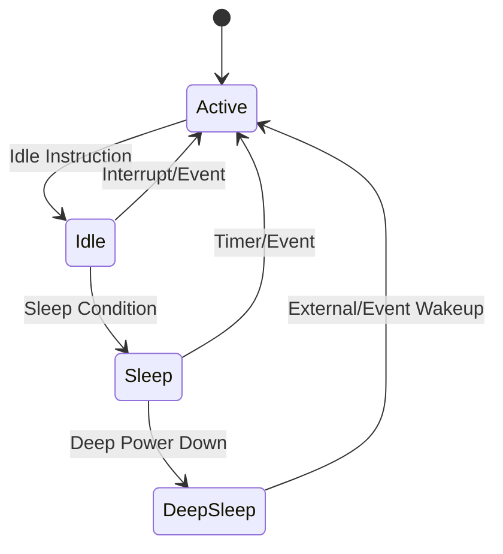
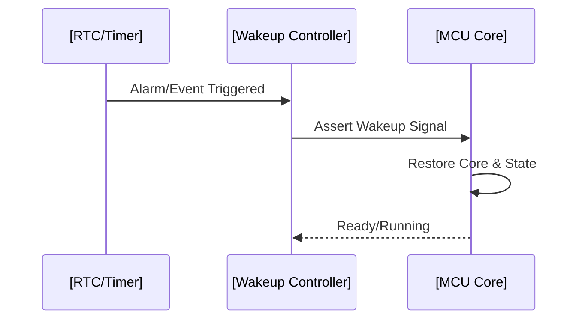
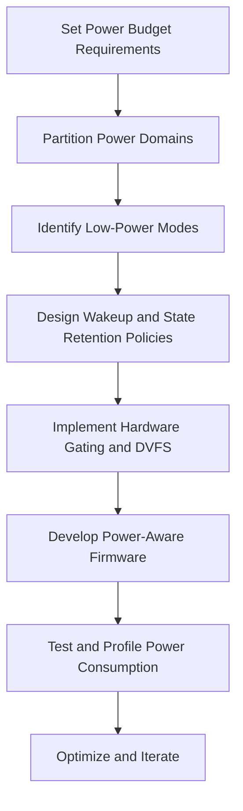
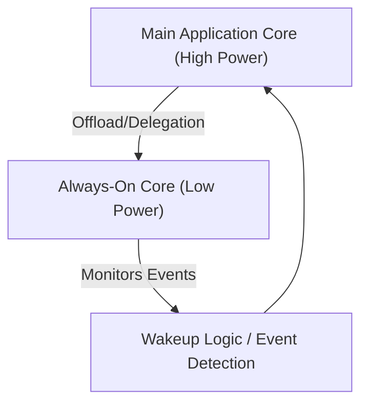

# Power Management in Embedded Systems

## 1. Introduction

Effective power management in embedded systems is a critical concern that fundamentally impacts product viability, performance, and reliability. As embedded devices increasingly permeate sectors such as IoT, automotive, healthcare, and industrial automation, energy efficiency has become a core design criterion. Many embedded applications deploy on battery-powered or energy-harvesting platforms, making consumption optimisation essential to prolong operation and deliver sustainable solutions.

In this context, power management denotes the set of architectural techniques, hardware features, and software strategies designed to optimize energy usage based on application requirements, system constraints, and operational contexts. This document systematically reviews the core concepts, architectural features, design techniques, and practical considerations relevant to power management in contemporary embedded systems.

---

## 2. Technical Context and Motivation

Embedded systems frequently operate under strict energy budgets. Unlike general-purpose computers, embedded platforms must often meet requirements such as:

- Extended battery life (months or years of autonomy)
- Minimal thermal output
- Compact form factors that restrict battery capacity
- Intermittent or unreliable access to recharging infrastructure

Common use cases include wireless sensor nodes, IoT endpoints (such as those using NB-IoT or LoRaWAN), implantable medical devices, and portable instrumentation.

Power management, therefore, is not solely about energy saving but balancing functionality, performance, responsiveness, and longevity—often under tight resource constraints and cost pressures.

---

## 3. Core Concepts in Power Management

### 3.1 Power Domains and Subsystems

Most embedded designs feature discrete power domains—clusters of components that can be independently powered up or down. This enables fine-grained control over system energy use:

- **Core domains**: Main MCU/CPU, where computational instructions execute.
- **Peripheral domains**: Interfaces such as UART, SPI, I²C, ADC, timers.
- **Memory domains**: SRAM, EEPROM, Flash.
- **Communication domains**: Wireless radio modules (e.g., NB-IoT, BLE, ZigBee).
- **Sensor/Actuator domains**: Sensor circuits, feedback controllable actuators.

This partitioning allows aggressive power gating or reduction for inactive subsystems while maintaining essential services elsewhere.

### 3.2 Active, Idle, and Low-Power States

Embedded system operation is characterized by transitions between multiple power states:

- **Active/Run Mode**: Full voltage/frequency, all circuits powered. Used during computation, data acquisition, or communication.
- **Idle Mode**: CPU halted, but peripherals or memory remain powered for fast wake.
- **Sleep/Standby Modes**: Further circuits are powered down, disabling clocks, lowering voltage, and reducing current consumption.
- **Deep Sleep or Hibernation**: Minimal retention—just enough circuit state/data preserved for restart.

The benefit of each state is a function of the power saved versus system wakeup latency and state retention requirements.

#### State Diagram: Typical MCU Power States



---

### 3.3 Power Consumption Characteristics

The main contributors to energy use in embedded systems are:

- **Dynamic power**: Switching activity in digital logic, typically proportional to V²·f (voltage squared times frequency).
- **Static (leakage) power**: Sub-threshold/leakage currents in transistors, even when logic is idle.
- **Peripheral consumption**: Constant drain from interfaces and analog blocks.
- **Memory consumption**: Continuous draw for retention, access energy particularly for Flash/EEPROM.

---

## 4. Architectural Approaches to Power Management

### 4.1 Hardware Techniques

#### 4.1.1 Voltage and Frequency Scaling

- **Dynamic Voltage and Frequency Scaling (DVFS)**: System modulates core voltage and oscillator frequency to match computational demand. Lowering both significantly reduces dynamic consumption.

#### 4.1.2 Clock Gating

- Precise control over which system clocks propagate to which logic blocks. Disabling clock supply can completely halt unnecessary digital circuits.

#### 4.1.3 Power Gating

- Silicon blocks can be electrically isolated (power rails switched off) when inactive. This technique is vital for reducing leakage in idle/sleep states.

#### 4.1.4 Wakeup Controllers

- Dedicated hardware monitors events (e.g., pin transitions, communication activity, internal timers) to bring the system out of deep-sleep states quickly without waking the main CPU.

#### 4.1.5 Retention Modes

- Specialized memory blocks retain key system variables, stack, or state registers, enabling fast resume without full reinitialization.

```mermaid
flowchart TD
    A[Power Source] --> B[PMU (Power Management Unit)]
    B --> C[Voltage Regulator]
    C --> D[MCU Core]
    C --> E[Peripherals]
    C --> F[Memory]
    C --> G[Wireless Radio]
    B --> H[RTC/Wakeup Timer]
    H -->|Wakeup Event| D
    D --|Clock Gating/Power Gating| D
```
_**Mermaid Diagram 2:** Block-level overview of the power distribution and gating architecture in a typical embedded platform._

---

### 4.2 Software Strategies

#### 4.2.1 Sleep Management Algorithm

Embedded firmware must efficiently decide when and how to enter low-power modes, orchestrating:

- When to transition between states
- Preservation of critical context/state
- Peripheral wake-time prediction
- Coordinated sleep scheduling (especially in RTOS/multitasking systems)

#### 4.2.2 Peripheral and IO Control

Application software should deactivate unused peripherals, shut down interfaces, and tri-state or pull-down unused GPIOs to avoid leakage paths.

#### 4.2.3 Event-Driven Architectures

Design pattern where MCU remains in low-power mode by default and wakes only upon significant events (interrupts, communication, or timer expiry).

#### 4.2.4 Power-Aware Scheduling

In multitasking RTOS environments, task scheduling should favor long sleep intervals and batch resource use to minimize frequent wakeups.

---

## 5. Wakeup Strategies

### 5.1 Event Sources for Wakeup

Typical embedded MCUs support diverse hardware sources for wakeup:

- **Timers / RTC**: Periodic wake for sampling, synchronization, or keep-alive transmissions.
- **GPIO/External Interrupts**: Physical sensor activity, button presses, or signal transitions.
- **Communication Events**: Traffic reception on UART, SPI, I²C, CAN, or wireless.
- **Analog Comparator**: Threshold crossings for analog signals, enabling immediate response.

### 5.2 Wakeup Timing and Latency

- **Wakeup latency** is critical, especially for real-time or safety-critical systems. It can range from nanoseconds (shallow sleep) to milliseconds (deep hibernation), depending on state retention and reinitialization requirements.
- **Migration of processing**: Sometimes, simple event handling is offloaded to low-power co-processors or dedicated sub-controllers to avoid main MCU power-up.

#### Example Flow: Deep Sleep to Active on RTC Event


---

## 6. Energy Consumption Optimization

### 6.1 Techniques for Reducing System Consumption

1. **Duty Cycling**: The system aggressively minimizes the percentage of time spent in high-power/active modes.
2. **Adaptive Sampling**: Misalign sampling rates to match input signal dynamics or application requirements.
3. **Aggressive Peripheral Shutdown**: Deactivate sensors, radios, displays during inactivity.
4. **Selective State Retention**: Only essential system state is retained during sleep to maximize shutdown depth.
5. **Subsystem Partitioning**: Offloading always-on or high-duty-cycle tasks to energy-minimal submodules (e.g., an ultra-low-power co-processor).

### 6.2 Activity Profiling and Measurement

Engineering best practice requires that engineers profile real power consumption in all operating modes:

- Use of shunt resistors, high-side monitors, or dedicated energy profilometers (e.g., Joulescope, Otii Arc).
- Instrumentation for both average and peak currents, as well as event-tied current spikes.

> :warning: **Caution:** Measured power can differ significantly from vendor-provided datasheet numbers, especially due to board-level leakages, real-world workloads, and temperature variation.

---

## 7. Power Management Workflows

Effective embedded power management depends on well-defined design and validation workflows.

### 7.1 Typical Power Management Design Flow



### 7.2 Integration in Application Development

- Sleep scheduling and power state APIs must be integrally supported within application code and OS/RTOS abstraction layers.
- Use of industry standards (e.g., Advanced Configuration and Power Interface (ACPI) for some platforms), and specific APIs offered by MCU vendors.
- Application logic often must tolerate delayed or lost events due to deep sleep/wakeup latencies.

---

## 8. Standards, Protocols, and Relevant Specifications

While power management is often platform-specific, certain standards and industry conventions influence or regulate implementation:

- **ACPI (Advanced Configuration and Power Interface):** Defines interface standards for power state control (mainly x86 platforms, some ARM SoCs).
- **IEEE 802.15.4:** Defines duty cycling and low-power MAC for wireless sensor networks.
- **Bluetooth Low Energy (BLE, part of Bluetooth 4.0+):** Defines low-power radio modes, connection intervals, and advertising channels geared for energy minimization.
- **NB-IoT (Narrowband IoT):** Cellular standard (3GPP TS 36.300) specifying PSM/eDRX modes for extended device autonomy.
- **LwM2M (Lightweight Machine to Machine):** Application-layer protocol with provisions for power-sensitive device management.

> :bulb: **Tip:** Always consult target platform datasheets and application notes for precise mode control procedures and caveats.

---

## 9. Implementation Challenges and Engineering Considerations

### 9.1 Oscillator Start-Up

Deep sleep modes may power down high-frequency oscillators to save energy, requiring non-negligible reactivation time. System designers need to:

- Choose oscillator types/trade off startup times against power.
- Buffer time-critical signals or events through always-on low-power circuits.

### 9.2 Data Retention and Corruption

Deep sleep modes can expose RAM or peripheral state to corruption; careful design must ensure:

- Critical system data is backed up to non-volatile memory if needed.
- System resumes correctly from any intermediate state, even after unexpected resets.

### 9.3 Debug and Trace Limitations

Low-power operation can complicate use of traditional debugging tools, as clocks and JTAG/SWD may be inactive. Solutions include:

- Use of low-power debug modes by specific MCUs.
- Software-based event trace buffers flushed after wakeup.

> :warning: **Note:** Inadequate debug during low-power operation is a frequent source of complex, hard-to-reproduce field bugs.

### 9.4 Peripheral and IO Leakage

Unmanaged GPIOs, analog blocks, or unused subsystems can account for significant leakage. Diligent software and schematic design is required to:

- Set unused pins to low-leakage states.
- Power-down or tri-state external circuits.

---

## 10. Common Pitfalls and Mitigation

- **Overuse of Active Mode:** Firmware or OS tasks prevent deep sleep by unnecessary polling or background activity, drastically shortening battery life.
- **Failure to Configure Low Power Peripheral Modes:** Many MCUs require explicit enabling of low-power features for each peripheral; defaults are often not optimized for minimal power.
- **Race Conditions During Wakeup:** Improper sequencing of power domains or wake logic may cause data loss or deadlocks.
- **Inadequate Debouncing of Wake Events:** Spurious wakeups due to noise create power-hungry event storms.
- **Inaccurate Power Profiling:** Relying only on theoretical or design-time estimation, without actual board- or field-level measurement, can misrepresent real consumption.

> :warning: **Warning:** Even minor software misconfigurations can inflate long-term power use by orders of magnitude, particularly for deeply embedded or remote IoT devices.

---

## 11. Variation Across MCU Architectures

### 11.1 Ultra-Low-Power MCUs

Vendors such as TI (MSP430), Nordic Semiconductor (nRF Series), STMicroelectronics (STM32L), and others provide MCUs featuring:

- Multiple sleep depths (e.g., STOP, STANDBY, SHUTDOWN)
- Sub-microamp current consumption in deepest sleep
- Precise wakeup and peripheral retention options
- Built-in ultra-low-power oscillators and wakeup RTCs

### 11.2 Dual-Core and Always-On Domains

Modern SoCs may partition high-performance and ultra-low-power cores:


_**Mermaid Diagram 3:** Dual-core partitioning for power management, with an always-on sub-core handling event monitoring in lowest-power state._

---

## 12. Emerging Trends

### 12.1 Energy Harvesting

- Integration of solar, kinetic, thermal, or RF energy sources enables indefinite operation, provided ultra-low quiescent currents and efficient sleep scheduling are achieved.

### 12.2 AI/ML Optimized Power Management

- ML models are increasingly used to predict optimal wake times or adapt activity to workload patterns, further minimizing power while keeping responsiveness.

### 12.3 Secure Power Management

- With increased connectivity, security modules (crypto accelerators, secure bootloaders) must also support or integrate with low-power strategy—without compromising data confidentiality.

---

## 13. Conclusion

Power management in embedded systems is a multidimensional engineering domain intertwining hardware design, firmware strategy, architectural partitioning, and measurement-driven optimization. The rapid evolution of IoT and edge devices, coupled with increasing regulatory and environmental focus on energy efficiency, demands that embedded engineers possess acute familiarity with both foundational and emerging power management techniques.

A successful low-power design will match application needs to the hardware's full capabilities—enabling intelligent sleep management, precise wakeup control, meticulous consumption profiling, and robust software strategies. Understanding key concepts, typical workflows, best practices, implementation challenges, and the constraints imposed by hardware and protocols is fundamental to building reliable, efficient, and sustainable embedded solutions.

---

## 14. Additional Visuals

> :memo: **Note:** Diagram to be added later: "Practical Power Profiling Workflow for Embedded Platforms" (suggested: workflow diagram from hardware setup through measurement, logging, and result analysis).

---

## 15. References to Standards and Specifications

- IEEE 802.15.4 MAC/PHY for low-power wireless
- BLE Core Specification (Bluetooth SIG)
- 3GPP TS 36.300 (NB-IoT PSM/eDRX)
- ACPI Specification (UEFI Forum)
- MCU vendor datasheets and application notes for low-power modes and wakeup source configuration

---

> :bulb: **Tip:** For every new embedded design, treat power management as an iterative, whole-system concern. Early, holistic planning yields exponential returns in device lifetime and reliability.