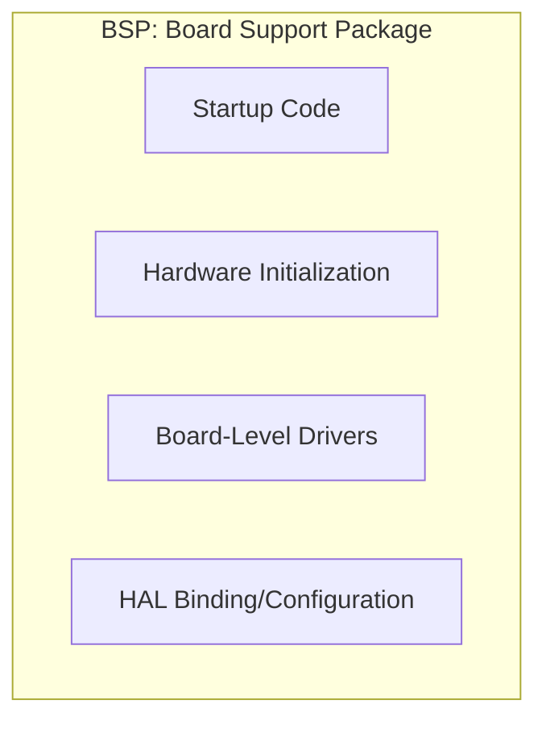
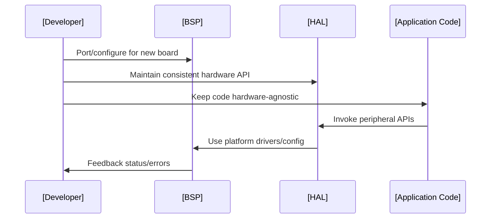
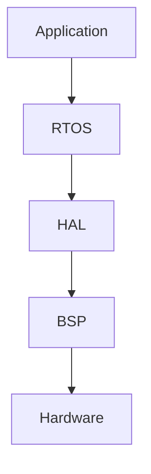

# Hardware Abstraction Layer (HAL) and BSP Concepts

## Introduction

In embedded systems, software engineers often face the challenge of designing applications that must run on multiple hardware platforms or migrate across device families. To address hardware heterogeneity and promote software portability, embedded systems have developed architectural patterns based on abstraction layers. Two key constructs central to this modular approach are:

- **Hardware Abstraction Layer (HAL)**
- **Board Support Package (BSP)**

This primer provides a technically precise overview of these concepts, their typical structure, operational workflow, major variations, and key engineering considerations for embedded software development.

---

## The Motivation for Abstraction Layers

Direct interaction between application code and hardware peripherals is undesirable for the following reasons:

- **Portability:** Application code coupled tightly to hardware is non-portable; migrating to new platforms demands extensive rework.
- **Maintainability:** Hardware-specific changes might affect application stability.
- **Testability:** Hardware dependencies complicate simulation and unit testing.

Abstraction layers such as HAL and BSP decouple application logic from specific hardware, enabling portable, maintainable, and testable designs. This is critical for embedded systems, where product lines frequently evolve with changing microcontrollers, peripherals, or board revisions.

---

## Key Definitions

### Hardware Abstraction Layer (HAL)

The HAL is a software layer providing high-level APIs for hardware features (e.g., GPIO, UART, timers), abstracting away register-level and hardware-specific details. Its primary function is to offer a uniform interface to hardware resources irrespective of underlying variations.

### Board Support Package (BSP)

The BSP is a software collection tailored to a specific hardware platform (a board or SoC). It typically configures low-level hardware settings, enables startup/initialization, and may include or reference the HAL. The BSP serves as the porting layer when targeting a new platform.

---

## Abstraction Layer Architecture

Abstraction layers are typically arranged as follows:

```mermaid
flowchart TD
  App[Application Code] --> OSRTOS[OS/RTOS/App Framework]
  OSRTOS --> HAL[Hardware Abstraction Layer (HAL)]
  HAL --> BSP[Board Support Package (BSP)]
  BSP --> Drivers[Device Drivers (peripherals, hardware registers)]
  Drivers --> Hardware[Physical Hardware (SoC, Board, Peripherals)]
```

- **Application Code**: Implements product functionality, free from direct hardware dependencies.
- **OS/RTOS/App Framework**: (If present) provides scheduling, resource management, and middleware.
- **HAL**: Offers standard APIs for peripherals, masking hardware details.
- **BSP**: Handles board-specific configuration, initialization, and startup.
- **Device Drivers**: Interface with and manage actual hardware registers and peripherals.

---

## HAL: Detailed Structure and Role

### Interface and Layering

The HAL defines a generic API for hardware functions such as:

- Pin control (digital I/O)
- Serial communication (UART, SPI, I2C)
- Timers/counters
- ADC/DAC
- Interrupt management

The actual implementation of these APIs will access hardware registers or invoke lower-level drivers, but their signatures and semantics remain consistent across supported platforms. Some systems provide the HAL as:

- A flat set of C functions (common in microcontroller SDKs).
- Object-oriented interfaces (for C++ or model-driven tools).
- Abstracted OS driver APIs (for systems with RTOS).

#### Example: HAL API Call vs. Register-Level Access

```c
// HAL abstracted call
HAL_GPIO_WritePin(GPIO_PORTA, GPIO_PIN_5, GPIO_PIN_SET);

// Hardware-specific register access
PORTA->OUT |= (1 << 5);
```

### Implementation Patterns

HALs may use:

- **Thin Abstraction:** Minimal indirection, simply mapping generic calls to hardware functions.
- **Rich Feature Layer:** Emulated functionality to create uniformity where hardware differs (e.g., software-based PWM on hardware that lacks PWM).

---

## BSP: Detailed Structure and Role

The BSP encompasses all the software necessary to boot and initialize a specific board, typically including:

- **Startup files** (boot code, interrupt vector tables)
- **Low-level hardware initialization** (clock, power, memory controller, external buses)
- **Board-level drivers** (LEDs, user buttons, sensors, display controllers)
- **Device enumeration/configuration tables**
- **Linkage to HAL implementations**

BSPs may be delivered as:

- Standalone packages/bundles per board by semiconductor vendors or third parties.
- Platform-specific modules within larger SDKs.
- Add-ons to RTOS distributions or middleware stacks.

### BSP Composition



---

## Relationship and Boundaries between HAL and BSP

In industry practice, the relationship between HAL and BSP varies:

- **HAL Inside BSP:** BSP contains/depends on a HAL layer for abstracting board features.
- **HAL Outside BSP:** HAL sits above BSP, using BSP to implement the abstracted interface.
- **Combined/Unified Layer:** Some SDKs combine HAL and BSP concepts into a single set of modules.

**Key Point:** The distinction is less relevant to the application developer than having a clear, stable API boundary above the hardware-specific layers.

---

## Engineering Workflow with HAL/BSP

### Typical Development Workflow

1. **Board Bring-up (BSP focus):**
   - Configure clocks, memory, peripherals.
   - Verify CPU is running; setup interrupt vectors.
   - Initialize system peripherals and board-specific components.

2. **Device Abstraction (HAL focus):**
   - Write/port generic hardware access code using HAL APIs.
   - Validate on different boards/platforms using respective BSP implementations.

3. **Application Development:**
   - Implement core logic, referencing only HAL APIs for hardware access.
   - Integrate with OS/RTOS/middleware as needed.

4. **Porting to New Hardware:**
   - Supply/rewrite BSP for new board.
   - Valid HAL implementation ensures application requires minimal or no changes.



---

## Standards, Reference Architectures, and Industry Practice

While there are no universal formal standards for HAL/BSP, common conventions are established by:

- **CMSIS (Cortex Microcontroller Software Interface Standard):** ARM's standard for ARM Cortex-M devices, specifying HAL-layer APIs (CMSIS-Driver) and startup code.
- **POSIX/SUBPOSIX:** For larger embedded systems/software, minimal hardware abstraction APIs may be offered per these standards.
- **Vendor SDKs:** (e.g., STMicroelectronics STM32Cube HAL, NXP MCUXpresso SDK, Microchip ASF) frequently offer their own HAL/BSP conventions, sometimes integrating with RTOSes.

---

## Design Variations and Common Architectures

### Thin HAL vs. Rich Abstraction

- **Thin HAL:** Simple wrappers with 1:1 mapping to hardware features. Easier to maintain but less portable across significantly different hardware.
- **Rich HAL:** May emulate or expose advanced features, creating apparent uniformity but increasing complexity and possible performance impact.

### Integrated RTOS and HAL

Some real-time operating systems provide or mandate a specific HAL/BSP interface to support their portability (e.g., Zephyr RTOS, FreeRTOS+).



---

## Performance Considerations

- **Overhead:** Each abstraction (HAL, BSP) introduces additional function calls, possibly impacting execution time—especially in tight loops or interrupt contexts.
- **Inlining/Optimization:** Well-designed HALs may minimize impact with static inlining and conditional compilation.
- **Direct Access:** In performance-critical or timing-sensitive code, direct access to drivers or hardware may be permitted via "escape hatches", but this violates portability.

> **:warning: Warning**
> Excessive use of abstraction layers in performance-critical code can introduce unpredictable latencies. Always profile and validate system performance when adopting deep abstraction.

---

## Implementation Challenges and Common Pitfalls

- **Leaky Abstractions:** If the HAL API fails to cover all device functionality, applications may need to "peek" beneath the abstraction, reducing portability.
- **Feature Mismatch:** Not all hardware peripherals are identical; the HAL must sometimes provide "weak" or fallback features that behave differently across hardware.
- **API Stability:** Changing HAL or BSP interfaces after application development can break builds or introduce subtle bugs.
- **BSP Reusability:** Over-customization for specific boards may make BSPs hard to reuse across variations.

> **:bulb: Tip**
> Consider using conditional macros or build configurations to select platform- or board-dependent implementations without polluting high-level application code.

---

## Practical Engineering Considerations

- **Versioning:** Carefully manage versions of HAL/BSP as part of your build and release process.
- **Documentation:** Thoroughly document all API contracts and expected behaviors. Provide clear migration paths if APIs evolve.
- **Testing:** Mock HAL APIs for unit tests and CI. Hardware-in-loop (HIL) testing ensures integrated correctness.
- **Integration Points:** HAL/BSP must be coordinated with bootloaders, secure element drivers, and device power management.

---

## Summary Table: HAL vs BSP

| Feature                        | Hardware Abstraction Layer (HAL)     | Board Support Package (BSP)       |
|--------------------------------|--------------------------------------|-----------------------------------|
| Primary Scope                  | API abstraction for hardware         | Board-specific initialization     |
| Delivered By                   | IC vendor, OS vendor, 3rd party      | Board vendor, 3rd party, user     |
| Target                         | Per hardware family/peripheral type  | Per board/SOC                     |
| Exposed To Application         | Yes                                  | Typically, no (used indirectly)   |
| Changes When Porting           | Typically, no                        | Yes                               |
| Examples                       | STM32Cube HAL, ARM CMSIS             | Evaluation board BSP from vendor  |

---

## Advanced Topics and Variations

### Dynamic HAL/BSP Binding

For systems with runtime hardware detection (e.g., hardware plug-ins), a dynamic HAL/BSP binding mechanism is sometimes used to select appropriate drivers and configurations.

### BSP Extensions and Middleware

BSPs may provide middleware hooks for additional system services (e.g., file systems, communication stacks), leveraging board features beyond basic initialization.

### Security Considerations

HAL and BSP layers may require secure review, especially for secure boot, hardware crypto engines, and isolation features.

---

## Conclusion

The use of Hardware Abstraction Layers and Board Support Packages is foundational in embedded system architecture, promoting software portability, maintainability, and robust engineering workflows. Effective use of these abstractions delivers practical benefits but requires careful consideration of system requirements, performance, and long-term support strategies.

By providing well-defined boundaries between application code and hardware-specific implementation, HAL and BSP approaches significantly reduce engineering effort when scaling across hardware variants and future-proof embedded application architectures.

---

> **:information_source: Note**
> If a block-level diagram highlighting interactions among multiple HALs/BSPs in heterogeneous SoCs is required, a "diagram to be added later" placeholder may be inserted.