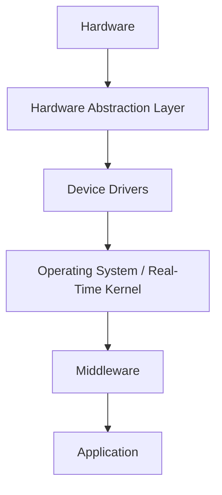
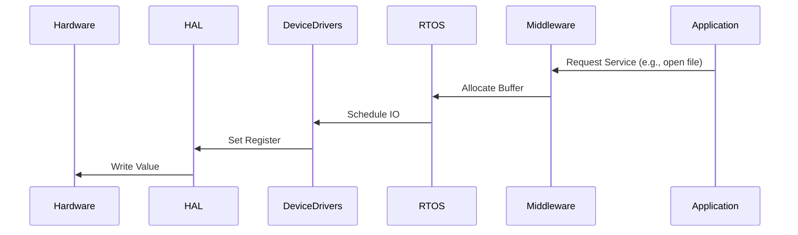
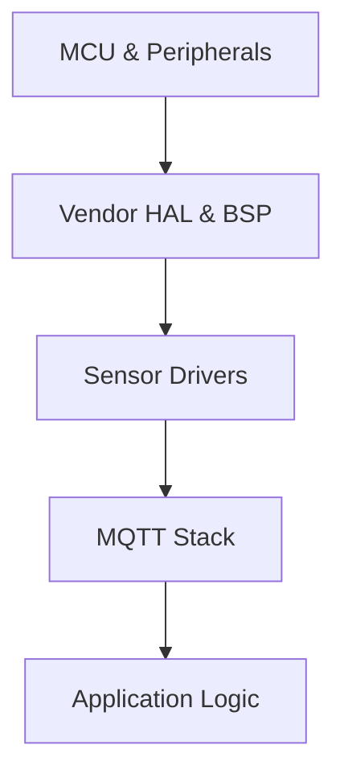

# Layered Embedded Architecture

## 1. Introduction

Layered embedded architecture is a disciplined engineering approach for structuring embedded software into a hierarchy of well-defined layers. Each layer has a clear scope, set of responsibilities, and interface boundaries. This separation enhances maintainability, portability, scalability, and reliability of embedded systems, and supports both iterative development and systematic testing.

In a typical layered system, each software layer abstracts details from the layer beneath it and offers higher-level functionality to the levels above. This method is inspired by similar partitioning principles in general software engineering as well as in reference models such as the OSI model for networking.

Layering in embedded systems is particularly important due to the stringent constraints imposed by hardware limitations, hard real-time requirements, tight coupling between software and physical devices, and the necessity for robustness.

## 2. Technical Context

Embedded software is often intimately tied to specific hardware platforms and deployed in environments where reliability and correctness are paramount (e.g., automotive, medical, industrial, and consumer electronics). Without architectural discipline, codebases tend to devolve into monolithic or entangled collections of device drivers, protocol handlers, business logic, and user interfaces. 

Layered architectures address the following challenges:

- **Hardware Portability:** Clean separation allows core algorithms or application logic to be reused across hardware variants.
- **Testability:** Boundaries between layers ease the use of mocks, stubs, or simulators.
- **Change Management:** Isolating hardware dependencies and application logic reduces the impact scope of changes or extensions.

## 3. Core Concepts and Layered Model

While nomenclature varies, most layered embedded architectures consist of the following canonical layers:

- **Hardware Layer (HL)**
- **Hardware Abstraction Layer (HAL)**
- **Device Drivers Layer**
- **Operating System Layer (optional)**
- **Middleware Layer**
- **Application Layer**

A simplified view:

**Figure 1: General Structure of a Layered Embedded Architecture**

### Layer Descriptions

#### 3.1 Hardware Layer (HL)

- Physical microcontrollers, peripherals (timers, UARTs, SPI, GPIO, etc.), power supply, and communication interfaces.
- Not a software layer, but foundational to system context.

#### 3.2 Hardware Abstraction Layer (HAL)

- Abstracts direct hardware registers and specifics.
- Provides standardized APIs for peripheral access (e.g., GPIO control, ADC reads) independent of hardware revision.
- Often provides mapping from a device-independent API to chip-specific registers or DMA controllers.

#### 3.3 Device Drivers Layer

- Encapsulates logic to control specific physical components (displays, sensors, actuators).
- Translates generic hardware access (from HAL) to support higher-value feature sets.
- Device drivers may be provided by vendors, custom-developed, or generated through tools (e.g., STM32CubeMX, TI Code Composer).

#### 3.4 Operating System Layer

- Optional, depending on system complexity.
- Consists of RTOS (e.g., FreeRTOS, Zephyr, Micrium OS) or simple scheduler functionality.
- Provides task scheduling, timers, synchronization primitives, message queues, and sometimes basic file systems.

#### 3.5 Middleware Layer

- Implements communication stacks (Bluetooth, TCP/IP, CAN), protocol handlers, file systems, or abstraction services (cryptography, USB).
- Often provided as libraries or third-party modules.
- Designed to be portable and hardware-independent.

#### 3.6 Application Layer

- Contains application-specific logic: control algorithms, user interface, system management, business logic.
- Should only interact with the middleware and public operating system APIs, never with hardware or drivers directly.

## 4. Layer Interactions and Boundaries

### Explicit Interfaces

Every layer provides a well-defined API through which it can be accessed by upper layers. Direct access across more than one layer is discouraged to avoid tight coupling and interface leakage.

**Figure 2: Typical Downward Call Flow in a Layered Embedded Stack**

### Layering Variations

There are legitimate variations determined by the demands of the target project:

- **Thin vs. Thick HAL:** Some systems favor a minimal HAL (just register wrappers); others implement a comprehensive API of all peripherals.
- **Driver Collapsing:** In the smallest systems, device drivers may be folded into the HAL.
- **Middleware Omission:** In highly resource-constrained or inflexible systems, middleware may be left out or integrated at application level.

## 5. Engineering Workflow

### Development Flow

Layered partitioning typically guides both code organization and team structure. Typical development practices include:

1. **Architectural Decomposition:** Major boundaries are established first: HAL, drivers, middleware, application.
2. **API Specification:** Interfaces between layers are defined (often using header files, interface classes, or component specifications).
3. **Layer Implementation:** Teams or individuals focus on individual layers, enabling parallel work and independent testing.
4. **Integration and Test:** Layers are integrated incrementally. Boundary contracts are asserted through unit tests and integration harnesses.

### Typical Constraints and Assumptions

- **Resource Limitations:** Must balance modularity against code size (ROM), RAM usage, and execution time.
- **Real-Time Behavior:** Layering must not introduce unacceptable timing overhead, especially with ISR (Interrupt Service Routine) boundaries.
- **Compatibility:** Must ensure backward compatibility over multiple hardware or product revisions.

## 6. Standards, Guidance, and Conventions

### Standards

- **MISRA C / C++:** Mandates for structuring embedded code for safety-oriented applications often dovetail with layered architectures.
- **ISO 26262 (Automotive):** Suggests architectural patterns to minimize cross-layer dependency and facilitate functional safety.
- **AUTOSAR:** Mandates strict layering concepts in automotive ECUs.

### Vendor Frameworks

Vendors commonly provide "starter kits" for layered architectures (e.g., STM32Cube for STMicroelectronics, MCUXpresso for NXP, MSP430 Driver Library for TI). These frameworks often serve as both reference implementation and project scaffolding.

## 7. Practical Engineering Considerations

### Integration Points and Common Pitfalls

#### Integration Points

- **Driver–Hardware Matching:** Correct versioning and build-time configuration for disparate chips or board spins.
- **Middleware Customization:** Adapting protocol stacks or libraries that assume availability of specific RTOS hooks or OS primitives.
- **Application Hook Points:** Designing clean, event-driven interfaces rather than tight polling or callback coupling.

#### Common Pitfalls

> [!CAUTION]
> **Leaky Abstractions:** Exposing hardware details (specific register maps, timing, or pinouts) through upper-layer APIs undermines portability and testability.
>
> **Incorrect ISR Context Handling:** Passing events or data across layers during or from within interrupt context can violate thread safety, cause deadlocks, or trigger priority inversion.
>
> **Monolithic Code Regression:** Accidental cross-layer calls through public headers or macros can subvert the architectural intent, especially if enforced only by convention.

#### Performance Considerations

- **API Overhead:** Excessive indirection introduces function call or data marshalling overhead; profiles must address critical paths.
- **Memory Fragmentation:** Middleware and OS layers must be cautious in resource-limited devices; static allocation is often preferred.
- **Interrupt Latency:** Layer boundaries must not impose call chains or blocking operations in time-critical code.

> [!TIP]
> **Use Traceability Matrices:** Connect architecture layers to system requirements and verification steps for use in audits and safety cases.

## 8. Layered Architecture and Testability

A major benefit of layered architectures is the facilitation of effective verification and validation:

- **Lower layers** can be validated with hardware-in-the-loop (HIL) or via dedicated peripheral simulators.
- **Upper layers** can be subjected to unit testing, system simulation, or mocked driver frameworks.
- **Regression suites** can be run with partial or dummy implementations to speed up development and fault isolation.

**Figure 3: Isolating the Application Layer During Unit Testing**

## 9. Variations: Flat vs. Layered Architectures

While the benefits of layered designs are well-established, not every project requires or allows them:

- **Flat Architectures:** For extremely constrained systems (tiny MCUs, cost-sensitive devices), layering may be collapsed to save code space, albeit with greater coupling.
- **Plug-in Architectures:** Complex systems (e.g., embedded Linux, Android) may mix layering with component or service plug-ins, using dynamic interfaces and inter-process communication.

## 10. Layering and Finite State Machines (FSMs)

FSMs are a common strategy for application-level logic in layered architectures. An FSM implementation at the application or middleware layer typically uses the services provided by the underlying OS or drivers, abstracting away hardware specifics. This ensures that high-level system orchestration remains decoupled from peripheral manipulation.

## 11. Example: Layered Architecture in an IoT Sensor Node

**Figure 4: Example Layered Model for a Networked Sensor Node**

- **MCU & Peripherals (Hardware)**
- **HAL & BSP:** Abstract access to MCU timers, GPIO, radio controller
- **Sensor Drivers:** TI/Maxim/Texas Instruments sensor drivers
- **Middleware:** MQTT client for cloud connectivity
- **Application Logic:** Sensor read, local processing, submission to MQTT broker

## 12. Conclusion

Adopting a layered embedded architecture enforces clarity of design, modularity, and maintainability. It enables effective hardware abstraction, supports scalable product lines, and forms the basis for robust verification and safety assurance processes. 

Despite up-front cost and discipline required to delineate layers cleanly, the returns in long-term evolvability and testability make this approach a standard best practice, particularly for products with non-trivial complexity or safety requirements. Engineers should continually balance architectural purity with resource constraints, seeking to maximize separation of concerns without overcomplicating the codebase for the target domain.

> [!IMPORTANT]
> Well-implemented layering is an investment in technical debt management, minimizing costly refactoring and regression exposure across evolving hardware and applications.