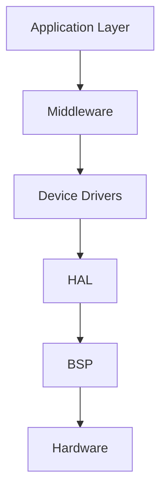
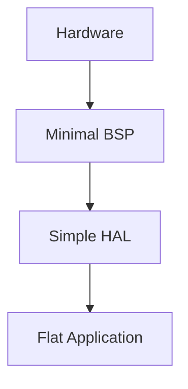
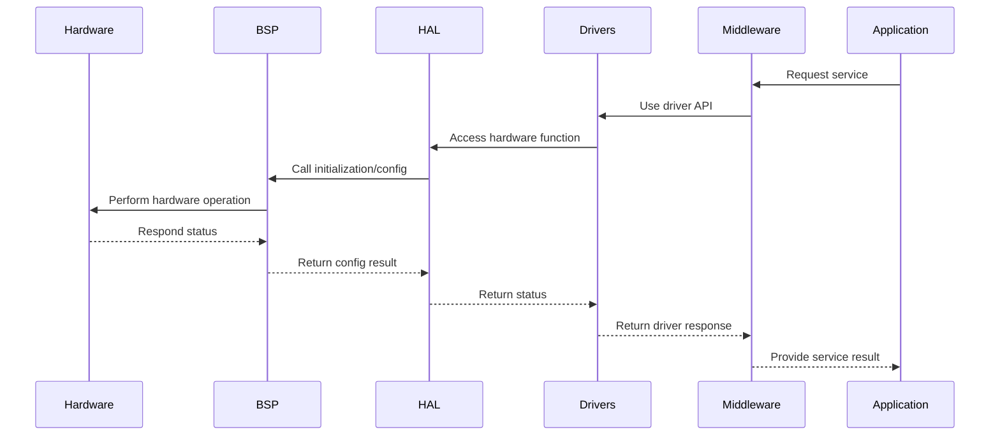

# Layered Embedded Software Architecture

## Introduction

Layered embedded software architecture is a structural approach that organizes embedded software systems into a hierarchy of logical layers, each with distinct responsibilities. This architecture promotes **separation of concerns**, modularity, scalability, and maintainability, which are crucial in the development of robust and efficient embedded systems.

In this overview, we introduce the core principles, typical components, and practical engineering considerations underpinning layered embedded software architecture, with a focus on standard layer separation and the interplay between hardware abstraction, device drivers, middleware components, and application logic.

## Context and Motivation

Embedded systems are deployed in a variety of domains—industrial automation, automotive electronics, consumer devices, IoT, medical instruments, and more. Their software must often interact directly with hardware, manage resource constraints, and meet rigorous real-time and reliability requirements.

Without clear architectural separation, embedded software can quickly become tangled, leading to:

- Tight couplings between hardware and application code
- Increased difficulty in porting, maintaining, or scaling the system
- High risk of introducing errors during hardware upgrades or feature extensions

Layered architectures address these problems by defining clear interfaces and responsibilities for each layer, thereby enabling reuse, easier testing, and adaptation of software across different hardware platforms.

## Overview of Typical Layers

A classic layered architecture in embedded software usually includes the following layers (from hardware upward):

1. **Hardware Layer**
2. **Board Support Package (BSP)**
3. **Hardware Abstraction Layer (HAL)**
4. **Drivers**
5. **Middleware**
6. **Operating System (optional, for systems with OS/RTOS)**
7. **Application Layer**

Not all projects include every layer, nor are the boundaries always rigid. However, these layers provide a conceptual framework for decomposition.

### Mermaid Diagram: Embedded Software Layered Architecture

```mermaid
flowchart TD
    HW[Hardware]
    BSP[Board Support Package (BSP)]
    HAL[Hardware Abstraction Layer (HAL)]
    DRV[Device Drivers]
    MID[Middleware]
    OS["Operating System (RTOS/Bare Metal)"]
    APP[Application Layer]

    HW --> BSP
    BSP --> HAL
    HAL --> DRV
    DRV --> MID
    MID --> OS
    OS --> APP
```

**Diagram: Standard layered decomposition of embedded software, showing dependency flow from hardware to application layer.**

## Layer Definitions and Functions

### 1. Hardware Layer

**Contains:** Microcontrollers, CPUs, SoCs, peripherals (UART, SPI, I2C, GPIO), on-board devices (sensors, actuators), and board wiring.

- **Assumption:** All software layers above must ultimately translate operations into hardware actions or responses.

### 2. Board Support Package (BSP)

The BSP encapsulates hardware- and board-specific initialization and configuration routines, ensuring that higher levels of software need not know unique board details.

- **Responsibilities:**
  - Low-level startup/boot code (e.g., vector table setup, clock/power initialization)
  - Pin multiplexing and peripheral configuration
  - Board revision management
  - Access to board resources (external memory, display, etc.)

- **Variation:** Sometimes BSP is merged with HAL if the system is simple.

### 3. Hardware Abstraction Layer (HAL)

The HAL abstracts the hardware features behind well-defined APIs, allowing upper layers to interact with hardware generically.

- **Purpose:** Hide hardware details, centralize hardware access logic, and support portability across hardware variants.

- **Examples:** HAL_UART_Transmit(), HAL_GPIO_ReadPin(), etc.

- **Design Notes:**
  - APIs typically map to one family/vendor (e.g., STM32 HAL, NXP MCAL).
  - Should not expose non-portable, board-specific attributes.

### 4. Device Drivers

Device drivers provide logic to control, access, and handle specific hardware peripherals or external devices, usually sitting atop the HAL.

- **Types of drivers:**
  - **Peripheral Drivers**: Manage on-chip peripherals (SPI, I2C, CAN, ADC, etc.)
  - **External Devices**: Handle off-chip sensors, memory, displays, or communication modules.

- **Responsibilities:**
  - Implement communication protocols (register access, timing, error handling)
  - Provide interfaces suitable for middleware

### 5. Middleware

Middleware consists of reusable, generally hardware-agnostic components that offer complex services to the application.

- **Examples:**
  - File systems, TCP/IP stacks, USB host/device stacks
  - Cryptography libraries
  - Protocol or bus stacks (e.g., Modbus, CANOpen)

- **Key Role:** Further decouple application logic from direct driver/hardware manipulation.

### 6. Operating System (RTOS/Bare Metal)

**Optional**, but common in systems with non-trivial concurrency or task management needs. The OS or RTOS provides task scheduling, inter-task communication, synchronization, timer management, and often device driver frameworks.

- **Standard Example:** FreeRTOS, Zephyr, ThreadX, embedded Linux.

### 7. Application Layer

The application layer contains domain logic, user interfaces, state machines, and coordination code, built atop provided services and APIs from middleware and device drivers.

- **Expectation:** Completely independent of hardware-specific implementation details.

## Layer Responsibilities and Boundaries

The following table summarizes the primary concerns and boundaries of each layer (table to be added later for completeness).

> **Note**
> 
> Table summarizing role/responsibilities of each layer to be added later as visual reference.

## Core Concepts

### Separation of Concerns

Each layer should be responsible for only a coherent subset of the system's functionality:

- **Encapsulation:** Internal details of each layer are hidden from above layers.
- **Loose Coupling:** Layers communicate through well-defined interfaces.
- **Replaceability:** Changes in hardware (e.g., new MCU) require work only in the lowest layers, not in middleware or application.

### Interface Design and Abstraction

APIs between layers are critical:

- **HAL APIs**: Should provide uniformity, minimizing hardware-specific details in higher levels.
- **Driver APIs**: Should be vendor-neutral where possible, encode device semantics, abstract protocol details.
- **Middleware APIs**: Should provide high-level services; e.g., network socket functions that abstract transport mechanisms.

### Dependency Direction

Each layer should depend only on layers below it, never above:



**Diagram: Uni-directional dependency from application down to hardware.**

> [!WARNING]
> Cyclic dependencies between layers can introduce maintenance chaos, hinder testing, and defeat the purpose of layered architecture. Always design dependencies to be unidirectional—top-down.

## Practical Implementation Details

### Integration Points

Critical interfaces where layers interact:

- **HAL/Driver boundary:** Abstract register access, uniform error handling
- **Driver/Middleware interface:** Event/callback design, protocol configuration
- **Application/middleware interface:** API clarity, thread safety

> [!TIP]
> When designing for portability, keep hardware-dependent code tightly scoped in BSP/HAL; all other code should reference hardware only through the published APIs.

### Threading and Concurrency

Systems with RTOS integration face challenges not just in layering, but also in synchronization and isolation.

- Device drivers and middleware should be reentrant or protected with synchronization primitives where accessed from multiple threads.
- Interrupt handler routines should delegate work upward through queues or deferred processing, keeping ISR code minimal and bounded.

### Common Pitfalls

- **"Leaky" abstraction:** Exposure of hardware quirks (e.g., register bits) through upper-layer APIs.
- **Inappropriate coupling:** Application logic importing hardware headers or manipulating registers directly.
- **Duplicated responsibilities:** Hardware initialization scattered across BSP, HAL, or drivers.
- **Violation of layering:** Middleware or applications bypassing proper layers for performance or convenience, which leads to maintenance and portability issues.

> [!CAUTION]
> Avoid optimizing prematurely by skipping layers, unless rigorously justified and carefully documented. Shortcuts often result in technical debt.

### Engineering Decisions and Variations

Layered architectures are often adapted or extended for complex systems:

- **API Adaptation Layer:** Additional behavioral or translation layer for standardizing APIs across hardware variants.
- **Service Layer:** Sits above middleware in large systems to encapsulate business logic/services.
- **Vendor SDK Integration:** Some platforms merge HAL, drivers, and middleware into monolithic SDKs; custom partitioning may be needed for maintainability.

#### Example Variation: Minimalist Embedded System (No OS)



**Diagram: Simplified architecture for minimalist bare-metal systems.**

## Standards and Specifications

Several industry standards formalize aspects of layered embedded architecture:

- **AUTOSAR (AUTomotive Open System ARchitecture):**
  - Enforces strict layering: Application, Services, ECU Abstraction, Microcontroller Abstraction, and Microcontroller Hardware.
- **POSIX (Portable Operating System Interface):**
  - Provides standardized APIs for application/OS/middleware, chiefly in embedded Linux and RTOSes supporting POSIX calls.
- **CMSIS (Cortex Microcontroller Software Interface Standard):**
  - ARM standard for processor support, hardware abstraction, and middleware integration.

> [!TIP]
> When working in automotive, adhering to established standards (e.g., AUTOSAR, ISO26262) for abstraction layers and module interfaces is critical for safety and interoperability.

## Workflow: From Hardware to Application

1. **Initialization:** BSP executes hardware initialization at startup.
2. **HAL Setup:** Standardizes peripheral access via abstracted APIs.
3. **Driver Instantiation:** Loads/configures low-level device controllers.
4. **Middleware Registration:** Sets up protocol stacks, file systems, or communication services.
5. **Application Launch:** Begins main task/event loops; invokes services via middleware/driver APIs.



**Diagram: Sequence of layered calls from application down to hardware and back.**

## Portability and Maintainability

The primary advantage of layered architecture is increased adaptability:

- **Porting to new hardware:** Typically only BSP/HAL/drivers need modification.
- **Adding new features/services:** Middleware and applications can be modified or extended independently.
- **Testing and verification:** Each layer can be unit tested in isolation via mocks or emulated interfaces.

### Example: Replacing a Sensor

- **Scenario:** Original temperature sensor replaced with a newer I2C model.
- **Engineering action:** Only the corresponding driver is replaced or extended. Application and middleware remain unaffected if their APIs are unchanged.

## Performance Implications

Layered architectures introduce function call overhead and—if not carefully managed—increase stack/code size. Engineering trade-offs include:

- **Inlining hot paths:** For performance-critical drivers, HAL APIs may be inlined or "flattened."
- **Direct application-to-driver calls:** In exceptional real-time cases, the application may access drivers directly, but this should be isolated and documented as an exception.
- **Configurable layers:** Permit compile-time removal/merging of layers for constrained systems.

> [!ALERT]
> Excessive abstraction can incur performance penalties—monitor timing impact, especially in interrupt-driven and hard real-time systems.

## Summary

Layered embedded software architecture is a fundamental pattern that supports modular, maintainable, and portable system design by enforcing clear boundaries between hardware-specific code and high-level application logic. By implementing separation of concerns through layers such as BSP, HAL, drivers, middleware, and application code, engineering teams can mitigate complexity, ease hardware upgrades, and streamline feature development.

The layered approach does not remove the need for careful analysis and engineering judgment—proper interface definition, dependency management, and adherence to system constraints remain essential for balancing performance, reliability, and maintainability in embedded systems.

---

**End of overview.**