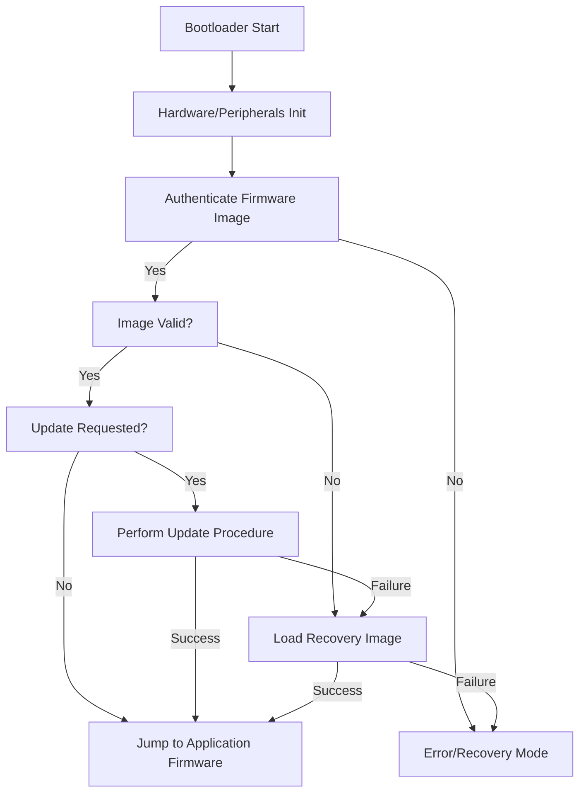
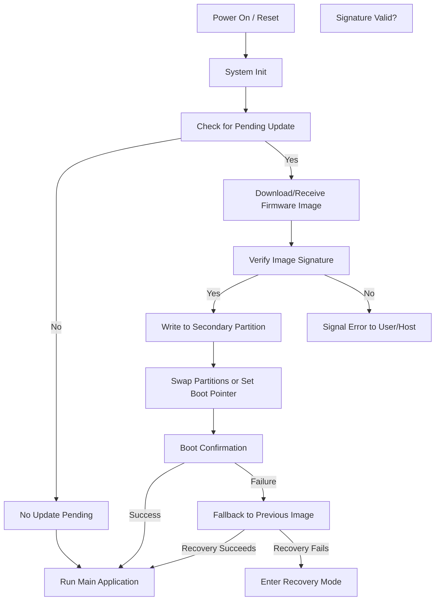

# Embedded Bootloaders: Design Principles for Secure and Reliable Firmware Bootstrapping

## Introduction

Embedded bootloaders are critical pieces of software located at the beginning of the program memory in embedded systems. Their primary function is to manage the secure and reliable initialization of application firmware. Bootloaders are also responsible for firmware revision and update procedures, often serving as the root of trust and first line of defense against security threats during device startup and in-field updates.

Bootloaders interface between hardware reset or power-on and the transition to the main firmware. Their design directly affects system integrity, reliability, and upgradability. This technical primer provides an in-depth exploration of embedded bootloaders, detailing architectural patterns, security foundation, update management, practical implementation considerations, and common pitfalls.

---

## Role and Responsibilities of Embedded Bootloaders

### Definition

An embedded bootloader (often shortened to "bootloader") is a minimalistic software entity that executes immediately after hardware initialization, before transferring execution to main application firmware. Bootloaders reside in persistent, usually non-volatile, memory and often occupy protected or immutable regions to guard against accidental or malicious modification.

### Technical Context

Bootloaders are ubiquitous in microcontroller units (MCUs), systems-on-chip (SoCs), microprocessors, and custom embedded platforms. Their scope can range from simplistic, non-secure startup routines to comprehensive systems supporting cryptographic validation, version rollbacks, fail-safes, and firmware-obsolescence checks. Advanced bootloaders frequently underpin secure bootchains conforming to standards such as NIST SP 800-193, ARM® TrustZone® principles, or vendor-specific secure boot implementations.

### Key Responsibilities

- **System Initialization:** Configure low-level system state and peripherals necessary for further operation.
- **Firmware Selection and Validation:** Identify, authenticate, and integrity-check the target firmware image.
- **Firmware Launch:** Transfer control to validated firmware in a secure and defined manner.
- **Firmware Update Support:** Enable field or factory reprogramming, often via UART, USB, CAN, SPI, wireless (Bluetooth, Wi-Fi), or over-the-air (FOTA) mechanisms.
- **Security Enforcement:** Implement various security mechanisms, including cryptographic signature verification, anti-rollback, and hardware protection enablement.
- **Failsafe and Recovery:** Detect and recover from startup failures by providing fallback to known-good images or recovery modes.

---

## Bootloader Architecture: Overview and Components

Embedded bootloaders must balance minimal size, robustness, upgradeability, and security. Their architecture is influenced by application requirements, available hardware resources, and threat models.

### Common Architectural Patterns

#### 1. Monolithic Bootloader

Monolithic bootloaders perform all necessary tasks in a single, non-modularized binary.

- **Advantages:** Simplicity, reduced attack surface.
- **Disadvantages:** Harder to update; all changes require full reflash.

#### 2. Staged Bootloader (Two-Stage or Multi-Stage Bootloader)

Separates boot responsibilities into discrete stages—commonly, a small immutable primary stage (first-stage bootloader, FSBL) and a more capable, upgradeable secondary stage (second-stage bootloader, SSBL).

- **Advantages:** Flexibility, supports advanced update/recovery procedures, layered security.
- **Disadvantages:** Increased complexity; careful inter-stage trust management required.

#### 3. Bootloader with Update Agent

Some designs separate the update logic into an independent subsystem, allowing the bootloader to focus on minimal secure validation and chain of trust enforcement.

### Block Diagram: Typical Staged Bootloader System

```mermaid
flowchart LR
    HW[Hardware Reset]
    FSBL[First-Stage Bootloader]
    SSBL[Second-Stage Bootloader (with Update Agent)]
    FW[Application Firmware]
    RC[Recovery Image]
    SEC[Secure Validation]
    UPM[Update Manager]
    
    HW --> FSBL
    FSBL -->|Initial Checks| SEC
    SEC -->|Valid| SSBL
    SEC -.->|Fail| RC
    SSBL -->|Load Firmware| FW
    SSBL -->|Perform Update| UPM
    UPM -->|Update Success| FW
    UPM -.->|Update Fail| RC
    RC -->|Recovery Boot| FW
```

**Figure:** Multi-stage Bootloader Structure with Failsafe and Update Processing

---

## Secure Boot and Chain of Trust

Security is paramount for modern embedded devices, especially with increasing connectivity and deployment in critical applications.

### Secure Boot: Definition

**Secure Boot** refers to a process where each stage of firmware, starting with the immutable root of trust (usually the first-stage bootloader or ROM code), verifies the integrity and authenticity of the next stage before passing execution. Typically, this is accomplished by cryptographically verifying a digital signature appended to firmware images.

**Reference:** NIST SP 800-193, Secure Boot Chain guidelines; ARM Trusted Firmware specifications.

### Chain of Trust: Key Concepts

- **Root of Trust (RoT):** Hardware or immutable code that is inherently trusted and serves as the anchor point.
- **Image Authentication:** Prior to code execution, verify image authenticity using mechanisms such as RSA/ECDSA signatures or HMACs.
- **Integrity Check:** Validate that firmware hasn't been tampered with, often using cryptographic hashes (SHA-2, SHA-3, etc.).
- **Anti-rollback Protection:** Prevent loading of deprecated or vulnerable firmware by tracking version numbers or monotonic counters.
- **Hardware Security Features:** Enabling device-specific protections such as memory readout protection, write/erase locking, TrustZone isolation, or hardware unique keys (HUK).

### Chain of Trust Flowchart

```mermaid
flowchart TD
    RoT[Root of Trust (usually hardware or ROM)]
    Boot1[Bootloader Stage 1]
    Boot2[Bootloader Stage 2]
    FW[Application Firmware]
    SecBoot[Secure Boot Verification]
    
    RoT -->|Verifies| Boot1
    Boot1 -->|Verifies| Boot2
    Boot2 -->|Verifies| FW
    FW -.->|Fails verification| Boot2
    Boot2 -.->|Fails verification| Boot1
```

**Figure:** Secure Boot Chain of Trust Stages

> **Warning**
>
> Bootloaders are attractive attack targets. An insecure bootloader undermines all firmware security regardless of application-layer protections.

---

## Bootloader Components and Workflows

### Persistent Memory Map

Bootloader designs must define memory regions for:

- The bootloader itself (often at the reset vector or protected sector)
- Primary firmware image(s)
- Secondary/inactive images (for updates, rollback, staging)
- Recovery images (optional)
- Metadata (version info, digital signatures, cryptographic keys, etc.)

### Typical Bootloader Workflow

At each reset or power-on, the bootloader executes a repeatable, deterministic process. A generalized workflow is shown below.



**Figure:** Example Bootloader Execution Flow

---

## Firmware Update Mechanisms

Supporting remote or local firmware updates is a primary function of modern embedded bootloaders.

### Update Modes

- **Factory Programming:** Initial image is loaded via JTAG, SWD, SPI, or factory programmer.
- **Local Field Update:** Firmware replaced via UART/USB/CAN/SPI by authorized technicians.
- **FOTA (Firmware Over-The-Air):** Wireless update delivered via Wi-Fi, Bluetooth, LoRa, NB-IoT, or cellular networks. Usually mediated by an update agent or external host, but secure bootloader participation is essential.

### Update Strategies

#### 1. In-Place Update

New firmware is written directly over the old firmware.

- **Pro:** Simplicity; no extra flash needed.
- **Con:** If interrupted, system may become non-bootable.

#### 2. A/B Swap or Dual-Bank Update

System contains two firmware banks (“A” and “B”); update is written to the inactive bank and swap is performed after successful validation.

- **Pro:** High robustness; can revert to old image on update failure.
- **Con:** Increased flash/EEPROM usage.

#### 3. External Storage Staging

Updates downloaded to external memory (SD card, external flash, etc.) and copied into main memory after validation.

#### 4. Recovery and Fallback

Many systems store a known-good recovery image that can be loaded if both primary and update images fail validation.

> **Important**
>
> Always validate *all* firmware before activation—even if the image is newly downloaded or transferred. Never assume authenticity or integrity.

---

## Practical Integration: Firmware Verification and Update Flow

The following diagram illustrates a robust FOTA-enabled bootloader’s flow for firmware upgrade and verification (omitting networking details).



**Figure:** High-Level Bootloader Workflow with FOTA

---

## Security Mechanisms in Bootloaders

### Cryptographic Principles

Bootloader designs employ several classes of cryptographic measures:

- **Digital Signatures:** Validate authenticity and provenance (RSA, ECDSA, Ed25519, etc.).
- **Cryptographic Hashes:** Check image integrity (SHA-2/3, BLAKE2, etc.).
- **Symmetric Authentication:** Optionally authenticate using HMACs or AEAD schemes for constrained hardware.
- **Public Key Infrastructure (PKI):** Management of certificate and key hierarchies for signed updates.

### Replay and Rollback Protections

To prevent attackers from downgrading devices to known-vulnerable firmware:

- Monotonic version counters, stored in tamper-evident or hardware-protected regions.
- Enforced minimum firmware version thresholds.
- Unforgeable logs or cryptographic audit trails.

### Hardware Protection Features

Bootloaders should leverage available hardware mechanisms where possible:

- **Read/Write Protection:** Lock bootloader region to preclude modification.
- **Memory Protection Units (MPUs):** Restrict access to critical memories.
- **Secure Elements/TPMs:** Store cryptographic keys or sensitive data outside main MCU/SoC.
- **Trusted Execution Environments (TEEs):** E.g., ARM TrustZone, to isolate boot processes from untrusted code.

> **Note**
>
> Engineering best practice dictates that cryptographic checks and hardware protection activation *must* predate any transfer of execution control to the main firmware.

---

## Firmware Metadata and Manifest Design

### Purpose and Contents

Metadata describing firmware images enables version tracking, cryptographic verification, update orchestration, and rollback prevention. Manifest schemas should contain:

- Firmware version and unique identifier (UUID)
- Cryptographic hash and signature
- Required hardware version/platform constraints
- Build timestamp
- Anti-rollback/protection counters
- Optional delta/patch information for efficient updates

**Example Firmware Manifest Structure:**
```json
{
  "firmware_version": "3.2.7",
  "uuid": "c0ffee12-3456-789a-bcd1-ef0123456789",
  "hash": "a94a8fe5ccb19ba61c4c0873d391e987982fbbd3",
  "signature": "30820122300d06092a864886f70d010101... [truncated]",
  "required_hw": "STM32F429",
  "timestamp": "2024-06-13T03:16:00Z",
  "rollback_counter": 42
}
```

> **Tip**
>
> A well-structured manifest enables both robust update orchestration and granular security policy enforcement.

---

## Common Implementation Pitfalls

1. **Insufficient Verification Logic:** Failing to properly verify digital signatures or hash mismatches allows malicious firmware execution.
2. **Improper Update Error Handling:** Failing to handle interrupted updates can lead to device bricking or security downgrades.
3. **Neglected Anti-rollback Protections:** Omission allows attackers to revert to vulnerable code.
4. **Cryptographic Key Management Weaknesses:** Embedding keys insecurely in firmware or code enables key extraction and signature forgery.
5. **Lack of Hardware Protection:** Not enabling SoC-level readout or write protections exposes bootloader code to attackers.
6. **Resource Limitations:** Underestimating flash or RAM needs for cryptographic verification and update staging.
7. **Inadequate Recovery Paths:** Lack of recovery fallback leads to unbootable devices after failed updates.
8. **Improper Use of Nonvolatile Memory:** Not accounting for wear-leveling or atomicity, especially in NOR/NAND or EEPROM when storing critical state.

---

## Engineering Considerations

### Platform Constraints

- **Flash/RAM availability:** Cryptographic and dual-image mechanisms require significant memory, influencing architecture decisions.
- **Processing Performance:** Low-MHz MCUs or processors may face prohibitive signature verification times, especially with RSA.
- **Power-on Reliability:** Bootloader must be extremely robust—any bug can prevent system operation.

### Integration Points

- **Update Distribution:** Bootloader may interface with host-side or cloud-based tooling for update delivery. Update agent and bootloader must have a well-defined contract for image storage and handoff.
- **Manufacturing Provisioning:** Secure key injection, initial boot image loading, and version counter setup must be performed securely at manufacturing.
- **Testing and Verification:** Bootloader requires rigorous negative and functional testing, due to its security-critical status and inaccessibility after deployment.

### Implementation Languages & Approaches

- **C/C++ (baremetal):** Dominant, due to size and determinism. Some RTOS integration is possible, but minimalism is preferred.
- **Rust:** Emerging adoption for enhanced memory safety in bootloader contexts.
- **Assembler:** For the absolute lowest-level initialization (e.g., reset handlers), but rarely for main logic.

### Update Orchestration and Fail-Safes

- **Atomic Swap/Activation:** Firmware updates should be activated only after successful post-update validation (boot confirmation or successful self-test).
- **Boot Confirmation Protocols:** Require application firmware to affirm successful operation after update, before retiring previous image.

---

## Example: Secure Bootloader for an IoT MCU

To internalize the above concepts, consider a typical secure bootloader workflow for an internet-connected sensor node:

```mermaid
graph TD
  1[Device Reset]
  2[ROM Loader (Immutable)]
  3[Primary Bootloader]
  4[Check Boot Flags and Metadata]
  5[Authenticate Candidate Firmware]
  6[Firmware Valid?]
  7[Activate Application]
  8[Invoke FOTA Agent?]
  9[Perform Update Transaction]
  10[Rollback if Failure]
  11[Enter Recovery Mode]
  12[Update Anti-rollback Counter]

  1 --> 2 --> 3 --> 4 --> 5
  5 -->|Yes| 6
  6 -->|Yes| 7
  6 -->|No| 8
  8 -->|Yes| 9
  9 -->|Success| 12
  9 -->|Failure| 10
  10 --> 11
  12 --> 7
```

---

## Firmware Update Security Standards and Protocols

### Relevant Standards

- **NIST SP 800-193:** Platform Firmware Resiliency Guidelines; requirements for secure boot, update, and recovery for firmware on platforms.
- **Trusted Computing Group (TCG):** Defines roots of trust and secure boot primitives.
- **ARM Trusted Firmware:** Provides secure boot and chain of trust reference implementation for Cortex-A/M devices.
- **IETF SUIT (Software Updates for Internet of Things):** Standardizing "manifest" formats, update payload processes, and security models for FOTA in IoT.
- **IEC 62443:** Security for industrial automation and control systems—provides high-level security requirements including update mechanisms.

### Update Protocols

- **MCUBoot (Zephyr, Mynewt):** Open-source bootloader with security best-practices, dual image support, and manifest-based validation.
- **Android Verified Boot (AVB):** Reference for strong, staged-boot and image verification on mobile platforms.
- **U-Boot with Verified Boot:** Widely used in embedded Linux; can be configured for signature enforcement.
- **Proprietary Protocols:** Many vendors (NXP, STMicroelectronics, Microchip, etc.) implement custom protocols leveraging hardware-specific features.

---

## Conclusion

Embedded bootloaders form the foundational layer for secure and reliable embedded system operation. Their correct implementation is tightly coupled to device security, update resilience, and field maintainability. 

Key engineering mandates include:

- Establishing and protecting a secure chain of trust starting at immutable hardware.
- Ensuring rigorous authentication and integrity verification of all executed firmware.
- Supporting robust update flows with atomic activation, anti-rollback, and fallback/recovery paths.
- Leveraging hardware security features and adhering to standardized best-practices.

Bootloader architectures must balance minimalism, reliability, upgradability, and strong security as dictated by the platform, resources, and threat model. Pragmatic attention to implementation detail—especially error handling, cryptographic key management, and memory protection—remains essential for maintaining device trustworthiness throughout its lifecycle.

Embedded engineers should hold the bootloader to the highest standards of rigor and testing, as all subsequent system assurances ultimately depend on its correctness and security.