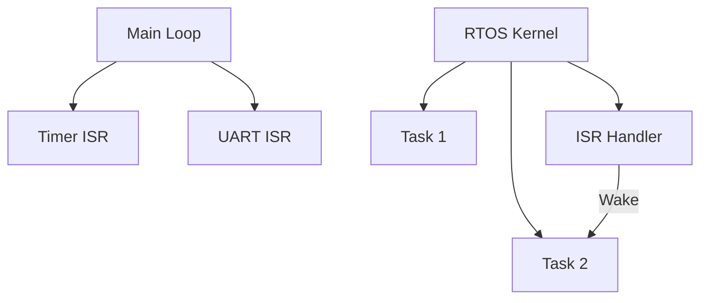
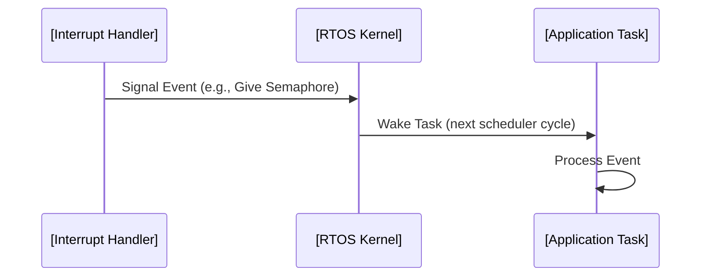

# Bare-metal vs RTOS: Engineering Trade-offs in Embedded Systems

## Introduction

Embedded systems range from simple, resource-constrained microcontrollers in consumer devices to complex, high-performance units in industrial controls. At the heart of software design for these systems lies a foundational decision: whether to architect the application using bare-metal programming—where code interacts directly with hardware registers, often without an underlying abstraction layer—or to leverage a Real-Time Operating System (RTOS), which introduces scheduling, multitasking, and structured abstractions.

Each paradigm carries implicit trade-offs affecting determinism, maintainability, scalability, resource utilization, and system complexity. This overview provides embedded engineers with a detailed, technical comparison to guide architectural choices in their projects.

---

## 1. Defining the Paradigms

### 1.1. Bare-metal Programming

**Bare-metal programming** refers to software development where the code runs directly on the hardware, typically without an intervening operating system or scheduler. Interaction with peripherals and core processor features is achieved by manipulating memory-mapped register addresses.

**Key Characteristics:**
- Full control over all system resources.
- Typically a single-threaded, sequential control flow.
- Deterministic execution, limited by interrupt structure and implementation.
- Code tightly couples to target hardware.

**Common Use Cases:**
- Ultra-low power applications (e.g., battery-powered sensors).
- Systems with strict code size or latency constraints.
- Safety-critical domains where full system behavior must be known and traceable.

### 1.2. Real-Time Operating Systems (RTOS)

An **RTOS** is a software layer that abstracts hardware resources and enables multitasking via pre-emptive (or sometimes cooperative) scheduling. RTOS frameworks such as FreeRTOS, Zephyr, µC/OS, or ThreadX provide APIs for task management, inter-task communication, time management, and hardware abstraction.

**Key Characteristics:**
- Task-level concurrency (threads or processes).
- Pre-emptive or cooperative scheduling, supporting real-time guarantees.
- Abstractions for semaphores, queues, mutexes, and timers.
- Modular, portable code base.

**Common Use Cases:**
- Complex, event-driven embedded applications.
- Systems requiring deterministic task pre-emption (e.g., motor control).
- Applications with multiple concurrent tasks, wireless stacks, file systems, or user interfaces.

---

## 2. Core System Architectures

### 2.1. Bare-metal System Architecture

On a bare-metal system, the software execution proceeds from reset, typically entering a main loop with explicit polling or interrupt-based branching.

```mermaid
flowchart TD
    A[Power-On Reset] --> B[Startup Code (Init)]
    B --> C[Peripherals Init]
    C --> D[Main Loop]
    D --> E{Poll Event?}
    E -->|Yes| F[Service Event]
    E -->|No| D
    F --> D
    D --> G[Interrupt Handler]
    G --> D
```

### 2.2. RTOS-based System Architecture

An RTOS schedules multiple tasks, typically initiated from a kernel startup routine. Each task may block, wait, or synchronize with others through RTOS primitives.

```mermaid
flowchart TD
    AA[Power-On Reset] --> BB[Startup Code (Bootloader/Init)]
    BB --> CC[RTOS Kernel Start]
    CC --> DD[Task 1]
    CC --> EE[Task 2]
    CC --> FF[ISR Handlers]
    DD -->|Yield/Wait| CC
    EE -->|Yield/Wait| CC
    FF -->|Signal| CC
```

---

## 3. Detailed Comparison

### 3.1. Control Flow and Scheduling

#### Bare-metal

- **Single thread of execution** predetermined at design-time.
- Interrupt Service Routines (ISRs) handle asynchronous or high-priority events.
- Software architecture often built as a “super loop” or cyclic executive.

#### RTOS

- Multiple “tasks” (threads) scheduled according to assigned priorities.
- Pre-emptive or cooperative context switching according to real-time constraints.
- ISRs signal tasks via semaphores or event flags; long-running handlers are generally avoided.



### 3.2. Resource Management

| Aspect                | Bare-metal                           | RTOS                                 |
|-----------------------|--------------------------------------|--------------------------------------|
| **Memory Footprint**  | Minimal (no kernel overhead)         | Increased (kernel + API structures)  |
| **CPU Overhead**      | None (other than ISRs)               | Context switch + scheduling logic    |
| **Stack Usage**       | Typically one stack (plus for ISRs)  | Per-task stack allocation            |
| **Power Management**  | Direct, minimal abstraction          | Often supports tickless idle modes   |
| **Peripheral Access** | Direct register access               | Encapsulated/Mediated by drivers     |

### 3.3. Timing and Determinism

- **Bare-metal systems** achieve predictability by tightly controlling execution order and latency; external events are handled as ISRs, minimizing context changes.
- **RTOS introduces context-switching latency**, and the need to bound worst-case task scheduling; however, RTOSes are specifically designed to provide deterministic scheduling for real-time applications, subject to the correct configuration of task priorities and timeouts.

> :warning: **Warning:**  
> In both approaches, unbounded or lengthy ISRs can undermine system determinism. In RTOS-based systems, lengthy tasks or inappropriate priority assignment can lead to missed deadlines or priority inversion.

### 3.4. Modularity, Reusability, and Maintainability

#### Bare-metal

- High coupling between application and hardware.
- Limited abstraction means changes to hardware or application logic often require significant code modification.
- Debugging is straightforward, as control flow is explicit, but scalability is poor for large or feature-rich applications.

#### RTOS

- Encapsulates functionality into tasks/modules, improving separation of concerns.
- Easier to port to new hardware if RTOS is also ported or already supported.
- Supports middleware (stacks, protocols) that rely on OS abstractions.
- Complexity in debugging due to concurrency.

---

## 4. Common Workflows

### 4.1. Bare-metal Development Flow

1. Hardware initialization (clocks, memory, I/O).
2. Application-specific peripheral configuration.
3. Super-loop or state machine design.
4. Event handling via polling or ISRs.
5. Code optimization to ensure required performance/response time.

### 4.2. RTOS Development Flow

1. Hardware and low-level driver initialization.
2. RTOS kernel configuration (scheduling options, tick rate, stack size).
3. Task creation with prioritized stacks.
4. Implementation of inter-task synchronization (mutexes, semaphores, queues).
5. Optimize task priority assignments and stack sizes.
6. Integration with middleware (network stacks, file systems).

---

## 5. Device Integration and Middleware Support

- **Bare-metal**: Integration with complex peripherals (USB, TCP/IP, file systems) often requires vendor-specific libraries or minimal stacks, which must operate without OS support. This can be limiting for projects requiring third-party middleware integration.
- **RTOS**: Middleware is commonly designed for OS-driven environments. Stacks for networking, USB, Bluetooth, and file systems often rely on task-context operation and RTOS-related synchronization.

> :bulb: **Tip:**  
> When long-term scalability or maintainability may be needed, favoring an RTOS-compatible middleware stack early in development can avoid costly later refactoring.

---

## 6. Constraints, Pitfalls, and Engineering Trade-offs

### 6.1. When to Use Bare-metal

- Extreme resource constraints (minimal RAM/Flash).
- Maximum performance or ultra-low-latency requirements.
- Simple state-machine applications.
- Complete trust and control required over all code execution (e.g., safety-critical certified firmware).

### 6.2. When to Use an RTOS

- Multiple concurrent workflows.
- Need for middleware: TCP/IP, USB, filesystems, OTA updates.
- Complex communication protocols or peripheral processing.
- Applications with mixture of high- and low-priority tasks.

### 6.3. Implementation Challenges

#### Bare-metal

- Growing feature set can quickly outpace maintainability.
- Scaling up for new hardware or new features often involves significant refactoring.
- Manual management of shared resources (non-reentrant code, shared variables) can lead to subtle bugs.

#### RTOS

- Incorrect priority assignment, stack sizing, or ill-designed synchronization can lead to deadlocks, starvation, or missed deadlines.
- Added complexity from context switching, debugging, and tracing.
- Kernel bugs or misconfiguration may introduce subtle timing issues.

> :warning: **Caution:**  
> Porting legacy bare-metal code to an RTOS or mixing paradigms (“hybrid” design) without careful planning can result in unpredictable behavior or priority inversion scenarios.

---

## 7. Example Task/ISR Interaction (RTOS)



---

## 8. Safety and Certification Considerations

- **Bare-metal systems** may facilitate traceability and transparency required for standards such as ISO 26262 (Automotive), DO-178C (Aerospace), or IEC 61508 (Industrial), particularly due to minimized code footprint and reduction in third-party code dependencies.

- **RTOS-based systems**, especially those providing certification-ready kernels (e.g., SafeRTOS, QNX), simplify partitioning, fault isolation, and help in meeting high-integrity requirements—provided system integrators follow best practices for task isolation, memory protection, and deterministic design.

---

## 9. Summary Table: Typical Design Trade-offs

| Factor                   | Bare-metal                          | RTOS                                  |
|--------------------------|-------------------------------------|---------------------------------------|
| **Complexity**           | Low                                 | Moderate to High                      |
| **Scalability**          | Limited                             | High                                  |
| **Maintainability**      | Low to Moderate                     | Moderate to High                      |
| **Feature Integration**  | Challenging (manual)                | Facilitated by middleware             |
| **Latency**              | Minimal                             | Small, bounded with correct config    |
| **Determinism**          | High (well-controlled ISR)          | High (with correct scheduling)        |
| **Certification**        | Easier for small/critical systems   | Supported if using certified kernel   |

---

## 10. Conclusion

For embedded engineers, the primary architectural choice between bare-metal programming and an RTOS is driven by the application's complexity, real-time constraints, maintainability targets, resource restrictions, and forward-looking integration requirements.

**Bare-metal programming** excels in simplicity, performance, and resource usage for small or singularly-focused tasks, but incurs scalability and maintainability challenges as complexity grows.

**RTOS-based designs** enable modular, concurrent, scalable systems adapted for high feature-integration and reliability, at the cost of increased resource consumption and design complexity.

A clear, technical understanding of both paradigms empowers informed architectural decisions—and the ability to articulate expected trade-offs across performance, cost, feature growth, and maintainability over the product lifecycle.

---

## 11. Further Visuals

- **State diagrams**: Useful for representing task states and scheduling, especially for priority inheritance or deadlock detection.
- **Timing charts**: Illustrate response times for ISR vs. scheduled task execution.

> :memo: **Note:**  
> Additional diagrams such as detailed kernel state transitions or advanced scheduling comparisons may be added in production documentation.