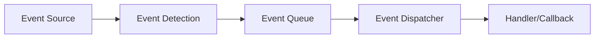
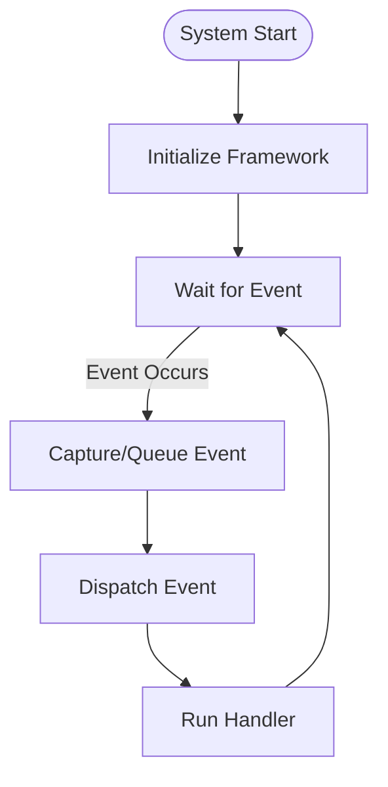
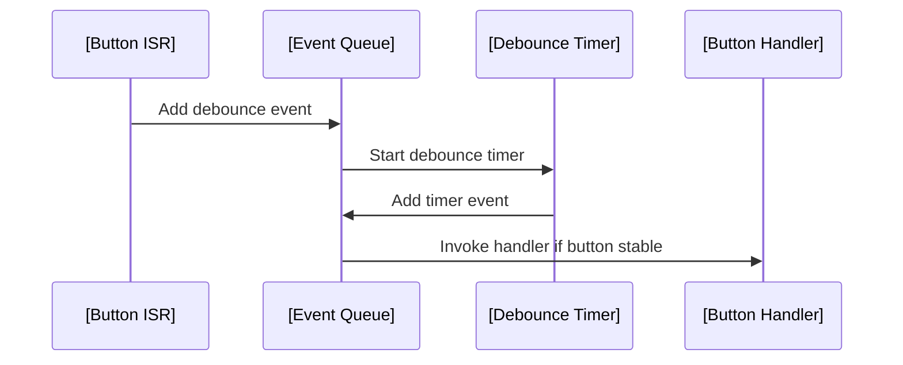
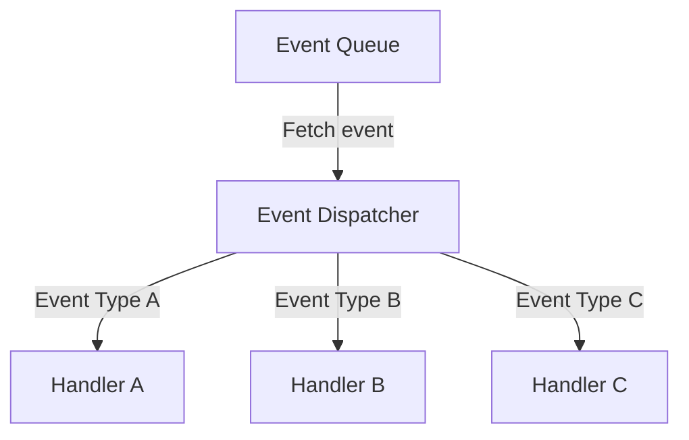
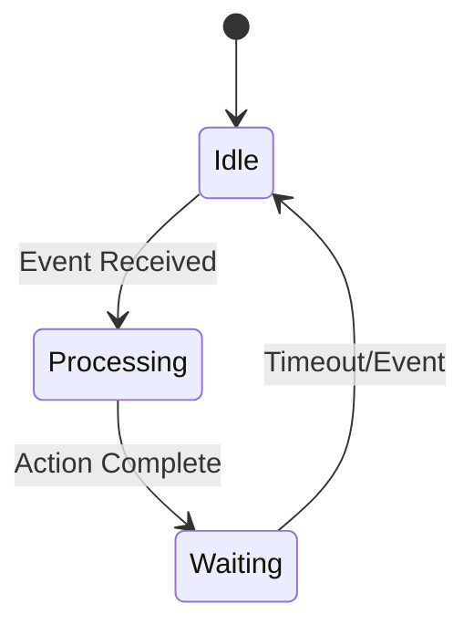

# Event-driven Embedded Software

## Introduction

Event-driven embedded software is a programming paradigm wherein system behaviour is dictated by the occurrence of external or internal events. Unlike sequential or polling-based models, event-driven architectures react to stimuli such as hardware interrupts, timer expirations, sensor changes, network packets, or human-machine interface (HMI) actions. This model is fundamental where real-time responsiveness and efficient use of limited resources are required, and is a cornerstone in designing robust, scalable embedded systems.

The approach is prevalent in a wide spectrum of embedded domains, including consumer electronics, automotive, industrial control, IoT devices, medical instrumentation, and more. The event-driven model often overlaps conceptually and technically with both interrupt-driven design and finite state machines (FSMs), and is often realized through callbacks, message queues, or event dispatchers.

## Core Concepts

### What is an Event?

An **event** is a discrete, identifiable occurrence that may require the system to respond or change state. Events may originate externally (e.g., a GPIO pin change, network data arrival) or internally (e.g., internal timers, state transitions).

Common types of events in embedded systems include:

- **Hardware interrupts:** Pin changes, timer overflows, communication peripherals (UART, SPI, I2C) signals.
- **Software signals:** Timer expirations, inter-task messages, operating system signals.
- **User actions:** Button presses, touch inputs.
- **System conditions:** Errors, watchdog expirations, resource thresholds.

### Event-driven Architecture

In an event-driven embedded system, the software is organized around the detection, dispatch, and handling of events. The main loop (if present) typically does not contain explicit application logic but instead waits for events or messages, which are then routed to appropriate handlers.

#### Fundamental Components

- **Event Sources:** Hardware peripherals, sensors, timers, or communication interfaces.
- **Event Detection Layer:** Mechanisms such as interrupt service routines (ISRs), polling routines, or software event generators.
- **Event Queues/Buffers:** Structures that temporarily hold events pending processing.
- **Event Dispatcher/Handler:** A module or design pattern responsible for invoking the correct response logic for each event.
- **Callback Functions:** Application code registered to respond to specific events.



---

### Reactive Programming Principles

The event-driven model is inherently *reactive* — operation is passive until an event arrives. The principal programming practice is to write handlers (callback functions) that encapsulate response logic, with the system framework managing invocation in response to event arrival.

**Key properties:**

- **Loose coupling:** Handlers are often decoupled from source.
- **Asynchronous execution:** Multiple events may occur in arbitrary order.
- **Non-blocking design:** Handler execution should be short and non-blocking to keep the system responsive.

---

## Technical Context and Motivation

Embedded systems traditionally interacted with their environment by **polling**—repeatedly checking the state of inputs in a loop, then acting accordingly. However, polling tends to be resource-inefficient, can miss edge-triggered conditions, and hinders real-time responsiveness.

The transition to event-driven models enables:

- **Minimized MCU active time** (lower power).
- **Deterministic reactions** to asynchronous stimuli.
- **Concurrent management** of diverse inputs and outputs.

This approach also fits with real-time operating systems (RTOS), which often provide extended support for event registration, inter-process signaling, and event queues.

## Event-driven Embedded Software in Practice

### Typical Workflow

The event-driven programming loop deviates from conventional sequential logic. The following is a conceptual sequence for an event-driven embedded system:

1. **Initialization:** Event sources, handlers, and infrastructure (queues, dispatcher) are initialized.
2. **Run Loop or Scheduler:** The system enters a passive state, typically waiting for events.
3. **Event Generation:** An event source (e.g., hardware interrupt) signals an event.
4. **Event Capture:** The event is captured and possibly enqueued.
5. **Event Dispatch:** The event dispatcher extracts the event from the queue and invokes the corresponding handler.
6. **Handler Execution:** The handler performs minimal, quick response actions and may schedule longer processing steps elsewhere.
7. **Idle or Repeat:** Once all events are handled, the system returns to the passive state.



### Event Management and Control Flow

#### Interrupt Service Routines (ISRs) vs. Event Queues

In resource-constrained systems, events may be processed directly within ISRs. In more complex systems, ISRs promptly log the event (typically into a queue or buffer) and defer the actual handling to the main loop or dedicated tasks for efficiency and to minimize ISR duration.

#### Example: Button Press Debouncing

A simple event-driven approach to button debouncing:

1. **ISR fires** on button press, logs the time and schedules a debounce timer event.
2. **Timer event** fires after debounce interval, validates the button state.
3. **Callback handler** is invoked for confirmed button press.


---

## Key Architectural Elements

### Event Loop

The "event loop" is the central dispatch mechanism in an event-driven system. It blocks or idles while waiting for new events, then processes them as they arrive. In small embedded systems, the event loop is sometimes the only scheduling entity, whereas in RTOS-based systems, it operates within a thread or task.

**Note:** [Diagram to be added later: An expanded event loop architecture, showing integrated subsystems per application.]

### Event Representation

Events are typically represented as enumerated types, tagged structure/unions, or messages in a queue. A minimal event structure:

```c
typedef enum {
    EVENT_NONE,
    EVENT_BUTTON_PRESS,
    EVENT_TIMEOUT,
    // ...
} event_type_t;

typedef struct {
    event_type_t type;
    uint32_t     timestamp;
    void        *data;
} event_t;
```

Events may carry associated data, such as payloads, context information, or identifiers.

### Event Dispatch Strategies

There are several patterns for event delivery:

- **Direct Callbacks:** ISRs or event detectors call handler functions directly; minimal overhead, but tight coupling and poor flexibility.
- **Event Queues/Message Passing:** Events are queued and dispatched in FIFO or prioritized order. This approach decouples event production from consumption, supports deferred processing, and improves system robustness.
- **Publish-Subscribe (Observer Pattern):** Multiple handlers subscribe to specific event types; the dispatcher notifies all relevant listeners.



### Handler Design

Event handlers (callbacks) must obey critical constraints:

- **Short Duration:** Maximize system responsiveness; minimize risk of blocking.
- **Reentrancy:** If handlers may be invoked from different contexts, they must protect shared state (use atomic operations or critical sections).
- **Statelessness/Simple State:** Avoid complex, long-lived state within handlers unless the architecture is designed for it (e.g., using FSM or explicit context structures).

---

## Integration Points and Interactions

### Interaction with Interrupts

Often, ISRs act as event sources. Best practice is to minimize ISR execution time and merely log/post events for later handling in application context.

> [!warning]
> Avoid complex logic, blocking calls, or shared data manipulation inside ISRs. Defer all nonessential work to handlers running in the main loop or OS task context.

### Integration with Finite State Machines (FSMs)

Finite State Machines are often embedded within event-driven architectures. An event handler updates system state variables, which are then interpreted by an FSM to actuate state transitions or actions.



### Event-driven Design & Real-Time Operating Systems (RTOS)

Most RTOS kernels offer constructs for event management, such as message queues, event flags, semaphores, and software timers. Tasks may block awaiting events, respond to them asynchronously, or synchronize via RTOS-provided APIs (e.g., FreeRTOS `xQueueReceive`, CMSIS-RTOS `osMessageQueueGet`).

### Event Prioritization

Some embedded systems must prioritize certain events over others (e.g., emergency stop vs. regular sensor update). Prioritization is enforced either in hardware (interrupt priority levels) or in the software dispatcher (priority queues, pre-emption).

---

## Engineering Considerations

### Performance Implications

- **Latency:** Event-driven systems excel at minimizing response latency.
- **Determinism:** Complex event interleaving can reduce system predictability unless thoroughly designed.
- **Overhead:** Queue management adds memory and potential CPU overhead; must fit within hardware constraints.

### Implementation Challenges

- **Resource Constraints:** RAM/ROM limitations can impact queue size and handler code complexity.
- **Race Conditions:** Improper synchronization between ISRs and handlers may cause corrupted state.
- **Event Storms:** Unchecked event rates (event storms) risk queue overflows or system starvation.

> [!caution]
> Always size event buffers/queues defensively and audit event sources for the risk of flooding or unintended recurring triggers.

### Debugging and Testability

Event ordering problems, lost events, or race conditions are notoriously hard to debug. Instrumentation (event logging/tracing), use of static analysis, and careful modularization are important practices.

> [!tip]
> Use circular buffer queues for event logs to facilitate post-mortem debugging.

---

## Variations and Advanced Topics

### Hierarchical Event Handling

In large systems, events may comprise high-level "meta-events" constructed from several lower-level events (e.g., protocol stacks). This hierarchy is represented via layered dispatch or FSM structures.

### Event Coalescing and Filtering

Some systems implement logic to merge ("coalesce") similar events for efficiency or apply filters to discard irrelevant signals before queuing.

### Time-driven and Hybrid Approaches

Some architectures blend event-driven and time-driven execution; periodic tasks (e.g., sampled control loops) coexist with eventdriven handlers. Coordination between loops and event handlers requires careful design to avoid priority inversion.

---

## Example Applications

### 1. IoT Sensor Node

- **Events:** Sensor measures completed, low battery warnings, incoming wireless packets.
- **Handlers:** Send data, go to sleep, update display.

### 2. Automotive ECU

- **Events:** CAN message received, engine sensor change, diagnostic request.
- **Handlers:** Log event, actuate actuator, send response.

---

## Standards, Protocols, and Best Practices

While no universal standard governs all event-driven embedded designs, commonality exists in:

- **MISRA C:** Guidelines for robust C code; warn against direct complex ISR code.
- **AUTOSAR (Automotive):** Specifies event mechanisms for automotive ECUs (RTE event mechanisms).
- **FreeRTOS & CMSIS-RTOS:** Standardized APIs for queues, semaphores, event groups.

> [!note]
> Reference application notes from silicon vendors often showcase event-driven frameworks tailored to their microcontrollers and toolchains.

---

## Common Pitfalls

- Overly lengthy or blocking event handlers degrading system reactivity.
- Direct ISR-to-application logic coupling without decoupling buffers or queues.
- Event queue overflows due to unbounded or bursty sources.
- Unhandled events or default cases, leading to silent failures or undefined state.

---

## Conclusion

Event-driven embedded software enables scalable, power-efficient, and responsive system design in the face of complex, asynchronous environments. By carefully structuring the system around events, engineers can ensure timely reactions to significant stimuli, facilitate concurrency, and ease maintenance. However, successful application requires disciplined handler design, robust event management, and attention to interactions between hardware, firmware, and (optionally) RTOS or middleware layers. Mastery of the event-driven paradigm—and its interaction with related principles such as finite state machines and interrupt-driven design—is vital for modern embedded system engineering.