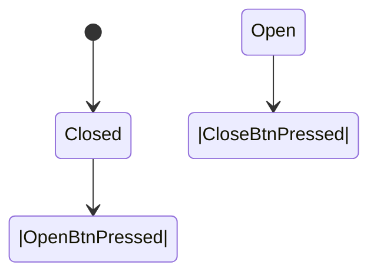
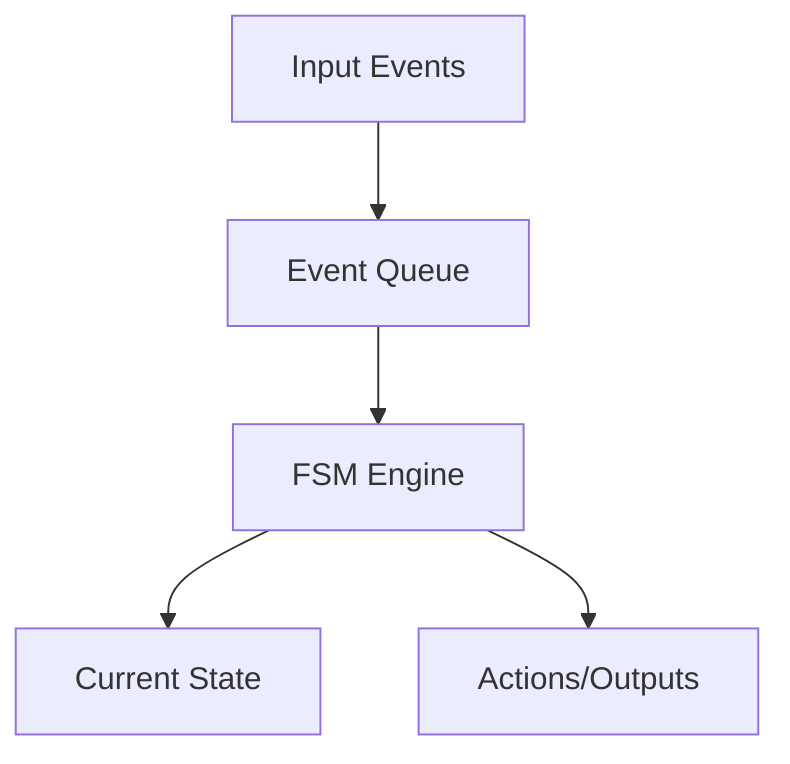
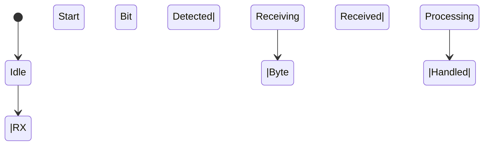
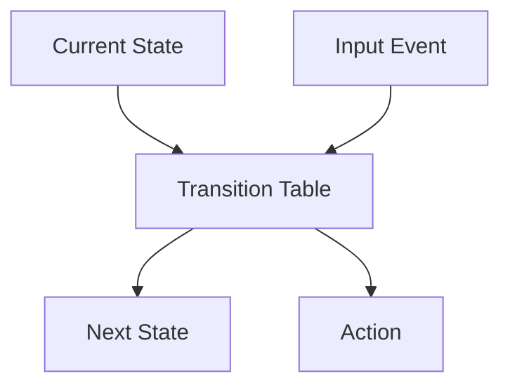

# Finite State Machines (FSM)

## Introduction

Finite State Machines (FSMs) are deterministic, mathematical models widely used in the design and analysis of embedded systems, digital logic, protocols, compilers, and control software. FSMs provide a structured way to represent the dynamic behavior of systems whose operation can be described as a sequence of discrete states, transitions, and actions governed by events or conditions.

FSMs offer a practical method for modeling control flow, event handling, protocol implementation, and decision logic in a manner that is both rigorous and amenable to automated analysis and design. Their deterministic nature ensures reproducible, predictable operation—an essential property in the often safety- and time-critical world of embedded engineering.

## Core Concepts and Architecture

### Fundamental Components

A finite state machine is formally comprised of the following elements:

- **States**: Distinct modes of operation, each describing the behavior of the system for a particular set of conditions.
- **Events (or Inputs)**: External or internal occurrences that may cause the system to transition between states.
- **Transitions**: Rules specifying how the system moves from one state to another in response to events.
- **Actions**: Operations performed during a transition or while the system resides in a particular state.

### Varieties of FSMs

FSMs come in several formal variants:

- **Deterministic Finite Automaton (DFA)**: For every input in a given state, at most one transition applies (no ambiguity).
- **Non-deterministic Finite Automaton (NFA)**: Multiple transitions may be possible for a single input in a state; not commonly used directly in embedded control due to ambiguity.
- **Mealy Machine**: Actions are associated with transitions.
- **Moore Machine**: Actions are associated with states.
- **Hierarchical State Machine (HSM)**: States may themselves contain other sub-states (increases scalability and modularity).

For embedded systems, deterministic, explicit FSMs are almost always used.

### Formal Definition

An FSM can be denoted as a 5-tuple:

$${\displaystyle M=(S,\,I,\,O,\,f,\,g)}$$

Where:

- \( S \): A finite set of states.
- \( I \): A finite set of inputs (events).
- \( O \): A finite set of outputs (actions).
- \( f: S \times I \to S \): The state transition function.
- \( g: S \times I \to O \): The output function (for Mealy); \( g: S \to O \) for Moore.

### Example: Simple Door Control FSM



This diagram models a control system for a simple door. States are `Closed` and `Open`. Input events (`OpenBtnPressed`, `CloseBtnPressed`) cause state changes.

## FSM in Embedded System Context

### Applications

FSMs are foundational in embedded systems design, where deterministic, event-driven control is required. Typical application domains include:

- **Protocol Handlers** (e.g., UART, SPI, CAN, I2C)
- **User Interface Control** (e.g., button debouncing, menu navigation)
- **Power Modes and Sleep Management**
- **Safety Interlocks and Fault Handling**
- **Process Control and Sequencing**
- **Software Timers and Watchdogs**

### Integration Points

FSM logic typically resides in the application layer, device drivers, middleware, or directly in the hardware abstraction, depending on system architecture. FSMs can be implemented as:

- Explicit switch/case or if/else cascades in firmware.
- Table-driven or data-driven transition models.
- Graphical tools or code generators with model-to-code workflows.

FSMs interact with event sources (interrupts, timers, inputs), peripheral drivers, and main system loops.

### State and Event Handling Architecture



Here, input events are collected and placed in an event queue, processed by the FSM engine which updates the current state and triggers corresponding outputs.

## FSM Workflows and Implementation

### Typical Engineering Workflow

1. **Model Identification**: Define the system operational modes (states) and all events (inputs).
2. **State Diagram Construction**: Draft state diagrams, including transitions and actions.
3. **Transition Table Generation**: Convert diagrams into tables or enumeration structures.
4. **Code Implementation**: Map FSM structure into firmware, using switches, tables, or code-generation.
5. **Integration & Test Harness**: Integrate with event and output interfaces, develop test cases and simulators.
6. **Verification & Validation**: Analyze for completeness, reachability, and dead ends.
7. **Deployment & Maintenance**: Update diagrams/tables for modifications, verify system consistency after changes.

### Practical Example: UART Receiver FSM

UART protocol parsing often uses a FSM to handle the serial input stream.



**States**
- Idle: Waiting for data.
- Receiving: Collecting incoming bits.
- Processing: Checking byte integrity and handling the byte.

**Inputs**  
- RX Start Bit Detected
- Byte Received
- Handled

**Actions**  
- Begin data collection
- Validate and store byte
- Reset state

### Typical FSM Software Skeleton (C-Like Pseudocode)

```c
typedef enum {IDLE, RECEIVING, PROCESSING} State;
typedef enum {NONE, RX_START, BYTE_RECEIVED, HANDLED} Event;

void fsm_handle_event(State* current, Event input) {
    switch (*current) {
        case IDLE:
            if (input == RX_START) *current = RECEIVING;
            break;
        case RECEIVING:
            if (input == BYTE_RECEIVED) *current = PROCESSING;
            break;
        case PROCESSING:
            if (input == HANDLED) *current = IDLE;
            break;
        default: break;
    }
}
```

## Design Considerations and Pitfalls

### Scalability and Maintainability

FSMs are elegant for small, bounded state spaces but can grow unwieldy as the number of states or transitions increases. Consider **Hierarchical State Machines (HSMs)** for designs where states naturally group or nest. Some RTOSes and frameworks offer specialized FSM or HSM support (e.g., [Quantum Platform (QP)](https://www.state-machine.com/qp/), SCXML-based engines).

> :warning: **CAUTION:**  
> Large, flat FSMs are challenging to maintain and error-prone. Use decomposition (hierarchical states, modularization) to control complexity.

### Concurrency

In multi-threaded or interrupt-driven embedded systems, concurrent events can cause race conditions if state transitions are not properly protected.

> :warning: **CAUTION:**  
> Always protect state changes with synchronization mechanisms (mutexes, atomic sections) when accessed from multiple contexts (e.g., ISR and main loop).

### Event Loss and Overload

In systems with high event rates, the event queue may overflow or lose events if not sized or drained appropriately. FSMs relying on polling may miss brief events.

### Observable Outputs and Side Effects

Clearly distinguish between **output actions** (changing actuators) and **internal transitions** to avoid unwanted side effects and ensure testability.

## FSM Optimization and Variations

### Table-Driven FSMs

FSMs may be implemented as a transition table: a 2D array mapping (state, event) pairs to (next state, action).



This approach enables dynamic reconfiguration, easier testing, and code generation.

**Example Table Format:**

| Current State | Event         | Next State   | Action        |
|---------------|--------------|--------------|---------------|
| IDLE          | RX_START     | RECEIVING    | StartRX       |
| RECEIVING     | BYTE_RECEIVED| PROCESSING   | CheckByte     |
| PROCESSING    | HANDLED      | IDLE         | None          |

### Hierarchical and Orthogonal Regions

**Hierarchical states** allow sub-states to inherit transitions and actions, providing scalability for complex workflows. **Orthogonal regions** (also called parallel states) enable modeling systems with simultaneous processes.

> :bulb: **TIP:**  
> Consider using UML statecharts or SCXML (State Chart XML, [W3C Recommendation](https://www.w3.org/TR/scxml/)) for graphically expressing hierarchical and parallel state behavior in both design and documentation.

### Timed and Extended State Machines

Some FSMs incorporate timing (delayed transitions), actions conditional on variables ("extended state", or **finite state machine with memory**), or are parameterizable via external data—these are common extensions in model-based design and protocol stacks.

## Engineering Guidelines and Best Practices

### Specification, Documentation, and Traceability

- **Document FSMs with diagrams, tables, or statecharts.**  
  Maintaining up-to-date documentation alongside code is critical for maintainability and team communication.

- **Use enumeration for states/events in code.**  
  This improves readability, type safety, and debugging.

- **Review for completeness.**  
  All states and transitions should be well-defined. Handle error, undefined, or unexpected events to prevent undefined system behavior.

### Verification and Validation

- **Reachability Analysis**: Ensure all states are reachable as intended.
- **Dead State Detection**: Detect states from which no legal transitions exist (unless intentional, e.g., Error/Halt).
- **Coverage Testing**: Exercise all state-event pairs in test harnesses.

### Performance and Resource Impact

- **FSM code is typically lightweight**, but may become substantial if code generation or extended state/complex action management is used.
- **Flash/RAM constraints**: FSM tables and code must fit within system constraints.
- **Real-time requirements**: Transition handling must meet real-time deadlines; unexpected delays in FSM code can violate system response times.

### Common Pitfalls

- **State Explosion:** Flat FSMs for complex systems become difficult to modify or analyze.
- **Unhandled Events:** If an event arrives in a state without an explicit handler, system may behave unpredictably.
- **Coupling:** Overly tight coupling between FSM and external interfaces reduces flexibility—keep FSM logic agnostic to hardware where possible.

## Advanced FSM Topics

### FSMs in Hardware (HDL/Silicon)

FSMs are a fundamental construct in digital logic design (e.g., VHDL, Verilog), where their sequences control everything from communication protocols to microcoded CPUs. Hardware DSLs may define FSMs using process/state constructs; formal verification tools exist for correctness proofs.

### Modeling and Code Generation Standards

UML (Unified Modeling Language) state diagrams and [SCXML](https://www.w3.org/TR/scxml/) are widely used for model-driven engineering and auto-generation of FSM code in embedded software workflows. Many tools convert graphical statecharts to C/C++ or HDL for direct use in embedded firmware.

### Frameworks & Libraries

Numerous open-source embedded frameworks provide FSM/HSM abstractions (e.g., Quantum Leaps’ QP, Boost MSM, SMC, Yakindu Statechart Tools), increasing productivity and reducing implementation errors.

### Integration with Event Loops and RTOS

In RTOS-based systems, FSMs often operate as tasks or services, polling event queues or awaiting OS signals. Integration considerations include round-robin, preemptive, or cooperative multitasking models; FSM code must never block execution.

> :bell: **NOTE:**  
> FSM-based control flow combines well with event-driven and interrupt-driven designs; careful prioritization of event sources is essential for responsiveness and predictability.

## Summary

Finite State Machines are an essential building block for deterministic control, protocol handling, and behavior modeling in embedded systems. An FSM’s structure—consisting of distinct states, well-defined transitions, and explicit actions—enables engineers to manage complexity, verify operation, and ensure reliability.

Key takeaways for embedded engineers:
- Use FSMs for control flows with discrete operating modes, event-driven behavior, or protocol parsing.
- Maintain clear diagrams/tables and up-to-date documentation.
- Decompose complex systems using hierarchical or table-driven FSM approaches.
- Ensure robust handling of concurrent events, error conditions, and undefined transitions.
- Leverage existing frameworks and standards for consistency and maintainability.

FSMs, when correctly architected, support rigorous, maintainable, and predictable system behavior—a cornerstone of robust embedded design.