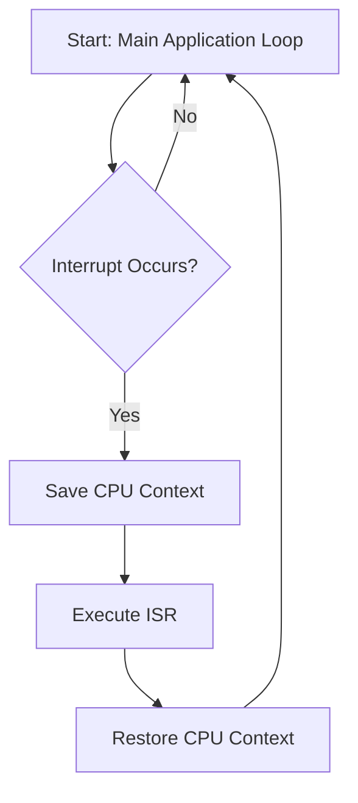
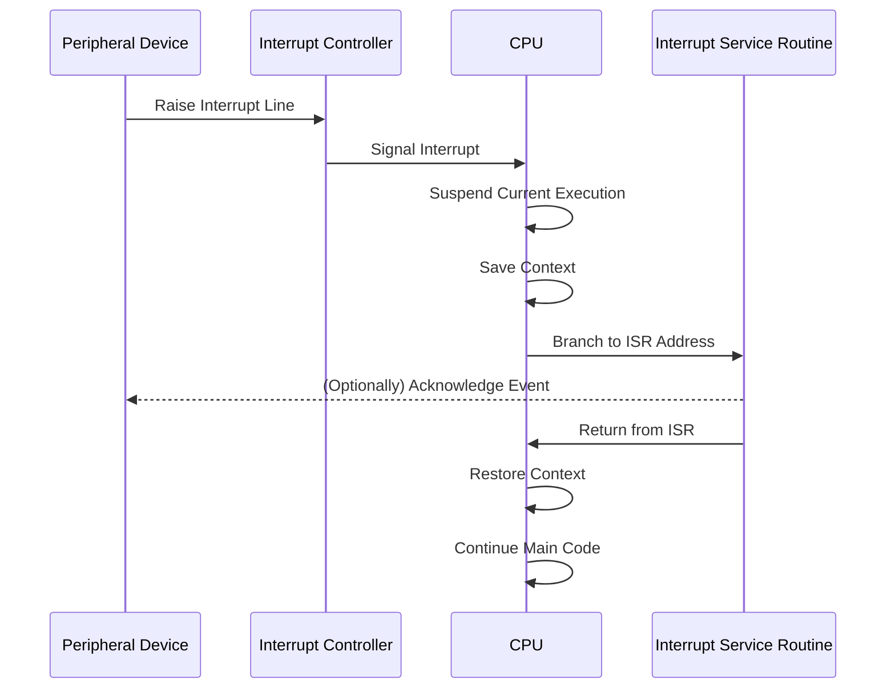
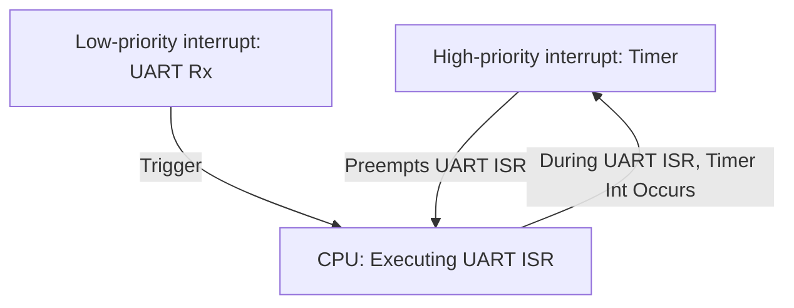
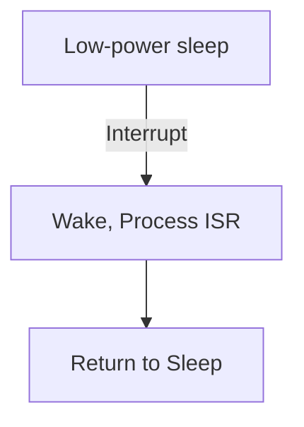

# Interrupt-driven Design

## Introduction

Interrupt-driven design is a fundamental architectural strategy in embedded systems engineering, employed to ensure deterministic and immediate responses to time-sensitive events. Unlike polling or scheduled checking, which can introduce nondeterministic delays, hardware interrupts allow a system to temporarily halt ongoing processes and service critical events almost instantaneously. This principle is core to real-time, safety-critical, and performance-sensitive embedded applications.

This primer introduces essential concepts of interrupt-driven design, explores its architecture in embedded systems, details practical engineering considerations, and provides structured methodologies and best practices for implementation.

---

## 1. Core Concepts

### 1.1 What Is an Interrupt?

An **interrupt** is a signal to the processor emitted by hardware or software indicating an immediate attention requirement. Interrupts enable a system to react to asynchronous, often external, events regardless of the software’s current execution state.

**Key characteristics:**
- **Asynchronous:** May occur at any time, outside the control of sequential program flow.
- **Preemptive:** The processor suspends current operations to execute a specific response routine.
- **Event-driven:** Tied to specific conditions such as hardware pin changes, timers, faults, or peripheral communication.

### 1.2 Types of Interrupts

- **Hardware Interrupts**: Generated by external devices (e.g., GPIO inputs, ADC conversions, UART, timers).
- **Software Interrupts**: Initiated by code via instructions or supervisor calls (e.g., SWI in ARM architectures), often for OS services.
- **Maskable vs Non-Maskable Interrupts**:
  - **Maskable Interrupts (IRQ)**: Can be disabled (masked) by software during critical operations.
  - **Non-Maskable Interrupts (NMI)**: Cannot be masked; reserved for highest-priority faults (e.g., watchdog timer expiry, power failure).

### 1.3 Interrupt Latency

**Interrupt latency** is the time interval between generation of an interrupt (event occurrence) and execution start of its interrupt service routine (ISR). Latency depends on:
- Processor architecture
- Interrupt controller implementation
- Ongoing instruction cycles
- System interrupt load and priority

### 1.4 The Interrupt Service Routine (ISR)

An **ISR** (also called interrupt handler) is a function executed in response to an interrupt. It handles the minimum required processing to service the event, deferring more complex tasks to main program loops or lower-priority contexts.

---

## 2. Interrupt-driven System Architecture

### 2.1 Architectural Overview

In interrupt-driven embedded systems, the CPU executes main application code until an interrupt occurs. Upon interrupt, the current CPU state is preserved, the ISR runs, and then the original context resumes.


*Diagram: High-level interrupt-driven control flow*

### 2.2 Interrupt Controller

Most processors integrate an **Interrupt Controller** to manage multiple interrupts, resolve priorities, and route signals to the CPU. For instance:
- **NVIC**: Nested Vectored Interrupt Controller (ARM Cortex-M MCUs)
- **PIC**: Programmable Interrupt Controller (x86, legacy architectures)
- **GIC**: Generic Interrupt Controller (ARMv7/ARMv8 platforms)

**Functions:**
- Prioritizing concurrent interrupts
- Masking (enabling/disabling) interrupts by software configuration
- Supporting interrupt nesting (optional)

### 2.3 Exception Vector Table

The **vector table** maps interrupt sources to function pointers in memory, so the CPU knows which ISR to execute for each event. Typical microcontroller startup code configures this table according to hardware reference manuals.

---

## 3. Practical Workflow

### 3.1 Typical Sequence

1. **Peripheral Event or Signal**
2. **Interrupt Signal Sent to CPU**
3. **CPU Completes Current Instruction**
4. **CPU Saves State (Registers, Program Counter)**
5. **ISR Address Loaded from Vector Table**
6. **ISR Executes**
7. **ISR Clears Interrupt Flag (if required)**
8. **CPU Restores Previous State**
9. **Main Code Execution Resumes**


*Diagram: Interrupt handling sequence*

### 3.2 ISR Design Guidelines

- **Keep ISRs short and efficient.** ISRs must finish rapidly to minimize overall system latency.
- **Minimize resource usage.** Limit use of shared data, avoid memory allocations inside ISRs.
- **Communicate via flags, queues, or ring buffers.** For deferred processing, use mechanims like circular buffers to pass data to main loop or background tasks.
- **Clear interrupt flags.** Most hardware requires clearing the interrupt source (e.g., reading status register) to avoid repeated triggers.

> :warning: **Caution**
>
> Excessive processing in an ISR (e.g., blocking calls, complex logic, or extensive computations) can starve other interrupts and degrade overall system responsiveness.

---

## 4. Interrupt Prioritization and Nesting

### 4.1 Prioritization

Modern microcontrollers support **interrupt prioritization** for deterministic handling of multiple simultaneous events. Higher-priority interrupts can preempt lower-priority ones.


*Diagram: Interrupt prioritization and preemption*

### 4.2 Nesting

**Nesting** allows higher-priority interrupts to interrupt (preempt) ISRs already running for lower-priority events. This is tightly controlled, as excessive nesting increases context saving/restoring time and stack usage.

- **Nesting enabled:** Careful management of stack usage and ISR reentrancy needed.
- **Nesting disabled:** Ensures predictability, but increases maximum service latency.

> :warning: **Warning**
>
> Unmanaged interrupt nesting may result in stack overflows or undefined system behavior. Analyze stack requirements carefully and avoid deep nesting whenever possible.

---

## 5. Integration Strategies

### 5.1 Bare-Metal Design

Most simple embedded software runs "bare-metal" (without a real-time operating system). Here, the main loop executes background tasks, while ISRs handle all immediate event servicing.

- **Workflow:** ISRs perform minimum work, often just signaling flags or storing data in buffers; main loop handles heavy-lifting.
- **Example:** A UART ISR places received bytes in a queue; the main loop parses and processes complete messages.

### 5.2 Integration with an RTOS

An RTOS adds interrupt abstraction via task scheduling and deferred interrupt handling (sometimes called *deferred procedure calls*, *bottom-halves*, or *interrupt threads*).

- ISRs trigger higher-level callbacks or wake specific threads.
- System latency can be affected by RTOS kernel configuration (priority inversion, scheduler policies, etc.).
- Many RTOSes (e.g., FreeRTOS, Zephyr, ThreadX) provide APIs for safe communication between ISRs and threads.

### 5.3 Communication Between ISR and Application Code

Use standard mechanisms for communicating between ISRs and other contexts:

- **Flags and semaphores**: Indicate event readiness.
- **Queues**: Transfer event data or descriptors.
- **Ring buffers**: For streaming data (e.g., UART, ADC samples).
- **Event groups**: For signaling multiple event sources.

> :bulb: **Tip**
>
> Always declare shared state between main code and ISRs as `volatile` to prevent compiler optimization errors.

---

## 6. Constraints, Challenges, and Best Practices

### 6.1 Resource Contention

Access to shared hardware or memory regions must be guarded to prevent concurrency bugs (race conditions, data corruption). Use atomic operations or disable interrupts briefly when accessing critical shared resources.

### 6.2 Determinism and Real-time Constraints

- **Deterministic response** is critical for real-time and safety-critical systems (e.g., automotive, medical).
- ISRs should introduce bounded, predictable latency.
- Avoid constructs with unbounded execution time in ISRs (loops, linked list traversals, I/O waits, etc.).

### 6.3 Reentrancy and Thread Safety

ISRs may preempt main code or other ISRs, requiring careful attention to reentrancy.

- Avoid using non-reentrant functions within ISRs (e.g., dynamic memory allocators, standard I/O).
- Avoid function calls with static/local state unless explicitly designed to be interrupt-safe.

### 6.4 Power Consumption

Interrupt-driven design allows microcontrollers to operate in low-power or sleep modes, waking only on interrupt. This is leveraged in battery-powered and energy-critical designs.


*Diagram: Interrupt-driven power management*

---

## 7. Hardware and Software Standards

- **ARM Cortex-M**: ARMv7-M/ARMv8-M exceptions, NVIC reference (see ARM DDI documentation).
- **POSIX**: `signal()` and related APIs, though not typically applied to embedded bare-metal.
- **MISRA C**: Guidelines on interrupt handler implementation for safety-critical embedded systems.
- **ISO 26262 / IEC 61508**: Functional safety standards; place requirements on ISR design and analysis for automotive and industrial systems.

---

## 8. Common Pitfalls

> :warning: **Warning**
>
> Frequent mistakes in interrupt-driven design include:
> 
> - Failing to clear the interrupt flag, leading to repeated interrupts ("interrupt storms").
> - Long or blocking ISRs that cause missed deadlines for other interrupts.
> - Ignoring stack depth requirements when multiple ISRs/Nesting is enabled.
> - Unsafe access to shared variables without proper synchronization.

---

## 9. Example: Interrupt-driven UART Reception

```c
// Pseudocode
volatile uint8_t rxBuffer[128];
volatile uint8_t rxHead = 0;

ISR(UART_RX_vect)
{
    uint8_t data = UART_DATA_REG;
    rxBuffer[rxHead++] = data;
    if (rxHead == sizeof(rxBuffer)) rxHead = 0; // Wrap-around
}
```

- **ISR triggered** when UART receive holding register contains data.
- ISR reads byte and stores it into a ring buffer.
- Main loop processes buffer contents as needed.

---

## 10. Design Alternatives and Variations

- **Polling**: Low-complexity, but non-deterministic and less power efficient; useful in test/debug.
- **DMA with Interrupts**: For high-speed peripherals, DMA handles bulk data, triggering an interrupt on completion.
- **Event-driven Frameworks**: Some embedded platforms encapsulate event handling at higher levels (e.g., QP Framework, TinyOS).

---

## 11. Conclusion

Interrupt-driven design remains a cornerstone of reliable, real-time embedded systems. Mastering its concepts enables engineers to build responsive, deterministic, and efficient applications for diverse domains including consumer electronics, automotive ECUs, industrial controllers, and sensor networks. Careful architecture, ISR discipline, robust prioritization, and mindful integration with broader system frameworks are essential to harnessing the power of interrupts safely and effectively.

---

## 12. Suggested Visuals

> :memo: **Note**
>
> For further elaboration, engineers may find it useful to include per-platform vector table layouts or annotated NVIC block diagrams (to be added later).

---