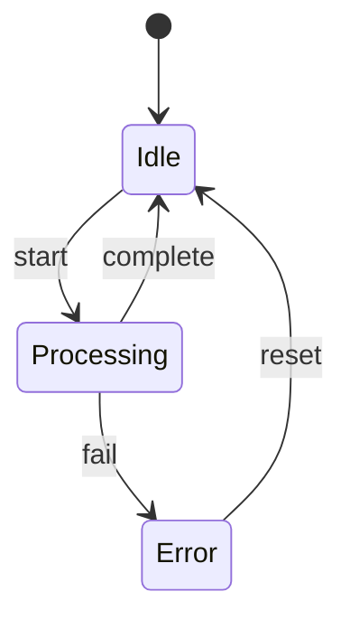
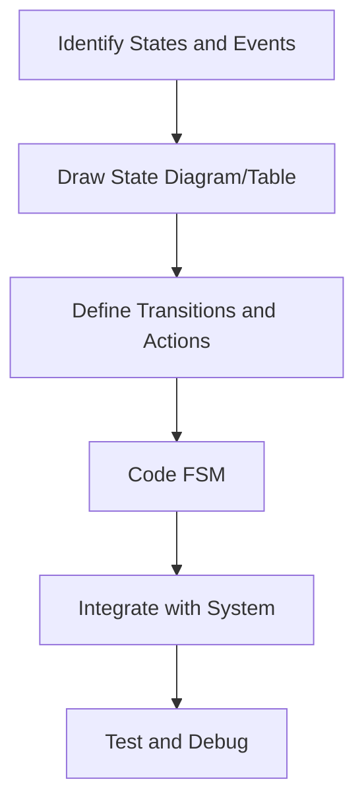
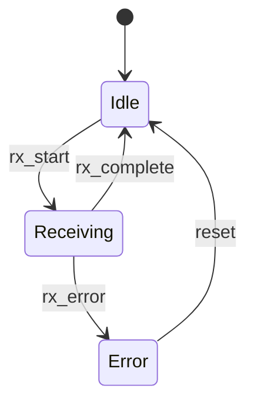
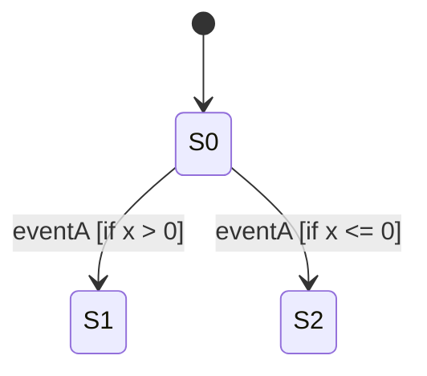
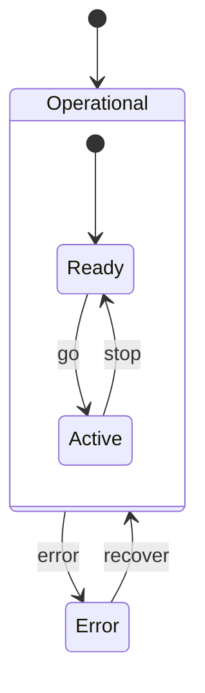
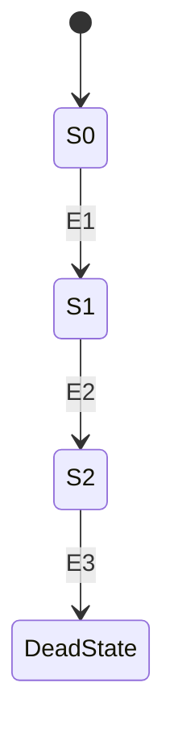
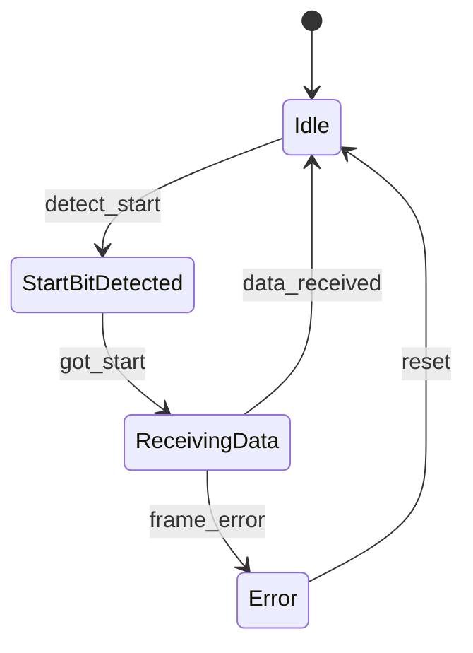

# Finite State Machines (FSMs) in Embedded and Real-Time Systems

Finite State Machines (FSMs) are abstract computational models widely used for representing, designing, and implementing deterministic control flows in embedded and real-time systems. Their deterministic nature, simplicity, and suitability for resource-constrained environments make FSMs foundational in modeling control policies, parsing routines, communication protocols, user interfaces, device drivers, and error handling routines.

## 1. Introduction to FSMs

An FSM is a computational model characterized by a finite set of states, a set of allowed transitions between these states, a defined starting state, and a set of accepted input events/actions that trigger those transitions. At any given point, the FSM is in one (and only one) of its possible states. In response to external events or inputs, the FSM transitions deterministically from one state to another according to predefined rules.

FSMs are particularly prevalent in embedded systems when implementing deterministic control logic under tight constraints on memory, performance, and code complexity, where predictable behavior is required.

## 2. Core Concepts

### 2.1 Components of an FSM

An FSM is typically defined by:

- **States**: Distinct modes or conditions in which the system can reside.
- **Events/Inputs**: External or internal triggers that may cause state transitions.
- **Transitions**: Associations that map a state and an event to another state (and possibly an output or action).
- **Actions**: Operations or outputs that may occur during transitions or while in a given state (entry/exit/do actions).
- **Initial State**: The state in which the FSM begins operation.
- **(Optional) Final State(s)**: For certain classes of FSMs, a final/accepting state may be specified.

### 2.2 Types of FSMs

FSMs can be broadly categorized as follows:

- **Deterministic Finite State Machines (DFSM, DFA)**: For each state and input, there is at most one transition.
- **Non-deterministic Finite State Machines (NDFSM, NFA)**: May specify multiple transitions for the same state and input.
- **Moore Machines**: Output depends solely on the current state.
- **Mealy Machines**: Output depends on both the current state and the input/event causing the transition.

#### Mermaid Example – Basic State Diagram



## 3. FSMs in Embedded Systems Context

### 3.1 Why FSMs?

Embedded systems must often react to asynchronous events (input signals, user activity, sensor values, etc.) in a deterministic manner, all under significant resource constraints. FSMs enable:

- **Predictable, reproducible behavior**: Well-defined state and transition logic.
- **Efficient implementations**: Simple, low-memory code and easy translation into switch statements, lookup tables, or code generated from state diagrams.
- **Clear structure for complex control flows**: Modularity, testability, and easier verification.

Typical embedded use cases:

- Communication protocol handling (UART, I2C, SPI)
- User interface control
- Power management (sleep, deep sleep, wake)
- Device initialization and error recovery

### 3.2 Workflow and Implementation

The typical FSM design and implementation workflow in embedded systems consists of:

1. **Problem Analysis**: Identify control processes, possible states, events, and actions.
2. **State Modeling**: Create a state diagram or state table.
3. **Transition & Action Definition**: Define transition and action rules.
4. **Implementation**: Choose a suitable FSM coding pattern (e.g., switch/case, function pointers, table-driven).
5. **Integration**: Connect FSM logic to event sources (interrupts, periodic polling, input handling).
6. **Testing & Verification**: Validate that all transitions and edge cases are handled correctly.

#### Mermaid Example – FSM Development Lifecycle



### 3.3 FSM Implementation Strategies

Unlike software for general-purpose computers, embedded FSM code must be highly efficient. Engineering decisions around FSM implementation typically include:

- **Flat Switch-case FSM**: Each state is handled within a switch statement in the main event loop. Suitable for simple FSMs.
- **Table-driven FSM**: State transitions and actions encoded in lookup tables. Suitable for more complex or configurable FSMs.
- **Function-pointer or State-pattern FSM**: Encapsulate each state as a function or object, enabling modular code and easy addition of new states.

#### Example: Switch-case FSM (C code for illustration)

```c
switch (state) {
    case IDLE:
        if (event == START) {
            state = PROCESSING;
            // do actions...
        }
        break;
    case PROCESSING:
        if (event == FINISH) {
            state = IDLE;
        } else if (event == ERROR) {
            state = ERROR_STATE;
        }
        break;
    // ...
}
```

> **Note**
>
> For visual representation of table-driven FSMs and their transition tables, **diagram to be added later**.

## 4. FSM Structure, Architecture, and Execution

### 4.1 State Diagram Representation

State diagrams or state transition tables are the two most common ways to model FSM logic in embedded applications.

- **State diagrams**: Visual graphs where nodes are states and edges are transitions (annotated with event labels and actions).
- **State tables**: Tabular representations mapping (state, event) pairs to (next state, action) pairs.

#### Mermaid Example – UART Receiver FSM



### 4.2 Events and Transition Conditions

Inputs driving FSM transitions can come from:

- Interrupt handlers (e.g., pin change, timer expire)
- Periodic polling (e.g., checking sensor status)
- External events (e.g., user input, communication receive)
- Internal events (e.g., timeout, sub-FSMs)

Transitions may include **guards** (conditions) and **actions** (side effects occurring during the transition).

#### Mermaid Example – FSM with Guarded Transitions



### 4.3 Actions

Actions may occur:

- **On entry** to a state (entry actions)
- **On exit** from a state (exit actions)
- **During** a transition (transition actions)

Efficient embedded FSMs may factor actions to minimize side effects and maximize testability.

## 5. Common FSM Variations for Embedded Use

### 5.1 Hierarchical State Machines (HSMs)

Hierarchical State Machines (also called statecharts) allow states to contain sub-states, enabling compact representation of complex behaviors and state reuse.

#### Mermaid Example – Simple HSM Structure



> **GitHub Alert Warning**
>
> Classic flat FSMs can suffer from state explosion in complex systems. Hierarchical approaches address this by organizing related substates, but may require custom frameworks or third-party libraries.

### 5.2 Extended FSMs (EFSMs)

An EFSM allows **state variables** in addition to current state, permitting transitions that depend on both events and variable values. EFSMs are prevalent in protocol handling and in systems where guard conditions are necessary.

### 5.3 Parallel (Orthogonal) FSMs

Some embedded systems require concurrent state machines (e.g., handling separate but interacting control concerns). Coordination between parallel FSMs must be carefully managed to avoid deadlock or inconsistent states.

## 6. Engineering Considerations

### 6.1 Integration Points

FSMs interface with:

- **Interrupt routines**: As event sources for real-time response.
- **Peripheral drivers**: For handling device-level interactions.
- **Application logic**: For overall product control.
- **Error handling mechanisms**: FSMs often implement error recovery and safe fallback states.

### 6.2 Performance Implications

FSMs are generally lightweight, but poor structuring or excessive complexity can introduce inefficiency:

- **State explosion**: Too many unique states can make code hard to maintain and test.
- **Transition delays**: Complex guards or extensive event queues can impact real-time performance.
- **Memory footprint**: Table-driven FSMs require RAM/ROM proportional to number of states and events.

> **GitHub Alert Tip**
>
> Minimize FSM state count and maximize reuse (via hierarchical or orthogonal state machine models) for maintainable, scalable designs.

### 6.3 Implementation Challenges & Pitfalls

Common FSM pitfalls in embedded engineering:

- **Unreachable states or dead states**: Failing to define transitions for all input events.
- **Uninitialized state variables**: Can result in unpredictable behavior on startup.
- **Non-determinism**: Avoid ambiguous transitions—deterministic transitions are preferred for testability.
- **State latching**: Accidental code paths that prevent state exit, causing infinite loops or lockups.

#### Mermaid Example – Dead State



> **GitHub Alert Caution**
>
> Always verify FSM completeness. All (state, event) pairs should be accounted for to avoid system lockups.

### 6.4 Testing and Validation

Strategies for FSM testing:

- **State-coverage testing**: Ensure all states are reachable.
- **Transition-coverage testing**: Every transition triggered at least once.
- **Edge case testing**: Verify correct behavior on unexpected input or invalid sequences.
- **Simulation/Emulation**: Tools can provide automated checking for unreachable states or unintended cycles.

### 6.5 Tooling and Standardization

Several UML tools and code generators support FSM modeling, notably:

- **UML Statecharts**: Standardized diagram format (see UML 2.x, ISO/IEC 19501).
- **SCXML (State Chart XML)**: W3C standard for state machine definition and runtime.

## 7. FSMs in Real-Time Operating Systems (RTOS)

FSMs often integrate tightly with RTOS tasks:

- **Event-driven tasks**: An FSM may run inside a periodic or event-triggered RTOS task.
- **Event queues and message passing**: RTOS-based FSMs can treat messages as input events, decoupling state logic from hardware interrupts.
- **Timeouts and watchdogs**: RTOS timers can provide FSM timeout events for robust error recovery.

## 8. FSMs and Protocols

Network and communication protocol implementations—such as UART, I2C, TCP/IP state machines—rely on FSMs to encode protocol states (e.g., TCP: LISTEN, SYN_SENT, ESTABLISHED, FIN_WAIT). Well-defined FSMs here enforce robustness and conformance.

#### Mermaid Example – Simplified UART Protocol FSM



## 9. Summary

Finite State Machines are critical building blocks for deterministic logic and control in embedded and real-time systems. They provide:

- **Predictability**: Each input yields a reproducible outcome.
- **Simplicity**: Compact design, straightforward code generation.
- **Resource efficiency**: Suited to resource-constrained microcontrollers.

FSM-based design reduces system complexity, improves reliability, and aids formal verification. Advanced variants (hierarchical/extended FSMs) scale to complex applications, and integration with RTOS or protocol stacks further extends FSM utility. Proper modeling, structured implementation, and comprehensive testing yield robust FSM-based control logic well-suited for demanding embedded applications.