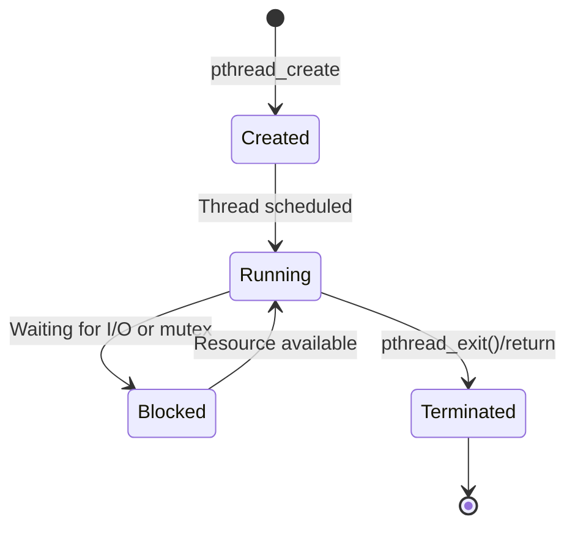
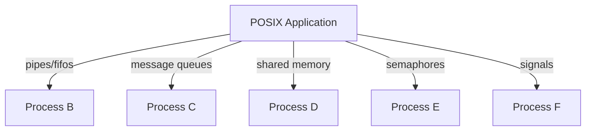
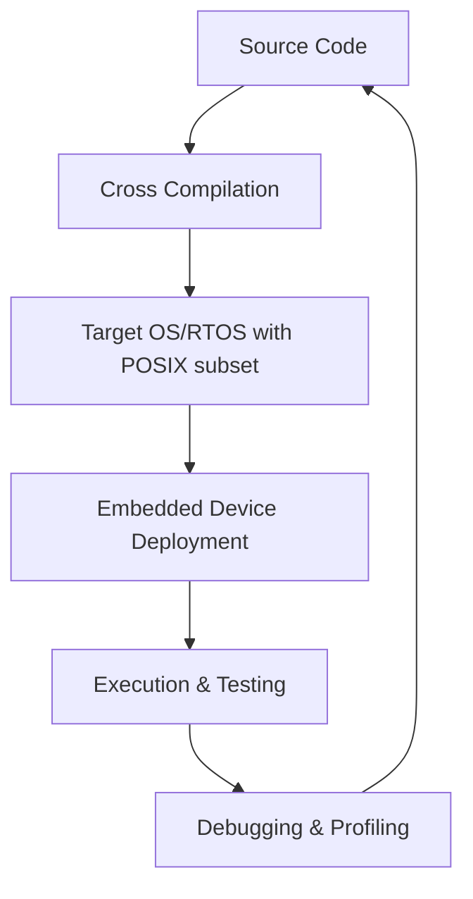
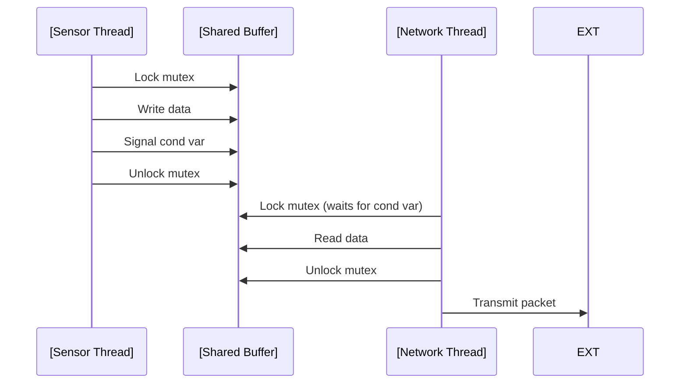

# POSIX Basics for Embedded Systems

## Introduction

Embedded systems are purpose-built computing systems designed with constraints in memory, processing power, and real time response. Increasingly, embedded software is required to interoperate across different platforms, necessitating portability. The **Portable Operating System Interface** (POSIX) standards define a family of interfaces and conventions that establish *source-level portability* for software between UNIX-like operating systems. POSIX APIs and programming models are now commonly adopted by embedded Linux distributions as well as by various Real-Time Operating Systems (RTOSs).

This primer provides an in-depth introduction to the core POSIX concepts, APIs, and programming models relevant for embedded software development. It discusses the rationale, the essential components, practical application, and highlights constraints unique to embedded environments.

---

## 1. POSIX in Embedded Context

### 1.1 What is POSIX?

**POSIX** (Portable Operating System Interface) is a set of IEEE standards (collectively, IEEE 1003 and ISO/IEC 9945) specifying interfaces between application software and operating systems. It encompasses system calls, library functions, threading, file and device I/O, IPC, and conformance semantics.

#### Key POSIX Standards
- **IEEE Std 1003.1** – Base operating system API, process/thread management, and primary IPC.
- **IEEE Std 1003.13** – Profiles and real-time extensions, specifying subsets for embedded and real-time use.
- **The Single UNIX Specification** – Defines additional requirements, aligned with POSIX.

**POSIX does not define an OS** but enables application code to be portable across systems that implement these APIs.

---

### 1.2 POSIX Adoption in Embedded Systems

Embedded operating systems, such as embedded Linux, VxWorks, QNX, FreeRTOS (with POSIX wrappers), ThreadX, and RTEMS, implement POSIX APIs to enable software reuse and portability. OSes may provide only a subset of POSIX, often focusing on the *Realt-time Controller (RTC)* profiles or *Minimal Real-Time System* profiles (POSIX.13).

**Typical application domains:**
- Industrial control
- Medical devices
- Networking products
- Consumer electronics

> **Note:** Full POSIX compliance is rare in embedded; most RTOSes provide only those APIs relevant to their target domain and resource budget.

---

## 2. Core POSIX Concepts

### 2.1 Processes and Threads

#### Processes

The process model is foundational to POSIX. Each process:
- Has its own address space.
- Communicates via well-defined IPC mechanisms.
- Typically managed by use of `fork()`, `exec()`, and `wait()` APIs.

> :warning: **Caution:** Many embedded RTOSes do not implement process isolation (`fork`/`exec`), instead focusing only on multi-threading within a monolithic process due to memory constraints.

#### Threads (pthreads)

The POSIX Threads API (`pthreads`) defines a standardized way to use multiple threads in an application:
- Create, join, and manage threads.
- Synchronize with mutexes, condition variables, and barriers.
- Control scheduling and priorities.

**Common pthread APIs:**
- `pthread_create`, `pthread_join`
- `pthread_mutex_*`, `pthread_cond_*`
- `pthread_attr_*`

##### Mermaid Diagram: POSIX Thread Lifecycle

---

### 2.2 Inter-Process Communication (IPC)

POSIX defines multiple IPC mechanisms critical for real-time and embedded systems:

- **Pipes and FIFOs:** Unidirectional/bidirectional byte streams; local to OS instance.
- **Message Queues:** Structured message passing; deterministic delivery.
- **Shared Memory (`shm_open`, `mmap`):** Allows faster, memory-based data exchange.
- **Semaphores:** Both named (system-wide) and unnamed (process-local).
- **Signals:** Asynchronous notifications between processes/threads.
- **Sockets:** Network-based communication; often excludes in minimal embedded POSIX profiles.

**Mermaid Diagram: IPC Mechanisms Overview**

> :bulb: **Tip:** For runtime efficiency in embedded applications, favor message queues for structured, prioritized communication, and shared memory for large data payloads.

---

### 2.3 File and Device I/O

POSIX standardizes file and device access with a unified I/O model:

- **File descriptors:** Integer handles for files, devices, and sockets.
- **APIs:** `open`, `read`, `write`, `close`, etc.
- **Device files:** Abstract hardware devices as files, allowing portable code to manipulate devices.

**I/O Redirection and Select/Poll**
- `select()` and `poll()` facilitate multiplexing I/O, commonly used in embedded networking and event-driven designs.

> :warning: **Caution:** Not all embedded OSes support complex file systems or device abstraction. Implementations may stub or omit some I/O APIs, potentially requiring conditional compilation or adaptation layers.

---

### 2.4 Timers and Clocks

Accurate timekeeping and alarms are vital in embedded.

- **Clocks:** `clock_gettime`, `clock_settime` for system or monotonic time.
- **Timers:** `timer_create`, `timer_settime` for asynchronous event generation.
- **sleep/yield:** `nanosleep`, `clock_nanosleep`, thread yielding.

These allow time-driven tasks, periodic execution, and timeouts.

---

### 2.5 Scheduling and Real-Time Extensions

#### Scheduling Policies

POSIX defines several scheduler policies relevant for real-time and embedded:

- **SCHED_FIFO:** First-In-First-Out, non-preemptive within priority.
- **SCHED_RR:** Round-robin, time-sliced at each priority.
- **SCHED_OTHER:** Default timesharing.
- **SCHED_DEADLINE:** (Optional, for deadline-based scheduling. Not common in all embedded POSIX.)

#### Real-Time Priorities

Threads can be assigned deterministic priorities via thread attributes, ensuring latency bounds.

> :warning: **Caution:** Real-time scheduling is not available on all embedded Linux or RTOS implementations; capabilities may depend on OS configuration and hardware timer support.

---

## 3. Practical Application in Embedded Systems

### 3.1 Typical Engineering Workflow

1. **Select Appropriate OS and Profile**
    - Full POSIX (Linux, QNX) vs. partial/real-time profile (ThreadX, FreeRTOS+POSIX).
2. **Configure POSIX Features**
    - Enable or stub unused APIs to save code space.
    - Tune scheduler and memory options.
3. **Develop Application using POSIX APIs**
    - Thread management, mutexes, semaphores.
    - Portable I/O and device access.
    - Use of configuration macros for portability (`_POSIX_THREADS`, `_POSIX_TIMERS`, etc.).
4. **Cross-Compilation and Testing**
    - Use of host development with cross-toolchains.
    - Test in both native and target environments.
5. **Debugging and Analysis**
    - Leverage standard POSIX debugging tools where supported.
    - Instrumentation via standardized APIs.

**Mermaid Diagram: POSIX Application Build Workflow**

---

### 3.2 Integration Points

#### HAL and BSP Layers

Most POSIX-RTOSes require a **Hardware Abstraction Layer (HAL)** or **Board Support Package (BSP)** between POSIX APIs and underlying hardware drivers (as POSIX only defines the application interface, not drivers).

- **Integration challenge:** Ensuring the driver model matches file/device abstraction expected by POSIX, including interrupt and DMA handling.
- **Vendor customization:** Adapting or extending POSIX APIs for project or hardware-specific needs.

---

### 3.3 Constraints and Variations

#### Resource Constraints

- Limited RAM/ROM impacts which APIs can be enabled.
- Critical sections for real-time constraints may be more granular than defined by standard POSIX APIs.
- Dynamic resource allocation (e.g., dynamic thread or semaphore creation) is sometimes avoided.

#### Feature Subsets

- POSIX profiles (per IEEE 1003.13) allow OS vendors to claim conformance to smaller sets (e.g., minimal real-time system profile).
- Often, only POSIX threads, mutexes, and minimal IPC supported; process APIs and advanced filesystem features omitted.

#### Static vs. Dynamic Resources

- Many RTOSes enforce static task/thread and stack allocation, contrary to the dynamic model of full POSIX.

> :information_source: **Note:** When porting desktop POSIX code, examine assumptions about available APIs, dynamic allocation, and error handling. Not all behaviors or limits are defined by the standard.

---

## 4. POSIX Programming Considerations in Embedded Systems

### 4.1 Determinism and Real-Time Behavior

POSIX APIs can deliver deterministic, real-time behavior *if* underlying RTOS and hardware are properly configured:
- **Priority inversion** must be mitigated, typically by priority inheritance protocols (`PTHREAD_PRIO_INHERIT`).
- API response time is ultimately bound by kernel and hardware behavior, which is not standardized by POSIX.

### 4.2 Portability and Conditional Compilation

- Use POSIX feature-test macros to conditionally compile features (`#ifdef _POSIX_SEMAPHORES`).
- Be wary of subtle semantic differences between embedded POSIX implementations (e.g., timing units, error returns).

### 4.3 Error Handling and Robustness

- POSIX standardizes error codes (`errno`), but resource-constraint errors more frequent on embedded systems.
- Defensive coding against resource exhaustion is critical (thread, semaphore, queue limits).

### 4.4 Safety and Certification

- Safety-critical domains (medical, automotive, avionics) may require certified RTOS compliance; not all open-source POSIX RTOSes can provide this.
- Thread and memory models should be audited to prevent race conditions.

---

## 5. Example: POSIX Threaded Data Acquisition

Below is a typical example pattern for a periodic data acquisition embedded task using POSIX threads and timers.

**Components:**
- One thread for sensor acquisition.
- One thread for network transmission.
- Mutex to protect shared buffer.
- Condition variable for communication.

**Mermaid Diagram: Thread Synchronization**

> :bulb: **Tip:** Always prefer static allocation and bounded queues for hard real-time reliability in embedded deployments.

---

## 6. Common Pitfalls and Debugging Tips

- **Assuming full POSIX**: Check RTOS documentation for which APIs and limits are actually supported.
- **Kernel configuration**: In embedded Linux, many POSIX features are optional kernel config items (e.g., POSIX timers, message queues).
- **Resource leakage:** Properly destroy threads and synchronization objects (`pthread_mutex_destroy`).
- **Race conditions:** Non-atomic operations due to incomplete POSIX support or hardware interrupts.
- **Porting desktop code:** Remove dependencies on process APIs and multi-user file system features.

---

## 7. Summary Table: Typical POSIX Features in Embedded RTOS Profiles

| Feature                            | Embedded Linux | RTOS POSIX Subset | Comment                                  |
|-------------------------------------|:--------------:|:-----------------:|------------------------------------------|
| Processes (`fork`, `exec`)          | Yes            | No / Minimal      | Omitted on most embedded RTOSes          |
| POSIX Threads (`pthreads`)          | Yes            | Yes               | Core of most RTOS Posix implementations  |
| Mutexes, semaphores                 | Yes            | Yes               | Universal (small footprint)              |
| Signals                             | Yes            | Sometimes         | Often limited or omitted                 |
| File/descriptors, select/poll       | Yes            | Partially         | Device access/abstraction varies         |
| Message queues                      | Yes            | Yes               | Supported for real-time IPC              |
| Shared memory                       | Yes            | Sometimes         | Rare in microcontroller-class RTOSes     |
| Clocks, timers                      | Yes            | Yes               | Real-time extensions required            |
| Dynamic resource management         | Yes            | Sometimes         | Often static in RTOS for predictability  |

---

## 8. Conclusion

POSIX APIs remain the foundation for software portability and interoperability in embedded systems. Their adoption in embedded Linux and many RTOSes enables code sharing, rapid development, and maintainability across device classes. Embedded engineering teams must, however, evaluate the tradeoffs between POSIX conformance and resource usage, and must always verify the actual subset implemented on their chosen platform.

When foundational knowledge of the POSIX model is combined with real-time and hardware-awareness typical of embedded design, engineers can leverage industry-standard software patterns while meeting the tight constraints characteristic of embedded deployments.

---