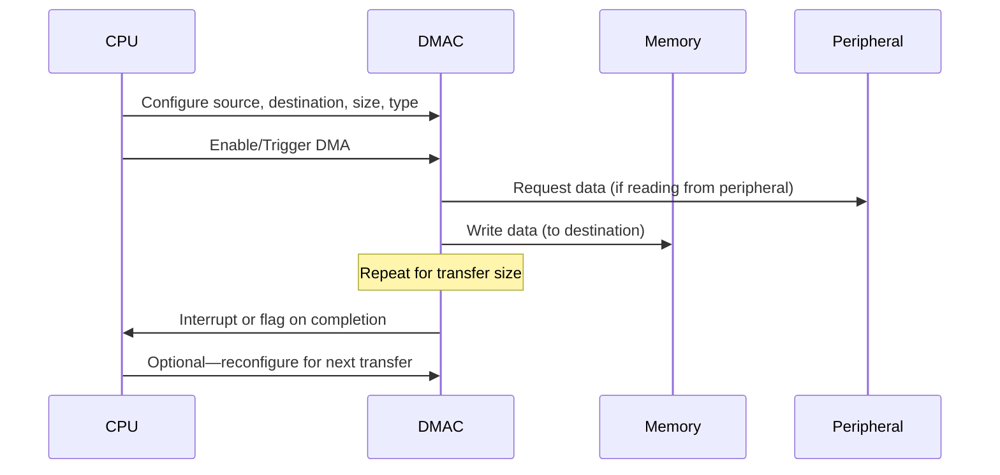
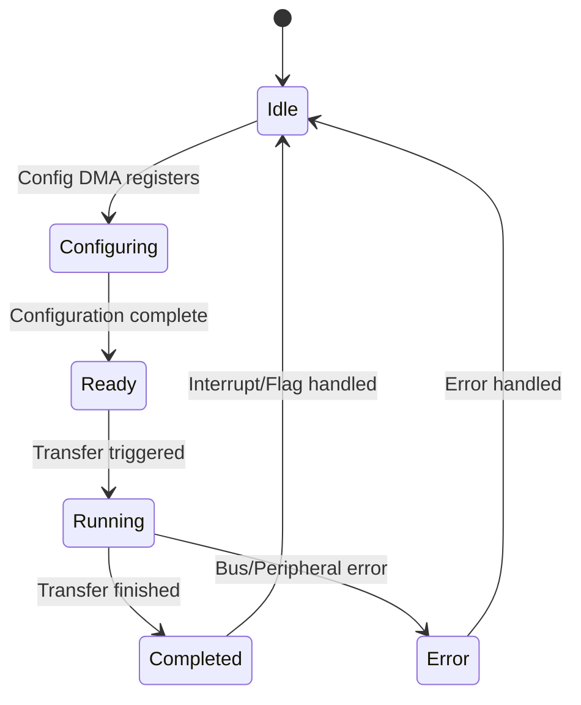
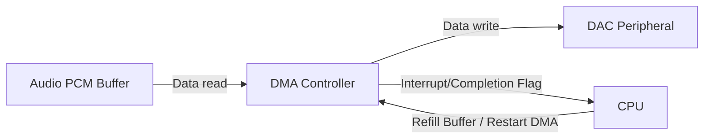

# DMA (Direct Memory Access) Technical Primer

## Introduction

Direct Memory Access (DMA) is a hardware feature that enables high-speed data transfers between memory and peripherals, or between memory regions, without continuous intervention by the central processing unit (CPU). In embedded systems and real-time operating systems (RTOS), DMA enables efficient utilization of system resources by offloading bulk data transfer tasks, thus allowing the CPU to focus on critical control and computation activities.

DMA is foundational in high-throughput systems, multimedia processing, network communications, and anywhere reduced CPU latency and deterministic data movement are central to system performance.

---

## Core Concepts

### What is DMA?

DMA is a subsystem that mediates data transfers between memory and peripherals or between different memory segments. Unlike conventional data movement (e.g., using CPU load/store instructions in programmed I/O), DMA allows a dedicated controller—the DMA Controller (DMAC)—to handle the transfer autonomously based on configurations provided by the CPU.

### When is DMA Used?

DMA is beneficial when:

- Large volumes of data must be read or written rapidly (e.g., audio buffers, ADC samples, network packets, sensor data, or graphical framebuffers).
- The CPU cannot afford to be blocked by polling or frequent interrupts during transfer.
- Power efficiency or latency predictability is required.

#### Key DMA Use Cases in Embedded Systems

- Streaming audio data from memory to a digital-to-analog converter (DAC).
- Transferring camera sensor image data to memory buffers.
- Bulk copying configuration tables between memory regions.
- Reading sensor data into memory buffers for post-processing.
- Handling data packets for communication peripherals (e.g., SPI, UART, CAN, or Ethernet).

---

## DMA Architecture and Components

DMA operation depends on both hardware (DMA controllers), their integration with peripheral devices, and software driver support.

### Core Components

- **DMA Controller (DMAC):** Hardware block managing the transfers, supporting one or more DMA channels.
- **Bus Arbiter:** Resolves bus access contention between CPU, DMA, and other bus masters.
- **Source and Destination Registers:** Specify memory/peripheral addresses for transfer.
- **Transfer Size Register:** Indicates amount and size (byte, word, burst) of data to be moved.
- **Control Logic:** Handles start, trigger, and completion conditions, alignment, increment/decrement modes, and interrupts.

### DMA in System Architecture

```mermaid
flowchart TD
    CPU[CPU Core]
    DMAC[DMA Controller]
    MEM[System Memory (RAM)]
    PERIPH1[Peripheral Device (e.g., ADC)]
    PERIPH2[Peripheral Device (e.g., UART)]
    BUS[System Bus (e.g., AHB/AXI)]
    
    CPU <---> BUS
    DMAC <---> BUS
    MEM <---> BUS
    PERIPH1 <---> BUS
    PERIPH2 <---> BUS
    CPU -- Configures --> DMAC
    DMAC -- Initiates Transfer --> MEM
    DMAC -- Initiates Transfer --> PERIPH1
    DMAC -- Initiates Transfer --> PERIPH2
```

---

## DMA Operation: Practical Workflow

The DMA workflow consists of the following generic steps:

1. **Configuration:** The CPU programs the DMAC with the source and destination addresses, transfer length, transfer direction, transfer width, triggering mechanism, and other relevant attributes.
2. **Trigger:** DMA transfers can be started by the CPU directly (software trigger) or automatically in response to hardware events (peripheral request, timer, etc.).
3. **Transfer Execution:** The DMAC arbitrates for bus access and moves data from source to destination.
4. **Completion Notification:** Once the transfer completes, the DMAC can raise an interrupt or set a flag to notify the CPU.

### Typical DMA Transfer Workflow



---

## DMA Modes and Variants

DMA controllers are highly configurable and support a variety of operational modes:

### 1. Burst vs. Single Transfer

- **Burst Mode:** Data is transferred in chunks when the bus is available, reducing bus contention and improving efficiency.
- **Single Transfer Mode:** Moves one data unit at a time, suitable for slow peripherals or narrow buses.

### 2. Memory-to-Memory vs. Peripheral-to-Memory

- **Memory-to-Memory:** Fast data movement between two memory areas.
- **Peripheral-to-Memory / Memory-to-Peripheral:** Common for streaming audio/video, sensor data transfer, network packets, etc.

### 3. Cycle Stealing vs. Block Transfer

- **Cycle Stealing:** DMA temporarily "steals" bus cycles from the CPU, transferring one or a few units and then releasing the bus.
- **Block Transfer:** DMA holds the bus until a predefined block is completed, potentially causing longer CPU wait periods.

### 4. Scatter-Gather DMA

Some advanced DMA controllers support scatter-gather or linked-list DMA, allowing non-contiguous memory regions to be specified for a transfer sequence. This reduces interrupt overhead and supports complex buffer management.

---

## Integration with Peripherals

DMA is often tightly integrated with specific on-chip peripherals in microcontrollers or SoCs (System-on-Chip). Peripheral modules (e.g., ADC, UART, SPI, I2S) typically include dedicated DMA request lines, which trigger DMA transactions when ready.

- **Dedicated Hardware Request Signals:** Peripherals raise hardware DMA requests, which are mapped by the DMAC to specific channels.
- **Software Requests:** The CPU can trigger a DMA transfer directly for memory-to-memory operations or polled I/O.

---

## Interrupts and Synchronization

DMA transfers can be synchronous (CPU actively waits for completion) or asynchronous (CPU is interrupted or polled later):

- **Interrupt on Completion:** Most DMACs can assert an interrupt when a transfer completes or an error occurs.
- **Double Buffering/Ping-Pong Buffers:** Here the CPU processes one buffer while DMA fills/empties the other, minimizing wait times and reducing data loss.



---

## Hardware Standards and Interface Specifications

DMA architectures are commonly found in platforms compliant with standard bus architectures:

- **AMBA (Advanced Microcontroller Bus Architecture, e.g., AHB/AXI/APB)**
- **PCI/PCIe Bus DMA** (for higher-end embedded and general-purpose platforms)
- **AVR/XMEGA, MSP430, STM32 DMAs:** Manufacturer-specific implementations on microcontrollers

DMA hardware registers and channel structures are documented in device datasheets and reference manuals. No universal software interface exists; each vendor's DMAC has unique configuration schemes, although industry-standard APIs like CMSIS (Cortex Microcontroller Software Interface Standard) abstract differences for ARM Cortex-M systems.

---

## Engineering Considerations and Practical Use

### CPU Utilization and Latency

DMA offloads data movement from the CPU, reducing overall CPU utilization and enabling deterministic response for time-sensitive tasks. However, poorly configured DMA can lead to unintended bus contention, increasing the latency for both DMA and CPU memory access.

> **:warning: Warning**
> On shared-bus systems, simultaneous DMA and CPU accesses can introduce unpredictable delays or priority inversion if the bus arbiter is not properly configured.

### Buffer Alignment and Data Integrity

Many DMA controllers impose requirements on alignment (e.g., word-aligned addresses) and buffer boundaries due to bus width or memory access granularity.

> **:exclamation: Caution**
> Unaligned or misconfigured DMA buffers can result in incomplete transfers, data corruption, or hard faults. Always check device documentation and use memory sections or attributes as required for alignment.

### Power Efficiency

DMA is often used in low-power designs. During DMA operation, the CPU can enter low-power or sleep modes, reducing system power consumption dramatically, particularly during long I/O operations.

### Error Handling

DMA errors may occur due to bus faults, peripheral misconfiguration, or memory access violations. Most DMACs provide error status registers and optional error interrupts that engineers must handle.

---

## Typical Integration Workflow

1. **Peripheral Initialization:** Enable the target peripheral (e.g., configure ADC, UART, SPI).
2. **DMA Channel Configuration:** Set up DMA source/destination addresses, buffer sizes, transfer width, and settings.
3. **Trigger Configuration:** Specify DMA trigger source (hardware or software).
4. **Interrupt or Completion Event Setup:** Configure DMA complete/error interrupts if required.
5. **Start DMA Transfer:** Begin transfer via CPU or hardware event.
6. **Transfer Completion Handling:** When DMA finishes, process data or re-arm DMA as appropriate.

---

## Common Pitfalls

- **Overlapping DMA and CPU Access:** Simultaneous access to the same memory region by CPU and DMA can cause data races or corruption. Use buffer management, mutual exclusion, or double-buffering techniques.
- **Improper Channel Assignment:** On multi-channel DMACs, allocating the wrong channels or failing to prioritize critical transfers can result in deadlocks or missed deadlines.
- **Lack of Error Checking:** Ignoring DMAC error flags can lead to silent data loss or corruption.

---

## Example: Audio Playback Using DMA

An audio playback system requires rapid, continuous transfer of PCM data from memory to a DAC peripheral. CPU intervention is minimized by configuring a DMA channel:



The audio application typically uses ping-pong (double) buffers: while the DMA block feeds the DAC from one buffer, the CPU prepares the next chunk in the alternate buffer.

---

## Advanced Topics

### Linked-List DMA (Scatter-Gather)

Modern DMACs may implement scatter-gather transfers, reading a chain (linked list) of descriptors from memory that program the next transfer without CPU intervention. This facilitates efficient management of non-contiguous application buffers.

### Secure and Protected DMA

In safety- or security-critical designs, DMA access is limited via memory protection units (MPU) or similar mechanisms to restrict DMA's ability to access only authorized memory regions.

### Cache Coherency

On systems with data caches, DMA may bypass or interfere with cache contents.

> **:bulb: Tip**
> When using DMA with cached memory, ensure buffers are marked as non-cacheable or perform explicit cache clean/invalidate operations to maintain data coherency.

---

## Conclusion

DMA is a key component for achieving high-throughput and deterministic data transfer performance in embedded and real-time systems. Understanding DMAC capabilities, integration intricacies, and interaction with memory hierarchy is essential for developing robust, efficient embedded applications.

DMA design involves careful consideration of buffer management, bus arbitration, error handling, and platform-specific constraints. By leveraging DMA effectively, embedded engineers can dramatically reduce CPU load and attain low-latency, high-reliability data movement across their systems.

---

## Appendix

> **:exclamation: Note**
> [Diagram to be added later: Detailed block diagram of multi-channel DMA controller with connection to multiple peripherals and memory regions.]
