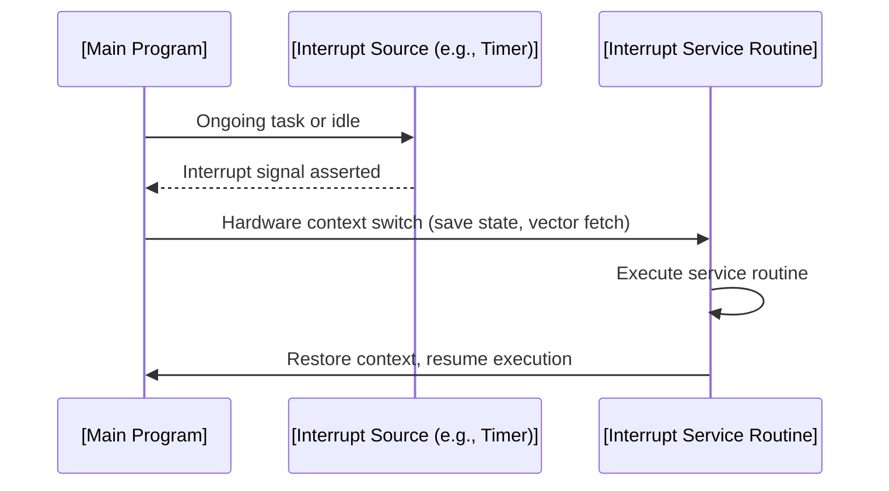
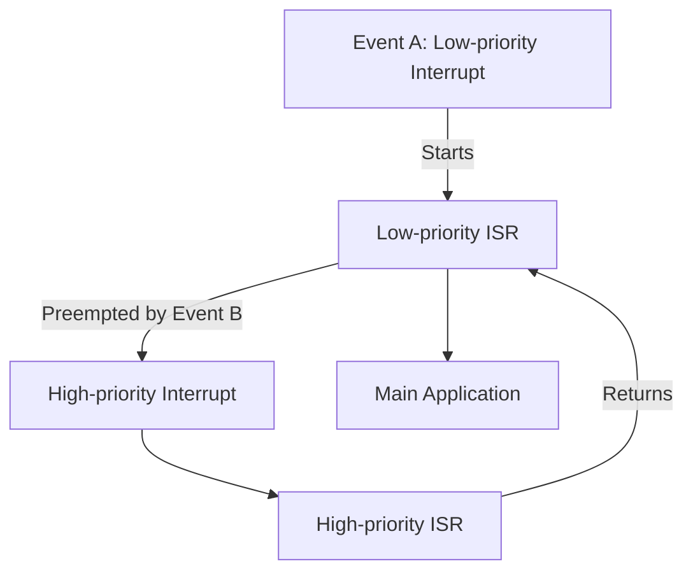
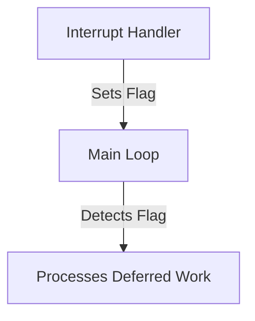
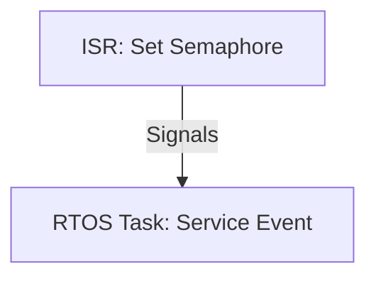
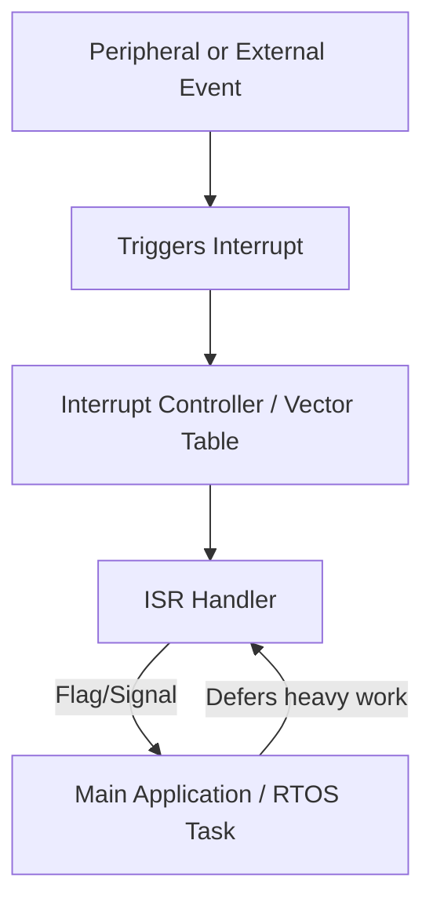

# Interrupt-driven Design: A Technical Primer

## 1. Introduction

Interrupt-driven design is a cornerstone paradigm in embedded systems engineering, enabling responsive, event-driven execution by leveraging hardware interrupt mechanisms. This approach stands in contrast to polling-based designs and is fundamental to achieving deterministic system responsiveness, supporting multitasking, and minimizing latency in systems where external or internal events are both frequent and time-sensitive.

Typical applications span from microcontroller-based firmware to complex real-time operating system (RTOS) environments across domains such as industrial control, automotive electronics, telecommunications, and safety-critical devices.

This primer presents a comprehensive engineering introduction to the underpinnings, mechanisms, architectures, workflows, and engineering tradeoffs that define interrupt-driven design.

---

## 2. Technical Context and Foundation

Interrupt-driven execution addresses a key limitation of polling-based architectures: the inability to respond to asynchronous events with minimal latency, regardless of ongoing program execution state.

### 2.1 Definition

**Interrupt:** A hardware or software signal that causes the processor to pause its current code execution and switch context to execute a special routine, generally referred to as an Interrupt Service Routine (ISR) or Interrupt Handler.

**Interrupt-driven design:** An architecture in which significant events (timing, I/O, sensor data, faults) are detected and handled primarily using interrupts, rather than continuous polling from the main program flow.

### 2.2 Role in Embedded Systems

- **Efficient resource utilization:** Allows the central processing unit (CPU) to remain in low power or perform other tasks until an event requires attention.
- **Responsiveness:** Minimizes latency between event occurrence and system response.
- **Determinism:** Supports hard and soft real-time requirements by enabling predictable, fast handling of high-priority events.

---

## 3. Core Concepts and Architectural Elements

### 3.1 Interrupt Sources

Interrupts may originate from the following:

- **Peripheral devices** (e.g., UART, SPI, I²C, ADC, timers)
- **Processor exceptions/faults** (e.g., illegal opcodes, divide-by-zero)
- **External hardware signals** (e.g., GPIO pin change)
- **Software triggers** (e.g., software interrupts on some architectures)

### 3.2 Interrupt Types

| Type                 | Description                                                                            |
|----------------------|----------------------------------------------------------------------------------------|
| Maskable Interrupts  | Can be enabled or disabled (masked) by software, allowing selective event response.    |
| Non-maskable Interrupts (NMI) | Cannot be disabled; typically reserved for critical events (faults, resets).  |
| Vectored Interrupts  | Use a vector table to determine specific handler address.                              |
| Non-vectored Interrupts | Handler address is fixed or predetermined by hardware.                              |
| Edge-triggered       | Interrupt triggered on rising/falling edge of signal.                                 |
| Level-triggered      | Interrupt asserted while the signal remains high/low.                                 |

### 3.3 Basic Mechanism: The Interrupt Cycle

#### 3.3.1 Simplified Sequence



#### 3.3.2 Context Saving

Upon interrupt acceptance:

- The processor saves critical state (typically Program Counter, Status Register, possibly additional registers) onto the stack.
- After ISR execution, this state is restored so the main program can continue as if uninterrupted.

---

## 4. System Organization and Architectural Variants

### 4.1 Interrupt Vector Table

The interrupt vector table is a hardware-defined lookup table that maps interrupt sources to handler addresses. 

- **Location:** Fixed memory region, architecture-dependent.
- **Format:** Table of addresses; indexed by interrupt source number.

#### Example: ARM Cortex-M Vector Table

| Vector Index | Function               | Handler Address    |
|--------------|-----------------------|--------------------|
| 0            | Initial stack pointer  | 0x20001000         |
| 1            | Reset handler         | 0x08000000         |
| 2            | NMI handler           | 0x08000004         |
| ...          | ...                   | ...                |
| n            | Peripheral IRQ n      | 0x080000XX         |

### 4.2 Nested Interrupts and Prioritization

Many modern microcontrollers, such as ARM Cortex-M with the Nested Vectored Interrupt Controller (NVIC), allow for nested interrupts.

- **Interrupt Preemption:** A higher-priority interrupt can pre-empt an active lower-priority ISR.
- **Grouping and Priority Levels:** Interrupts are configured with priority levels and, sometimes, subpriorities.
- **Tail-chaining (Cortex-M):** Efficient handling of back-to-back interrupts by merging context save/restore steps.



---

## 5. Interrupt Service Routines (ISRs): Design and Constraints

### 5.1 Properties

- **Atomicity:** Typically non-preemptible on single-core systems; avoid actions that may block or wait.
- **Non-reentrancy:** ISRs should not re-enter themselves unless specifically designed to do so.
- **Stack Usage:** Limited stack space—keep local variables to a minimum.

### 5.2 Engineering Guidelines

- **Minimize Execution Time:** Keep ISRs as short as possible; defer time-consuming actions.
- **Avoid Blocking/Delay:** Never call functions that may block (e.g., waiting for another interrupt, RTOS resource).
- **Shared Data:** Protect shared variables using atomic operations or synchronization schemes (volatile keyword, memory barriers).


### 5.3 Typical ISR Workflow

1. Mask further or equivalent interrupts (optional, based on priority and design).
2. Clear the interrupt flag at hardware register level.
3. Perform critical, minimal, and error-free processing (e.g., store received byte in buffer).
4. Set a software flag, post a message, or initiate deferred processing for main loop or RTOS task.

---

## 6. Workflow Integration Patterns

### 6.1 Superloop (Bare-metal) + Interrupts

In systems without an operating system ("superloop" architecture), interrupts are used to handle urgent events and signal main loop:



### 6.2 RTOS-based Interrupt Management

In systems running an RTOS, ISRs commonly interact with kernel objects (queues, semaphores).

#### Example: Interrupt triggers RTOS Task

- ISR sets semaphore or posts to RTOS queue.
- RTOS task, pending on this event, awakens and performs heavyweight processing.



> **Warning**
>
> In most RTOS environments, only specific kernel functions may be safely used from within ISRs (e.g., posting to an "ISR-safe" queue or semaphore). Using regular RTOS API functions from ISRs can cause system instability.

---

## 7. Practical Engineering Considerations

### 7.1 Integration Points

- **Peripheral Drivers:** Must expose interrupt events to application via callback, flag, or queue.
- **Middleware Stacks:** Frequently depend on correct, low-latency ISR handling (e.g., USB, networking).
- **Power Management:** Unattended interrupts must not prevent deep sleep or safe shutdown.
- **Bootloaders/Monitors:** May need to adjust or remap the interrupt vector at system startup.

### 7.2 Performance and Latency

- **ISR Latency:** Time from event occurrence to start of handler execution (hardware+software induced).
- **Interrupt Response Time:** Includes hardware synchronization, instruction pipeline flush, context save.
- **Tail-chaining:** Reduces time overhead in systems with back-to-back interrupts.

> **Tip**
>
> Use hardware features such as "fast interrupt" modes (e.g., FIQ on ARM) for extremely time-sensitive events.

### 7.3 Common Pitfalls

- **ISR Overrun:** Processing within ISR takes longer than minimum time between events. Causes missed events or lockups.
- **Priority Inversion:** Low-priority ISR blocks high-priority system actions, causing unpredictable delays.
- **Unintended Recursion:** Failing to clear interrupt source causes repeated triggering.
- **State Corruption:** Shared data modified by both ISR and main context without proper synchronization.

> **Caution**
>
> Always clear the interrupt flag at the *end* of the ISR, where atomicity is assured. Clearing too early may not mask a recurring interrupt, causing recursive entry.

---

## 8. Implementation Patterns and Examples

### 8.1 Example: UART Receive Interrupt in Bare-metal Design

```c
volatile uint8_t rx_buffer[256];
volatile uint16_t rx_head = 0;
volatile bool rx_flag = false;

// ISR: runs on UART RX event
void UART_RX_IRQHandler(void) {
    if (UART_RXFlagSet()) {
        rx_buffer[rx_head++] = UART_ReadByte();
        rx_flag = true;             // Signal main loop
        UART_ClearRXFlag();
    }
}

// main loop
int main() {
    while (1) {
        if (rx_flag) {
            rx_flag = false;
            process_rx_data(rx_buffer, rx_head);
            rx_head = 0;
        }
    }
}
```

### 8.2 Example: Timer Interrupt Used for Task Scheduling

Many embedded systems use a periodic timer interrupt ("system tick") to drive time-based activities.

```c
volatile uint32_t system_ticks = 0;

void SysTick_Handler(void) {
    system_ticks++;
    // Set flags or post semaphores for time-based jobs
}
```

**Engineering considerations:**
- System tick interval must balance between resolution (how frequently tick occurs) and CPU overhead.
- Overly fast ticks waste processing power; overly slow ticks hinder time-sensitive operations.

---

## 9. Synchronization and Data Sharing

Sharing data between the main context and ISRs must be done carefully to prevent data races and inconsistencies.

### 9.1 Volatile Keyword

In C/C++, declare shared variables as `volatile` to prevent the compiler from optimizing out accesses that can change asynchronously.

### 9.2 Critical Sections

Block interrupts (temporarily mask) in main context during sensitive operations:

```c
__disable_irq();        // Assembly intrinsic to mask interrupts
// Critical section
__enable_irq();
```

Or, on RTOS-based systems, use kernel-provided primitives (`taskENTER_CRITICAL()` / `taskEXIT_CRITICAL()`).

### 9.3 Lock-free Communication (Circular Buffers)

ISRs often write to a ring-buffer, and the main loop or tasks read out; pointers/indices must be updated atomically (use of `volatile`).

> **Note**
>
> Use single-producer, single-consumer ring buffer patterns to facilitate lockless communication between ISR and main context.

---

## 10. Hardware Support and Standards

### 10.1 Processor Support

Key architectural features influencing interrupt handling include:

- **Vectored and prioritized interrupt controllers** (e.g., ARM NVIC)
- **Dedicated "fast" interrupt channels** (e.g., ARM FIQ, AVR INT0/INT1)
- **Hardware stack and context save/restore**

### 10.2 Relevant Standards and Specifications

- **ARM Cortex-M Series:** Described in ARM’s "ARMv7-M Architecture Reference Manual".
- **IEEE 1003 (POSIX):** Real-time extensions specify signal delivery but not hardware interrupts.
- **AUTOSAR (Automotive):** Specifies interrupt handling best practices in automotive designs.

---

## 11. Common Variations and Advanced Patterns

### 11.1 Software Interrupts

Some architectures provide mechanisms to trigger interrupts from software (e.g., `SWI` instruction, system calls), used for context switch requests, or user-to-kernel transitions.

### 11.2 Deferred Procedure Calls (DPCs)

Extensive work can be deferred from ISRs to DPCs running at lower priority or in thread context, as in many RTOSs or in the Windows kernel.

### 11.3 Multi-core and Shared Interrupt Controllers

Modern MCUs/CPUs may have complex interrupt routing, supporting symmetric or asymmetric delivery to multiple cores. Careful partitioning and affinity configuration are required.

---

## 12. Debugging and Verification

### 12.1 Observability

- **Logic analyzers, oscilloscopes:** Hardware event timing and ISR response measurement.
- **Event trace units (ETU), Embedded Trace Macrocell (ETM):** Event logging and profiling.
- **In-circuit debuggers:** Support breaking on interrupts, inspecting ISR stack.

### 12.2 Static Analysis

- **ISR Best Practice Checking:** Tools may flag forbidden API calls or blocking actions inside ISRs.
- **Stack Usage Analysis:** Prevents stack overflow from deeply nested or recursive ISR use.

---

## 13. Interrupt-driven Design: System Overview Diagram



---

## 14. Conclusion

Interrupt-driven design is indispensable in embedded systems, providing rapid response, deterministic control, and efficient resource utilization. Mastery of this paradigm—understanding hardware features, ISR constraints, synchronization issues, and architecture-specific subtleties—enables engineers to implement robust, efficient event-driven systems.

Correct application of interrupt-driven techniques is vital for real-time responsiveness, power efficiency, and functionality in modern embedded platforms. Careful design around ISR duration, data integrity, prioritization, and system integration is central for reliability and maintainability.

---

**Keywords:** Interrupt, ISR, Embedded, NVIC, RTOS, Event-driven, Atomicity, Masking, Preemption

**Related Topics:** Finite State Machines (FSMs), RTOS Fundamentals