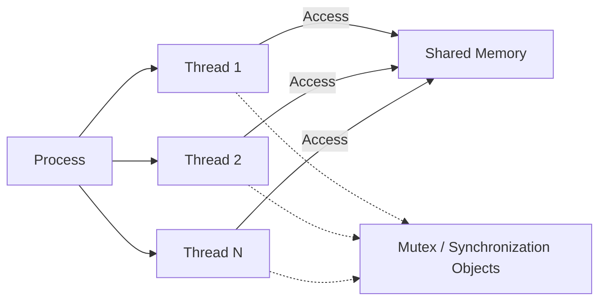
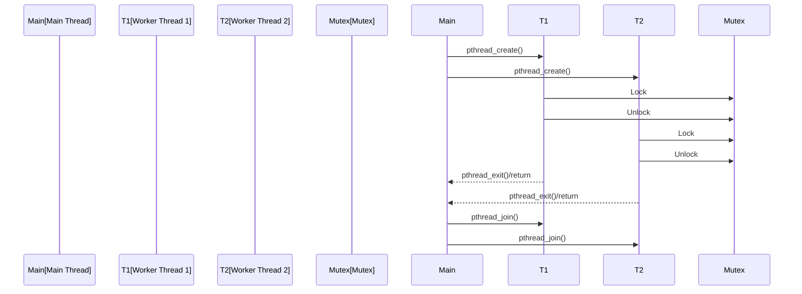

# POSIX Threads (pthreads): A Technical Primer

## 1. Introduction and Context

In embedded and real-time systems engineering, efficient and portable concurrency constructs are crucial for the development of robust applications. POSIX Threads, commonly known as **pthreads**, represent the de facto standard threading API for C and C++ on POSIX-compliant operating systems, including most UNIX-like platforms such as Linux and BSD derivatives. They are defined by the **IEEE 1003.1c-1995** POSIX standard (often referenced as IEEE Std 1003.1, or "POSIX.1"), which specifies system interfaces for portability across compliant systems.

Pthreads provide a uniform programming model for managing **multiple threads of execution** within a single process. Each thread has its own execution context (e.g., program counter, registers, stack), but shares global memory and resources with other threads within the same process. This model is particularly suited to embedded and real-time system workloads where responsiveness, resource utilization, and predictability are paramount.

## 2. Core Concepts and Definitions

### 2.1 Thread

A thread is the smallest unit of execution within a process. A process may consist of multiple threads, each executing concurrently and possibly interacting via shared memory primitives. In pthreads, threads are **lightweight** compared to processes—they share the process's address space and most of its resources.

### 2.2 POSIX Threads API

The pthreads API defines data types, constants, and functions for thread management and synchronization. The fundamental types include:

- `pthread_t`: Identifier for threads.
- `pthread_attr_t`: Attributes object for thread creation.
- Synchronization primitives: `pthread_mutex_t`, `pthread_cond_t`, `pthread_rwlock_t`, `pthread_spinlock_t`, etc.

### 2.3 Key Architectural Elements

Pthreads have several main components:

1. **Thread Creation and Management**: Functions for creating, joining, terminating, and detaching threads.
2. **Synchronization Primitives**: Mutexes, condition variables, read-write locks, and barriers.
3. **Thread Attributes and Scheduling**: Control over thread stack size, scheduling policy, priority, and other attributes.
4. **Thread-Specific Data**: Mechanisms for associating data with specific threads.
5. **Cancellation and Cleanup**: Facilities for asynchronous and deferred thread termination.

## 3. High-Level Architecture

The following diagram illustrates the basic architecture and relationships in a multi-threaded process using pthreads.


*Figure: Pthreads Architecture—Multiple threads within one process share memory and synchronization objects.*

## 4. Fundamental Operations

### 4.1 Thread Lifecycle

The thread lifecycle encompasses the creation, execution, and termination (clean or forced) of thread objects.

```mermaid
stateDiagram-v2
    [*] --> New
    New --> Runnable : pthread_create()
    Runnable --> Running : OS Thread Scheduler
    Running --> Waiting : Synchronization Primitives
    Waiting --> Runnable : Condition Satisfied
    Running --> Terminated : pthread_exit() / Thread Returns
    [*] <-- Terminated
```
*Figure: Thread Lifecycle Using pthreads API.*

### 4.2 Creating Threads

Threads are created by calling `pthread_create`, which takes:

- A pointer to `pthread_t` (returned thread ID)
- An attribute object (or NULL for defaults)
- The start routine (function pointer)
- An argument to pass to the thread function

**Example:**
```c
pthread_t thread;
int rc = pthread_create(&thread, NULL, thread_func, arg);
```

#### Practical Notes

> **:warning: Caution**
> Thread creation incurs resource overhead (e.g., stack allocation, scheduler metadata). In embedded systems, always balance concurrency with system limits to avoid exhausting RAM or creating excessive context-switching overhead.

### 4.3 Joining and Detaching Threads

- **Joining**: `pthread_join(thread, retval)` waits for a thread to complete and collects its exit status.
- **Detaching**: `pthread_detach(thread)` marks a thread as detached. Detached threads clean up resources immediately upon exit, and cannot be joined.

> **:information_source: Tip**
> Use detached threads for “fire-and-forget” tasks. Use joinable threads when you need to synchronize with or collect results from a thread.

### 4.4 Thread Termination

Threads terminate:

- Explicitly via `pthread_exit()`
- Implicitly by returning from the entry function
- Via cancellation by another thread (see Section 6).

### 4.5 Thread Attributes and Scheduling

- **Attributes**: Configurable via `pthread_attr_t`, including stack size, detach state, scheduling policy, and priority.
- **Scheduling Policies**: POSIX supports policies such as `SCHED_FIFO` (real-time FIFO), `SCHED_RR` (real-time round robin), and `SCHED_OTHER` (default time-sharing).

#### Example: Setting Stack Size

```c
pthread_attr_t attr;
pthread_attr_init(&attr);
pthread_attr_setstacksize(&attr, 4096); // Set 4KB stack
pthread_create(&thread, &attr, thread_func, arg);
pthread_attr_destroy(&attr);
```

> **:bulb: Tip**
> Tuning stack size per thread minimizes memory usage—critical in resource-constrained embedded systems.

## 5. Synchronization Primitives

Multithreaded programs risk **race conditions** and **data corruption**. Pthreads provides primitives to ensure mutual exclusion and proper coordination:

### 5.1 Mutexes

`pthread_mutex_t` provides binary mutual exclusion. Only one thread can lock a given mutex at a time.

#### Usage Example

```c
pthread_mutex_t mtx = PTHREAD_MUTEX_INITIALIZER;
pthread_mutex_lock(&mtx);
// critical section
pthread_mutex_unlock(&mtx);
```
> **:warning: Caution**
> Always release (unlock) mutexes in all code paths, including error handling, to prevent deadlocks.

### 5.2 Condition Variables

`pthread_cond_t` lets threads block until a particular condition occurs. Commonly used with a mutex.

```c
pthread_mutex_lock(&mtx);
while (!condition_met) {
    pthread_cond_wait(&cond, &mtx);
}
// proceed when condition_met
pthread_mutex_unlock(&mtx);
```

### 5.3 Read-Write Locks

`pthread_rwlock_t` enables multiple concurrent readers or exclusive access for writers.

### 5.4 Barriers

`pthread_barrier_t` allows a set of threads to synchronize at a point, only continuing once all have reached the barrier.

> **:bulb: Tip**
> Barriers are useful for thread pool phased computations or staged pipeline steps.

### 5.5 Spinlocks

`pthread_spinlock_t` is a busy-wait lock, more suitable for short critical sections on multicore systems.

## 6. Thread-Specific Data (TSD)

When global variables are inappropriate, thread-specific data allows associating unique data with each thread. Managed via `pthread_key_t` and accessor functions.

**Workflow:**
1. Create a key: `pthread_key_create`
2. Set per-thread value: `pthread_setspecific`
3. Get per-thread value: `pthread_getspecific`

## 7. Cancellation and Cleanup

Threads may be canceled via `pthread_cancel`. Cleanup handlers can be registered with `pthread_cleanup_push/pop` to execute resource releases reliably.

- **Cancellation Types**: 
  - Asynchronous: thread may be terminated at any point (rarely used; dangerous in RTOS).
  - Deferred (default): thread checks for cancellation at defined points.

> **:warning: Caution**
> Asynchronous cancellation can lead to inconsistent state; **deferred cancellation** is recommended for embedded or real-time systems.

## 8. Practical Workflows and Common Patterns

### 8.1 Typical Multithreaded Workflow


*Figure: Main thread spawns worker threads, synchronizes with them, and joins on completion.*

### 8.2 Producer-Consumer Pattern

The producer-consumer queue is a classic pattern for threads interacting via a bounded buffer, mediated by mutexes and condition variables.

> **Note**
> [Diagram to be added later]: Buffer state evolution in producer-consumer using pthreads.

## 9. Engineering Considerations

### 9.1 Performance and Determinism

- **Thread Creation Cost**: Thread creation is typically more expensive than function calls or coroutines due to OS setup.
- **Context Switching**: Excessive threading may lead to increased CPU cache misses and context switch overhead.
- **Real-Time Suitability**: Use real-time scheduling (`SCHED_FIFO`, `SCHED_RR`) and priority management to reduce jitter.

> **:warning: Caution**
> Not all pthread implementations are real-time capable. The underlying OS kernel must support the necessary real-time guarantees for deterministic behavior.

### 9.2 Portability

Pthreads are present on most UNIX-like OSes. Variants and subsets are found in many RTOSes (e.g., RTEMS, VxWorks, FreeRTOS with POSIX API layer). Verify supported features and constant values on your platform.

### 9.3 Memory Footprint

- **Stack Size**: Each thread requires its own stack, affecting total RAM usage.
- **Control Structures**: Scheduler and synchronization objects consume additional memory.
- **Resource Limits**: The number of simultaneous threads may be bounded by configuration limits (`PTHREAD_THREADS_MAX`, kernel parameters).

### 9.4 Integration with C/C++ Codebases

Pthreads are usable in pure C, C++, and mixed-language projects. C++ developers should ensure correct interactions with exceptions and Resource Acquisition Is Initialization (RAII) idioms, especially when writing cleanup code.

### 9.5 Debugging and Analysis

Threaded applications are harder to debug than single-threaded ones due to possible race conditions and nondeterministic behavior. Tools such as Valgrind (Helgrind), ThreadSanitizer, and OS-provided tracing tools can assist with analysis.

> **:information_source: Tip**
> Where possible, encapsulate thread logic and synchronization within well-defined modules to simplify reasoning and verification.

### 9.6 Common Pitfalls

- Deadlocks from improper lock acquisition/release order.
- Resource leaks from detached threads or unjoined terminated threads.
- Priority inversion: lower-priority thread holding a lock needed by higher-priority threads.
- Non-portable assumptions about thread scheduling, stack sizes, or scheduler fairness.

## 10. Standards and Specification Details

- **POSIX**: IEEE Std 1003.1-2008 (POSIX.1-2008), formerly IEEE 1003.1c-1995 (POSIX.1c).
- **Relevant Sections**: Pthreads API (`<pthread.h>`), scheduling interfaces, synchronization primitives.
- **Scope**: Defines mandatory and optional parts; implementations may support only a subset (consult `_POSIX_THREAD_*` feature test macros).
- **RTOS Integration**: Some RTOSes only provide subsets for resource-constrained devices; verify which primitives and scheduling policies are real-time certified.

## 11. Advanced Topics (Brief Overview)

### 11.1 Priority Inheritance and Robust Mutexes

Some RTOS pthreads implementations support **priority inheritance** or **priority ceiling** protocols via mutex attributes to prevent priority inversion.

### 11.2 Thread Pools

Managing thread lifecycles via pools avoids frequent thread creation/destruction, reducing latency and resource churn. Pthreads itself does not provide native thread pools; these can be implemented at the application level.

### 11.3 Interaction with Signals

Threads may interact with UNIX signals; however, signal disposition needs careful coordination in multi-threaded scenarios.

### 11.4 Affinity and CPU Binding

Thread affinity can be set with platform extensions (`pthread_setaffinity_np`), pinning threads to CPUs to optimize cache locality—important in multicore embedded systems.

## 12. Conclusion

POSIX Threads (pthreads) constitute a mature and standardized model for multithreaded programming on UNIX-like and embedded RTOS platforms that provide a compatible API. They offer a portable foundation for concurrent programming in C and C++ systems, with broad support for scalable, efficient designs. When applying pthreads to embedded and real-time systems, careful attention to platform constraints, performance characteristics, and robust synchronization design is vital to ensure reliable, maintainable, and deterministic applications.