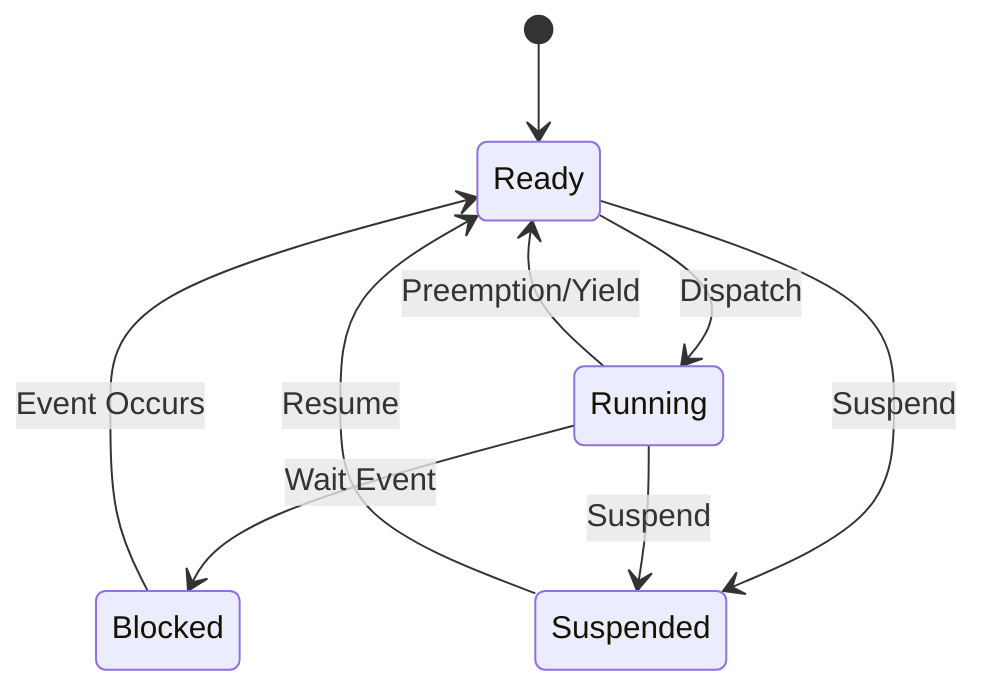
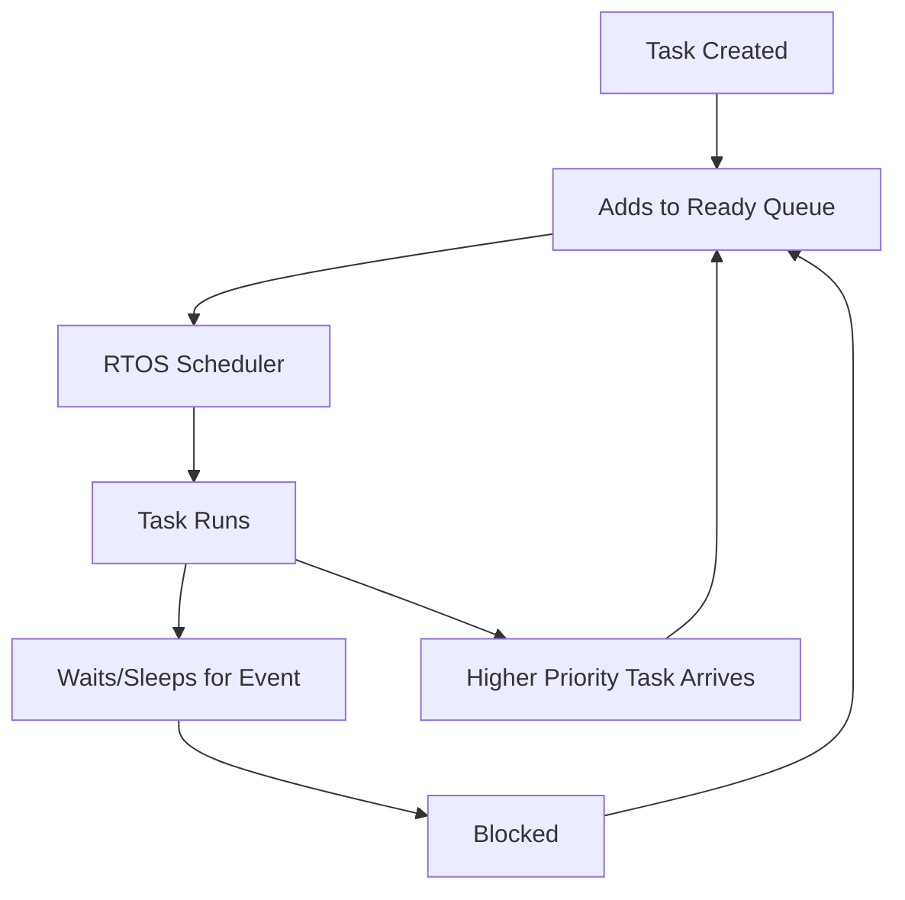
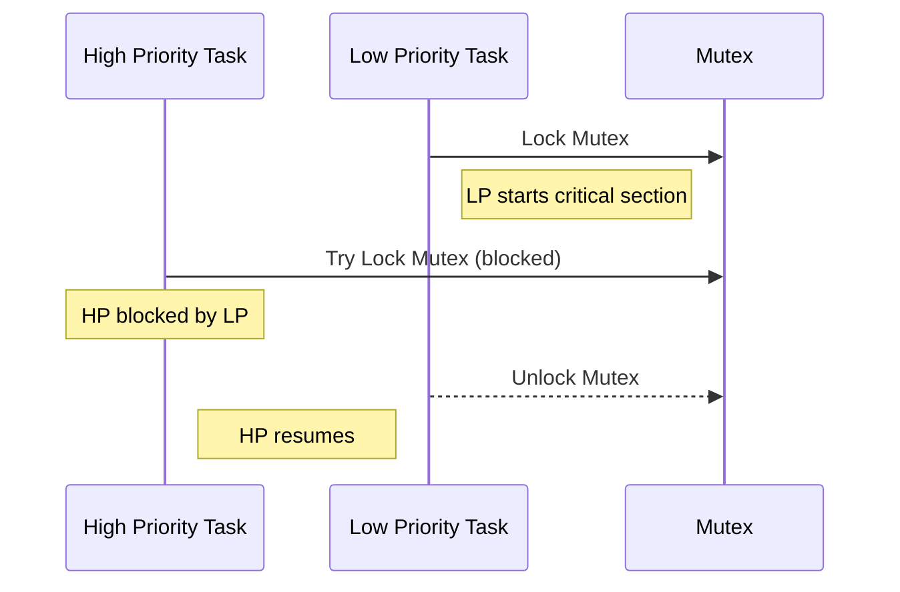
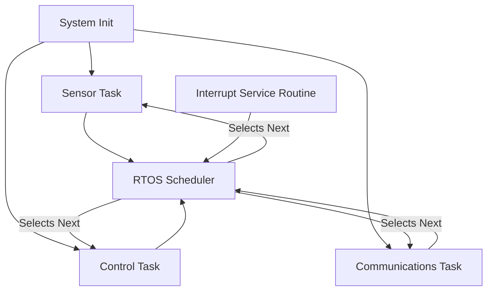

# RTOS Fundamentals

## Introduction

A Real-Time Operating System (RTOS) is a specialized operating system designed to guarantee reliable, predictable, and timely task management and scheduling, as required by real-time embedded systems. Determinism—where system behavior can be guaranteed within given timing constraints—sets RTOSs apart from general-purpose operating systems (GPOSs). RTOSs are used in systems where timing correctness is as important as logical correctness: avionics, automotive control, industrial automation, robotics, telecom, and more.

This primer provides an in-depth exploration of RTOS concepts, architectures, typical workflows, and practical considerations for embedded engineers tasked with designing or deploying embedded real-time systems.

---

## 1. Real-Time Systems Overview

### 1.1. Defining Real-Time

A **real-time system** is one in which the correctness of computation depends not only on its logical accuracy but also on its execution timing. Real-time systems are classified as:

- **Hard real-time**: Missing a deadline is considered a catastrophic failure (e.g., safety-critical controls in aviation or medical devices).
- **Firm real-time**: Occasional missed deadlines degrade performance but do not necessarily cause systemic failure.
- **Soft real-time**: Missed deadlines merely reduce performance or quality (e.g., multimedia playback).

### 1.2. RTOS Context

Unlike GPOSs—where throughput and user interactivity are prioritized—RTOSs focus on **predictability and determinism**:

- **Predictability**: Response times for system events are consistent and bounded.
- **Determinism**: Operations execute within known time limits.

RTOSs typically implement a minimalistic architecture, avoiding features that could introduce unbounded latencies (e.g., complex virtual memory paging schemes).

---

## 2. Core Concepts and Architecture

### 2.1. RTOS Kernel Architecture

An RTOS kernel is a compact, highly optimized core providing essential services for task management and synchronization. There are three principal kernel architectures:

- **Monolithic**: All kernel services are part of a single binary image.
- **Microkernel**: Only essential services (such as address-space management, scheduling, IPC) reside in the kernel; other services are in user mode.
- **Exokernel/Nano-kernel**: Bare-minimum kernel delegating most services to application-level libraries.

Most RTOSs used in deeply embedded systems are monolithic or microkernel-based.

#### Mermaid Diagram: RTOS Kernel Layers

```mermaid
flowchart TD
    Application[Application Tasks]
    Middleware[Middleware (Optional)]
    Kernel[RTOS Kernel]
    HW[Hardware]

    Application --> Middleware
    Middleware --> Kernel
    Kernel --> HW
```

---

### 2.2. Task/Thread Model

#### Definitions

- **Task** or **Thread**: The basic concurrent execution unit managed by the RTOS kernel. The terminology varies across RTOSs; often used interchangeably.
- Each task has its own context: stack, program counter, registers.
- In some RTOSs, tasks are grouped into **processes**, but resource-constrained embedded RTOSs typically distinguish only tasks.

#### Task States

A deterministic RTOS maintains strict control over task states:

- **Running**: Executing on the CPU.
- **Ready**: Eligible for execution (waiting for CPU).
- **Blocked/Waiting**: Waiting for event or resource.
- **Suspended**: Not eligible for execution (explicitly suspended).

##### Mermaid Diagram: RTOS Task State Transitions



---

### 2.3. Deterministic Scheduling

**Scheduling** is at the heart of RTOS design. Real-time schedulers manage the order and duration of task execution to ensure deadlines are met.

#### 2.3.1. Scheduling Policies

- **Preemptive Priority Scheduling**: Always runs the highest-priority ready task. Preemption occurs if a higher-priority task becomes ready.
- **Cooperative Scheduling**: Tasks must explicitly yield the CPU.
- **Time Slicing (Round-Robin)**: Ready tasks of equal priority are scheduled in fixed time slices.

#### 2.3.2. Priority Assignment

- **Static priorities**: Assigned at design time, never change.
- **Dynamic priorities**: May change at runtime (e.g., as with Earliest Deadline First).

#### 2.3.3. Rate Monotonic Scheduling (RMS) and Earliest Deadline First (EDF)

- **RMS**: Assigns higher priorities to tasks with shorter periods (fixed-priority).
- **EDF**: Dynamically assigns priorities according to task deadlines.

##### Mermaid Diagram: RTOS Scheduler Flow



---

### 2.4. Interrupt Handling

An RTOS must balance the latency and impact of hardware interrupts with task execution:

- **Interrupt Service Routines (ISRs)** handle immediate hardware conditions.
- ISRs should be kept as short as possible.
- Long processing is deferred to tasks, commonly via **deferred procedure calls** or **interrupt-to-task signaling**.

#### Key Considerations

- **Interrupt latency**: The time from interrupt assertion to ISR execution.
- **Context switch latency**: The time to save and restore task context during a switch.

---

### 2.5. Synchronization and IPC

#### Mutual Exclusion

- **Mutexes**: Provide exclusive access to shared resources.
- **Semaphores**: Counting or binary; control access or synchronize event signaling.

#### Event Notification

- **Event flags/groups**: Allow tasks to wait for multiple events.
- **Message queues**: Support data passing between tasks.

#### Priority Inversion and Inheritance

A classic RTOS problem is **priority inversion**, where a low-priority task blocks a higher one by holding a required resource. Most RTOSs provide **priority inheritance**, temporarily elevating the lower-priority task's priority to that of the waiting higher-priority task.

##### Mermaid Diagram: Priority Inversion Scenario



---

### 2.6. Memory Management

Most embedded RTOSs avoid complex memory management to preserve predictability:

- **Static allocation**: Preferred for deterministic behavior.
- **Dynamic allocation (heap)**: Sometimes supported for tasks, stacks, buffers, with fixed pools to avoid fragmentation.

Some safety-critical RTOSs avoid dynamic allocation entirely to guarantee timing.

## 3. RTOS in Practice

### 3.1. Typical RTOS Workflow

1. **System Initialization**
   - Hardware setup: clocks, peripherals, interrupt controller.
   - Hardware abstraction layers (HALs) initialization.
   - Kernel and scheduler initialization.

2. **Task Creation and Configuration**
   - Define task functions, priorities, stack sizes, parameters.
   - Create tasks/threads via RTOS API.

3. **Resource Allocation**
   - Initialize semaphores, mutexes, and message queues.
   - Configure periodic timers or alarms.

4. **Application Logic**
   - Tasks execute, synchronize, communicate, handle I/O.
   - ISRs trigger events/post to queues or signal semaphores.

5. **Shutdown/Low Power**
   - Optional: Halt tasks, save state, enter low-power modes.

---

### 3.2. RTOS API Patterns and Integration

Most RTOSs export a set of standard APIs, often conforming (or inspired by) standards such as **POSIX pthreads** (IEEE 1003.1), **OSEK/VDX** (automotive), **AUTOSAR OS**, etc.

#### Common API Patterns

- `create_task(func, priority, stack, args)`
- `start_scheduler()`
- `mutex_lock(m)`
- `mutex_unlock(m)`
- `semaphore_wait(s)`
- `semaphore_signal(s)`
- `delay(time_ms)`
- `queue_send(q, msg)`
- `queue_receive(q, msg)`

#### Integration Points

RTOSs are embedded into projects through **board support packages (BSPs)**, HALs, and typically interact with device drivers, protocol stacks, and middleware such as file systems or TCP/IP stacks.

---

### 3.3. Real-World Example: Task Scheduling Flow

##### Mermaid Diagram: Example Application Task Flow



---

## 4. RTOS Engineering Considerations

### 4.1. Integration and Portability

- RTOSs require architecture-specific **porting layers** for context switching and interrupt control.
- Portability considerations: instruction set, memory model, toolchain support.
- Some RTOSs support multicore or distributed configurations; others assume single-core.

### 4.2. Performance Metrics

- **Task context switch time**
- **Interrupt latency**
- **Scheduler overhead**
- **RAM/ROM footprint**

**⚠️ Warning:**  
Minimizing interrupt latency and jitter is essential for meeting real-time deadlines—instrument and measure your system using vendor-supplied or custom benchmarks.

### 4.3. Safety and Certification

Safety-critical domains (automotive, medical, avionics) require RTOSs to comply with standards such as **ISO 26262**, **DO-178C**, or **IEC 61508**. This affects architectural features, testability, and documentation demands.

**💡 Tip:**  
If certification is needed for your application, select an RTOS and RTOS version that explicitly support the relevant safety standards.

---

### 4.4. Implementation Challenges

- **Deadlocks**: Poor use of mutexes/semaphores can lead to unresolvable blocking.
- **Race conditions**: Failing to guard critical shared resources correctly.
- **Resource starvation**: Low-priority tasks never get CPU time if priorities are misassigned.
- **Stack overflows**: Each task typically requires a statically sized stack; stack overflows may go undetected in simple RTOSs.
- **Memory fragmentation**: Excessive use of dynamic allocation can reduce predictability, even lead to allocation failures.

**🚨 Caution:**  
Stack overflows in tasks can be catastrophic and hard to debug. Use stack overflow detection features when available.

---

### 4.5. Common Pitfalls

- **Violating priority assignment best practices**
- **Letting ISRs do too much work**
- **Blocking shared resources for excessive time**
- **Failing to size task stacks adequately**
- **Improper or non-deterministic use of dynamic memory**

---

### 4.6. Engineering Trade-offs

- Higher granularity in tasks increases modularity but may drive up context switch and scheduling overhead.
- Too few tasks can lead to complex, hard-to-test code structures.
- Preemptive scheduling offers best responsiveness at the cost of more complex debugging and timing analysis.

---

## 5. RTOS Variants and Practical Choices

### 5.1. Commercial vs. Open Source RTOS

- **Commercial RTOS**: VxWorks (Wind River), ThreadX (Microsoft), QNX (BlackBerry), INTEGRITY (Green Hills), often with certification artefacts, tooling, vendor support.
- **Open source RTOS**: FreeRTOS, Zephyr, RIOT, ChibiOS—widely used in IoT, free to modify and port.

### 5.2. Lightweight vs. Feature-Rich

- **Minimal RTOS**: Tiny kernel, just tasks and ISRs (e.g., FreeRTOS in minimal configuration).
- **Full-featured RTOS**: Support for filesystems, networking, USB, POSIX compliance, possibly MMU-based memory management.

Choose based on your application’s real-time needs, hardware constraints, and certification demands.

---

## 6. Standards and Specifications

While not every RTOS implements the same API, the following standards are widely referenced:

- **POSIX.1** (IEEE 1003.1): Defines portable APIs for threads, synchronization, etc.
- **OSEK/VDX**: Specifies RTOS services for automotive ECUs.
- **AUTOSAR OS**: Successor to OSEK; more feature-rich automotive standard.
- **ARINC 653**: Partitioned OS architecture for safety-critical avionics.
- **MISRA C**: Coding standard for safety in automotive and embedded C.

---

## 7. Summary

A Real-Time Operating System is the cornerstone of modern embedded real-time platforms, providing the deterministic scheduling and task management needed for reliable, predictable operation in time-constrained environments. Mastery of RTOS architectural concepts—task management, scheduling, synchronization, interrupt handling, and memory management—is essential for engineers designing embedded systems with real-time constraints.

Understanding the trade-offs, integration challenges, and best practices helps avoid common pitfalls and ensures robust, maintainable, and certifiable real-time solutions.

---

## Appendix

**Note:**  
If additional architectural diagrams or timing charts are needed for a specific RTOS implementation, they can be added later.
