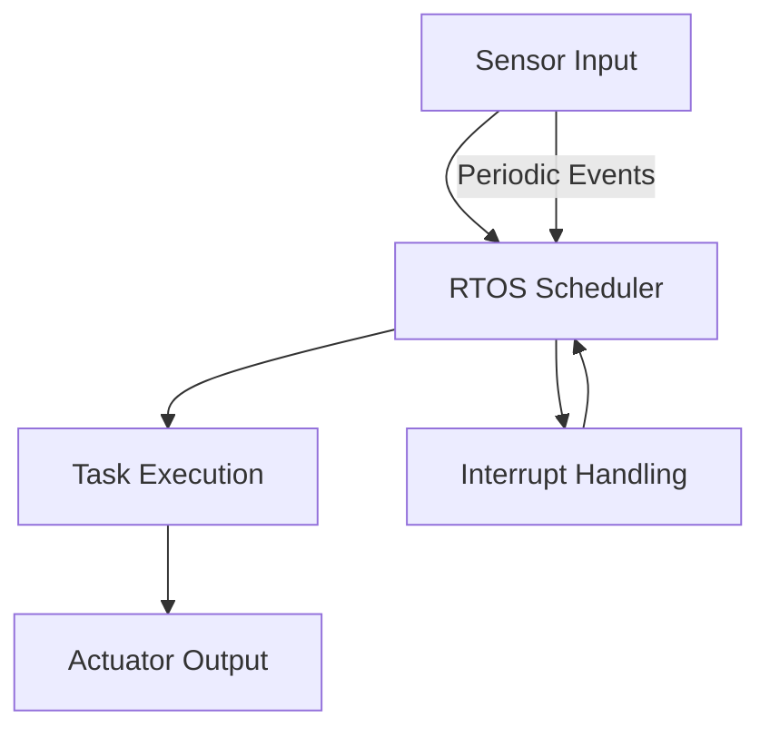
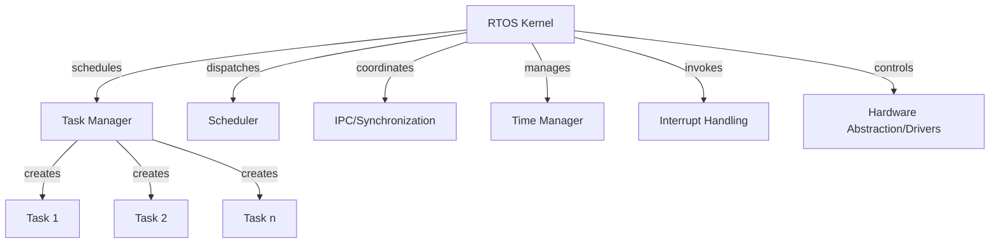
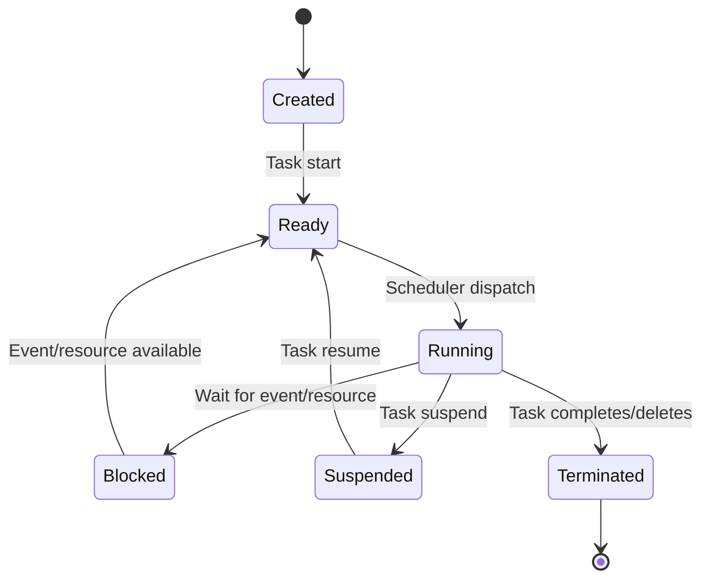
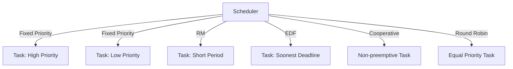
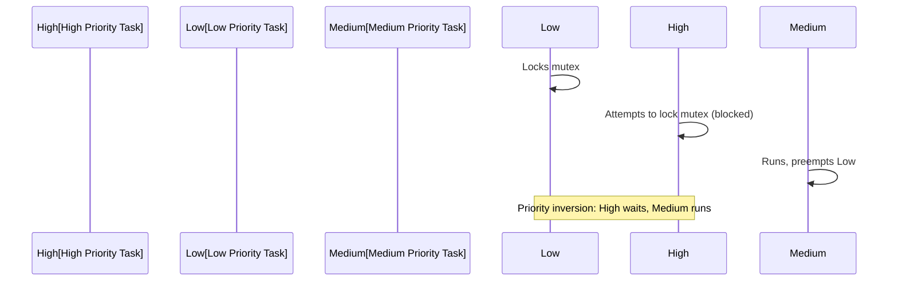

# RTOS Fundamentals

## 1. Introduction to Real-Time Operating Systems

A Real-Time Operating System (RTOS) is a fundamental building block for modern embedded and cyber-physical systems that require deterministic, timely, and reliable task execution. Unlike general-purpose operating systems, an RTOS prioritizes predictability and bounded latency for context-switching, I/O, and task completion, making it essential for systems where correctness depends not only on logical results but also on the timing of those results.

RTOSs are pervasive in domains such as industrial automation, automotive ECUs, robotics, avionics, telecommunications, consumer electronics, and medical devices. They underpin both safety-critical and soft real-time applications, ranging from pacemakers and anti-lock braking systems to network routers and IPTV set-top boxes.

## 2. RTOS Real-Time Concepts

### 2.1 Real-Time System Classification

Real-time systems are typically classified based on their strictness in meeting deadlines:

- **Hard Real-Time:** Missing a deadline constitutes system failure (e.g., pacemaker, flight control).
- **Firm Real-Time:** Occasional missed deadlines are tolerable but degrade system quality (e.g., video streaming).
- **Soft Real-Time:** Deadlines are important but not strictly enforced; some missed deadlines can be tolerated (e.g., audio playback).

The following flow context diagram illustrates the typical operation of a real-time system:



## 3. RTOS Architecture and Components

An RTOS provides core services for task/thread management, scheduling, inter-task communication and synchronization, time management, device/resource management, and in many cases, minimal I/O and file system support. Unlike monolithic operating systems, an RTOS typically emphasizes a small memory footprint, modularity, and strict execution predictability.

### 3.1 Core Components

The following components are fundamental to most RTOS implementations:

- **Kernel (or Core):** Manages task scheduling, context switching, and interrupt handling.
- **Task/Thread Manager:** Enables creation, deletion, suspension, and resumption of tasks.
- **Scheduler:** Implements deterministic scheduling algorithms.
- **Inter-task Communication (IPC):** Mechanisms like message queues, mailboxes, or events for data exchange.
- **Synchronization Primitives:** Semaphores, mutexes, and condition variables for shared resource protection.
- **Time Manager:** Provides high-resolution timers, timeouts, and delay services.
- **Interrupt Service Routines (ISRs):** Interfaces for external events and preemption.
- **Drivers/Abstractions:** Hardware abstraction for timers, memory, I/O, and peripherals (not universal).



### 3.2 Typical RTOS Architectures

RTOS kernels adopt architectures such as:

- **Monolithic Kernel:** All core functions bundled into a single binary (e.g., FreeRTOS).
- **Microkernel:** Only IPC, scheduling, and minimal task management in the kernel; drivers and services run as user-space tasks (e.g., QNX).
- **Layered Kernel:** Separation of core, networking, file system, and other services.
 
The choice affects system scalability, reliability, and performance overhead.

## 4. Task and Thread Management

The execution unit in an RTOS is often referred to as a *task* or *thread*, terms that are implementation-dependent but conceptually similar: a lightweight, schedulable sequence of instructions.

### 4.1 Task Lifecycle

Each task follows a lifecycle managed by the kernel:

- **Created/New:** The task is defined but not yet ready to run.
- **Ready:** The task is eligible to run, pending scheduler assignment.
- **Running:** The task has CPU control.
- **Blocked:** Waiting for an event, resource, or timeout.
- **Suspended:** Explicitly paused; not eligible for scheduling.
- **Terminated:** Finished execution or explicitly deleted.



### 4.2 Task Control Blocks (TCBs)

A **Task Control Block** is a data structure used internally by the RTOS kernel to maintain context and metadata for each task. TCB fields typically include:

- Program counter (PC)
- Stack pointer (SP)
- CPU register context
- Task priority
- Task state
- Pointers to task resources (e.g., timers, IPC resources)

The design of TCBs directly influences context switch time and system scalability.

### 4.3 Stack Management and Overflows

Each task requires a dedicated stack. Proper sizing is essential: too small leads to stack overflows; too large wastes scarce memory resources. Many RTOSs provide stack overflow checks, either through sentinel values, page protection, or hardware MPU support.

> **Alert**
> Stack overflows are a common, critical source of real-time task failures and often manifest as unpredictable system crashes or corruption. Always validate stack usage under worst-case conditions, enable runtime protection if offered, and design with margin.

## 5. Scheduling in RTOS

### 5.1 Scheduling Fundamentals

The *scheduler* determines which task runs at any moment based on policy, preemption configuration, and task priorities. One of the defining features of an RTOS is *deterministic scheduling latency*—the worst-case time to switch from one ready task to another.

#### RTOS Scheduling Goals

- **Determinism:** Schedulability analysis should be possible.
- **Preemptibility:** High-priority tasks can interrupt lower-priority ones.
- **Fairness:** Secondary; some RTOSs allow starvation for strict priority guarantees.
- **Configurability:** Some RTOSs support custom or evolving policies.

### 5.2 Common Scheduling Algorithms

#### Fixed Priority Preemptive Scheduling

Widely used due to predictability and ease of static analysis. Each task is assigned a priority; the scheduler always runs the highest-priority ready task. Lower-priority tasks may be preempted at any time.

#### Rate Monotonic Scheduling (RMS)

A special case of fixed-priority scheduling where priority is based on task frequency: shorter periods imply higher priority.

#### Earliest Deadline First (EDF)

Tasks with the soonest absolute deadline get the highest priority. EDF is optimal for uniprocessors but more complex to implement.

#### Cooperative Scheduling

A task runs until it yields or blocks; context switches only occur at well-defined points. Used in ultra-low-latency or safety-critical systems to minimize preemption jitter.

#### Time Slicing (Round Robin)

Tasks at the same priority share CPU in time slices. Used when fair sharing is important but can affect real-time guarantees.



### 5.3 Context Switching

Context switching is the process whereby the CPU state (registers, stack pointers, hardware-specific variables) is saved for the current task and restored for the next. This operation must be as predictable and fast as possible. Overhead depends on:

- Processor architecture
- Number of registers/states to save
- Complexity of scheduler logic
- Additional kernel services invoked during switching

> **Alert**
> Excessive or poorly optimized context switches can lead to real-time deadline failures and wasted CPU time (context switch thrashing).

#### Interrupts and Preemption

RTOS kernels tightly integrate with interrupt controllers. At the hardware level, an interrupt may preempt even the highest-priority RTOS task. Most RTOSs distinguish between *ISR context* and *thread context*, offering tailored APIs for each. ISRs should remain short to avoid blocking real-time operation.

## 6. Inter-task Communication and Synchronization

RTOS-based systems often require collaboration or mutual exclusion between concurrent tasks or ISRs. Primitives for synchronization and communication are critical.

### 6.1 Semaphores

Semaphores are integer-valued synchronization constructs. Widely used to serialize access to shared resources or signal events.

- **Binary Semaphore (Mutex):** Value restricted to 0/1. Used for exclusive resource management.
- **Counting Semaphore:** Allows multiple concurrent accesses, up to a defined limit.
- **Recursive Mutex:** Allows the same thread to lock the mutex multiple times (with unlock counts).

> **Tip**
> Always use mutexes (not bare semaphores) for protecting mutually exclusive resources, particularly if priority inversion is possible.

#### Priority Inversion Problem

Occurs when a lower-priority task holds a resource needed by a higher-priority task, and a medium-priority task preempts both. Can be mitigated by:

- **Priority Inheritance Protocol:** Raise the priority of the holder to that of the waiting higher-priority task.



### 6.2 Message Queues and Mailboxes

Queues facilitate passing data or events between tasks/ISRs asynchronously, decoupling senders and receivers. Common features:

- Fixed or dynamic size; blocking or non-blocking API
- FIFO ordering (most typical)
- Used for data transfer and event notification

### 6.3 Event Flags and Condition Variables

Event flags (or bitfields) allow tasks to wait for multiple conditions, individually or in combination. Condition variables are common in more advanced RTOSs or POSIX environments.

### 6.4 Signals

Signals are lightweight notifications, typically for out-of-band communication between ISRs and tasks, or between tasks.

## 7. Timing and Timeout Handling

### 7.1 RTOS Timers and Time Services

Precise timing is essential. RTOSs provide various services:

- **Delay/Sleep:** Block task for a fixed period.
- **Timeouts:** Specify maximum wait duration for an event/operation.
- **Periodic Timers:** Schedule tasks or callbacks at fixed-rate intervals.

Timer services usually rely on hardware timers (SysTick, RTC, etc.). Jitter and accuracy are critical metrics for evaluating real-time timer services.

### 7.2 Timekeeping and Tickless Operation

Some RTOSs use a periodic *system tick* interrupt to update timers and schedule time-based events. Tickless kernels adapt interval size to conserve power and reduce interrupt latency, important in ultra-low-power and event-driven systems.

> **Tip**
> Consider tickless mode for battery-powered IoT devices for increased sleep duration and improved energy efficiency.

## 8. RTOS Implementation and Integration

### 8.1 RTOS Selection and Porting

Selection factors include:

- Scheduling algorithm support
- Footprint/memory/performance constraints
- Certification (e.g., MISRA, DO-178C, ISO 26262)
- Target processor architecture support (e.g., ARM Cortex-M, RISC-V, PowerPC)
- Availability of BSPs (board support packages)
- Integration with toolchains (cross compilers, debuggers, tracing)
- Community / commercial support

Porting involves modifying hardware abstraction layers, timer ISRs, and context switch logic for new platforms.

### 8.2 Integration Points

An RTOS must interoperate with:

- **Boot loaders:** Ensure early hardware initialization prior to RTOS start.
- **ISRs:** Fast, predictable interrupt handling interfacing to the scheduler.
- **Peripheral drivers:** Exploit RTOS services (e.g., thread-safe buffers).

> **Caution**
> Do not invoke blocking or scheduling APIs from ISRs unless the RTOS supports it explicitly, as this can cause deadlocks or context corruption.

### 8.3 Debugging and Tracing

Debugging RTOS-based systems is nontrivial due to concurrency and high rates of state change. Most mature RTOSs offer:

- Per-task stack and resource monitoring
- Trace logging (task transitions, event timing)
- JTAG/SWD support for breakpoints and memory inspection
- Performance analyzers, e.g., ARM Keil RTX Viewer, Segger SystemView

> **Tip**
> Instrument task switching and timing events during integration tests to confirm that real-time constraints are met under all load conditions.

## 9. Standards and Compliance

Relevant standards include:

- **POSIX (Portable Operating System Interface, IEEE 1003):** Many RTOSs offer POSIX-like APIs, enabling portability of multi-threaded embedded code.
- **OSEK/VDX:** Defines a standard RTOS interface for automotive ECUs.
- **AUTOSAR OS:** Automotive RTOS standard, superseding OSEK/VDX, with safety and timing guarantees.
- **RTEMS:** Open-source, standards-compliant RTOS for embedded and space applications.

Compliance with MISRA, ISO 26262, DO-178C, and other certification standards may be required for safety-critical industries.

## 10. Practical Engineering Considerations

### 10.1 Determinism vs. Throughput

RTOSs sacrifice maximum throughput for determinism. Non-blocking design, careful ISR length, stack sizing, and worst-case execution path evaluation are essential to guarantee deadlines.

### 10.2 Memory and Resource Constraints

Embedded deployments typically offer tens to hundreds of kilobytes of RAM/Flash. RTOS configuration (number of tasks, buffer sizes, queue lengths, timer resolution) must balance real-time requirements with resource limits.

### 10.3 Integrating Third-Party Libraries

Not all libraries are thread-safe. OS integration (e.g., with networking stacks or filesystems) often requires wrapper layers or careful resource access synchronization.

> **Alert**
> Uncoordinated access to non-thread-safe interfaces can lead to data races and unreproducible failures in the field.

### 10.4 Power Management

RTOSs must often interface tightly with power management units (PMUs), dynamic frequency scaling, and hardware sleep states. Some offer explicit hooks for idle/sleep task entry and wakeup.

### 10.5 Security

As embedded systems become more networked, RTOSs are exposed to new threats. Heap overflows, unchecked pointer dereferences, and TOCTOU (Time Of Check To Time Of Use) bugs in IPC/synchronization routines must be actively managed.

> **Caution**
> Many classical RTOSs were not designed with security in mind. Adopt memory-protected kernels (MPU/MMU support), secure boot, and run-time task isolation where possible.

## 11. Variations: Bare-Metal, RTOS, and Hybrid Approaches

### 11.1 Bare-Metal Systems

No OS: Superloop or interrupt-driven code sequence, often sufficient for small or ultra-constrained devices.

**Pros:** Minimal latency, absolute transparency, lowest memory use.  
**Cons:** Difficult scaling, error-prone concurrency, little modularity, no dynamic task management.

### 11.2 RTOS-Driven Systems

Standard RTOS deployment as discussed above.

### 11.3 Hybrid Models

Some systems feature a mix: certain interrupts or functions remain bare-metal, others use RTOS services. For example, soft real-time drivers run outside the kernel to minimize overhead, while safety checks or logging use OS resources.

## 12. Example: RTOS-Based Embedded Controller

```mermaid
flowchart TD
    START[System Start] --> INIT[RTOS Initialization]
    INIT --> SENS[Sensor Task]
    INIT --> COMM[Communication Task]
    INIT --> ACT[Actuator Task]
    INIT --> DIAG[Diagnostics Task]
    SENS -->|measure| PROC[Processing Task]
    PROC -->|analyze| ACT
    COMM -->|receive| PROC
    DIAG -->|log| COMM
    NOTE_RIGHT of DIAG: Each task managed and scheduled by RTOS kernel
```

This diagram outlines a typical embedded controller with four tasks, all orchestrated by an RTOS kernel to balance real-time interactions, communication, and diagnostics.

---

## 13. Summary Table: RTOS Primitives and Usage

| Primitive           | Purpose                              | Typical API Calls         | Used In                      |
|---------------------|--------------------------------------|---------------------------|-------------------------------|
| Task/Thread         | Parallel, scheduled execution        | create/suspend/delete     | All RTOS-based systems        |
| Semaphore           | Mutual exclusion/counter resource    | take/give/create          | Resource sharing, events      |
| Mutex/Recursive Mut | Resource locking (with ownership)    | lock/unlock/trylock       | Shared state protection       |
| Message Queue       | Inter-task data/event transfer        | send/receive/create       | Asynchronous communication    |
| Event Flag          | Wait for multi-condition events      | wait/set/clear            | Asynchronous triggers         |
| Timer               | Timeouts, periodic actions           | start/stop/callback       | Task delays, timeouts         |

---

## 14. Conclusion

Real-Time Operating Systems represent a mature, proven foundation for building reliable, deterministic embedded systems. Mastering RTOS fundamentals—task management, scheduling, synchronization, and timer services—enables engineers to design efficient, scalable, and predictable solutions for a wide range of critical applications.

Understanding the constraints, architectural variations, and practical integration challenges is essential for both the selection and certification of RTOS-based products. Compliance with relevant standards, systematic use of debugging and diagnostic tools, and attention to memory and timing limits are indispensable for robust system design.

Engineering teams should approach RTOS adoption with a clear focus on system requirements, upfront schedulability analysis, and continuous validation of real-time constraints throughout the development lifecycle.
