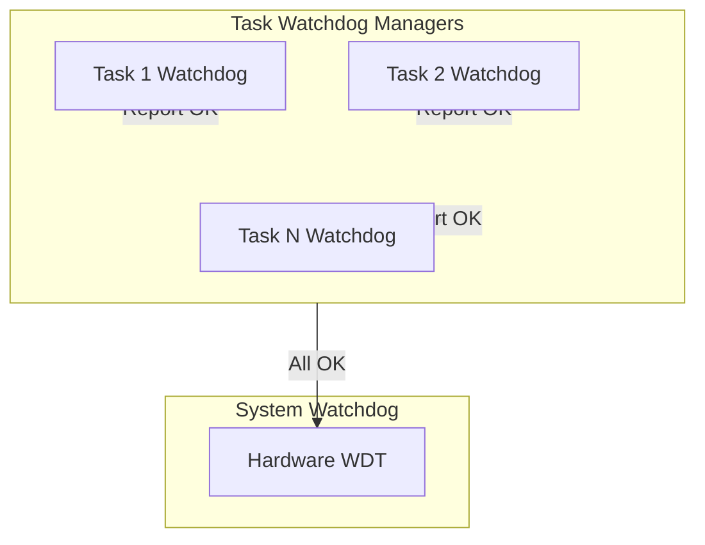
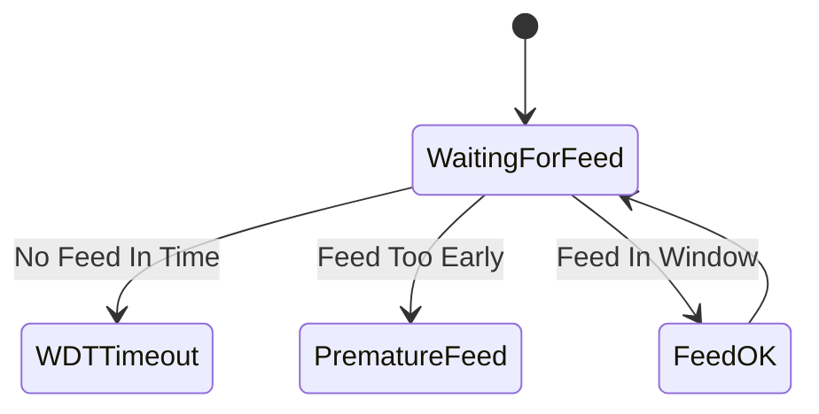
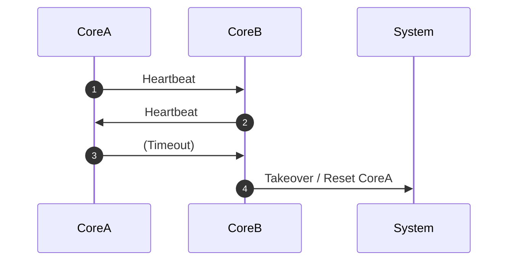
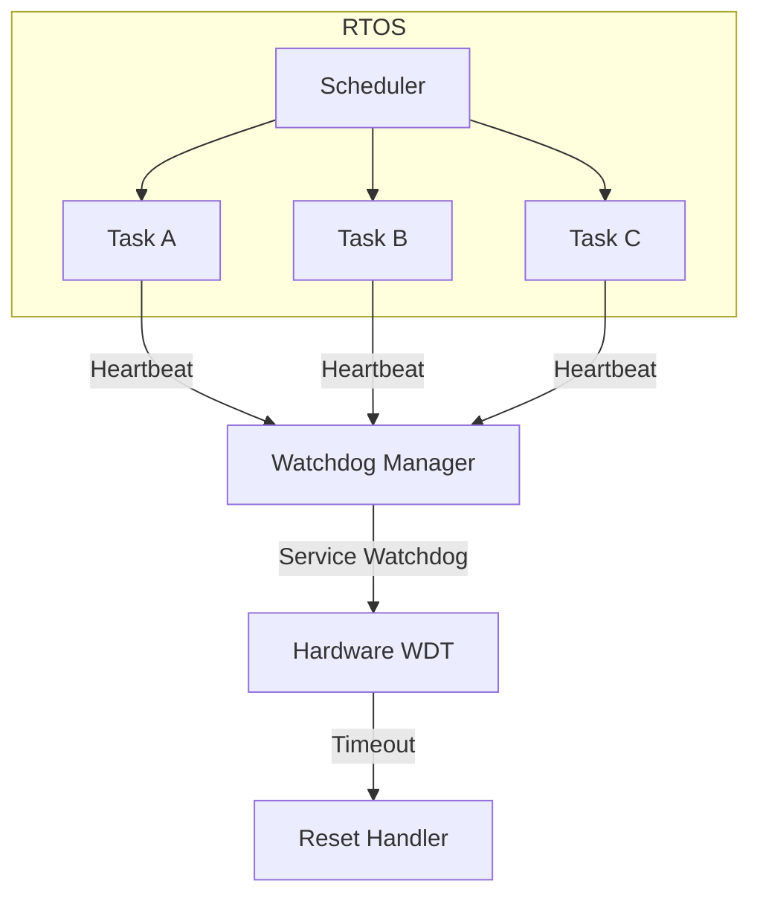

# Watchdog Timer Patterns

## Introduction

A Watchdog Timer (WDT) is a fundamental hardware or software mechanism used in safety- and reliability-critical embedded systems. Its primary purpose is to detect and recover from software anomalies, such as code hangs, infinite loops, or system deadlocks, that prevent normal operation. The WDT helps ensure that the system remains live and responsive through timely detection of abnormal conditions.

Watchdog timer patterns are a set of architectural and design approaches for systematically integrating watchdogs into embedded systems. These patterns maximize system integrity, fault detection, recovery capabilities, and liveness guarantees. This document explores WDT concepts, integration patterns, operational workflows, architectural trade-offs, and implementation guidelines suitable for embedded engineers.

## 1. Watchdog Timer: Definition and Context

### 1.1. Definition

A Watchdog Timer is a timing mechanism, typically implemented in hardware but sometimes as a software module, that operates independently of the main processor’s control flow. The WDT must be periodically "kicked" or "petted" by the running software. If the system fails to perform this task within the specified time interval (“timeout”), the WDT assumes that the software is malfunctioning and initiates a system recovery action, commonly a reset.

### 1.2. Technical Context

WDTs are found in almost all safety-oriented embedded platforms, ranging from consumer microcontrollers to safety-critical industrial controllers (referenced in standards such as **IEC 61508** and **ISO 26262**), automotive ECUs, and medical devices. They complement hardware fault tolerance and RTOS-level safety mechanisms, ensuring single-point failure recovery even at the lowest software stack levels.

### 1.3. Core Functions

- **Fault Detection:** Identifies situations where the system stops responding or gets stuck in an erroneous state.
- **Automatic Recovery:** Restores the system to a known state via reset or user-defined handler.
- **Liveness Guarantee:** Provides time-bounded guarantees that the main control loop or critical tasks are executing.

## 2. Conceptual Architecture

A typical WDT mechanism incorporates the following elements:
- The Watchdog Timer peripheral itself (internal or external).
- The software agent responsible for servicing (petting/kicking) the watchdog.
- The recovery routine or reset controller triggered upon timeout.
- Optional logging or persistent storage for post-mortem diagnostics.

### 2.1. Architecture Overview

```mermaid
flowchart TB
    A[Application Task(s)] -- Service Request --> B[Watchdog Service Routine]
    B -- Feed Watchdog --> C[WDT Peripheral]
    C -- Timeout Event --> D[System Reset Handler]
    D -- Reset System --> E[System Initialization]
    D -- Log Fault (optional) --> F[Non-Volatile Storage]
```

## 3. Watchdog Patterns and Variations

### 3.1. Simple (Monolithic) Watchdog Pattern

The simplest pattern involves a single system-level WDT and a single service point in the main control loop or RTOS idle loop:
- **Use Case:** Single-threaded or cooperative scheduler systems.
- **Workflow:**  
  - Main loop executes functional code.
  - After each iteration or fixed time unit, the WDT is serviced.
- **Constraint:** Does not distinguish which subsystem is faulty.

### 3.2. Multi-level Watchdog Pattern

Higher-integrity systems utilize hierarchical watchdogs for better fault isolation:
- **System Watchdog:** System-wide supervisor, typically hardware-based.
- **Task/Process Watchdogs:** Software modules monitoring individual threads, processes, or scheduler "heartbeats."
- **Supervisor Mechanism:** Aggregates software-based watchdogs to conditionally feed the system hardware watchdog.



- **Advantage:** Fault localization—identifies which software module stalled and enables graceful degradation or partial restart.

### 3.3. Windowed Watchdog Timer

- Enforces not only maximum, but also minimum servicing intervals.
- **Purpose:** Captures both missed and prematurely frequent kicks, preventing accidental resets due to runaway tasks.
- **Implementation:** Available in controllers with dedicated windowed WDT peripherals.



### 3.4. External Watchdog Circuits

- **Context:** When on-chip WDT is not considered sufficiently robust against hardware/software lock-ups (e.g., clock failures).
- **Pattern:** Uses an independent hardware component, sometimes powered from a separate supply or oscillator.
- **Advantage:** Enhanced resilience against system-level failures, such as bus lock or clock oscillator failures.

### 3.5. Distributed Watchdog (Cross-Monitoring)

- **Purpose:** Improve safety in redundant or distributed systems (common in fail-operational architectures).
- **Mechanism:** Peer processors or microcontrollers monitor each other's heartbeat messages and respond to missing signals.



## 4. Lifecycle and Workflow

### 4.1. Activation and Configuration

- WDT should be configured as early as possible during system startup, preferably before application code is initialized.
- Key configuration parameters:
  - Timeout interval (must be tailored to worst-case execution path plus margin).
  - Window parameters if using windowed WDT.
  - Recovery action (reset, interrupt, NMI, etc.).
  - Optional: Source clock selection (important for robust timeout accuracy).

### 4.2. Service Policies

- **Fixed Point:** Pet the WDT at a known, fixed execution point in the control loop.
- **Conditional:** Pet the WDT only after all critical sub-tasks or checkpoints are completed.
- **Delegated:** Software partitioning assigns service responsibility to a dedicated component (supervisor or monitor thread).

### 4.3. Recovery Actions

- **Immediate Reset:** Most common, hardware-enforced. System restarts from reset vector.
- **Interrupt/NMI:** Allows logging, graceful shutdown or limited clean-up before reset.
- **Partial System Restart:** In RTOS or multicore systems, limited restart of specific subsystems or threads.

## 5. Implementation Considerations

### 5.1. Integration With RTOS

- WDT feeding must be carefully coordinated with RTOS scheduling, critical sections, and low-power modes.
- Common approach: Place the WDT service in a high-priority periodic task or as a system tick hook.
- Avoid servicing from ISR unless WDT timeout window requirements are satisfied.

### 5.2. Diagnostic and Postmortem Analysis

- Use dedicated NVRAM or battery-backed RAM to store last-known state or reason for reset.
- Systems can distinguish between power-on, external, processor, and watchdog resets by reading reset status registers.

### 5.3. Performance Impact

- WDT overhead is minimal under normal conditions, but improper servicing (e.g., in tight loops or blocking code) may degrade real-time behavior or cause spurious resets.

### 5.4. Common Pitfalls

> [!CAUTION]
> - Servicing the WDT in the wrong location (e.g., inside an always-true loop or ISR) can mask genuine faults.
> - Not configuring the WDT as early as possible may allow faults to escape detection after power-on reset.
> - Failing to use a true hardware-independent WDT may cause undetectable failures (e.g., silicon lock-up, clock failure).
> - Setting too short or too long timeouts can lead to false positives or missed faults, respectively.

## 6. Design Trade-offs

### 6.1. Timeout Period Selection

- Too short: Risk of nuisance resets due to transient load or valid long-execution cycles.
- Too long: Faults may persist uncorrected for excessively long intervals, reducing liveness guarantees.
- Guidance: Analyze worst-case execution time (WCET) across all critical code paths; apply appropriate margin.

### 6.2. Watchdog Kick Location

- Application-level vs. RTOS-level (system tick, scheduler idle).
- Decentralized (task-level) vs. centralized (supervisor thread) responsibility.
- Safety argument: Restrict WDT service to points demonstrating true liveness and functional progress.

### 6.3. Multiple Watchdogs vs. One

- Multiple: Improved granularity, better fault isolation, higher complexity.
- Single: Simpler, lower overhead, less observability.

### 6.4. Hardware vs. Software Watchdog

- Hardware WDT: Resilient against software failures, preferred for fail-safe requirements.
- Software-only: Easily bypassed, less robust, suitable only for non-safety uses or as supplement.

## 7. Standardization and Best Practices

- **IEC 61508, ISO 26262 (Automotive), EN 50128 (Railway), and FDA 21 CFR 820.70 (Medical)**: All require validation of watchdog mechanisms for safety control.
- **Certified RTC/MCU Components:** Some microcontrollers offer certified WDT hardware compliant to safety standards.
- **Design Reviews:** Watchdog configuration and coverage should always be included in functional safety hazard and risk analyses.

## 8. Example Integration: RTOS-based System



**Workflow:**
1. Each supervised task signals its aliveness to a Watchdog Manager within each cycle or period.
2. The Watchdog Manager conditions the hardware WDT feed on the status of all tasks.
3. If any monitored task fails to provide “heartbeat,” the WDT will not be serviced and a reset is triggered.

> [!TIP]
> Use task-level “heartbeat” monitoring to potentially allow selective restart or flag faulty tasks upon recovery. Persisting task status in NVRAM allows the post-reset system to adapt diagnostics or system initialization.

## 9. Engineering Checklist

- [ ] **Map all critical execution paths** to ensure WDT servicing reflects true system liveness.
- [ ] **Determine and configure robust timeout intervals** for both hardware and software watchdogs.
- [ ] **Ensure early activation** of WDT before entering complex application code.
- [ ] **Store last-known system state** in persistent storage for post-reset root-cause analysis.
- [ ] **Integrate watchdog logic with safety analysis/DFMEA** where required by standards.

## 10. Summary

Watchdog timer patterns are core elements in safety- and reliability-oriented embedded design. Effective use requires understanding both hardware and software watchdog architectures, optimal integration into system operations, and strict alignment with functional safety requirements and standards. Engineers must critically assess watchdog coverage, minimize sources of spurious reset, and design observable liveness checks to ensure that watchdogs provide meaningful system integrity guarantees.

---

*This document provided an overview suitable for engineers seeking to implement rigorous watchdog timer patterns in embedded systems, emphasizing workflows, trade-offs, and best practices.*