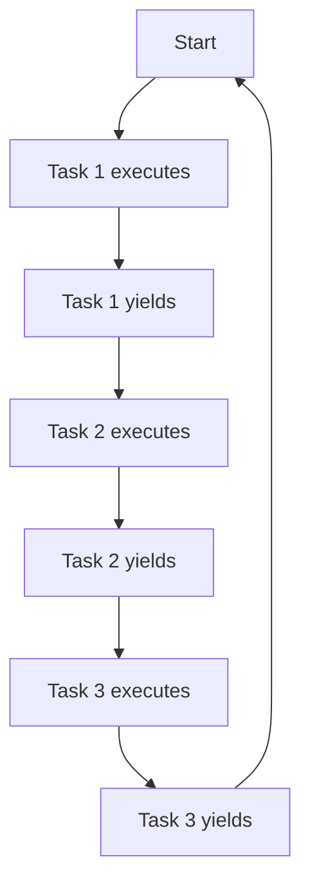

# Task Scheduling Models

Task scheduling is a core concern in embedded system design, ensuring that multiple software tasks execute in the intended order and are allocated appropriate processor time. Selection of a suitable scheduling model shapes key system characteristics such as determinism, responsiveness, throughput, and resource utilization.

Embedded engineers must understand the fundamental scheduling models—cooperative, pre-emptive, cyclic executive, and time-triggered—to select or implement an approach suited to their application’s functional requirements and constraints.

---

## 1. Introduction to Task Scheduling

Embedded systems typically handle multiple concurrent activities: sensor polling, actuator control, communication protocols, and user interactions. Each activity is encapsulated as a *task* (also known as a thread, process, or job, depending on system terminology).

The *scheduler* is the part of the system responsible for selecting which task executes at any point in time, based on defined policies. The scheduling model governs:

- **Task switch points**: When control may pass from one task to another.
- **Prioritization**: Whether and how tasks are assigned priorities.
- **Timing guarantees**: Whether deadlines or real-time constraints are enforced.

Key terms:

- **RTOS (Real-Time Operating System)**: Provides scheduling and timing services for embedded applications requiring determinacy.
- **Context Switch**: The act of saving the state of the currently running task and restoring the state of the next scheduled task.

---

## 2. Cooperative Scheduling

### 2.1 Overview

**Cooperative scheduling** (also known as non-pre-emptive or voluntary yield scheduling) is the simplest scheme. In this model, a task runs until it voluntarily yields control, either by invoking a scheduler function or by returning from its function.

There is **no forced pre-emption**; thus, a poorly designed or misbehaving task can monopolize the processor.

### 2.2 Architecture


*Mermaid Diagram: Cooperative Task Execution Loop*

### 2.3 Practical Workflow

- Common in simple embedded systems without an OS.
- Tasks typically implemented as functions within a main loop.
- Yield points coded explicitly (e.g., by calling a `yield()` or `schedule()` function).
- Common in Arduino and basic microcontroller projects.

### 2.4 Characteristics and Considerations

- **Simplicity**: Minimal overhead or runtime complexity.
- **Responsiveness**: Entirely dependent on tasks properly yielding.
- **Debugging**: Easier to debug than pre-emptive systems due to predictability.
- **Pitfalls**: Any task that fails to yield can cause total system lockup.

> **Note**
> 
> In cooperative scheduling, lengthy or blocking operations (e.g., waiting for I/O or complex calculations) must be split into small segments or handled via non-blocking APIs to maintain system responsiveness.

---

## 3. Pre-emptive Scheduling

### 3.1 Overview

**Pre-emptive scheduling** allows the scheduler (often within an RTOS) to interrupt a running task in order to run a more urgent or higher-priority task, according to a scheduling policy.

**Task switch points** arise both at explicit yield points and asynchronously—e.g., through timer interrupts, external events, or priority escalations.

### 3.2 Scheduler Variants

- **Priority-based pre-emptive scheduling**: Each task is assigned a priority. A higher-priority task will pre-empt a lower-priority one.
- **Round-robin pre-emptive scheduling**: Each task is allocated a time slice; the scheduler rotates among tasks.
- **Earliest Deadline First (EDF)** and **Rate Monotonic Scheduling (RMS)**: Advanced policies for real-time guarantees.

### 3.3 Architecture

```mermaid
stateDiagram-v2
    [*] --> Idle[Idle Task]
    Idle -->|Interrupt/Event| Ready[Ready Queue]
    Ready -->|Priority Decision| Run[Running Task]
    Run -->|Higher Priority Pre-empts| Ready
    Run -->|Yield/Block| Ready
    Run -->|Completion| Idle
```
*Mermaid Diagram: Pre-emptive Scheduler State Transitions*

### 3.4 Typical RTOS Scheduler Flow

- Task execution is interrupted by timer or external interrupt.
- RTOS kernel examines all *ready* tasks.
- Scheduler selects the highest-priority ready task.
- Context switch occurs (save state of current, restore next).
- Critical sections may be protected (e.g., disabling pre-emption or interrupts).

### 3.5 Standards and APIs

- **POSIX.1 (IEEE 1003.1)**: Standard interface for threads and scheduling policies (`SCHED_FIFO`, `SCHED_RR`, etc).
- **AUTOSAR OS & OSEK/VDX**: Standards for automotive real-time task scheduling.

### 3.6 Engineering Considerations

- **Determinism**: Pre-emptive models can enforce hard timing constraints but are susceptible to priority inversion and jitter if not properly engineered.
- **Stack Usage**: Each pre-emptible task usually has its own stack, increasing RAM footprint.
- **Concurrency Hazards**: Data races and deadlocks require synchronization primitives (mutexes, semaphores).
- **Debugging**: System state can be complex to trace due to context switches at arbitrary points.

> :warning: **Caution**
> 
> Priority inversion—a lower-priority task holding a resource needed by a higher-priority task—must be mitigated using mechanisms such as priority inheritance.

---

## 4. Cyclic Executive Scheduling

### 4.1 Overview

**Cyclic Executive Scheduling** is an approach where a static schedule defines the order and timing of all tasks, typically in a main loop. Each task (or "minor cycle") runs in a fixed time window; the full list of tasks constitutes the "major cycle". This approach is popular in safety-critical and deeply embedded applications where determinism is paramount.

### 4.2 Structure

```mermaid
graph LR
    A[Begin Major Cycle] --> B[Task 1 (Minor Cycle 1)]
    B --> C[Task 2 (Minor Cycle 2)]
    C --> D[Task 3 (Minor Cycle 3)]
    D --> E[Wait/Idle until Major Cycle Ends]
    E --> A
```
*Mermaid Diagram: Cyclic Executive Major Cycle*

### 4.3 Implementation Pattern

- **No scheduler**: Sequence hard-coded in a time-driven main loop.
- **Deterministic**: All tasks run in guaranteed fixed order and frequency.
- **No run-time prioritization**: All scheduling decisions made at design time.
  
A simplified example:
```c
void main_loop() {
    while (1) {
        task1();
        task2();
        task3();
        wait_until_end_of_major_cycle();
    }
}
```
### 4.4 Timing Analysis

- **Major cycle**: Total period after which the schedule repeats—equal to the least common multiple (LCM) of all task periods.
- **Minor cycle**: Smallest interval to which task periods are aligned.

> **Tip**
> 
> Use static worst-case execution time (WCET) analysis to calculate maximum allowable execution time for each task to prevent schedule overruns.

### 4.5 Practical Considerations

- **Predictability**: Highly predictable temporal behavior.
- **Extendibility**: Adding new tasks requires recomputing the entire schedule.
- **Flexibility**: Poor; not suitable for systems with highly variable execution times.
- **Suitability**: Widely used in avionics, automotive ECUs, and other domains with stringent safety (see DO-178C, ISO 26262).

---

## 5. Time-Triggered Scheduling

### 5.1 Overview

**Time-triggered (TT) scheduling** generalizes and formalizes the cyclic executive approach. In TT systems, all actions are initiated as a result of the progression of time, not events or interrupts. Tasks, message transmissions, and even actuator commutations are scheduled based on a global time base.

### 5.2 Architecture

```mermaid
flowchart TD
    A[System Timer Tick (Global Time Base)] --> B[Scheduler Activation]
    B --> C{Is Task Due?}
    C -- Yes --> D[Task Execution]
    C -- No --> E[Wait]
    D --> A
    E --> A
```
*Mermaid Diagram: Time-Triggered Scheduler Cycle*

- **Global time base**: Usually a hardware timer or distributed clock.
- **Schedule table**: Precomputed offline; lists all operations with exact time offsets.

### 5.3 TT Systems in Practice

- Used in high-integrity, safety, and automotive networks (e.g., TTP, FlexRay).
- Can be implemented at the node (microcontroller/ECU) or system (networkwide) level.

#### Example of TT Communication Table

| Time (ms) | Task/Action         |
|-----------|---------------------|
| 0         | Read sensor array   |
| 5         | Update control law  |
| 8         | Send CAN message    |
| 10        | Log data            |

### 5.4 Standards

- **Time-Triggered Architecture (TTA)**: Refer to IEC 61508, TTP, AUTOSAR Time-Triggered Operating System (TTOS).
- **FlexRay**: Automotive TT protocol (static segment).

### 5.5 Determinism and Fault Tolerance

- **Deterministic**: Eliminates race conditions caused by event arrival times.
- **Temporal Fault Detection**: TT systems can detect and recover from missed deadlines or overruns by monitoring time deviations.

### 5.6 Engineering Constraints

- **Global clock synchronization**: Required for distributed TT systems.
- **Resource overhead**: Table-driven approach needs careful WCET analysis and offline tooling.
- **Concurrency**: All actions, including communications, are scheduled, meaning there is little or no event-driven unpredictability.

> :information_source: **Note**
> 
> Time-triggered scheduling is central to systems with mixed-criticality and synchronized control, such as X-by-wire automotive or fly-by-wire avionics.

---

## 6. Model Comparison

| Model            | Deterministic | Pre-emption | Dynamic Scheduling | Typical Use Cases          | Pros                                | Cons                       |
|------------------|:-------------:|:-----------:|:------------------:|----------------------------|-------------------------------------|----------------------------|
| Cooperative      | No            | No          | No                 | Simple MCUs, low-power     | Simple, low overhead                | Low responsiveness         |
| Pre-emptive      | Yes/Partial   | Yes         | Yes (usually)      | General-purpose embedded   | Responsive, dynamic priorities      | Complexity, concurrency    |
| Cyclic Executive | Yes           | No          | No                 | Safety-critical, real-time | Highly predictable                  | Rigid, inflexible          |
| Time-Triggered   | Yes           | No          | No                 | High-integrity/distributed | Predictable, fault-tolerant         | Complex offline schedule   |

---

## 7. Engineering Considerations and Best Practices

### 7.1 Task Design and WCET

Each task, especially in cyclic and time-triggered models, must have a well-defined WCET to avoid deadline violations. Overruns in fixed schedules can jeopardize system safety.

### 7.2 Integration Points

- **With Communication Stacks**: TT models often integrate closely with time-triggered communication protocols (CAN with TT scheduling, FlexRay static segment).
- **With Middleware/Runtime**: Pre-emptive scheduling relies on OS/RTOS APIs for task creation, event queues, and synchronization.

### 7.3 Resource Constraints

Scheduling models constrain stack, code size, and CPU utilization. Cooperative and cyclic models offer minimal runtime overhead but place more responsibility on the application developer.

### 7.4 Common Pitfalls

- Deadlocks and livelocks due to improper concurrency management in pre-emptive and cooperative models.
- Schedule overruns in cyclic and TT systems due to underestimated WCET or unhandled exceptions.

---

## 8. When to Use Each Model

- **Cooperative**: Small, simple systems with limited concurrency needs where code simplicity is paramount.
- **Pre-emptive**: Systems with unpredictable workloads, the need for responsiveness, or where hard and soft real-time constraints mix.
- **Cyclic Executive**: Certified or safety-critical environments requiring predictability, especially when tasks are always periodic.
- **Time-Triggered**: Distributed, high-integrity, fault-tolerant systems (e.g., aerospace, automotive networks).

> :bulb: **Tip**
> 
> Hybrid models are possible: for instance, a cyclic executive that launches a pre-emptive RTOS for certain non-critical tasks.

---

## 9. Summary

Task scheduling models are foundational to the structure and correctness of embedded software. Understanding their mechanics, constraints, and integration requirements is essential for robust system design. Choosing an appropriate model involves evaluating application needs in terms of determinism, flexibility, safety, and resource constraints, and aligning those with the system’s operational context and required standards compliance.

Proper engineering and analysis—including WCET estimation, concurrency control, and schedule verification—are crucial to safe and reliable implementation of the chosen scheduling strategy.

---

## 10. Additional Visualizations

> **Note**
> 
> Diagram to be added later: Gantt-style schedule visualizing cyclic executive and time-triggered schedules in parallel for direct comparison.

---

*End of Primer*