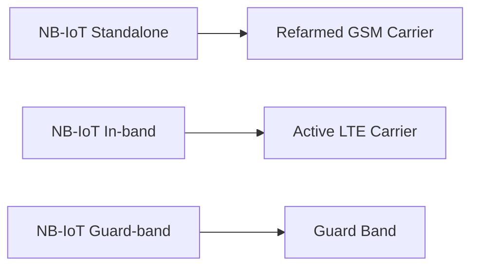
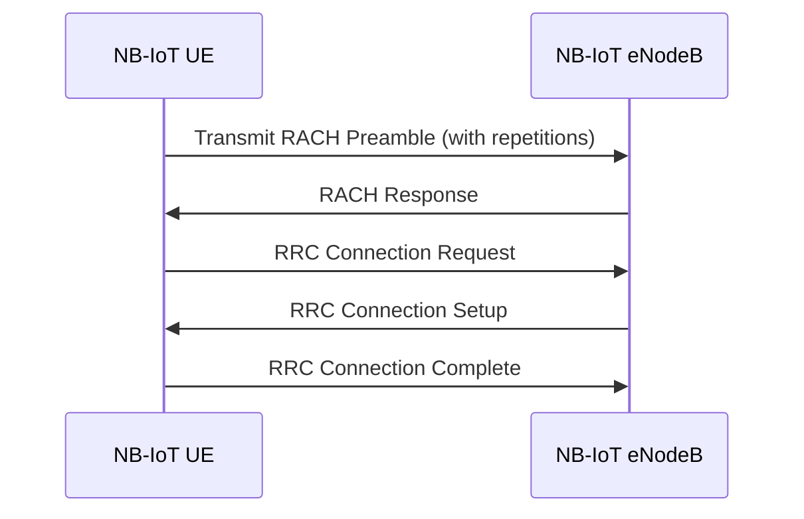
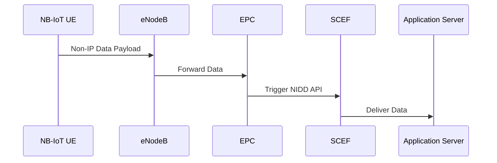
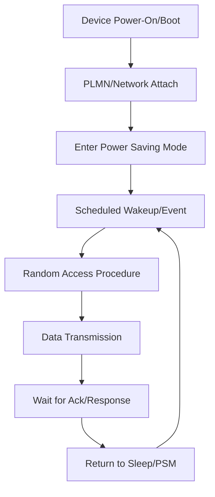

# NB-IoT (Narrowband Internet of Things): Technical Primer

## Introduction

Narrowband Internet of Things (NB-IoT) is a standards-based Low Power Wide Area Network (LPWAN) radio technology developed by the 3rd Generation Partnership Project (3GPP) to enable a broad range of IoT devices and services. As a member of the cellular IoT family, NB-IoT is designed to provide efficient connectivity for devices that require low data rates, long battery life, extended coverage, and secure, reliable connectivity—primarily targeting Machine-Type Communication (MTC) use cases.

## Background and Technical Context

### Evolution of Cellular IoT

NB-IoT is a 3GPP Release 13 (frozen June 2016) standard, later enhanced in Releases 14 and 15. It is part of the global push to provide low-cost solutions for massive IoT deployments, complementing alternatives such as LTE-M (LTE Cat-M1), non-cellular LPWAN technologies (e.g., LoRaWAN, Sigfox), and traditional cellular M2M solutions.

Key motivations for NB-IoT include:

- Reducing device and deployment costs.
- Providing significantly extended coverage (indoor and rural).
- Supporting massive numbers of devices per cell.
- Ensuring long battery lifetimes (10+ years in optimal scenarios).
- Maintaining compatibility and co-existence with existing LTE networks.

NB-IoT achieves these goals by optimizing for low complexity and offering a very narrow bandwidth operation (180 kHz per carrier), making it distinct from broadband cellular technologies.

## Core Concepts and Key Features

### Defining Characteristics

- **Bandwidth:** 180 kHz (one Physical Resource Block in LTE).
- **Deployment Modes:**
  - Standalone (using refarmed GSM spectrum)
  - In-band (within LTE spectrum)
  - Guard-band (using LTE edge spectrum).
- **Uplink/Downlink:** Based on OFDMA in downlink, SC-FDMA in uplink.
- **Data Rates:** Peak downlink ~26 kbps, uplink ~62 kbps (single-tone).
- **Coverage:** Extended (up to 164 dB Maximum Coupling Loss).
- **Device Complexity:** Ultra-low costs (less than GSM/GPRS modules).
- **Battery Life:** Targeted at 10+ years for typical IoT traffic profiles.
- **Massive Device Support:** Up to 50,000 devices per cell (as per 3GPP specification).
- **Optimized for Infreqent, Small Data Transfers:** Ideal for sensors, utility meters, environmental monitors, etc.

### Positioning within LPWAN Landscape

NB-IoT is specifically intended for use cases where:

- Device mobility is limited or non-existent (stationary/nomadic).
- Power efficiency and deep in-building penetration are key.
- Payload sizes are small, and communication is typically infrequent.

It differs from LTE-M by lacking support for handover and voice (VoLTE), but is more cost-effective and supports even longer battery life.

## Architecture and Network Integration

#### Fundamental Network Elements

NB-IoT leverages modified versions of standard LTE architecture. The main components involved are:

- **UE (User Equipment):** NB-IoT device or module.
- **eNB (eNodeB):** Cellular base station with NB-IoT software features.
- **EPC (Evolved Packet Core):** LTE core network.
- **Application Server:** Sits outside mobile operator domain, providing IoT services.
- **Service Capability Exposure Function (SCEF):** For secure exposure of network services to applications (optional).

#### NB-IoT Logical Architecture

```mermaid
flowchart TD
  UE[NB-IoT Device]
  eNB[eNodeB (NB-IoT Enabled)]
  EPC[Evolved Packet Core]
  SCEF[SCEF (optional)]
  AS[Application Server]

  UE -->|Radio Link (NB-IoT)| eNB
  eNB -->|SGi, S1 Interfaces| EPC
  EPC -->|Service API| SCEF
  SCEF -->|Northbound API| AS
  EPC -->|Direct Interface (S8/S5)| AS
```

- **Note:** SCEF (Service Capability Exposure Function) is optional and used for regulated secure API exposure.

## Radio Access and Spectrum Deployment

### Deployment Modes

NB-IoT can be flexibly deployed in three main modes:

1. **Standalone:** Utilizes a GSM carrier spectrum (refarmed 2G spectrum).
2. **Guard-band:** Occupies the guard bands of LTE carriers, not used for LTE traffic.
3. **In-band:** Deployed within an LTE carrier as part of normal LTE resource blocks.



**Implications:**
- Spectrum flexibility allows operators to choose optimal integration based on their existing spectrum assets.
- Co-existence with LTE minimizes additional investment.

## Protocol Stack and Data Flow

NB-IoT largely reuses the LTE protocol stack, but with key simplifications:

### Protocol Architecture

```mermaid
graph TD
  PHY[Physical Layer (NB-IoT)]
  MAC[MAC Layer]
  RLC[RLC Layer]
  PDCP[PDCP Layer]
  NAS[NAS (Non-Access Stratum)]
  IP[IP Layer]
  APP[Application Layer]

  APP --> IP
  IP --> PDCP
  PDCP --> RLC
  RLC --> MAC
  MAC --> PHY
```

- **Downlink:** OFDMA (Orthogonal Frequency Division Multiple Access)
- **Uplink:** SC-FDMA (Single Carrier-FDMA), with support for single-tone and multi-tone transmission.

### NB-IoT Random Access Procedure

The random access (RACH) procedure in NB-IoT is tailored for extended coverage, using multiple preamble formats and repetitions.



**Engineering Note:**
> :warning: **NB-IoT UEs may take several seconds to complete network attach in deep coverage scenarios due to high repetition levels and reduced bandwidth.**

### Power Saving Techniques

- **PSM (Power Saving Mode):** UEs stay registered with the network but power down most functions, waking only for scheduled events or uplink transmissions.
- **eDRX (extended Discontinuous Reception):** UEs only periodically wake to check paging messages, trading latency for power savings.

## Application Protocols and Data Transfer

Typical application-layer protocols over NB-IoT include:

- **UDP/IP (default for most NB-IoT conventional traffic).**
- **Non-IP Data Delivery (NIDD):** For small payloads, bypassing the IP stack.
- **Application protocols:** LwM2M (Lightweight M2M), MQTT-SN, CoAP, SMS.

#### Non-IP Data Delivery (NIDD)

NIDD enables transmitting small data payloads directly over the NAS layer, bypassing the overhead of the IP stack—ideal for highly constrained, bursty IoT traffic.



## Detailed Coverage Enhancements

NB-IoT includes specific features to boost coverage, such as:

- **Repetition:** Transmit/detect data across multiple frames (~2048 repetitions possible).
- **Tones:** Flexible configuration of single-tone (one 3.75 kHz/15 kHz subcarrier) or multi-tone uplink (up to 12 subcarriers).
- **Robust Modulation/Coding:** Support for QPSK only, enabling operation in noisy/rural environments.

## Security Considerations

NB-IoT reuses LTE security mechanisms:

- **Mutual authentication (SIM-based).**
- **Radio and core network encryption (integrity and confidentiality).**
- **Optional: Secure keying for NIDD via SCEF.**

> :lock: **NB-IoT inherently benefits from carrier-grade SIM authentication, but application-level encryption (e.g., DTLS at CoAP/MQTT level) is recommended for end-to-end security.**

## Example Workflow: Device Bootstrapping and Data Transmission

Below is a simplified diagram of a typical NB-IoT device workflow:



## Integration Points and Engineering Considerations

### Integration Scenarios

- **Module Selection:** Choose NB-IoT modules with appropriate band support and required SW/HW interfaces (e.g., UART, SPI).
- **SIM Provisioning:** Ensure correct APN profiles and operator credentials (typically via MFF2 or eSIM for IoT).
- **Backend Integration:** API integration with operator SCEF for NIDD or direct IP endpoints for standard IP traffic.
- **OTA Upgrades:** Plan for firmware-over-the-air (FOTA) with consideration of NB-IoT throughput/latency constraints.

### Performance and Operational Constraints

- **Latency:** Measured in hundreds of milliseconds to several seconds for uplink; higher in deep coverage modes.
- **Throughput:** Not suitable for large files, streaming, or real-time applications.
- **Mobility:** No support for seamless cell handover—intended for stationary or limited-mobility devices.
- **Coverage:** Excellent indoor/rural reach, but not universally available across all networks/countries.
- **QoS:** Basic; typically best-effort delivery, optimized for sparsely active lots of devices.

### Implementation Challenges and Best Practices

> :warning: **Use short, infrequent messages; avoid chatty protocols and polling-heavy designs.**

- **Duty Cycle and Network Policies:** Operators may enforce limitations; ensure compliance in device firmware.
- **Firmware Update Strategy:** Use delta updates, compression, and schedule during off-peak hours.
- **Error Handling:** Expect link loss and resumption; support robust retransmission logic.
- **Device Density:** Plan for massive deployment scenarios; test for coexistence with many other NB-IoT UEs.

### Interoperability

- **3GPP Specification Alignment:** Devices should comply with TS 36.300, TS 36.321, TS 36.331, TS 23.401, TS 23.682, and relevant 3GPP standards for NB-IoT.  
- **Protocol Standards:** For application layers, follow IETF RFCs for CoAP (RFC 7252), MQTT (OASIS), LwM2M (OMA SpecWorks).

## Comparison with Other LPWAN Technologies

| Feature                         | NB-IoT             | LTE-M             | LoRaWAN           | Sigfox            |
|----------------------------------|--------------------|-------------------|-------------------|-------------------|
| Standardization                  | 3GPP               | 3GPP              | LoRa Alliance     | Sigfox            |
| Spectrum                         | Licensed           | Licensed          | Unlicensed (ISM)  | Unlicensed (ISM)  |
| Mobility                         | Stationary         | Mobile            | Stationary        | Stationary        |
| Max Data Rate                    | ~62 kbps UL        | ~1 Mbps           | ~50 kbps          | ~0.1 kbps         |
| Handover                         | No                 | Yes               | No                | No                |
| Coverage                         | Excellent          | Good              | Good              | Wide              |
| Battery Life                     | 10+ years          | 5-10 years        | 5-10 years        | 5-10 years        |
| Network Ownership                | Operator           | Operator          | Public/Private    | Operator          |
| Security                         | High (SIM/EAP)     | High (SIM/EAP)    | App-dependent     | App-dependent     |

## Typical Use Cases

- Utility metering (gas, water, electricity)
- Smart city sensing (lighting, parking, environmental)
- Asset tracking (static/nomadic)
- Industrial automation (low-frequency data)
- Agricultural monitoring

## Future Directions and Ecosystem

With ongoing 3GPP releases, NB-IoT continues to evolve, with work on 5G integration (as NR RedCap/Massive MTC) and further optimizations for power, coverage, and efficiency.

## Conclusion

NB-IoT is a standardized, operator-led technology that addresses the need for massive IoT deployments demanding low cost, low complexity, long battery life, and deep coverage. Its strong integration with cellular networks, robust security posture, and support by the 3GPP ecosystem make it well-suited for many stationary IoT use cases. Nevertheless, practical deployments must be designed with awareness of NB-IoT’s unique constraints on throughput, latency, device mobility, and application protocol support.

> :bulb: **Tip:** For most efficient operation, design application payloads and communication cycles to minimize interaction, leverage NIDD where possible, and test extensively in target deployment environments.

---

**Note:**  
For deployment planning, ensure NB-IoT network capabilities and coverage meet application needs, as operator support and PLMN availability vary by country and region.

**Note:**  
[Diagram to be added later: Example Packet Flow with SCEF and NIDD End-to-End Security.]