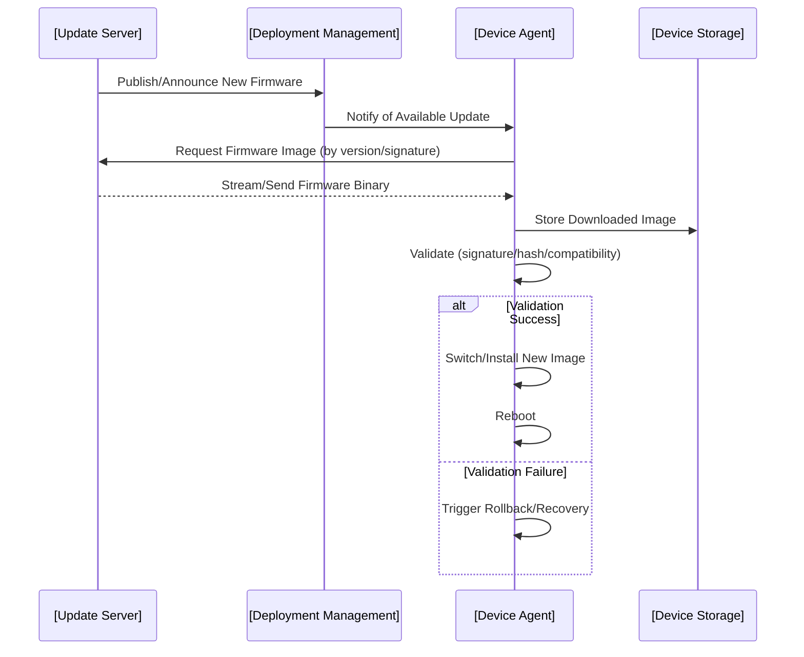
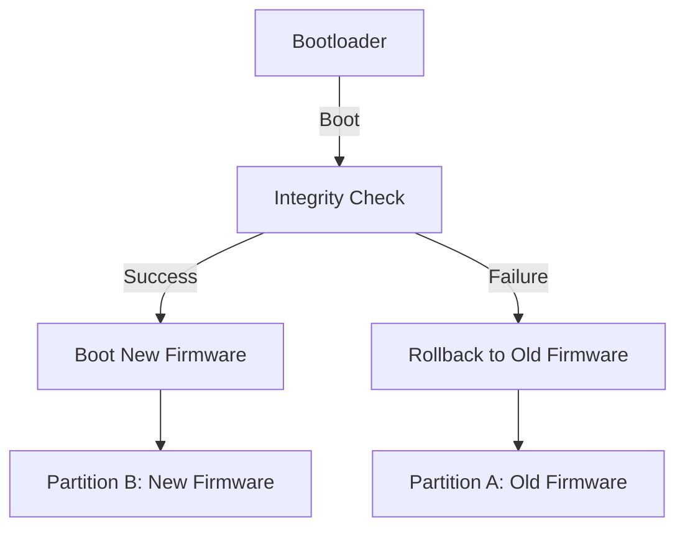
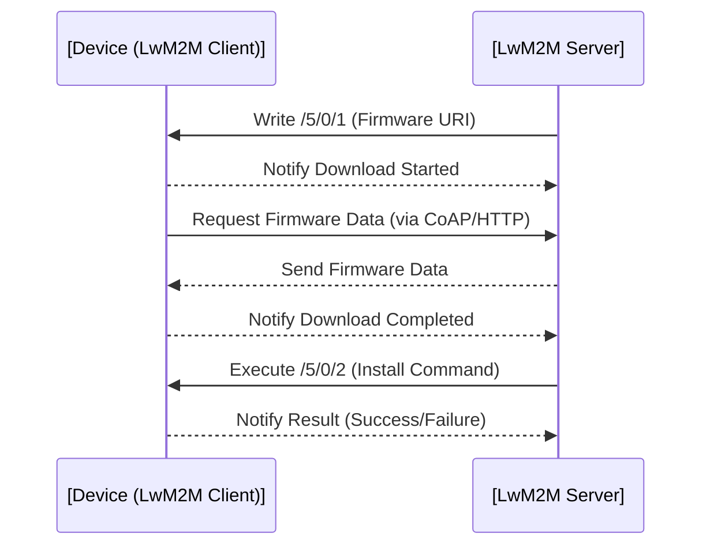
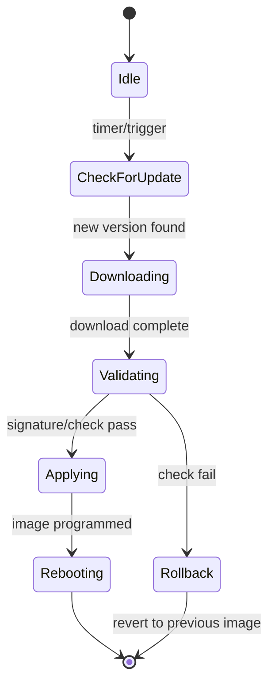

# FOTA (Firmware Over-The-Air): Engineering Overview

## Introduction

Firmware Over-The-Air (FOTA) is a critical technology for modern embedded systems, particularly in the rapidly expanding Internet of Things (IoT) landscape. It enables remote, wireless, and often automated updating of device firmware in production deployments, from consumer electronics to industrial sensor networks. By reducing the need for physical access, FOTA provides a scalable, efficient approach to deploying bug fixes, security patches, and feature enhancements.

FOTA is governed by a combination of embedded software design, networking protocols, system security, and device management best practices. For embedded engineers, it is fundamental to understand FOTA's architecture, operational workflows, and lifecycle integration.

## FOTA in Context

### Definition

**Firmware Over-The-Air (FOTA)** is a method by which new firmware is delivered, authenticated, and applied to embedded devices using wireless communication channels (cellular, Wi-Fi, LPWAN, etc.), generally without user intervention or device downtime.

### Why FOTA Matters

- **Scalability:** Physical replacement or manual intervention is unfeasible for large deployments.
- **Security:** Timely patching of security vulnerabilities.
- **Product Evolution:** Feature rollouts and optimizations after deployment.
- **Compliance:** Updates to meet regulatory or protocol changes in situ.

### Technical Context

FOTA intersects with multiple architectural concerns:

- Embedded storage management (reliable, atomic updates)
- Secure boot and image verification
- Network reliability and device-to-cloud communication protocols
- Power management, especially for battery-operated devices

## Core Concepts and Key Components

### FOTA System Components

A robust FOTA system consists of at minimum:

- **Update Server:** Hosts firmware images and metadata, initiates and manages update campaigns.
- **Device Agent:** Embedded client software responsible for update retrieval, validation, and application.
- **Transport Layer:** Network protocols that enable secure, reliable communication (HTTP, MQTT, CoAP, proprietary).
- **Deployment Management:** Logic to control which devices receive which updates and when.
- **Verification/Recovery:** Mechanisms to authenticate images and recover from failed updates.

#### High-Level FOTA System Block Diagram

```mermaid
flowchart TD
    cloud[Update Server/Cloud]
    mgmt[Deployment Management Service]
    dev[Embedded Device (Device Agent)]
    store[Persistent Storage]
    net[Transport Layer]
    auth[Verification & Recovery]
    cloud --> mgmt
    mgmt -->|Schedule/Policy| dev
    cloud -->|Firmware Binary| dev
    dev --> store
    dev -->|Check| auth
    dev -- Network Comm --> net
    net -- Wireless Link --> cloud
    auth --> dev
```

### Update Campaigns

FOTA campaigns manage the distribution of firmware to subsets of the device fleet according to device class, version, region, or other filters. Rollouts may be staged or canary-based to minimize risk.

### Typical FOTA Workflow States

- **Idle:** Device operates normally, periodically checks for updates.
- **Download:** New firmware package is downloaded.
- **Validate:** Integrity/signature and sometimes compatibility checks performed.
- **Apply:** New firmware programmed into device storage.
- **Reboot/Switch:** Device switches to new firmware (immediate reboot or scheduled switchover).
- **Recovery:** In case of failure, rollback or recovery is initiated.

---

## FOTA Architecture and Workflows

### Update Distribution Pipeline

#### Workflow Overview



### Transport Protocols

The choice of protocol is determined by device capabilities, security requirements, and deployment environment.

- **HTTP/HTTPS:** Common for high-bandwidth, IP-enabled devices.
- **CoAP:** Lightweight, supports constrained devices (IETF RFC 7252).
- **MQTT:** Efficient, reliable publish-subscribe messaging for IoT devices.
- **Proprietary:** Custom protocols for specialized hardware or networks.

For large files, segmented downloads, delta updates (only changed blocks), and resume support are often necessary.

#### Note
> Where the deployment spans low-power wide-area networks (LPWAN) like LoRaWAN or NB-IoT, FOTA must consider strict bandwidth, payload, and duty cycle constraints.

### Image Preparation and Signing

Firmware images are typically:

- Versioned (semantic or date-based schemes)
- Compressed and/or encrypted
- Digitally signed (RSA/ECDSA) for authenticity and integrity

Metadata formats (like SOTA Manifest [IETF RFC 9019]) may specify:

- Image checksum/hash (SHA-256, SHA-512)
- Signed manifest
- Required or compatible versions, device model targeting
- Rollback indication/flag

### Update Validation and Security

**Authentication** and **integrity** are paramount. Common practices include:

- Public Key Infrastructure (PKI) for signing
- Secure Boot: Device only boots digitally signed images (see Secure Boot Chains)
- Root of Trust and hardware-backed secure elements

#### GitHub Alert: :warning: Authentication Criticality

> **Warning:** Never accept unauthenticated firmware images. Tampered or malicious images can compromise entire device fleets.

### Storage Management for FOTA

Update application methods depend on flash layout and storage architecture:

- **Single Bank:** Firmware written in place; unsafe if interrupted.
- **Dual Bank / A/B Partitioning:** Two separate flash regions; allows preparation of new image before switch. Supports rollback.
- **External Storage:** For devices with additional flash/EEPROM for staging images.

#### A/B Partition Boot Process (Mermaid Diagram)



### Reliable Update Mechanisms

Failure resilience is essential. **Atomicity** must be ensured, so devices are not rendered inoperable by:

- Power loss during update
- Corrupt download
- Network interruptions

Common design strategies:

- Write image to unused partition, validate, then commit
- Maintain roll-backable "last known good" image
- Bootloader verification
- Update progress tracking (to resume or retry safely)

### Power and Resource Constraints

IoT devices often operate with:

- Limited RAM/flash (tens to hundreds of KB)
- Battery power, aggressive duty cycling
- Intermittent connectivity

Techniques to mitigate constraints:

- Block-by-block downloads, with strong checkpointing
- Delta updates to minimize bandwidth (cf. bsdiff/xdelta, although constrained by MCU resources)
- Update throttling based on battery level or connectivity quality

---

## Integration with Device Lifecycle and Standards

### Overarching Protocols and Device Management

FOTA, as a subsystem, integrates into broader device management frameworks. Lightweight M2M (LwM2M, OMA SpecWorks) is one standard supporting secure, standardized FOTA, providing:

- Object models for firmware, software management
- Defined update sequence (download, verify, install, activate)
- Optional notifications and reporting to Device Management platforms

#### Mermaid: LwM2M Update Workflow



### Security Considerations

Beyond image signature verification and secure boot, other best practices include:

- **Encrypted transport:** Use TLS/DTLS (IETF RFC 6347) for update traffic.
- **Device authentication:** Mutual authentication (X.509 certificates, device-specific pre-shared keys).
- **Update provenance tracking:** Trace which devices have identified, downloaded, and applied which images.

#### Caution: Bricking Risk

> **Caution:** Poorly designed FOTA systems risk "bricking" (inoperable devices). Bootloader and update agent must always be recoverable.

---

## Engineering Considerations and Implementation Challenges

### Key Engineering Decisions

- **Update Image Size vs. Device Capability:** Large images may require external storage.
- **Bandwidth Management:** Scheduling updates during low-traffic periods.
- **Authentication/Encryption Overhead:** Strong security may impact device CPU/RAM.
- **Update Rollback/Failsafe Design:** Strongly recommended for all field devices.

### Implementation Pitfalls

- **Assuming Unreliable Networks are Reliable:** Especially in cellular and LPWAN contexts.
- **Lack of Power-Loss Recovery:** Must always be safely recoverable.
- **Insufficient Testing for Variant Devices:** Heterogeneous fleets may have subtle differences impacting firmware compatibility.

### Integration Points

- **Bootloader/Startup Code:** Bootloader must be able to select and validate which firmware to boot.
- **Device Management Interface:** FOTA outcome reporting, status, error codes for fleet monitoring.
- **Security Subsystem:** Key management/rotation.

---

## Advanced Topics and Variations

### Differential (Delta) Updates

Efficient updates send only changes rather than full images; demands more processing and storage buffer but can save substantial bandwidth for frequent, small changes. Applies mainly when device resources permit.

### Partial and Modular Updates

Rather than monolithic firmware, modular systems update only parts (e.g., wireless stacks, application engines) but require robust dependency/version tracking.

### Multicast or Group-Based Delivery

For networks with many devices on a shared medium (e.g., certain mesh or Zigbee deployments), multicast FOTA pushes updates to many devices at once, reducing network usage but complicating reliability guarantees and device state tracking.

### Secure Element Integration

Use of hardware root of trust (including TPMs, Secure Elements, or TrustZone-based MCUs) for secure key storage and accelerated crypto operations during verification and boot.

---

## Example: Minimal FOTA Agent Update State Machine



---

## Summary Table: FOTA Engineering Essentials

| Consideration                               | Detail/Options                                                              |
|---------------------------------------------|-----------------------------------------------------------------------------|
| Protocols                                  | HTTP/HTTPS, CoAP, MQTT, LwM2M                                               |
| Image Security                             | Digital signatures (PKI), hash checks, encrypted transport                   |
| Storage Architecture                       | Single bank, A/B bank, external staging                                     |
| Recovery/Failsafe                          | Bootloader fallback, atomic switching, previous image backup                 |
| Update Format                              | Full image, delta/patch, modular                                             |
| Device Management Integration              | LwM2M, custom APIs, reporting/status feedback                                |
| Rollout Control                            | Staged, canary, or phased updates; campaign scheduling                       |
| Resource Constraints                       | Checkpointed downloads, power-aware operation, minimal RAM/flash usage        |
| Compliance/Traceability                    | Version tracking, update history logs                                        |

---

## Conclusion

FOTA is foundational for the management, security, and evolution of modern IoT and embedded systems at scale. Its architecture demands rigorous attention to network reliability, storage atomicity, security, and power/resource limitations. Successful design relies on understanding both system-level flows and embedded integration points, meticulous failure handling, and compliance with best practices for software update safety and integrity.

When architected properly, FOTA not only reduces operational costs but also underpins robust, secure, and future-adaptable deployments.

---

## References (For Direct Citation Within Text)

- IETF RFC 7252: "The Constrained Application Protocol (CoAP)"
- OMA LwM2M 1.2 Specification
- IETF RFC 9019: "A Manifest Information Model for Firmware Updates"
- IETF RFC 6347: "Datagram Transport Layer Security Version 1.2"
- Secure Boot Chain principles (varies by chipset/manufacturer)
- LwM2M /5 Firmware Update Object Model

---