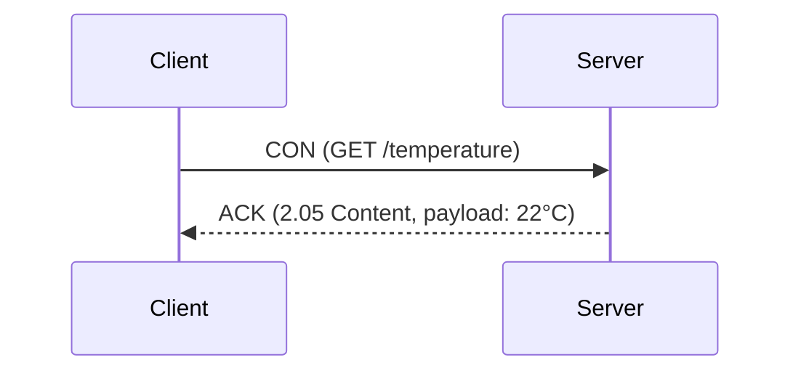
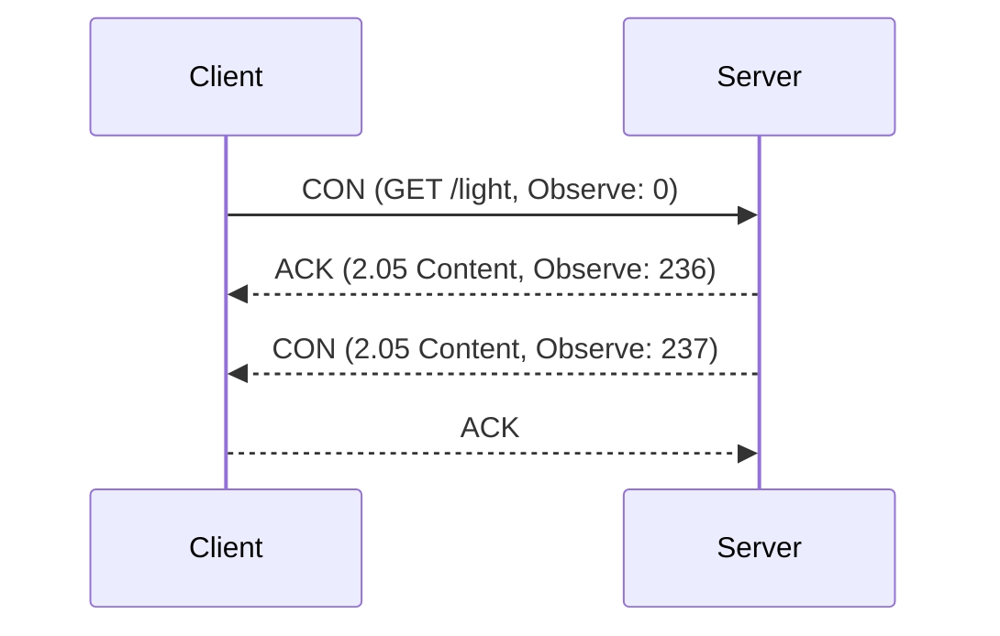

# Constrained Application Protocol (CoAP): A Technical Primer

## 1. Introduction and Technical Context

The Constrained Application Protocol (CoAP) is a specialized network protocol explicitly designed for use with resource-constrained devices and networks, frequent in the Internet of Things (IoT) domain. CoAP provides a lightweight, RESTful (Representational State Transfer) communication model similar to HTTP but tailored for low-power sensors, actuators, and microcontrollers often operating over lossy or low-bandwidth wireless links.

CoAP is standardized by the IETF Constrained RESTful Environments (CoRE) working group. The principal specification is [RFC 7252](https://tools.ietf.org/html/rfc7252), with additional extensions such as [RFC 7641] for observation, [RFC 7959] for blockwise transfers, and [RFC 8613] for object security (OSCORE).

CoAP’s main distinguishing feature is its operation over UDP, rather than the more resource-intensive TCP. This choice is paired with features enabling reliable messaging, low overhead, and asynchronous communication, all of which are vital for constrained IoT environments.

## 2. Core Concepts and Architecture

### 2.1 RESTful Paradigm for Constrained Devices

CoAP models its communication after HTTP’s REST paradigm, supporting standard operations—GET, POST, PUT, DELETE—on resources identified by URIs. This similarity enables easy integration with web services and RESTful architectures, while CoAP's binary header structure and semantics allow operation on devices with limited CPU, RAM, and network capabilities.

### 2.2 Typical Deployment Scenarios

Common use cases for CoAP include:

- Remote sensing (temperature, humidity, etc.)
- Lighting or HVAC control
- Automotive and industrial telemetry
- Smart metering

These applications require efficient communication, as endpoints often operate on battery power and communicate over unreliable wireless links like IEEE 802.15.4 (used in Zigbee/6LoWPAN).

### 2.3 Protocol Stack and Integration

CoAP fits within the typical IoT protocol stack as follows:

```mermaid
flowchart TD
    PHY[Physical (802.15.4/WiFi/Ethernet)]
    MAC[MAC Layer]
    NET[Network (IPv6/6LoWPAN)]
    UDP[UDP]
    DTLS[DTLS (Optional Security)]
    COAP[CoAP]
    APP[Application]

    PHY --> MAC --> NET --> UDP --> DTLS --> COAP --> APP
```

- **Physical & MAC**: Radio or Ethernet
- **Network**: Typically IPv6, often compressed with 6LoWPAN for low-power links
- **UDP**: Lightweight transport
- **DTLS**: Optional end-to-end security
- **CoAP**: RESTful messaging
- **Application**: Device services

## 3. How CoAP Works

### 3.1 Message Formats and Headers

CoAP defines a compact binary message format to minimize overhead. 

**CoAP Message Header:**

- **Version (2 bits)**
- **Type (2 bits):** Confirmable, Non-confirmable, Acknowledgement, Reset
- **Token Length (4 bits)**
- **Code (8 bits):** Represents method or response code, e.g., 0.01 for GET
- **Message ID (16 bits)**
- **Token, Options, Payload**

The message header is always 4 bytes, followed by a token (0-8 bytes), then options encoded in Type-Length-Value (TLV) format, and an optional payload.

```mermaid
flowchart LR
    V[Version (2)]
    T[Type (2)]
    TK[Token Length (4)]
    C[Code (8)]
    MID[Message ID (16)]
    TOK[Token (0-8B)]
    OPT[Options]
    PAY[Payload]
    V --> T --> TK --> C --> MID --> TOK --> OPT --> PAY
```

### 3.2 Communication Model

CoAP supports both synchronous and asynchronous communication, designed for environments where clients and servers might not always have a direct or stable connection.

- **Client-Server Model:** Clients issue requests to servers (resource owners).
- **Server-to-Client Push:** Via "Observe" extension (RFC 7641), enabling resource observation.

### 3.3 Message Types and Reliability

CoAP defines four message types:

- **Confirmable (CON):** Requires application-layer acknowledgement (ACK). Retransmissions handled by CoAP if no ACK.
- **Non-confirmable (NON):** Sent unreliably (no ACK).
- **Acknowledgement (ACK):** Responds to CON message.
- **Reset (RST):** Used when a message is received that cannot be processed.

**GitHub Alert**
> :warning: **Caution:** Although UDP is unreliable, CoAP implements its own reliability and deduplication mechanisms for confirmable messages. Careful tuning of retransmission parameters is necessary in lossy networks to avoid congestion or starvation.

### 3.4 Example Message Exchange

A typical CoAP request/response exchange:



If no ACK is received, the client retransmits the CON message until a maximum number of attempts is reached.

### 3.5 CoAP Methods and Response Codes

CoAP uses an 8-bit "code" field that splits into a class and detail, for methods and responses similar to HTTP:

**Request Methods:**
- `0.01`: GET
- `0.02`: POST
- `0.03`: PUT
- `0.04`: DELETE

**Response Codes:**
- `2.05`: Content (success)
- `4.04`: Not Found (client error)
- `5.00`: Internal Server Error

### 3.6 URI Scheme, Discovery, and Resource Representation

CoAP URIs follow the pattern:

    coap://[host]:[port]/[path][?query]

Devices typically expose a `/.well-known/core` resource (RFC 6690) for resource discovery using CoRE Link Format, analogous to HTTP’s `.well-known` discovery mechanisms.

## 4. CoAP Options and Payload

Similar to HTTP headers, CoAP uses Options to provide metadata and extra instructions for requests and responses. Examples include:

- **Uri-Host, Uri-Path, Uri-Query:** For addressing
- **Content-Format:** Media type for payload (e.g., application/json, application/cbor, text/plain)
- **Max-Age:** Resource cache control
- **Observe:** For resource subscription

CoAP payloads are optional and can carry sensor data, commands, or configuration in binary, text, or application formats.

## 5. Advanced Features and Extensions

### 5.1 Observe: Resource Observation and Eventing

The Observe extension ([RFC 7641](https://tools.ietf.org/html/rfc7641)) allows a client to register interest in the state of a resource, so the server pushes updates as they happen.



This model supports efficient pub-sub and eventing patterns foundational to IoT telemetry.

### 5.2 Blockwise Transfer: Large Payload Support

For resources too large to fit in a single CoAP packet, [RFC 7959](https://tools.ietf.org/html/rfc7959) specifies Block1/Block2 options for sending/receiving data in chunks.

```mermaid
flowchart TD
    Cl[Client]
    Sv[Server]
    Cl -->|Block 1 (0/3)| Sv
    Sv -->|Block 2 (0/3)| Cl
    Cl -->|Block 1 (1/3)| Sv
    Sv -->|Block 2 (1/3)| Cl
    Cl -->|Block 1 (2/3)| Sv
    Sv -->|Block 2 (2/3)| Cl
    Cl -->|Block 1 (3/3)| Sv
    Sv -->|Final Block 2| Cl
```

Blockwise transfer ensures fragmentation and reassembly suitable for networks and devices with strict limits on maximum packet size.

### 5.3 Security: DTLS and Object Security (OSCORE)

CoAP handles security at two potential layers:

- **DTLS ([RFC 6347](https://tools.ietf.org/html/rfc6347)):** CoAP over UDP is protected using Datagram TLS for confidentiality, integrity, and authentication.
- **OSCORE ([RFC 8613](https://tools.ietf.org/html/rfc8613)):** Applies object security directly to the CoAP payload and options, enabling end-to-end security even with intermediaries (proxies).

**GitHub Alert**
> :lock: **Important:** Plain CoAP is not secure against eavesdropping, spoofing, or replay attacks. Always deploy CoAP with DTLS or OSCORE in production or sensitive environments.

**GitHub Alert**
> :bulb: **Tip:** OSCORE enables secure end-to-end messaging across intermediate proxies, while DTLS only secures hop-by-hop.

## 6. Proxies, Gateways, and Integration with HTTP

### 6.1 Cross-Protocol Translation

A key design feature of CoAP is its compatibility with HTTP, easing integration with existing web backends. CoAP-to-HTTP proxies transparently translate requests and responses, mapping methods, URIs, and content.

```mermaid
flowchart LR
   Device1[Sensor Node (CoAP Client)] -- CoAP/UDP --> Proxy[CoAP-HTTP Proxy] -- HTTP/TCP --> Server[Web Service]
```

- CoAP and HTTP status codes are mapped where possible.
- Proxies must handle differences (streaming, chunked encoding, error codes), and protocol limitations.

### 6.2 Use of Multicast

CoAP natively supports group communication via IP multicast, allowing a client to address all devices in a group with a single request (e.g., toggle all lights).

**GitHub Alert**
> :information_source: **Note:** Not all networks or devices may support multicast efficiently. Consider unicast alternatives or application-level grouping where multicast is unavailable.

## 7. Implementation Considerations and Engineering Tradeoffs

### 7.1 Typical Engineering Decisions

- **Transport selection:** While UDP is typical, CoAP over TCP is available for non-constrained contexts ([RFC 8323]).
- **Header compression:** 6LoWPAN header compression is essential in low-bandwidth networks.
- **Security integration:** Must choose between end-to-end (OSCORE) and hop-by-hop (DTLS) models.
- **Resource URI design:** Keep resource IDs and paths short for minimal overhead.

### 7.2 Common Pitfalls

- **Statelessness:** CoAP is fundamentally stateless; stateful interactions (e.g., long transactions) require explicit design.
- **NAT traversal:** Like all UDP-based protocols, CoAP may encounter issues traversing NAT devices and firewalls.
- **Reliable messaging:** Poorly tuned retransmission can exacerbate network congestion.

### 7.3 Integration Points

CoAP is used as an application-layer protocol in device firmware, IoT gateways, and cloud-backend adapters. Related standards include:

- **LwM2M (OMA Lightweight M2M):** Device management over CoAP
- **MQTT:** Alternative publish/subscribe protocol for different use cases
- **RESTful HTTP:** For external APIs

**GitHub Alert**
> :warning: **Caution:** Not all web tools and frameworks natively support CoAP. Adapters or protocol translators are often needed for cloud integration.

## 8. Interoperability and Ecosystem

### 8.1 Client and Server Libraries

CoAP libraries are available for a variety of platforms (C, C++, Python, Java, JavaScript). Popular open-source implementations include:

- **libcoap** (C)
- **Eclipse Californium** (Java)
- **Node-coap** (Node.js)

### 8.2 Ecosystem Standards

- **RFC 7252:** Core CoAP specification
- **RFC 7641:** Observe extension
- **RFC 7959:** Blockwise transfer
- **RFC 8613:** OSCORE (object security)
- **OMA LwM2M:** Device management over CoAP

## 9. Summary Diagram: CoAP in a Typical IoT Environment

```mermaid
flowchart TB
    SensorA[Sensor Node<br/>(CoAP Client)]
    ActuatorA[Actuator Node<br/>(CoAP Server)]
    Gateway[IoT Gateway<br/>(CoAP Proxy)]
    Cloud[Cloud Backend<br/>(HTTP REST API)]

    SensorA -- CoAP/UDP --> Gateway
    ActuatorA -- CoAP/UDP --> Gateway
    Gateway -- HTTP/TCP --> Cloud
```

## 10. Conclusion

CoAP is a foundational protocol for RESTful, web-inspired communication in constrained IoT environments. Its compact binary encoding, employment of UDP, low overhead, and REST abstraction make it uniquely suited for battery-powered devices and lossy networks. Advanced features like Observe, blockwise transfers, multicast, and integration with security standards (DTLS, OSCORE) position CoAP at the core of next-generation IoT solutions.

Implementation requires careful attention to message reliability, congestion control, security, and integration with web backends. CoAP’s growing maturity and strong standards support mean it is broadly adopted for device-to-device and device-to-cloud communication in constrained contexts.

For engineers building or evaluating IoT systems where device constraints and efficient resource usage are paramount, CoAP is a key protocol to understand and master.