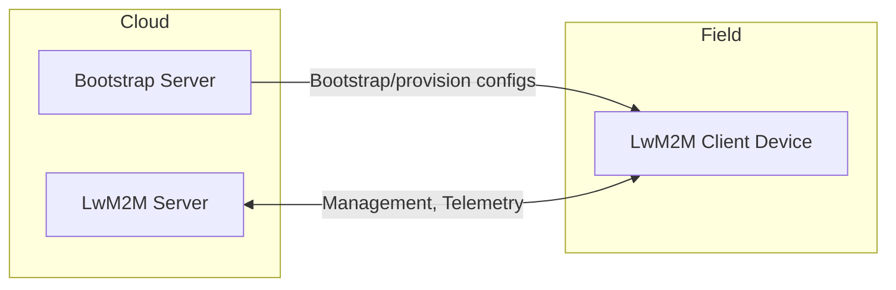
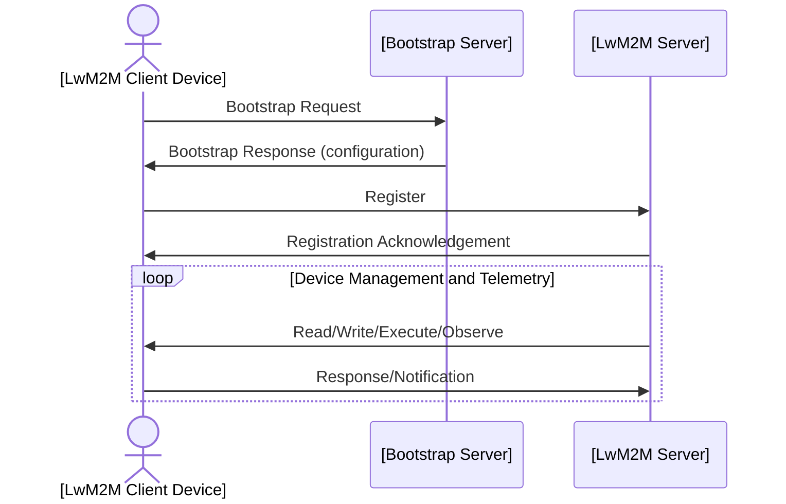
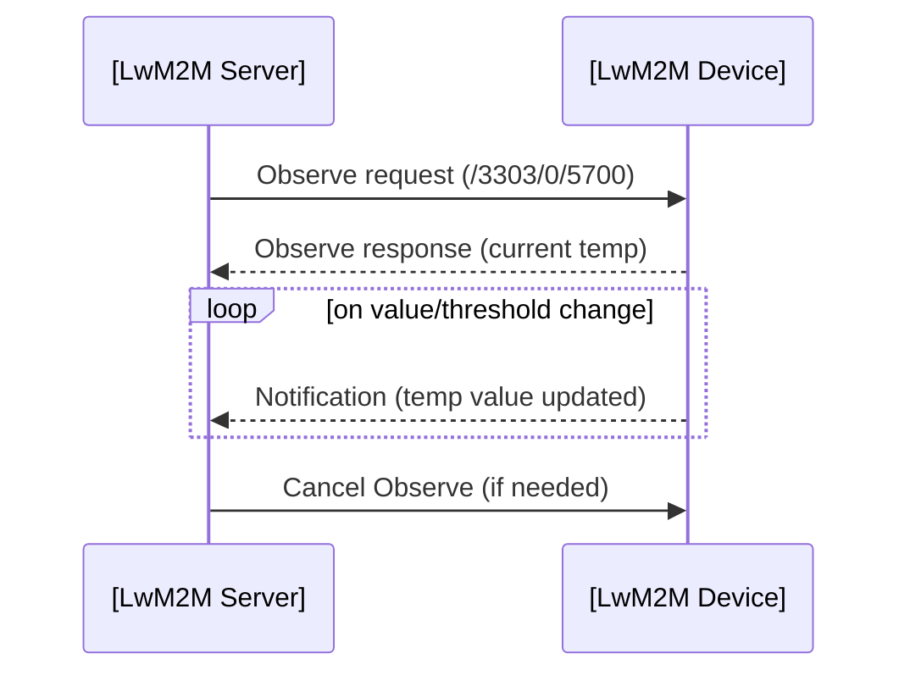
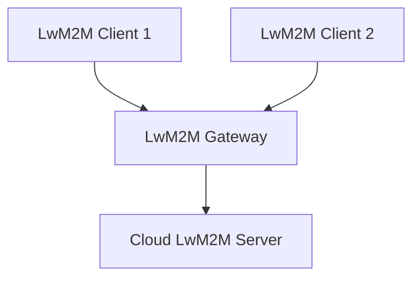

# LwM2M (Lightweight Machine to Machine): Protocol Explainer

## Overview and Context

**Lightweight M2M (LwM2M)** is an application layer protocol designed for efficient device management and telemetry in machine-to-machine (M2M) and Internet of Things (IoT) deployments, particularly those comprising resource-constrained devices. Specified and maintained by the Open Mobile Alliance (OMA), the protocol addresses the challenges of provisioning, configuring, monitoring, and updating devices with limited bandwidth, memory, and processing capability.

LwM2M is fundamental to scenarios involving low-power wide area networks (LPWAN), cellular IoT (e.g., NB-IoT, LTE-M), and other deployments where constrained end devices need reliable management and data reporting over unreliable or constrained links. The protocol leverages the **Constrained Application Protocol (CoAP)** as its underlying transport and is optimized for devices operating within the class 1 or class 2 limitation levels described in RFC 7228.

Key standards and references:
- OMA LightweightM2M Core Specification (OMA-TS-LightweightM2M_Core-V1_2-20211005-A)
- RFC 7252 (Constrained Application Protocol)
- RFC 7641 (CoAP Observe extension)
- RFC 7959 (Block-wise transfers for CoAP)

## Protocol Goals and Architectural Foundation

LwM2M is tailored to deliver:

- **Device Management:** Bootstrapping, provisioning, configuration, firmware updates, and status monitoring.
- **Service Enablement:** Support for telemetry (reporting sensor readings and events).
- **Efficiency:** Minimal bandwidth and power requirements, compact message encoding (including support for UDP and DTLS, and optionally TCP and TLS).
- **Interoperability:** A standardized data model facilitating plug-and-play integration with IoT platforms and management systems.

### Architectural Overview

The core LwM2M architecture revolves around a client-server model:

- **LwM2M Client:** Runs on the IoT device, exposing a set of managed objects for remote access and manipulation.
- **LwM2M Server:** Operates in the cloud or a managed environment; responsible for managing clients, collecting telemetry, and issuing commands.
- **Bootstrap Server (optional):** Facilitates initial provisioning and configuration of the device.

#### High-Level LwM2M Architecture



---

## Key Concepts and Components

### LwM2M Object Model

The foundation of LwM2M is its resource-oriented object model. This standardizes how device features and data are exposed for remote management.

#### Definitions

- **Object:** Represents a functional group (e.g., Device, Firmware, Temperature sensor).
- **Object Instance:** Specific instantiation of an object (e.g., first temperature sensor on a device).
- **Resource:** Individual attribute or function within an object (e.g., sensor value, reset command).
- **Resource Instance:** Allows arrays/lists inside objects.

Each entity is identified by a numeric ID as per the [OMA LwM2M Registry](https://github.com/OpenMobileAlliance/lwm2m-registry), ensuring interoperability.

#### Object Structure Example

| Object ID | Name         | Example Resource        | Resource ID | Access |
|-----------|--------------|------------------------|-------------|--------|
| 3         | Device       | Manufacturer           | 0           | R      |
| 3         | Device       | Reboot                 | 4           | E      |
| 3303      | Temperature  | Sensor Value           | 5700        | R      |
| 3303      | Temperature  | Min Measured Value     | 5601        | R      |

**R** — Read, **E** — Execute, **W** — Write, **RW** — Read/Write

### Object and Resource Path Notation

LwM2M uses hierarchical URI paths to reference items:

```
/<objectId>/<objectInstanceId>/<resourceId>/<resourceInstanceId>
```

Example: `/3303/0/5700` refers to the sensor value of the first temperature sensor.

### Device and Service Management Operations

LwM2M supports four key operations, directly mapping to CoAP methods:

| LwM2M Operation | CoAP Method | Description             |
|-----------------|------------|-------------------------|
| Read            | GET        | Fetch resource(s) value |
| Write           | PUT/POST   | Modify resource         |
| Execute         | POST       | Invoke resource action  |
| Create          | POST       | Instantiate new object  |
| Delete          | DELETE     | Remove instance/object  |

Observe and notification extensions allow clients to report resource changes asynchronously (RFC 7641).

---

## The LwM2M Lifecycle: Bootstrapping, Registration, and Operation

### 1. Bootstrapping

Bootstrapping provides devices with the initial configuration required to contact management servers. LwM2M defines two bootstrapping methods:
- **Client-Initiated Bootstrap:** Device contacts the bootstrap server on initial power-up or reset.
- **Server-Initiated Bootstrap:** The bootstrap server triggers configuration on a device.

### 2. Client Registration

Devices must register with at least one LwM2M Server to declare their presence and capabilities. Registration includes endpoint identification, supported objects, and communication parameters.

### 3. Management and Telemetry

After registration, the LwM2M Server (or platform) interacts with the device through read, write, execute, and observe operations for device management and telemetry.

#### LwM2M Communication Sequence (Simplified)



---

## Data Transport and Security

### CoAP as the Transport Foundation

LwM2M employs **CoAP** due to its lightweight, binary-friendly encoding and suitability for unreliable, low-power links. It supports:
- UDP as the primary transport
- Optional CoAP over TCP
- Optional WebSockets (in LwM2M 1.1+)

CoAP features are inherited:
- Confirmable/non-confirmable messages (akin to TCP/UDP reliability, but on top of UDP)
- Block-wise transfers for large resources
- Observe/notification extensions

### Security: DTLS and TLS

For wire security, LwM2M specifies:
- **DTLS (Datagram Transport Layer Security):** For UDP/CoAP
- **TLS:** For TCP/CoAP

Authentication mechanisms include:
- **Pre-Shared Key (PSK)**
- **Raw Public Key (RPK)**
- **X.509 Certificates**

#### Security Bootstrap and Key Management

Bootstrapping often includes provisioning of security materials (credentials, server URIs). Secure key provisioning and update flows are critical for IoT threat models.

> [!WARNING]
> Improper management of device credentials (e.g., hardcoded PSKs, failure to update keys post-manufacture) can critically compromise fleet security.

---

## Data Model: Standard and Custom Objects

LwM2M leverages a registry of standardized objects (https://github.com/OpenMobileAlliance/lwm2m-registry), covering:
- Device information and status
- Connectivity management (e.g., cellular, Wi-Fi parameters)
- Firmware updates
- Sensors (binary, temperature, humidity, digital input, etc.)
- Actuators (e.g., switch)

The model is **extensible**, supporting manufacturer/application-specific object definitions using custom IDs within a reserved range.

> [!NOTE]
> Any custom object definition should be considered for registration with the OMA to maximize interoperability.

---

## Observation, Notification, and Reporting

Efficient data reporting is crucial for battery-operated IoT deployments. LwM2M's **Observe** and **Notification** features, built on CoAP Observe (RFC 7641), allow:

- The server to subscribe to resource changes on the client.
- The client to push updated values when conditions/triggers are satisfied.

Clients support attribute-based reporting:
- Minimum/maximum reporting intervals
- Value change thresholds

This minimizes uplink congestion and conserves power.

#### Observe Workflow Example



---

## Firmware Update Over-the-Air (FOTA)

Device firmware/patch management is a core driver for LwM2M adoption. LwM2M provides a standardized FOTA object (Object 5):

- Allows the server to initiate firmware download via CoAP, typically in blocks (for lossy links)
- Supports update triggers, status monitoring, and error handling

> [!TIP]
> Always verify device power and storage availability before triggering FOTA on constrained devices to avoid device bricking.

---

## Protocol Versions and Evolution

LwM2M evolves rapidly to address emerging IoT requirements:

- **1.0:** Core functionality (DM, telemetry, firmware update)
- **1.1:** Added TCP, SMS binding, support for JSON/TLV/CBOR payloads, composite operations, enhanced error handling
- **1.2:** Further extensions for larger deployments, resource constraints, and enhanced security

Implementers need to monitor version compatibility due to significant feature growth between versions.

---

## Protocol Encodings and Content Formats

LwM2M supports multiple payload encodings:
- **TLV (Type-Length-Value):** Efficient, suited for constrained parsing
- **JSON:** Human-readable, interoperability with REST backends
- **CBOR:** Compact, binary, increasingly favored for large deployments

Content negotiation is through CoAP’s Accept/Content-Format headers, allowing flexibility per endpoint or operation.

> [!CAUTION]
> Ensure all server and client components agree on the chosen payload format to prevent interoperability issues.

---

## Network Architectures and Deployment Scenarios

### Deployment Topologies

LwM2M can support a range of deployment models:

1. **Direct-to-Cloud**: Devices connect over the Internet to a remote LwM2M Server.
2. **Edge Aggregator/Gateway**: Local gateway proxies LwM2M to upstream servers, allowing legacy/heterogeneous device integration.
3. **Private Networks**: For industrial or critical infrastructure, LwM2M can be restricted to on-premises/cloud boundaries.

#### LwM2M Gateway Use Case Diagram



Gateways can translate between radio protocols, aggregate telemetry, or provide protocol mediation between LwM2M and other IoT standards.

### Protocol Integration Points

Typical integration points:
- IoT device firmware (LwM2M client stack, minimal RTOS or Linux)
- Cloud/enterprise backend (LwM2M server, broker, or platform—either as standalone services or via managed offerings)
- Gateways, bridges, middleboxes (for protocol interop or buffering)

---

## Performance and Engineering Considerations

### Payload Efficiency

- CBOR or TLV encoding is mandated for devices with stringent power/radio constraints.
- Employ notification attributes (e.g., minimum/maximum interval, thresholds) to balance timely reporting and battery drain.

### Bandwidth and Resource Management

- Carefully design which object/resource instances are exposed and which are read/observed by servers.
- Limit notification frequency and report aggregation when devices are on expensive/limited networks (e.g., NB-IoT, satellite).

### Firmware Update Strategy

- Staged firmware download with resumption capability is wise for lossy/unstable links.
- Consider FOTA status and error reporting for fleet management automation.

### Security

- DTLS session management must consider keep-alives and session resumption so as not to drain battery on long idle periods.
- Employ PSK or RPK for resources not justified for certificate handling, but plan secure rotation or provisioning.

### Network Dynamics

- Devices may often sleep (NB-IoT PSM/eDRX) and lose network state. Registration lifetimes, notification retransmissions, and bootstrap retries must be engineered for real-world network unreliability.
- Device clocks may drift: design tolerance in reporting time windows.

---

## Implementation Challenges and Common Pitfalls

> [!WARNING]
> **Don’t assume all CoAP stacks are LwM2M ready.** LwM2M is not just CoAP—object model management, registration, bootstrapping, and notifications are protocol-specific and add engineering complexity on both client and server side.

- **Limited Device Resources:** Minimal heap/stack footprint is critical; LwM2M clients must be highly optimized.
- **Fragmentation:** Interop issues arise when using vendor-specific objects not aligned to OMA Registry.
- **Wakeup and Sleep Handling:** Duty-cycled radios, deep sleep, and network reattachment require careful handling for notifications, command delivery, and firmware updates.
- **Session and State Management:** Handling lost DTLS sessions or out-of-order block-wise transfers is nontrivial.
- **Firewall/NAT Traversal:** UDP-based CoAP sessions may face NAT/firewall timeouts—consider keep-alives or alternative transports (TCP/WebSockets) if available.

> [!TIP]
> Open-source LwM2M reference implementations (e.g., Eclipse Leshan, Anjay, Wakaama) are widely available but required careful tailoring for resource profiles and necessary features.

---

## Summary

LwM2M is a purpose-built protocol tailored for managing and monitoring resource-constrained IoT devices at scale. By combining a well-defined, extensible object model with CoAP-based efficient transport and robust security primitives, LwM2M enables reliable, interoperable device management on even the most limited embedded endpoints. Its evolution tracks the needs of modern IoT, supporting new transports, efficient payload formats, and diverse deployment scenarios.

Engineers integrating LwM2M must consider not only protocol-specific requirements but also real-world factors: network constraints, device lifecycle management, security, and scalable fleet automation. Navigating these demands with best practices in object modeling, efficient encoding, and robust security is critical for successful and sustainable IoT system deployments.

---

> [!NOTE]
> **Diagram to be added later:** Detailed state machine for LwM2M Client registration, re-registration, and lifetime management.