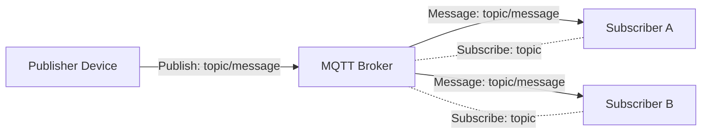
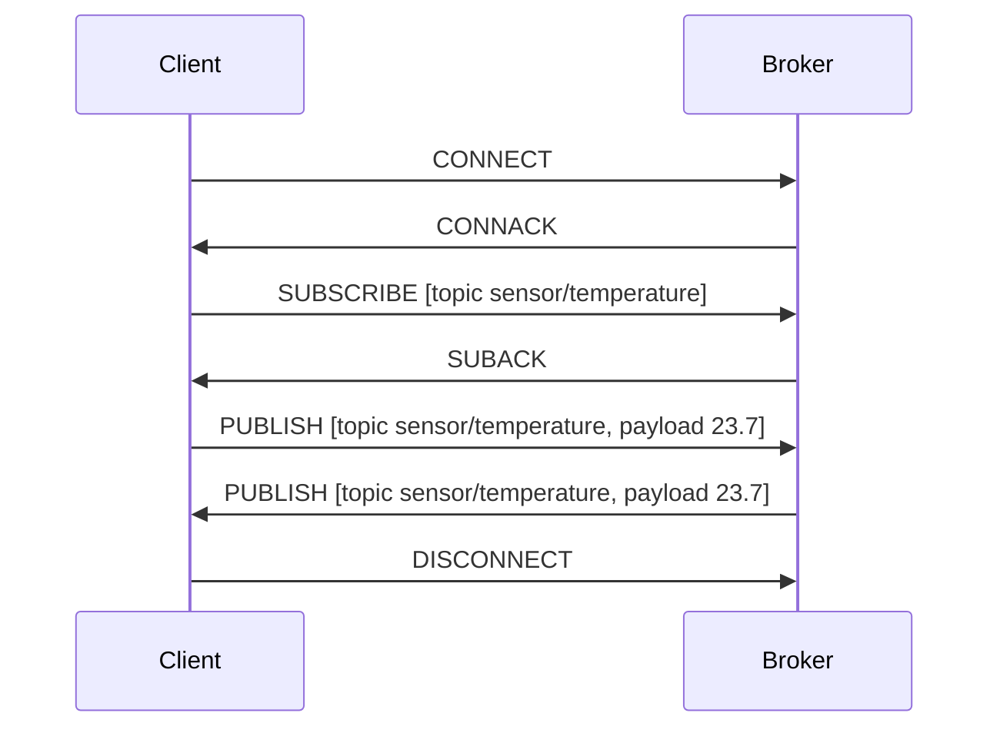
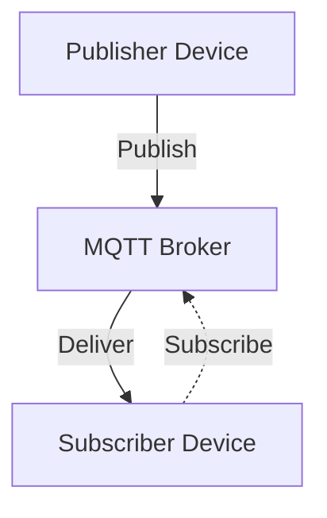
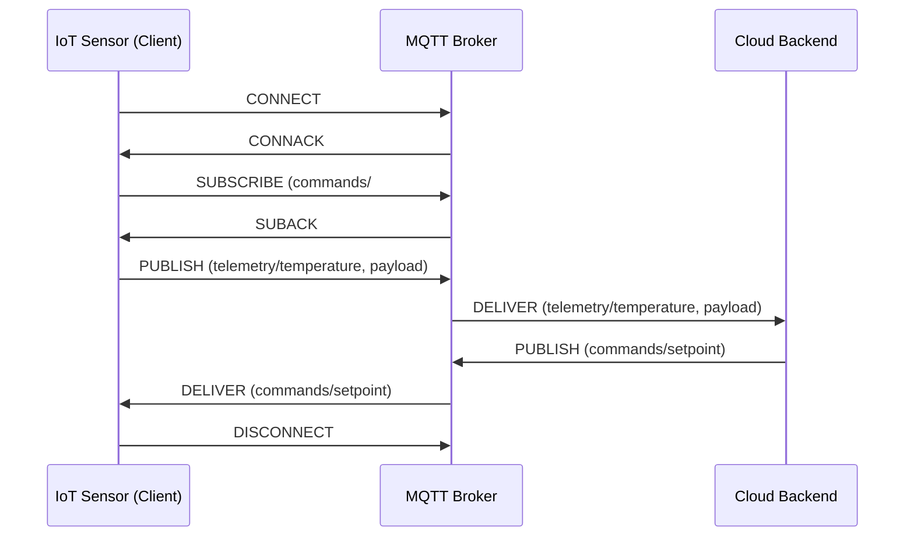

# MQTT Technical Primer

## Introduction

MQTT (Message Queuing Telemetry Transport) is a lightweight, open protocol designed for efficient publish-subscribe messaging between devices and cloud backends. It is widely used in Internet of Things (IoT) contexts due to its minimal network and device resource requirements, making it suitable for constrained devices and unreliable or low-bandwidth networks.

MQTT is specified in ISO/IEC 20922:2016 and originally developed by Andy Stanford-Clark (IBM) and Arlen Nipper (Cirrus Link). Its simplicity, efficiency, and decoupling of message producers and consumers have led to broad adoption in telemetry, remote sensing, industrial automation, smart home, and other IoT systems.

## Core Concepts

### Publish-Subscribe Architecture

MQTT is based on a publish-subscribe (pub-sub) model, contrasting with traditional client-server or point-to-point approaches:

- **Publishers** send messages to a central broker, addressing them to named "topics".
- **Subscribers** express interest in one or more topics, receiving messages published to them.
- **Broker** decouples publishers from subscribers by routing messages to all interested parties.

This architecture promotes scalability, modularity, and ease of integration.

**Mermaid Diagram: MQTT Pub-Sub Model**

### Topics and Message Routing

A **topic** is a hierarchical UTF-8 string (e.g., `sensors/temperature/livingroom`), specifying message channels. Subscriptions can use wildcards for flexible matching:

- **Single-level**: `+`
- **Multi-level**: `#`

Examples:
- `sensors/+/livingroom` matches `sensors/temperature/livingroom`
- `sensors/#` matches all subtopics under `sensors/`

### Quality of Service (QoS)

MQTT defines three Quality of Service levels, determining message delivery guarantees:

- **QoS 0 (At most once)**: Best-effort delivery, no acknowledgment, possible message loss.
- **QoS 1 (At least once)**: Guaranteed delivery, but possible duplicates.
- **QoS 2 (Exactly once)**: Guaranteed single delivery, highest overhead.

QoS is negotiated per message.

### Sessions and State

MQTT is state-aware, supporting persistent sessions for clients. A client can resume subscriptions and undelivered messages after reconnecting.

- **Clean Session**: If set, the broker discards session state after disconnect.  
- **Persistent Session**: Broker retains session, undelivered messages, and subscriptions.

### Retained Messages

MQTT brokers can store the last retained message for each topic. New subscribers immediately receive the retained message upon subscribing, ensuring late-joining devices have up-to-date state.

### Last Will and Testament (LWT)

Each client may specify a "Last Will and Testament" message when connecting. If the client disconnects unexpectedly, the broker publishes the LWT to a designated topic, alerting subscribers about the failure.

## Protocol Operation and Message Flow

### Network Layer and Transport

MQTT is defined over TCP. Standard port numbers:
- **1883**: Unencrypted MQTT
- **8883**: MQTT over TLS/SSL

Although TCP is required by the official specification, variations such as MQTT-SN (MQTT for Sensor Networks) exist for non-TCP transports (e.g., UDP).

### Message Types

MQTT defines a compact binary message format. Key control packet types include:

- **CONNECT**: Client to broker, initiates a connection.
- **CONNACK**: Broker to client, acknowledges connection.
- **PUBLISH**: Client to broker or broker to client, carries a topic and payload.
- **PUBACK/PUBREC/PUBREL/PUBCOMP**: Acknowledgments and flow control (for QoS 1/2).
- **SUBSCRIBE/UNSUBSCRIBE**: Client subscribes/unsubscribes from topics.
- **SUBACK/UNSUBACK**: Acknowledgment to SUBSCRIBE/UNSUBSCRIBE.
- **PINGREQ/PINGRESP**: Keepalive mechanism.
- **DISCONNECT**: Graceful client disconnect.

### Example: Connection and Message Exchange Flow

**Mermaid Diagram: MQTT Basic Message Flow**

## MQTT Architecture

### Broker-Centric Architecture

All MQTT communication is broker-mediated; clients never connect directly to one another.

- **Broker**: Central switchboard for all messages, maintains session data, QOS state, retained messages, subscriptions, and LWTs.
- **Client**: Any publisher or subscriber, typically embedded device, application server, or process.

Scalability is often addressed via broker clustering or federation.

**Mermaid Diagram: Broker Mediation**

### Security

MQTT itself provides for:

- **Username and password authentication**
- **TLS/SSL for transport security**
- Integration with external identity and authorization frameworks
- Fine-grained topic-based access control (in broker implementations)

> [!WARNING]
> MQTT without TLS and authentication exposes all message traffic in plaintext and is vulnerable to interception and abuse. Always use TLS/SSL and enforce authentication in production environments.

### Network Constraints and Keepalive

MQTT is optimized for:

- Small code footprint and message overhead (header as small as 2 bytes)
- Long-lived, low-bandwidth, and unreliable links
- Application-level keepalive (PINGREQ/PINGRESP)

Clients are responsible for periodically sending PINGREQ when idle, prompting the broker to respond (PINGRESP), maintaining connection state.

## Common Variations and Extensions

### MQTT v5

The original specification, MQTT v3.1.1, was succeeded by MQTT v5 (OASIS Standard, 2019), introducing:

- Enhanced error reporting and reason codes
- User properties in messages
- Shared subscriptions (load balancing across multiple subscribers)
- Topic aliases (reducing header size)
- Flow control enhancements

v5 is backward-incompatible with v3, but brokers and clients often support both.

### MQTT-SN (MQTT for Sensor Networks)

MQTT-SN adapts MQTT for non-TCP networks (UDP, Zigbee, etc.) and provides:

- Topic IDs (integer mapping for bandwidth reduction)
- Gateway devices mediating between sensor networks and MQTT brokers
- Broadcast and multicast message support

MQTT-SN is suitable for highly constrained wireless networks, such as those found in industrial or rural sensor deployments.

### Broker Clustering and High Availability

Broker implementations frequently support clustering, persistence (e.g., message queues, databases), and high-availability architectures for scalability and reliability.

**Note**
> Diagram to be added later: Broker cluster with HA failover.

## MQTT in Practice

### Typical Workflow

#### 1. Client Connection
- Device opens a TCP (optionally TLS) connection to broker.
- Sends CONNECT packet, possibly including username/password, session flags, LWT.
- Broker authenticates and acknowledges (CONNACK).

#### 2. Subscribe and/or Publish
- Client subscribes to one or more topics via SUBSCRIBE. Broker confirms (SUBACK).
- Client publishes data to topics via PUBLISH. Broker forwards to all subscribers.
- QoS negotiation defines acknowledgment sequence and delivery guarantees.

#### 3. Session Maintenance
- Keepalive (PINGREQ/PINGRESP) preserves state.
- Clients may disconnect/reconnect. With persistent session, broker retains state and undelivered messages.

#### 4. Disconnection and LWT
- Client sends DISCONNECT (graceful) or connection is lost (ungraceful).
- If LWT configured and session ungraceful, broker publishes LWT message.

### Example Device-to-Cloud Telemetry

**Mermaid Diagram: Sensor Telemetry Workflow**

### Implementation Challenges and Pitfalls

> [!CAUTION]
> **Message Loss in QoS 0:** QoS 0 does not guarantee message delivery. For critical telemetry or commands, use at least QoS 1.

> [!TIP]
> **Avoiding Retained Message Staleness:** If a topic's state becomes obsolete, send a retained message with a zero-length payload to clear the retained state.

Common considerations:

- **Session Scaling**: Broker memory/CPU can be consumed by many simultaneous persistent clients. Design with session state limits and consider broker-level clean-up policies.
- **Message Storms**: Poorly managed wildcards or deep topic hierarchies can overload brokers.
- **Authentication & Security**: Many open-source/public brokers allow anonymous access by default. Always verify configuration and use strong client authentication in production.
- **Network Outages**: Clients should back off and retry reconnection appropriately. Exponential backoff algorithms are recommended.

## Integration Points

- **Gateways/Bridges**: Connect local MQTT networks to internet brokers or hybrid topologies.
- **Integration with Application Servers**: MQTT message flows are often integrated with databases, analytics, REST APIs, or notification systems via broker plug-ins or bridges.
- **Cloud Platforms**: Providers (AWS IoT Core, Azure IoT Hub, Google Cloud IoT Core) offer managed MQTT endpoints with integrated security, scaling, and data ingestion features.
- **Protocol Translation**: Gateways often translate between MQTT and protocols such as HTTP, CoAP, or proprietary fieldbus systems.

## Performance Implications

- **Bandwidth Efficiency**: MQTT's compact binary headers and publish-subscribe architecture minimize protocol overhead.
- **Latency**: Determined largely by broker performance and network path. Direct client-broker paths yield low-latency messaging.
- **Throughput**: Broker hardware, persistence layer, and network conditions dictate maximum message rate and number of supported clients.
- **Resource Constraints**: Clients may run on MCUs with <128 kB RAM. MQTT's small code and message footprint make it suitable for such environments.

> [!TIP]
> MQTT libraries exist for virtually all common programming languages and embedded environments, with reference implementations from Eclipse Paho, Mosquitto, HiveMQ, and others.

## Standards and Interoperability

- **ISO/IEC 20922:2016**: MQTT v3.1.1 international standard.
- **OASIS MQTT Version 5.0 (2019)**: Current OASIS specification with new features and protocol details.
- **IETF**: While MQTT is not an IETF standard, its use alongside protocols like TLS 1.3 and integration with IP-based security mechanisms is best practice.

## Summary

MQTT is a mature, efficient, and widely implemented messaging protocol purpose-built for IoT, telemetry, and cloud-integration scenarios. Its brokered pub-sub model, fine-grained topic routing, connection/session semantics, and multiple QoS levels make it adaptable to both resource-constrained devices and large-scale distributed systems. Architects and engineers planning MQTT-based systems should consider broker architecture, topic design, security configuration, session scalability, and broker-client interoperability to realize robust and performant IoT solutions.