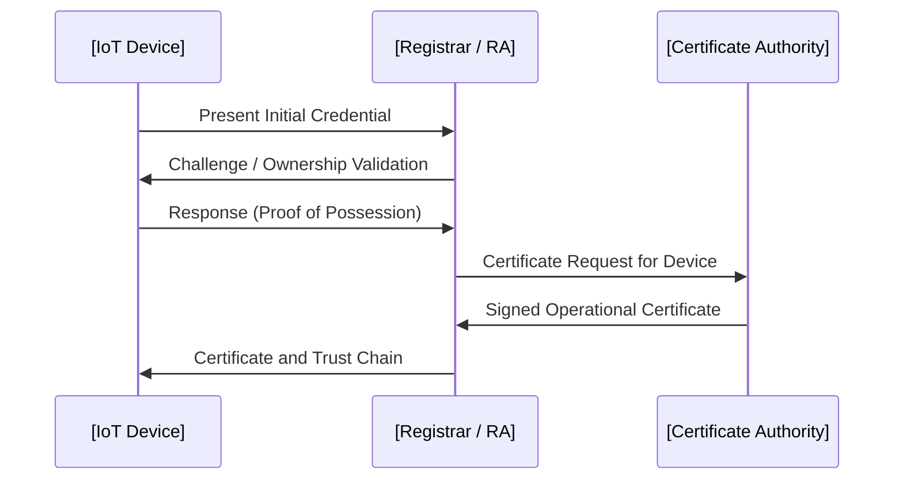
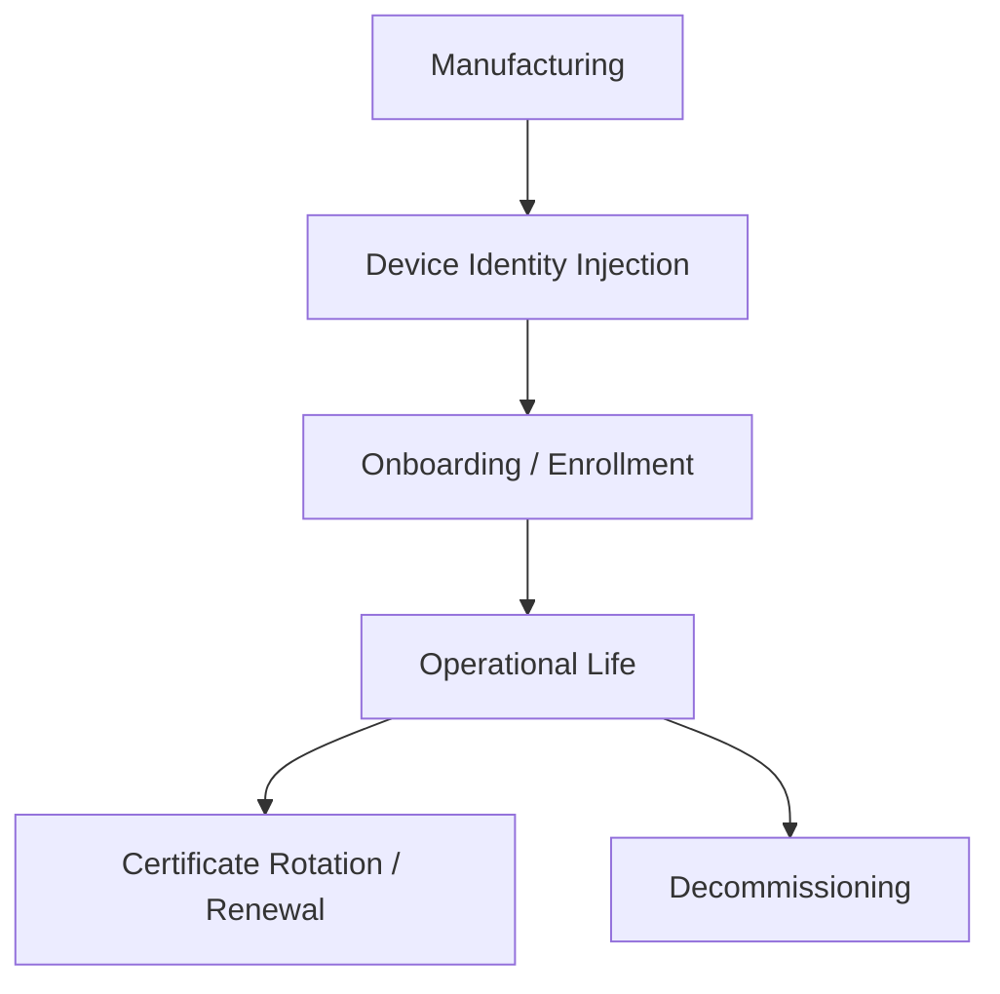

# IoT-specific PKI Architectures

## 1. Introduction

Public Key Infrastructure (PKI) is a fundamental component in securing digital communications, enabling identity management, authentication, confidentiality, and integrity through digital certificates and cryptographic keys. In Internet of Things (IoT) ecosystems, the deployment of PKI architectures introduces unique challenges due to the diversity, scale, and resource constraints of devices, as well as their distinct lifecycle management requirements. An IoT-specific PKI must provide scalable, resilient, and lifecycle-aware identity mechanisms tailored for the onboarding, operation, and decommissioning of billions of heterogeneous endpoints.

---

## 2. Core Concepts and Definitions

### 2.1. PKI in Brief

A PKI comprises:

- **Certificate Authorities (CAs):** Entities that issue and manage certificates binding digital identities to cryptographic key pairs.
- **Registration Authorities (RAs):** Entities that validate identity attributes and authorize certificate issuance.
- **End Entities:** The devices (IoT endpoints), services, users, or applications holding certificates and keys.
- **Repositories:** Storage and distribution points for certificates, CRLs (Certificate Revocation Lists), or OCSP (Online Certificate Status Protocol) responders.

### 2.2. Why IoT Demands a Specific PKI Approach

Unlike traditional enterprise settings, IoT environments often feature:

- **Massive scale:** Up to millions or billions of devices.
- **Device heterogeneity:** Wide variance in capability, security, communication methods, and trustworthiness.
- **Lifecycle volatility:** Devices installed, updated, decommissioned, or rotated at high frequency.
- **Network conditions:** Intermittent, low-bandwidth, or low-trust connectivity.
- **Automation:** Minimal human intervention desired or possible in device management.

---

## 3. Architectural Principles for IoT PKI

### 3.1. PKI Hierarchy Models

Multiple architectural models can be used, each balancing trust, deployment complexity, and scalability:

#### a) Single-tier CA (Flat PKI)

- A single, central CA issues all device certificates. This model is uncommon in large IoT due to operational and risk concentration concerns.

#### b) Hierarchical PKI

- A root CA is kept offline (for trust anchor security) while one or more subordinate CAs issue operational certificates.
- Suitable for segmentation (e.g., by region, line of business, or device type).

#### c) Mesh or Bridge PKI

- Entities in different administrative domains cross-certify each other, enabling federated trust.
- Sometimes needed for multi-vendor, multi-operator deployments.

#### d) Hybrid Models

- Combining hierarchies for internal devices with bridges or meshes for partner or supply chain integration.

```mermaid
flowchart TD
    RootCA[Root CA (offline)]
    SubCA1[Subordinate CA (Region 1)]
    SubCA2[Subordinate CA (Region 2)]
    DeviceA[IoT Device A]
    DeviceB[IoT Device B]

    RootCA --> SubCA1
    RootCA --> SubCA2
    SubCA1 --> DeviceA
    SubCA2 --> DeviceB
```
*Mermaid: Typical Hierarchical PKI for IoT Deployment*

### 3.2. Trust Anchors in IoT

A **trust anchor** is the root from which all trust derives (typically the public key or self-signed certificate of the root CA). In IoT, trust anchors must be:

- **Immutable** (once deployed),
- **Protected from modification** (e.g., via secure elements, TPMs),
- **Pluggable or updatable** (via secure mechanisms) where lifecycle demands (e.g., root CA rollover support).

---

## 4. Device Identity Lifecycle in IoT PKI

### 4.1. Key Phases

The device identity lifecycle encompasses:

1. **Manufacturing and Initial Identity Injection**
2. **Onboarding (Provisioning/Enrollment)**
3. **Operational Phase (Certificate Renewal, Revocation, Rotation)**
4. **Decommissioning**

#### 4.1.1. Manufacturing and Identity Injection

At manufacture or assembly, IoT devices may have:

- **Device Initial Credentials:** Pre-shared keys (PSKs), factory certificates, or unique initial secrets.
- **Device Key Generation:** Keys may be generated in the factory (less preferred) or by the device itself in a secure enclave or TPM (best practice; avoids key transport and loss of secrecy).

#### 4.1.2. Onboarding

PKI-based onboarding involves authenticating the device's initial credentials, establishing ownership and trust, and issuing operational certificates.

**Protocols used:**
- [RFC 7030 EST (Enrollment over Secure Transport)](https://datatracker.ietf.org/doc/html/rfc7030)
- [CMP (Certificate Management Protocol) RA/CA workflows](https://datatracker.ietf.org/doc/html/rfc4210)
- Custom workflows built on EAP-TLS, SCEP, or proprietary APIs


*Mermaid: High-Level Device Onboarding with Operational Certificate Issuance*

#### 4.1.3. Operational: Certificate Renewal, Rotation, and Revocation

Ongoing maintenance of device identity involves:

- **Certificate Renewal:** Essential for long-lived devices; may occur automatically triggered by expiry or proactively by policy.
- **Certificate Rotation:** Triggered by detected key compromise, device ownership handover, or policy change.
- **Revocation:** Misbehaving, compromised, or decommissioned devices must have their certificates revoked.
    - **CRL (Certificate Revocation List):** Batches of revoked certificate serials, periodically published.
    - **OCSP:** Real-time status for individual certificates; challenging for constrained devices due to extra network round trips and privacy implications.

#### 4.1.4. Decommissioning

At end-of-life, device secrets must be securely wiped and operational certificates invalidated. Ideally, decommissioning is a managed process with explicit removal from CA/RA inventories and relevant CRLs.

---

## 5. Technology Components and Integration Points

### 5.1. Certificate Formats

The overwhelming majority of IoT PKI schemes use **X.509 Certificates (ITU-T X.509, RFC 5280)** due to ecosystem and standards interoperability. However:

- Constraints may require DER (binary) instead of PEM (ASCII-armored) representation.
- Minimal X.509 profiles (removing unused fields and extensions).
- Use of custom certificate extensions for device-specific attributes (e.g., device serial, model, vendor).

### 5.2. Key Management in IoT Devices

#### Secure Key Storage Options

- **Simple file system storage:** Vulnerable unless on cryptographically-enabled file systems and protected microcontrollers.
- **Secure Elements (SEs):** Off-CPU hardware chips with cryptographic operation offload and root key protection.
- **Trusted Platform Module (TPM):** Industry specification for secure key and attestation management.
- **TEE/ARM TrustZone:** Isolated execution domains within CPUs.

#### Key Generation Best Practices

- **On-device generation:** Preferred for end-entity keys; never exportable private key.
- **Entropy/data source requirements:** Sufficient, high-quality entropy at manufacturing or onboarding; requires hardware random number generators.

### 5.3. Onboarding and Bootstrapping Methods

- **Pre-loaded Certificates:** Device comes with a factory-issued certificate, used for mutual TLS and enrollment.
- **Zero-touch Boarding:** Device authenticates automatically using manufacturer-installed bootstrap credentials, with minimal to no manual steps.
- **Out-of-band Onboarding:** Device identity is asserted out-of-band (e.g., via QR code scanning, NFC, physical access tokens).

---

## 6. Device Enrollment and Certificate Issuance Workflows

### 6.1. EST (Enrollment over Secure Transport)

**EST** is a certificate enrollment protocol over HTTPS, supporting:

- CSR (Certificate Signing Request) generation and submission.
- Certificate fetching.
- Distribution of trust anchors.

EST provides more robust options than legacy SCEP (Simple Certificate Enrollment Protocol), allowing stronger authentication and more features for modern PKI lifecycle workflows.

### 6.2. CMP (Certificate Management Protocol)

**CMP** (defined in RFC 4210, RFC 9483) supports complex CA/RA relationships and sophisticated message flows:

- Multi-step, authenticated certificate requests.
- Proof-of-possession validation (device proves it holds the private key).
- Certificate revocation and status queries.

### 6.3. Manufacturer Usage Description (MUD)

**MUD files** (RFC 8520) are not PKI protocols but can be referenced as part of the certificate or provisioning process to indicate authorized device behavior, helping automate security posture enforcement upon device introduction.

---

## 7. Typical Workflow: Device Birth to Decommissioning


*Mermaid: IoT Device Identity Lifecycle via PKI*

---

## 8. PKI Architectural Variations and Engineering Decisions

### 8.1. Global versus Domain-local CAs

- **Global (centralized) PKI:** Simplifies trust distribution and discovery. Potentially introduces global risk and scalability bottlenecks.
- **Domain-local (per-site/per-region) subCAs:** Reduces impact of CA compromise, allows local governance, but complicates cross-domain certificate validation and trust anchor distribution.

### 8.2. Offline/Intermittent Connectivity and CRL/OCSP Issues

**CRL Distribution:** CRLs can grow large in high-churn IoT deployments and may strain device storage/bandwidth.

**OCSP:** Real-time, but requires devices to perform additional online queries, which may be infeasible for battery-powered or intermittently connected endpoints.

**Short-lived Certificates:** One solution is to avoid revocation tracking almost entirely by issuing short-lived certificates (hours or days), reducing the window of exposure to key compromise.

### 8.3. Automation, Scale, and Bulk Operations

- **Bulk enrollment protocols:** Required for initial fleet deployment. Support batched CSR submission and certificate retrieval, often via authenticated APIs or supply chain integrations.
- **Hardware Root-of-Trust Registration APIs:** Integration with manufacturer or platform root-of-trust services (e.g., Arm PSA, AWS IoT Just-in-Time Provisioning).

---

## 9. Security Considerations and Pitfalls

### 9.1. Common Engineering Errors

- **Improper key handling:** Key generation off-device or lack of secure storage.
- **Certificate misuse:** Using a single credential across multiple devices (defeats non-repudiation and auditability).
- **Lax onboarding controls:** Failing to authenticate devices before granting operational certificates.
- **Ignoring compromised devices:** Inadequate revocation and lifecycle controls.

### 9.2. Secure Boot Chains

PKI may be integrated directly into secure/trusted boot mechanisms, using signed bootloaders and firmware images verified with root-of-trust public keys set via PKI hierarchy. Reference: Embedded secure boot recommendations (see [NIST SP 800-193](https://csrc.nist.gov/publications/detail/sp/800-193/final)).

### 9.3. Supply Chain Integrity

- **Supply chain attacks:** Manufacturing or supply chain compromise leading to injection of unauthorized keys or firmware. Use of attestation certificates at multiple supply chain stages is recommended.

> **Caution**
>
> Inadequate supply chain validation, or the absence of secure identity injection controls, can result in persistent device compromise and untrustworthy PKI state.

---

## 10. Constraints and Challenges Unique to IoT PKI

### 10.1. Device Resource Limitations

Devices may feature:

- Limited CPU, RAM, and flash storage.
- Inability to store/parse full certificate chains or process large CRLs.
- Lack of real-time clocks for precise certificate validity management.

**Mitigations include:**

- Minimal X.509 profiles.
- Use of compact cryptographic suites (e.g., ECC over RSA).
- Lightweight revocation and renewal strategies.

### 10.2. Privacy, Identifiability, and Anonymity

Care must be taken that certificate attributes do not unnecessarily reveal personal or sensitive device-specific information to external parties, especially in regulated environments (GDPR/CCPA).

---

## 11. PKI Protocol & Standards Overview

| Standard                        | Applies to                 | Summary                                                |
|----------------------------------|----------------------------|--------------------------------------------------------|
| RFC 5280                        | All X.509 certificates     | Profiles and rules for certificate/CRL syntax          |
| RFC 4210, RFC 9483              | CMP                        | Certificate management protocol workflows              |
| RFC 7030                        | EST                        | Enrollment over Secure Transport via HTTPS             |
| RFC 5272, RFC 8894              | SCEP                       | Simple, legacy certificate enrollment (limited IoT use)|
| RFC 6960                        | OCSP                       | Online Certificate Status Protocol                     |
| NIST SP 800-193                  | Secure Boot, device attestation| Cryptographic boot and firmware validation       |
| IEEE 802.1AR                    | Secure Device Identity     | DevID/Initial device certificates                      |
| RFC 8520                        | Manufacturer Usage Description| Secure profile provisioning                       |

---

## 12. Example: Certificate Profile for IoT Devices

A typical device certificate (X.509) SHOULD:

- Have a unique subject and serial number.
- Include issuer and validity fields.
- Use Minimum-size keys (EC 256 bits or RSA 2048 as minimums; ECC preferred).
- Contain a **Subject Alternative Name (SAN)** extension with device serial, model, and possibly optional device attributes.
- Omit unnecessary X.509 extensions.

```plaintext
Subject: CN=device12345, O=Vendor, C=US
Issuer: CN=IoT Sub CA, O=Vendor, C=US
Subject Alternative Name: URI:urn:dev:ops:serial=12345
Key Usage: Digital Signature, Key Encipherment
Basic Constraints: End Entity
Extended Key Usage: Client Authentication, Server Authentication
```

---

## 13. Integration Patterns

### 13.1. Edge Gateway PKI Termination

Where devices cannot support full TLS or certificate handling, **edge gateways** may terminate PKI sessions, authenticating devices via lightweight means (e.g., PSK, DTLS) and mapping to a backend PKI identity for upstream security.


*Mermaid: Gateway-mediated PKI Model for Constrained Devices*

### 13.2. Direct-to-Cloud PKI Workflows

Where device capabilities permit:

- Device establishes direct mutual TLS to cloud endpoint.
- Maintains periodic renewal with CA.
- No gateway or proxy required.

> **Tip**
>
> Favor direct-to-cloud PKI if device capabilities and network perimeter controls are sufficient, as it reduces intermediate trust boundaries and operational dependencies.

---

## 14. Managing CA and PKI Infrastructure at Scale

### 14.1. Secure CA Operations

- Root CA: **Offline, highly protected, minimal use.**  
- Subordinate CAs: **Online, operational, well armored.**  
- CA key operations: **Use hardware security modules (HSMs).**

### 14.2. Certificate Transparency and Auditing

Maintaining a verifiable record of all issued certificates is critical for both audit and supply chain provenance. Certificate transparency logs (RFC 6962) can be adapted for IoT, even if local/private to enterprise.

### 14.3. Multi-tenancy and Scalability

- Partition CAs by tenant, product line, or region to limit blast radius of compromise and facilitate delegated management.

---

## 15. Lifecycle Automation and DevSecOps Integration

- **APIs for onboarding, certificate request, status, and revocation.**
- **Infrastructure-as-code support for PKI instantiation and CA configuration.**
- **Integration with device provisioning/orchestration (e.g., through Platform APIs, edge orchestration tools, cloud service provider hooks).**
- **Monitoring of certificate validity, expiry, and revocation in SIEM/monitoring platforms for security posture awareness.**

---

## 16. Future Directions

- **Post-quantum cryptography:** Anticipate new standards for quantum-resistant certificates and key exchange, driven by NIST and IETF.
- **Automated certificate management protocols:** Continued evolution of ACME for IoT (RFC 8555, with IoT extensions in draft).
- **Integration with device attestation frameworks** such as DICE, FIDO Device Onboarding, and TPM 2.0-based attestation.

---

## 17. Summary

IoT-specific PKI architectures address the unique requirements and constraints posed by vast, heterogeneous device populations and long device lifecycles. Secure, scalable, and robust PKI integration is fundamental to establishing persistent device identities, supporting strong cryptographic authentication, and maintaining trust in evolving, dynamic IoT deployments.

Key engineering priorities:

- **Hierarchical, well-segmented PKI architectures with robust root key protection and well-designed CA hierarchies.**
- **Automated lifecycle management for device identity from manufacturing through decommissioning.**
- **Tailored certificate profiles, protocols, and workflows to match device and deployment constraints.**
- **Clear integration points and automation to support massive scale and diversity with minimal human touch.**

A well-engineered IoT PKI underpins device, user, and service identities in modern cyber-physical systems, enabling secure onboarding, resilient operations, and defensible lifecycle management at industry scale.