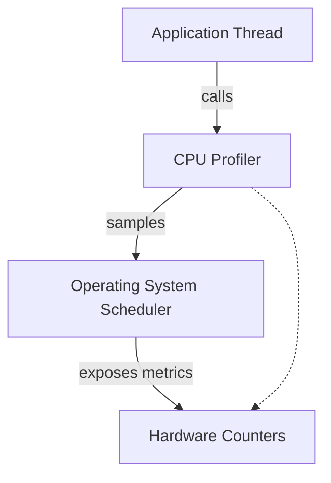
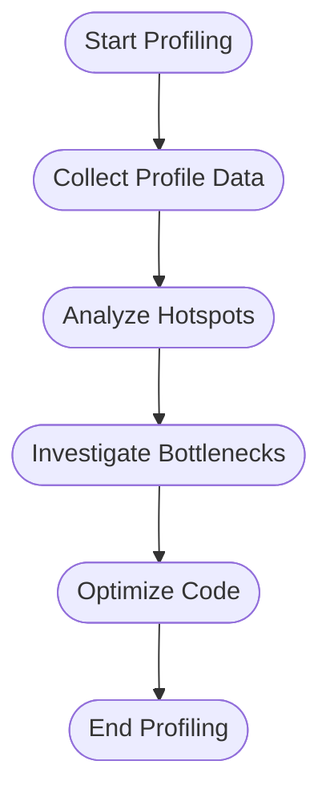
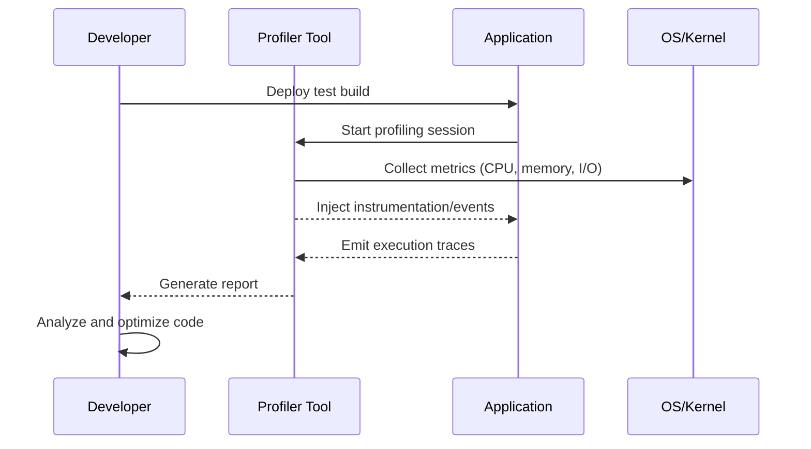

# Performance Profiling Fundamentals

## 1. Introduction

Performance profiling is the systematic process of measuring and analyzing the behavior of software systems to identify opportunities for optimization, efficiency improvements, and resource management. By examining runtime metrics such as CPU usage, memory allocation, and I/O activity, engineers can diagnose bottlenecks and inefficiencies that impede system performance and scalability.

Profiling is distinct from general performance monitoring. While monitoring refers to ongoing observation and alerting for system-level anomalies, profiling employs specialized tools and methods to capture fine-grained details of code execution, resource consumption, and system interactions, usually under controlled or repeatable conditions.

Performance profiling is an integral practice in software engineering, informing refactoring, debugging, architectural decisions, and validation against Service Level Objectives (SLOs). It is indispensable in environments where performance is a key quality attribute, including real-time systems, large-scale distributed applications, databases, high-throughput services, and embedded platforms.

## 2. Core Concepts

### 2.1 Profiling Metrics

Profiling investigates multiple facets of system performance:

- **CPU Utilization:** Instruction execution time, thread activity, context switches, cache hits/misses, CPU-bound code sections.
- **Memory Usage:** Allocation patterns, heap/stack usage, garbage collection, memory leaks, fragmentation.
- **I/O Performance:** Disk and network throughput, latency, syscall counts, I/O wait times, buffer management.
- **Concurrency/Threading:** Lock contention, thread pool utilization, race conditions, deadlock risks.
- **Call Graphs:** Dynamic call stack snapshots to identify execution paths and time spent in different functions.

### 2.2 Types of Profilers

Profilers can be categorized according to their methods of data collection and the granularity of their outputs:

- **Sampling Profilers:** Periodically sample the program's execution state, providing a statistical approximation of where time is spent.
- **Instrumentation Profilers:** Inject hooks or code to explicitly record entry and exit of functions, resource accesses, or events—yielding precise but sometimes intrusive measurements.
- **Event-Based Profilers:** Trace system or application-level events (e.g., garbage collection, syscall tracing) to correlate resource usage with specific actions.
- **Hardware-Assisted Profilers:** Leverage processor features, such as Performance Monitoring Counters (PMCs), to access hardware metrics (cache misses, branch mispredictions, etc.).

### 2.3 Architectural Context

Modern software often runs atop multilayered stacks. Effective profiling must account for:

- **User-level application code**
- **Runtime environments** (e.g., JVM, CLR, managed runtimes)
- **Operating system services** (process scheduling, kernel I/O, memory management)
- **Hardware** (CPU, memory hierarchies, network interfaces, storage devices)

Profiling tools and techniques target different layers and must be selected and calibrated appropriately for the architecture under analysis.

## 3. Profiling Workflow

### 3.1 Preparation

#### 3.1.1 Define Objectives

Before profiling, engineers must articulate their goals:

- What performance problem is being investigated?
- Are there specific SLOs or benchmarks to validate?
- Which workload(s) and scenarios are representative and reproducible?

#### 3.1.2 Instrumentation and Tool Selection

Select profiling tools based on language, architecture, and the target profile:

| Technology   | Typical Profilers           | Notes                                      |
|--------------|----------------------------|---------------------------------------------|
| Native (C/C++) | gprof, perf, VTune, Valgrind | OS/hardware sensitive, wide metric range    |
| JVM (Java/Kotlin) | VisualVM, JProfiler, async-profiler | Integrates with JVM events, allocation info |
| .NET (C#/F#) | dotTrace, Visual Studio Profiler, PerfView | Integration with CLR, threading insights    |
| Python       | cProfile, Py-Spy, pyinstrument | Sampling and tracing, interpreter aware     |
| Node.js      | Clinic.js, 0x, built-in inspector | V8 engine hooks, event loop details         |

Many OSs (Linux, Windows, macOS) provide system-level profilers (e.g., `perf`, DTrace, ETW).

#### 3.1.3 Environment Setup

Profiling is most accurate when performed under conditions that closely mimic production:

- Use representative data sets and workloads.
- Isolate external sources of noise (background processes, network jitter).
- Validate instrumentation overhead does not mask or distort results.

> [!caution]
> Instrumentation, especially intrusive profiling, can distort application behavior. Sampling profilers minimize this impact, but always verify that observed behavior remains representative of uninstrumented execution.

### 3.2 Data Collection

Profiling can be performed interactively (on-demand), continuously (background), or on postmortem snapshots (core dumps, logs). A typical profiling session captures:

#### 3.2.1 CPU Profiling

Collects call stacks, CPU time per function, and thread usage. Examples:

- **Flat profiles:** Aggregate time spent in each function (exclusive, inclusive).
- **Call graph profiles:** Hierarchical breakdown of caller-callee relations.
- **Hot paths:** Execution paths accounting for the majority of CPU time.



#### 3.2.2 Memory Profiling

Examines allocations, retention, and garbage collection:

- **Heap snapshots:** Structure and size of objects in memory at a given point.
- **Allocation sampling:** Frequency and source location of allocations.
- **Leak detection:** Growth in object counts or retained memory over time.

#### 3.2.3 I/O Profiling

Monitors file/network operations, buffer usage, and syscalls:

- **Throughput and bandwidth metrics**
- **Latency histograms**
- **Event timelines:** Correlate I/O events with application behavior

> [!tip]
> For distributed systems, correlate application-level profiling with system-wide tracing frameworks (e.g., OpenTelemetry) to diagnose cross-service latency and bottlenecks.

### 3.3 Analysis

#### 3.3.1 Identifying Bottlenecks

Determine which parts of the codebase are most resource-intensive using visualizations such as flame graphs, call trees, or heat maps.



#### 3.3.2 Validation

Profile after each round of optimization to confirm impact and detect regressions.

### 3.4 Post-Processing

Persist and archive profiling data to support:

- Baseline comparisons across releases
- Regression detection
- Compliance reporting (especially in regulated environments)

> [!note]
> Where possible, automate profiling within CI/CD pipelines to catch performance regressions before deployment.

## 4. Profiling Techniques in Practice

### 4.1 CPU Profiling Techniques

#### 4.1.1 Sampling vs. Instrumentation

- **Sampling:** Low-overhead; provides probabilistic insight by periodically capturing program counter and call stacks.
    - Example: `perf record`, `Linux Perf`, `py-spy`.
- **Instrumentation:** Can be precise but adds overhead by recording entry/exit of every targeted function.
    - Example: `gprof`, JVM `-Xprof`, .NET method enter/leave hooks.

#### 4.1.2 Synchronous vs. Asynchronous Profilers

- **Synchronous:** Collect metrics as the program executes specific code paths.
- **Asynchronous:** Interrupt execution at intervals or upon hardware events, reducing bias.

#### 4.1.3 Interpreting Call Graphs and Flame Graphs

Flame graphs visually aggregate stack traces by width (time spent):

```mermaid
flowchart TD
    A[main()]
    B[parseConfig()]
    C[runWorkload()]
    D[fetchData()]
    E[processData()]
    F[writeResults()]
    A --> B
    A --> C
    C --> D
    C --> E
    E --> F
```
*Note: For an actual flame graph, a specialized rendering tool or interactive SVG is used. Mermaid provides only a simple call graph illustration.*

### 4.2 Memory Profiling Techniques

#### 4.2.1 Heap Profiling

- Capture object allocation sites (function, file, line).
- Analyze object retention and growth patterns.
- Compare heap composition before and after workloads.
- Use tools such as `valgrind --tool=massif`, JVM heap dumps, .NET CLR Profiler.

#### 4.2.2 Leak Detection

- Monitor unreleased memory across runs.
- Identify cyclic or unexpected references keeping memory alive.
- Traceback to allocation source.

#### 4.2.3 Garbage Collection Analysis

- Analyze pause times, frequency, promoted/tenured objects.
- Tune GC settings (heap size, frequency) for improved performance.
- Monitor GC overhead relative to application work.

### 4.3 I/O Profiling Techniques

#### 4.3.1 File I/O Profiling

- Trace file open/close, read/write operations.
- Identify blocking calls and excess serialization/deserialization.
- Tools: `strace`, `lsof`, DTrace, built-in profiler integrations.

#### 4.3.2 Network Profiling

- Analyze socket activity (open/close, latency, throughput).
- Instrument protocol-specific interactions (HTTP, gRPC, RPC frameworks).
- Detect N+1 query patterns and unnecessary serialization.
- Tools: `tcpdump`, Wireshark for packet-level, `netstat` for state summary.

#### 4.3.3 Asynchronous I/O

- Trace event loop or reactor pattern behavior.
- Track queueing delays, buffer overflows, and callback timings.
- Monitor completion events to detect head-of-line blocking or thread starvation.

## 5. Practical Engineering Considerations

### 5.1 Integration with Development Workflow

- **Profiling Early:** Integrate basic profiling in unit and integration testing.
- **Continuous Profiling:** Employ lightweight profilers in production for baseline comparison (e.g., `Pyroscope`, `Parca`).
- **Controlled Experiments:** Use Canary or Blue/Green environments for high-impact changes.
- **Performance Budgets:** Define and enforce performance budgets (per request, memory, resource limits) as acceptance criteria.

### 5.2 Profiling Overhead and Distortion

- Sampling reduces overhead but may miss short-lived events.
- Instrumentation provides detail but can introduce significant slowdowns (Heisenberg effect).
- System instrumentation (e.g., kernel tracing) may require elevated privileges.

> [!warning]
> Excessive or poorly-configured profiling in production can introduce latency, security risk, or instability. Limit scope and data capture, and review tool security posture.

### 5.3 Security and Privacy

- Carefully manage sensitive data exposed through profiling (e.g., memory dumps, stack traces with secrets).
- Anonymize or redact dumps in controlled environments.
- Avoid leaking implementation logic or data in distributed crash dumps.

### 5.4 Constraints and Limitations

- **Language Runtime/Ecosystem Constraints:** Dynamic languages (Python, Ruby) may add profiling overhead in interpreters.
- **Platform-Specific Access:** Some hardware counters require root/admin privilege.
- **VM and Containerization:** Isolate profiling to target container/workload; ensure profiling tools support containerized/PaaS environments.

### 5.5 Advanced Topics

#### 5.5.1 Hardware Performance Counters (PMCs)

- Provide low-level metrics (cache misses, branch misses, pipeline stalls).
- Example: Intel VTune, Linux `perf stat`.
- Facilitate micro-optimizations, fine-grained hotspot analysis.

#### 5.5.2 System Tracing

- Generalized tracing (Linux `ftrace`, `bpftrace`, Windows ETW)
- Correlate across kernel, userspace, network, and storage layers.
- Employ for root-cause analysis in high-complexity or distributed systems.

#### 5.5.3 Profiling in Distributed Systems

- Distributed tracing (OpenTelemetry, Zipkin, Jaeger) enables correlation across service boundaries.
- Flame graphs extended across hosts/services.
- End-to-end latency and resource profiling reveals gaps missed by host-local profiling only.

## 6. Profiling Example: End-to-End Flow



## 7. Common Pitfalls

- **Profiling Non-Representative Workloads:** Leads to misleading optimization.
- **Ignoring Measurement Overhead:** Skews metrics and may hide bottlenecks.
- **Micro-Optimizing Unimportant Code:** Wasting time on non-critical paths.
- **Overlooking Multithreading Issues:** Focusing on single-thread performance in highly concurrent systems.
- **Neglecting End-to-End Latency:** Failing to correlate with user-perceived performance.

## 8. Standards, Protocols, and Formats

- **Performance Tools APIs:** PAPI (Performance API), Perfetto (Google), Windows ETW.
- **Trace/Telemetry Standards:** OpenTelemetry (distributed tracing), Trace Event Format (Chromium, Perfetto).
- **Language/Platform Profiling APIs:** JVMTI (Java Virtual Machine Tool Interface), .NET Diagnostic APIs, Linux perf events.
- **Process and Data Formats:** ELF/DWARF (for stack unwinding, symbols), pprof (Google Go), JFR (Java Flight Recorder).

## 9. Summary

Performance profiling is a disciplined, essential aspect of high-quality software engineering, enabling data-driven optimization and reliability. Mastery of CPU, memory, and I/O profiling accelerates diagnosis of bottlenecks and assures systems can scale to meet demanding workloads. Effective use of profiling integrates tool selection, methodical data collection, robust analysis, and iterative validation within the engineering lifecycle. By accounting for technical, organizational, and operational constraints, engineers can ensure their profiling efforts deliver both actionable insights and practical improvements.

