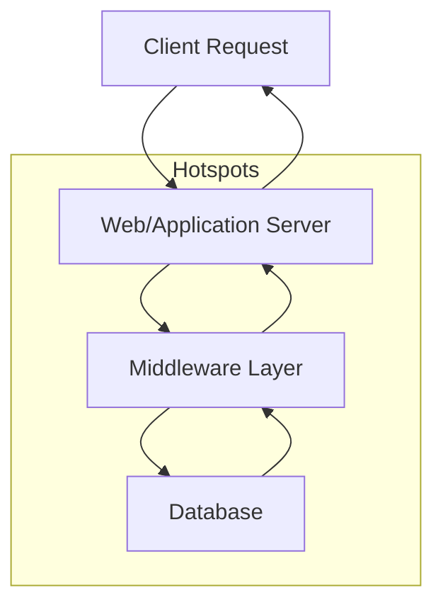
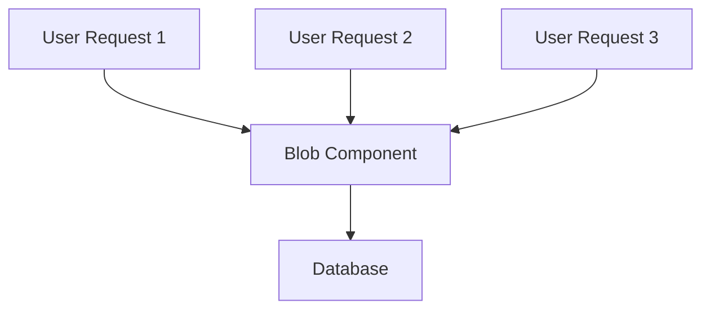
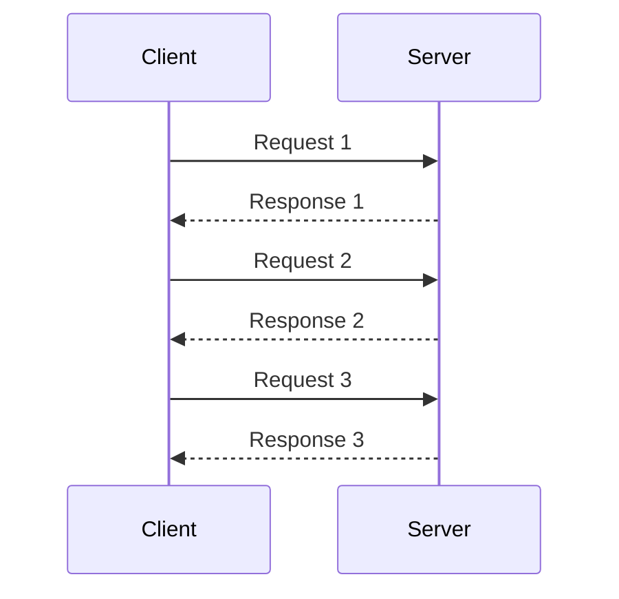
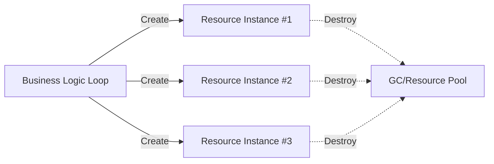
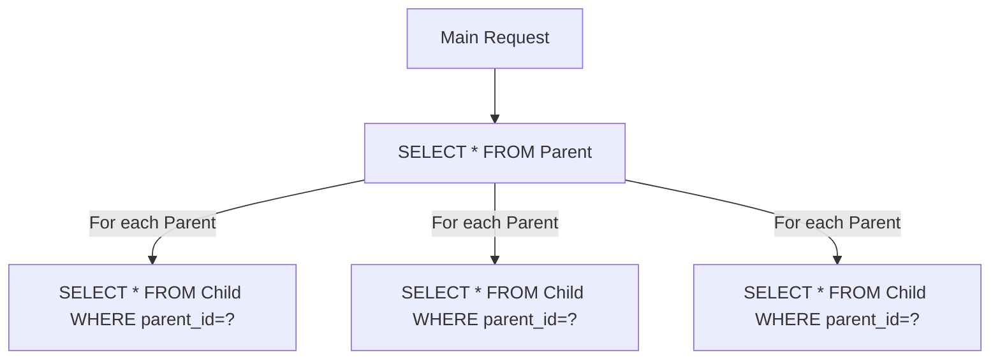
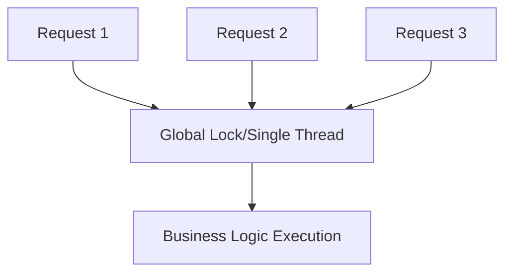
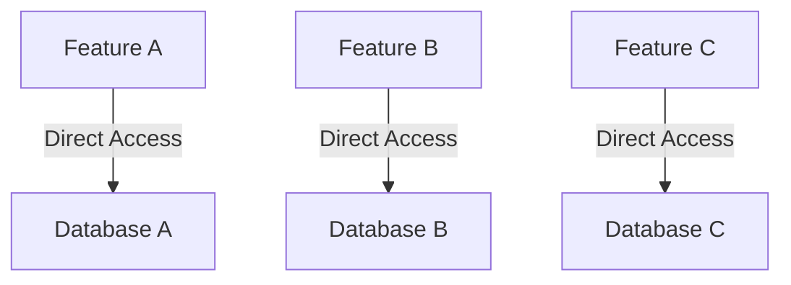
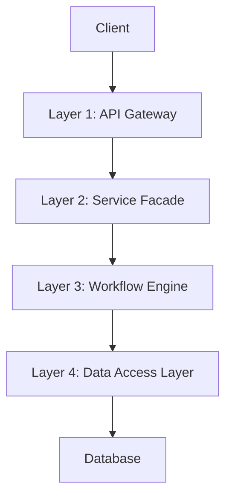
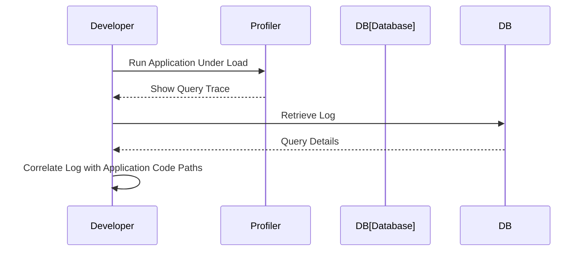

# Performance Anti-patterns: An Engineering Overview

## Introduction

Performance anti-patterns are recurring software design or implementation choices that systematically degrade system throughput, increase latency, or reduce resource efficiency. Unlike typical bugs that directly cause system malfunction, anti-patterns generally allow a system to function, but with suboptimal or deteriorating performance characteristics, often under load or scale.

This overview addresses common software performance anti-patterns in the context of software engineering and systems architecture. It focuses on scenarios, detection methods, and practical implications, presuming familiarity with software development, basic computer architecture, and systems integration.

---

## Defining Performance Anti-patterns

Performance anti-patterns are recognizable practices or structural choices in code, configuration, or system design that, while superficially functional, introduce persistent performance bottlenecks or scalability issues. They may exist at any level: code, application, middleware, or infrastructure.

A performance anti-pattern differs from a design anti-pattern in that its outcome is specifically detrimental to observable, quantifiable aspects of system performance, such as:

- **Throughput**: The amount of work performed in a unit of time.
- **Latency**: The time taken to respond to a request.
- **Resource Use**: Efficiency of CPU, memory, I/O, and network usage.

Well-known in both literature and practice, performance anti-patterns serve as warnings and teaching points for engineers aiming to build scalable, efficient software.

---

## System Context: Where Performance Anti-patterns Occur

Performance anti-patterns can emerge in any software system. Their impact often becomes significant at larger scale, higher concurrency, or under increased system stress.

### Common Layers Affected

- **Application Logic**
- **Data Access Layer**
- **Network Integration**
- **Concurrency Control**
- **System Configuration**

### System Call Flow with Potential for Anti-patterns

*Potential anti-pattern hotspots are present in each major block.*

---

## Core Concepts and Classification

Performance anti-patterns arise from:

- **Misplaced assumptions about load or usage patterns.**
- **Over-generalization through abstraction, leading to unnecessary overhead.**
- **Overengineering or underengineering for peak demands.**
- **Shortcuts in implementation, trading correctness for expedience without considering long-term effects.**

They can be categorized by their locus:

1. **Algorithmic Anti-patterns**: Poor choices in algorithm or data structure.
2. **Architectural Anti-patterns**: System organization problems.
3. **Concurrency/Scalability Anti-patterns**: Mismanagement of parallelism, contention, or resource synchronization.
4. **Resource Management Anti-patterns**: Inefficient allocation/release of system resources.
5. **Integration Anti-patterns**: Faulty design of inter-component communication.

---

## Notable Performance Anti-patterns

Below are several well-established performance anti-patterns. For each, the description includes detection strategies, effects, and mitigation guidance.

### 1. The Blob (God Object)

**Definition**: A single class or component aggregates too many responsibilities or data management duties, leading to excessive centralization.

**Consequences**:
- All performance-affecting logic channels through the Blob, causing an inherent bottleneck.
- Difficulty in scaling, parallelization, and maintainability.

**Mermaid Diagram — Blob Anti-pattern**

**Detection**:
- High CPU or lock contention rates centered on a single class/component.
- Profiling shows one class dominates execution time.

**Mitigation**:
- Refactor to distribute responsibility using established principles (e.g., Single Responsibility Principle, microservices, or helpers).

---

### 2. Chatty Interface (Excessive Communication)

**Definition**: A system or module requires many fine-grained interactions to complete a single operation.

**Consequences**:
- Increased latency due to round-trip times (RTT).
- Elevated risk for cascading bottlenecks under load.

**Mermaid Diagram — Chatty Interface**

**Detection**:
- Profiling shows repeated cross-network or cross-thread calls for composite operations.
- Poor cache effectiveness.

**Mitigation**:
- Employ coarse-grained APIs (bulk access patterns, batching).
- Use data aggregation.

---

### 3. Unnecessary Object/Resource Creation

**Definition**: Repeatedly allocating and destroying objects or resources, even when they could be reused.

**Consequences**:
- Increased garbage collection (in managed languages) or resource churn.
- CPU cycles wasted on allocation, often visible as high memory pressure.

**Mermaid Diagram — Resource Creation Churn**

**Detection**:
- Profiling shows allocation and deallocation are dominant.
- High GC or destructor activity.

**Mitigation**:
- Resource or object pooling.
- Minimize scope of allocations.

---

### 4. The N+1 Query Problem

**Definition**: An operation that, instead of performing a single query, inadvertently issues one query to retrieve an object and additional queries for each related object.

**Consequences**:
- Drastically increased number of database round-trips.
- Latency grows with dataset size.

**Mermaid Diagram — N+1 Query**

**Detection**:
- Database query logs reveal explosion in query count for typical page/request.
- Application profiling correlates latency with the number of entities.

**Mitigation**:
- Use join or batch queries.
- Employ object-relational mapper (ORM) eager loading strategies.

---

### 5. Fear of Concurrency

**Definition**: Avoiding concurrency altogether (even when safe and efficient concurrency models are feasible), often using global locks or single threads.

**Consequences**:
- Under-utilization of available resources.
- Scalability bottleneck.

**Mermaid Diagram — Fear of Concurrency**

**Detection**:
- High wait time for task execution, but low resource utilization (CPU, RAM).
- Thread dumps show serialization of otherwise independent requests.

**Mitigation**:
- Analyze and implement safe concurrency constructs (thread pools, lock partitioning).
- Use concurrent data structures.

---

### 6. Stovepipe System

**Definition**: Vertical partitioning of system features with little or no shared platform components, leading to duplication and inefficient resource utilization.

**Consequences**:
- Redundant workloads.
- Poor scalability and missed opportunities for cache/reuse.

**Mermaid Diagram — Stovepipe System**

**Detection**:
- Multiple subsystems exhibit similar load but operate independently.
- Minimal shared service/components.

**Mitigation**:
- Refactor to shared platforms, libraries, and services.

---

### 7. Golden Hammer

**Definition**: Applying a familiar technology/tool regardless of context; substituting a general solution for a tailored one.

**Consequences**:
- Use of inappropriately heavyweight frameworks for lightweight tasks (e.g., using relational databases for simple key-value storage).
- System inefficiency.

**Detection**:
- Over-engineered solutions for simple requirements.
- Application stack includes unnecessary components for the task.

**Mitigation**:
- Evaluate requirements against options objectively.
- Use fit-for-purpose tools and frameworks.

---

### 8. Excessive Layering/Over-Abstraction

**Definition**: Imposing unnecessary abstractions or architectural layers, each adding indirection, data transformation, and call overhead.

**Consequences**:
- Latency due to call-stack depth.
- Increased cognitive load and difficulty in profiling.

**Mermaid Diagram — Over-Abstraction Layering**

**Detection**:
- Performance analysis shows substantial time lost to framework/middleware code.
- Call stacks in trace or profile show deep stacking.

**Mitigation**:
- Simplify design; collapse unnecessary layers.
- Review abstraction benefits against cost.

---

## Detection and Analysis

Effective detection of performance anti-patterns involves several techniques:

- **Profiling**: Use CPU, memory, and I/O profilers to highlight inefficiencies.
- **Application Tracing**: Record and trace request execution paths.
- **Monitoring and Logging**: Collect metrics for request durations, resource usage, and error rates.
- **Load Testing**: Reveal bottlenecks that only emerge under load.
- **Static Analysis**: Identify architectural anti-patterns during code review.

**Example Workflow: Detecting N+1 Query**

---

## Practical Considerations

### Integration Points

Performance anti-patterns often go undetected at subsystem or module boundaries—between application and database, across network calls, or within orchestration/service mesh layers.

- **Critical integration points** should be subject to in-depth scrutiny during design and review.
- **Automated tests** may need to simulate realistic data volumes and concurrency.

### Constraints and Assumptions

- Some anti-patterns only cause observable issues at scale or with particular usage patterns.
- Premature optimization may itself create anti-patterns (e.g., using complex pooling before profiling proves necessity).

### Engineering Decisions

- **Tradeoffs**: Some designs prioritize correctness or maintainability over absolute performance; awareness of anti-pattern risks helps inform engineering tradeoffs.
- **Iterative Refinement**: Not all code needs to be optimized preemptively; however, recurring performance degradations must be tackled methodically.

---

## Key Engineering Takeaways

> :warning: **Caution**
>
> Relying on intuition or generic best practices may not expose latent performance anti-patterns—empirical measurement and profiling are essential.

- Recognize and avoid common anti-patterns through proactive code and architecture review.
- Use profiling and load testing early and often to reveal candidates for refactoring.
- Architect systems with an eye toward expected usage and future scale.

---

## Summary Table: Anti-patterns at a Glance

| Anti-pattern                 | Manifestation                        | Key Symptoms                | Typical Fix                  |
|------------------------------|--------------------------------------|-----------------------------|------------------------------|
| Blob                         | Centralized "god" class/component    | Hotspot in profiling        | Refactor, distribute duties  |
| Chatty Interface             | Excessive cross-system calls         | High RTT, many round-trips  | Batch, aggregate, coarsen    |
| Unnecessary Creation         | Frequent object/resource allocation  | High GC, churn              | Reuse/pool resources         |
| N+1 Query Problem            | Exploding database query counts      | Latency, db load            | Join/batch queries           |
| Fear of Concurrency          | All requests serialized              | Low CPU usage               | Use concurrency primitives   |
| Stovepipe System             | Duplication of workloads             | Redundant subsystems        | Platformization, sharing     |
| Golden Hammer                | Wrong tool for problem               | Complexity > need           | Fit-for-purpose tools        |
| Over-abstraction             | Deep layering                        | High call-stack overhead    | Collapse layers where possible |

---

## Conclusion

Performance anti-patterns represent predictable, avoidable mistakes in system design and implementation that degrade software performance. Awareness, detection, and measured remediation of these anti-patterns are vital for delivering scalable and efficient systems. Adopting a disciplined approach combining profiling, code review, and system design best practices ensures that performance remains a first-class engineering concern throughout the software development lifecycle.