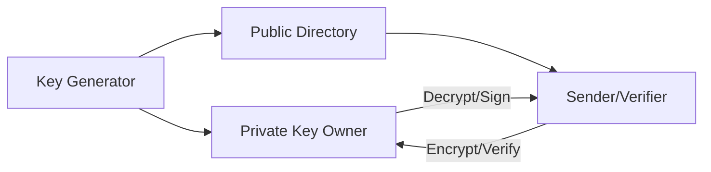
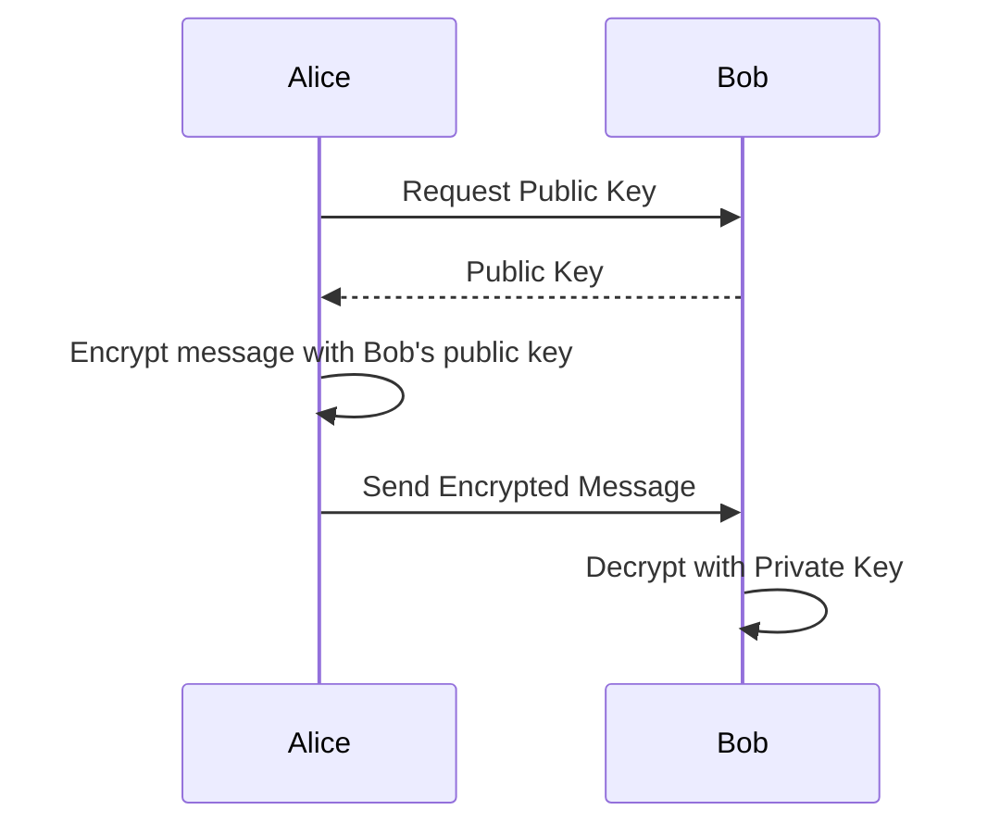
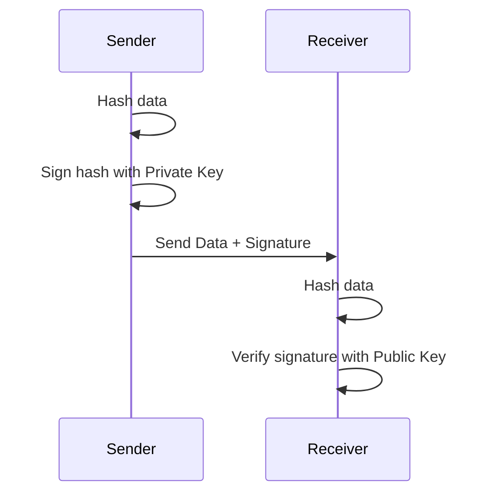
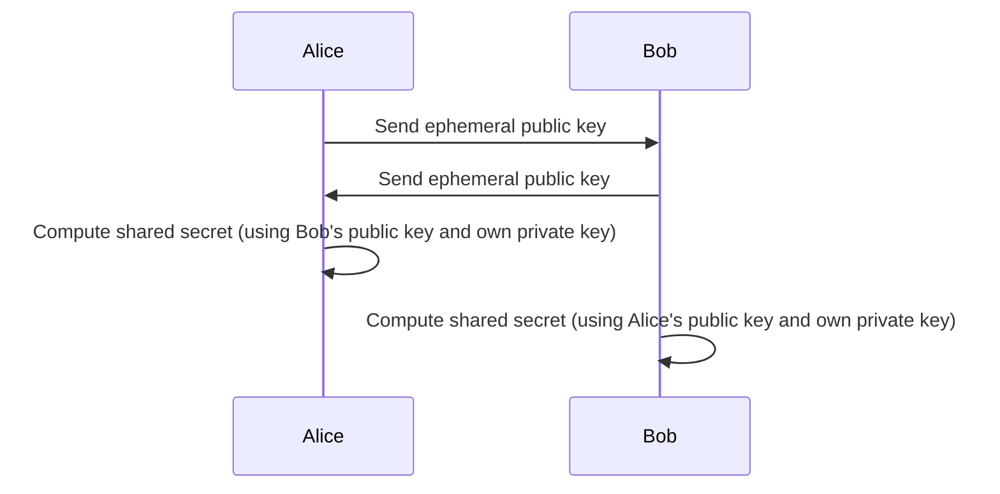
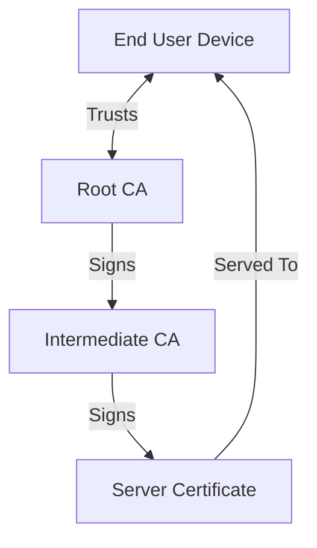

# Asymmetric Cryptography: A Technical Primer

## Introduction

Asymmetric cryptography, often referred to as *public-key cryptography*, constitutes the mathematical and operational foundation for many modern security protocols. Unlike symmetric key algorithms that require both communicating parties to pre-share a secret key, asymmetric cryptography uses mathematically related key pairs—one public and one private—to enable secure communication, digital signatures, key exchange, and authentication. This approach underpins technologies such as digital certificates, secure email, encrypted communications (TLS/SSL), and cryptocurrencies.

## Core Concepts

### Key Pairs: Public and Private Keys

At the heart of asymmetric cryptography is the concept of the key pair:

- **Public key:** A key that may be distributed widely. Used to encrypt data or verify digital signatures.
- **Private key:** A key known only to the owner. Used to decrypt data or generate digital signatures.

Mathematically, operations performed with one key can only be *reversed* by the corresponding other key. The *trapdoor one-way function* principle enables public disclosure of one key without compromising the secrecy of the other.

### Security Assumptions

Asymmetric cryptography relies on hard mathematical problems for its security:

- **Integer factorization (e.g., RSA)**
- **Discrete logarithm (e.g., DSA, ECDSA)**
- **Elliptic curve cryptography (ECC) problems**

The infeasibility of efficiently solving these problems for adequately chosen key sizes ensures the strength of these cryptosystems.

### Main Use Cases

- **Encryption & Decryption:** Only the private key holder can decrypt data encrypted with the corresponding public key.
- **Digital Signatures:** Proving data origin and integrity; digital signatures verify that data was signed using the private key.
- **Key Exchange:** Securely establish a shared symmetric key over an untrusted channel (e.g., Diffie-Hellman).

## High-Level Architecture

Below is a diagram illustrating typical interactions in an asymmetric cryptography system, including key generation, distribution, and operations:



- **Key Generator:** Entity or process responsible for generating key pairs.
- **Private Key Owner:** The user or service that holds the private key securely.
- **Public Directory:** Place where public keys are published (e.g., certificate authorities or public key servers).
- **Sender/Verifier:** Entity that uses the public key to encrypt messages or verify signatures.

## Asymmetric Operations in Practice

### Encryption and Decryption

#### Basic Workflow

Suppose Alice wants to send Bob a confidential message:

1. Bob generates a key pair (public and private).
2. Bob makes his public key available.
3. Alice encrypts her message using Bob’s public key.
4. Bob decrypts the received message using his private key.



#### Engineering Considerations

- **Performance:** Asymmetric encryption is computationally intensive; typically, only small pieces of data (e.g., symmetric session keys) are encrypted directly. Bulk data is encrypted with symmetric algorithms, and the key is exchanged asymmetrically (hybrid encryption).
- **Padding and OAEP:** Secure encryption requires proper padding schemes (e.g., OAEP for RSA, as specified in PKCS #1).

> :warning: **Caution:** Implementations must strictly follow standardized padding and encoding schemes to avoid vulnerabilities such as chosen ciphertext attacks.

### Digital Signatures

A digital signature provides proof of data origin and integrity. The process typically follows:

1. Data is hashed to produce a fixed-length digest.
2. The hash is signed with the sender's private key.
3. The recipient verifies the signature using the sender’s public key.

Applications include code signing, email signatures, and blockchain transactions.



#### Engineering Considerations

- **Hash Function Choice:** Use strong, collision-resistant hash functions (e.g., SHA-256).
- **Signature Format:** Adhere to standards like PKCS #1 (RSA), FIPS 186-4 (DSA, ECDSA), or RFC 7515 (JSON Web Signature).

> :bulb: **Tip:** Never sign data directly; always sign a well-defined hash of the data to avoid cross-protocol attacks.

### Key Exchange

Securely negotiating a shared symmetric session key over an insecure channel is a fundamental task in cryptographic protocols.

#### Diffie-Hellman Key Exchange

The classic Diffie-Hellman algorithm allows two parties to derive a shared secret without prior arrangement. For increased security and efficiency, Elliptic Curve Diffie-Hellman (ECDH) is commonly used in modern systems.



Both parties arrive at the same symmetric secret independently.

> :warning: **Caution:** Use ephemeral (temporary) keys and authenticated exchanges (e.g., via signatures or certificates) to prevent man-in-the-middle attacks.

## Common Algorithms and Standards

### RSA

- **Security Basis:** Integer factorization
- **Operations:** Key generation, encryption/decryption, digital signatures
- **Standardization:** PKCS #1 (RFC 8017), FIPS 186-4

### DSA (Digital Signature Algorithm)

- **Security Basis:** Discrete logarithm problem in finite fields
- **Operations:** Digital signature generation/verification only
- **Standardization:** FIPS 186-4

### Elliptic Curve Cryptography (ECC)

- **Security Basis:** Elliptic curve discrete logarithm problem
- **Operations:** ECDSA (signatures), ECDH (key exchange), ECIES (encryption)
- **Advantages:** Strong security with shorter keys, improved performance
- **Standardization:** SEC1, FIPS 186-4, RFC 4492 (ECC in TLS)

### Other Notable Cryptosystems

- **ElGamal:** Theoretical basis for several modern schemes; not widely used standalone.
- **EdDSA (Edwards-curve Digital Signature Algorithm):** Modern variant of ECC, high performance and security, RFC 8032.

## Public Key Infrastructure (PKI)

PKI provides the policy, procedures, and technical means to manage digital certificates and bind public keys to entities (people, services, or devices). Its core elements include:

- **Certificate Authorities (CAs):** Trusted entities that issue and sign digital certificates.
- **Registration Authorities (RAs):** Verify identities before certificates are issued.
- **Certificates:** X.509 format (RFC 5280) is standard; contains public key and subject identity, signed by CA.
- **Revocation Lists:** Mechanisms (CRL/OCSP) for terminating trust in compromised or expired certificates.



This trust chain enables scalable, hierarchical public key management, crucial for applications like TLS/SSL and secure email (S/MIME).

## Key Management

### Generation

Secure key generation demands entropy and resistance to prediction. Use certified cryptographic libraries and hardware random number generators where possible.

### Storage

- **Private Key Security:** Must always remain confidential, typically stored in hardware security modules (HSM), secure enclaves, or with strong encryption and access controls.
- **Public Key Distribution:** Embedded in certificates or shared via secure channels.

> :warning: **Warning:** Exposure of private keys cannot be undone—rotate and revoke affected credentials immediately upon compromise.

### Rotation and Expiry

Key material should have a defined lifetime. Rotate keys proactively and validate certificate expiration policies.

### Revocation

Revoked or compromised keys/certificates must be promptly flagged via Certificate Revocation Lists (CRLs) or Online Certificate Status Protocol (OCSP) as defined in RFC 5280 and RFC 6960.

## Implementation Variations

### Hybrid Cryptosystems

Protocols such as TLS use asymmetric schemes to exchange symmetric session keys, combining the efficiency of symmetric encryption with the secure key distribution of asymmetric techniques.

### Hardware Support

- **Trusted Platform Modules (TPM)**
- **Smart Cards**
- **Hardware Security Modules (HSM)**

These devices generate, store, and use private keys without exposing them to software, mitigating extraction attacks.

> :bulb: **Tip:** Leverage hardware support for high-value keys (e.g., root CA keys).

### Algorithm Agility

Security protocols designed for long-term usage need the ability to update or replace cryptographic algorithms and parameters (algorithm agility) as attacks emerge or standards evolve.

## Attacks and Countermeasures

### Classical Attacks

- **Mathematical Attacks:** Attempt to solve the underlying hard problems—mitigated by using sufficient key lengths (e.g., ≥2048 bits for RSA, ≥256 bits for ECDSA).
- **Side-Channel Attacks:** Extract information from implementation-specific channels (timing, power). Use constant-time implementations and hardware protections.

### Implementation Pitfalls

- **Improper Randomness:** Weak or predictable randomness during key generation undermines all protections.
- **Insecure Key Storage:** Leaked private keys compromise all dependent systems.
- **Protocol Downgrade:** Force clients/servers to use weaker algorithms.

### Quantum Threat

Potential future quantum computers may break widely used schemes (RSA, ECDSA). NIST is standardizing post-quantum cryptography, but broad adoption is pending.

## Integration Considerations

### Performance

- Asymmetric operations are orders of magnitude slower than symmetric algorithms; use them only for key establishment and signing, not for bulk data encryption.

### Interoperability

- Always adhere to well-established standards and choose widely supported algorithm suites. Cross-vendor certificate and signature validation depends on conformance to RFC-defined formats (e.g., RFC 5280, RFC 3279).

### Compliance

- Use FIPS-validated implementations if regulatory requirements demand it. Be mindful of local laws and export controls.

> :octagonal_sign: **Important:** Never develop your own cryptographic primitives or key management logic unless you have specialist expertise and review.

## Typical Asymmetric Cryptography Stack

Below is a generalized stack showing how asymmetric cryptography is layered in standard enterprise deployments:

```mermaid
flowchart TD
    A[Applications] --> B[Security Protocols (TLS, S/MIME, SSH)]
    B --> C[Cryptographic Libraries (OpenSSL, Bouncy Castle)]
    C --> D[Key Storage (File, HSM, TPM)]
    C --> E[Hardware Acceleration (optional)]
```

- **Applications:** End-user or network services integrating crypto functionality.
- **Security Protocols:** Embed asymmetric cryptography in protocol design.
- **Crypto Libraries:** Handle low-level mathematical operations and standards compliance.
- **Key Storage/Hardware:** Protect keys against disclosure.

## Summary Table: Algorithm Characteristics

| Algorithm | Security Basis                   | Typical Key Size | Use Cases                  | Standard |
|-----------|----------------------------------|------------------|----------------------------|----------|
| RSA       | Integer factorization            | ≥2048 bits       | Encryption, signatures     | PKCS#1   |
| DSA       | Discrete logarithm (finite field)| ≥2048 bits       | Signatures                 | FIPS 186 |
| ECDSA     | EC discrete logarithm            | ≥256 bits        | Signatures                 | FIPS 186 |
| ECDH      | EC discrete logarithm            | ≥256 bits        | Key exchange               | SEC1     |
| EdDSA     | EC discrete logarithm            | ≥256 bits        | Signatures                 | RFC 8032 |
| DH        | Discrete logarithm (finite field)| ≥2048 bits       | Key exchange               | RFC 3526 |

## Conclusion

Asymmetric cryptography provides foundational capabilities for secure communication, authentication, and digital signatures in open networks. Security engineers must understand both the mathematical underpinnings and the practical realities of deploying, integrating, and managing asymmetric cryptography. Adhering to standards, managing keys securely, and anticipating evolving threats are essential for maintaining trust and confidentiality in modern systems.