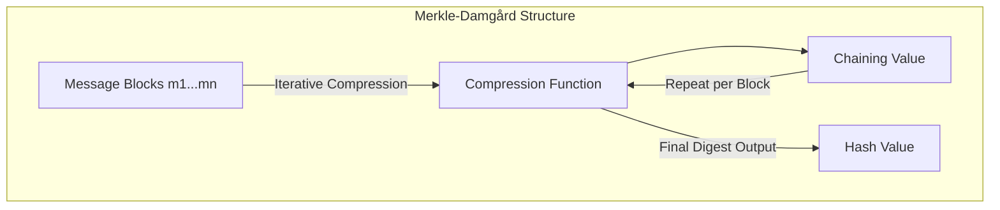
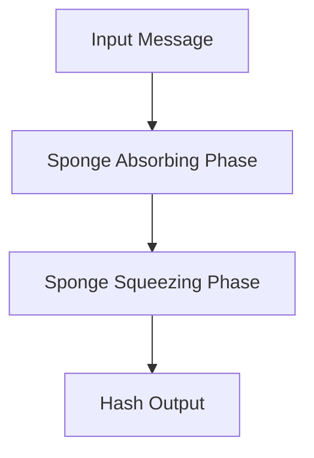
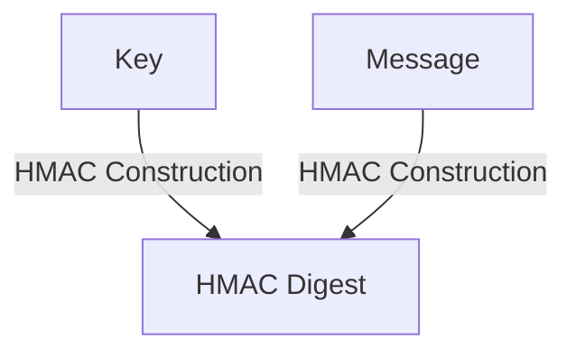
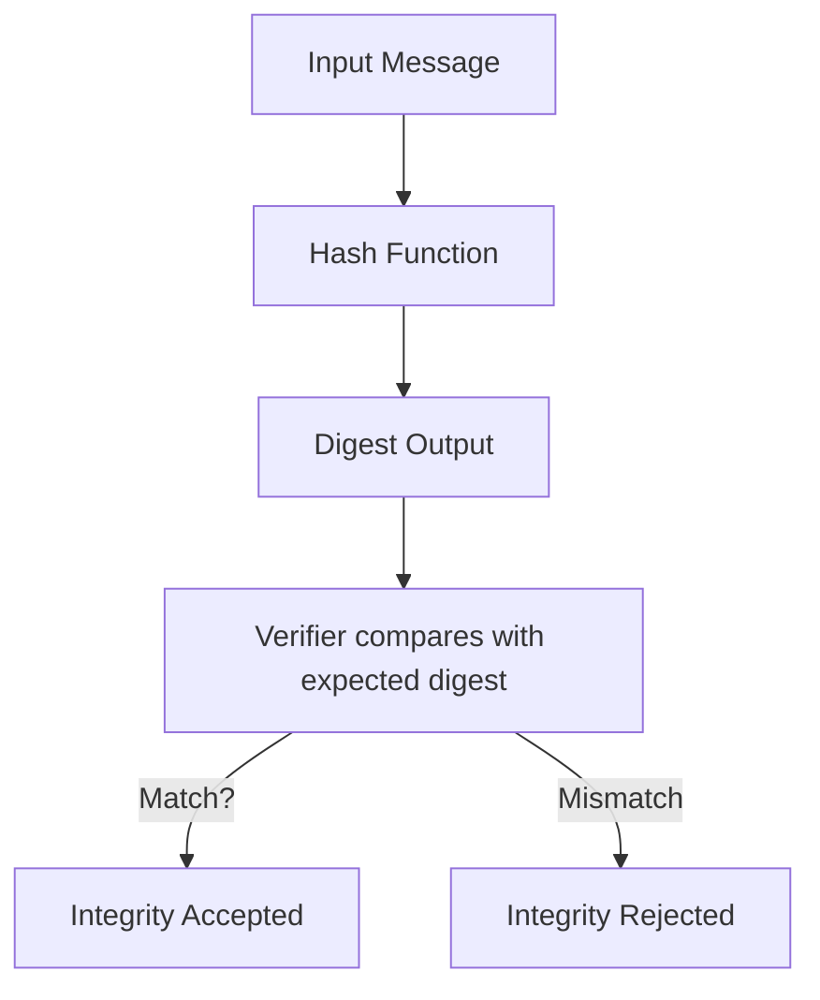

# Hash Functions: A Technical Primer

Hash functions are foundational components in modern cryptographic systems. They enable a range of security properties, including data integrity, commitment, password security, digital signatures, and the construction of more complex cryptographic building blocks. This primer provides formal definitions, theoretical underpinnings, practical protocol usage, and engineering considerations for the secure deployment of hash functions in cryptographic environments.

---

## 1. Introduction to Hash Functions

A **hash function** is a deterministic algorithm that maps input data of arbitrary length (the message) to a fixed-length output (the hash value or digest). Formally, a hash function _H_ maps an input _m_ ∈ {0,1}^* to an output _h_ ∈ {0,1}^n, where _n_ is the fixed output length (e.g., 256 bits for SHA-256).

Hash functions come in two major categories:
- **Non-cryptographic hash functions:** Designed for general purposes such as hash tables and checksums; not intended for security-critical use.
- **Cryptographic hash functions:** Constructed to withstand specific attack classes and provide strong security properties.

This document focuses exclusively on cryptographically secure hash functions.

---

## 2. Essential Properties of Cryptographic Hash Functions

Cryptographic hash functions are characterized by the following core security properties:

### 2.1 Preimage Resistance

Given a hash output _h_, it should be infeasible to find any input _m_ such that _H(m) = h_.

- **Formally:** for randomly chosen _h_, it is computationally infeasible to find _m_ such that _H(m) = h_.
- **Purpose:** Enables hiding the original input from its hash.

### 2.2 Second-Preimage Resistance

Given an input _m1_, it should be computationally infeasible to find a different input _m2_ ≠ _m1_ such that _H(m1) = H(m2)_.

- **Purpose:** Prevents forging alternative messages with the same hash value.

### 2.3 Collision Resistance

It should be computationally infeasible to find any two distinct inputs _m1_ ≠ _m2_ such that _H(m1) = H(m2)_.

- **Prevented Attack:** Arbitrary collision discovery, which can undermine many cryptographic tools, such as digital signatures.

---
```mermaid
graph TD
    A[Input (Arbitrary Length)] -->|Hash Function| B[Fixed-Length Digest]
    B -->|Preimage Attack| C1[Infeasible]
    B -->|Second Preimage Attack| C2[Infeasible]
    D[Find m1 ≠ m2: H(m1)=H(m2)] -->|Collision Attack| C3[Infeasible]
    style C3 fill:#fdf6e3,stroke:#dc322f,stroke-width:2px
    style C2 fill:#fdf6e3,stroke:#268bd2,stroke-width:2px
    style C1 fill:#fdf6e3,stroke:#859900,stroke-width:2px
```
---

### 2.4 Pseudorandomness and Avalanche Effect

- **Avalanche Effect:** A small change in input leads to unpredictable, substantial changes in output.
- **Pseudorandomness:** Outputs are indistinguishable from random, absent the secret or input.

---

## 3. Internal Architecture and Common Constructions

Cryptographic hash functions are typically constructed using components chosen for resistance against known cryptanalytic attacks. Two primary construction paradigms dominate:

### 3.1 Merkle-Damgård Construction

Most legacy hash functions, including MD5, SHA-1, and SHA-2, use the Merkle-Damgård construction:



- **Padding:** Ensures the message length is a multiple of the block size.
- **Initialization Vector (IV):** A fixed starting value for the chain.
- **Iteration:** Processes each block sequentially, updating the internal state.

### 3.2 Sponge Construction

Recent hash designs, such as SHA-3 (standardized in FIPS 202), utilize a sponge construction for greater flexibility and security:


- The sponge structure alternates between “absorbing” input and “squeezing" output, based on an internal permutation. This enables variable-length output and inherent resistance to length-extension attacks.

---

## 4. Standardized Hash Functions

### 4.1 SHA-2 Family

- **SHA-224, SHA-256, SHA-384, SHA-512, SHA-512/224, SHA-512/256**
- NIST FIPS 180-4

Widely used across protocols (e.g., TLS, SSH, code signing). Based on the Merkle-Damgård design.

### 4.2 SHA-3 Family

- **SHA3-224, SHA3-256, SHA3-384, SHA3-512, SHAKE128, SHAKE256**
- NIST FIPS 202

Sponge-based, providing resistance to length extension and offering variable-length output for extendable output functions (XOFs).

### 4.3 Legacy Hash Functions

**MD5** and **SHA-1** are now
considered cryptographically broken due to practical collision attacks and should not be used except for non-security purposes or in controlled legacy scenarios, with explicit risk acceptance.

> **Warning**
> Do *not* use MD5, SHA-1, or any hash function with known practical collision attacks in security-relevant contexts.

---

## 5. Typical Protocol Usage

Hash functions are employed in diverse protocols and components, providing integrity, uniqueness, or “randomness” for higher-level primitives.

### 5.1 Digital Signatures

Hash functions compress arbitrary messages to fixed-length digests before signature operations. The hash digest is what is signed, optimizing efficiency and standardizing signature size regardless of the input message length.

### 5.2 Message Authentication Codes (HMAC)

HMAC (RFC 2104) combines a hash function and a secret key to produce a keyed MAC, ensuring message authentication and integrity. HMAC is specifically designed to maintain its security even if the underlying hash is only weakly collision resistant.



### 5.3 Password Hashing

Generic hash functions (e.g., SHA-256) are not usually sufficient for password hashing, given vulnerability to high-speed brute-force attacks.

> **Caution**
> Use purpose-built password hash functions such as Argon2, scrypt, or PBKDF2, which are designed to be computationally and memory intensive.

### 5.4 Commitment Protocols

Hash functions are used to commit to values in cryptographic commitment schemes, where a party publishes a hash and later reveals the original value to prove fidelity.

### 5.5 Random Oracle Model Applications

Some protocols assume hash functions behave like ideal random oracles, notably in key derivation functions (KDFs), zero-knowledge proofs, and digital signature proofs.

---

## 6. Design and Implementation Considerations

### 6.1 Hash Function Selection Criteria

- **Security Margin:** Avoid hash functions with known weaknesses; regularly evaluate FIPS and IETF guidance.
- **Performance:** Evaluate throughput and latency, particularly for server-side and embedded contexts.
- **Output Length:** Choose adequately sized digests to provide sufficient resistance to collision and preimage attacks (e.g., 256 bits offers 128-bit collision resistance due to the birthday bound).
- **Interoperability:** Ensure compatibility with required protocols, standards, and existing deployments.

### 6.2 Length Extension Attacks

Merkle-Damgård hash functions (e.g., SHA-2) are vulnerable to length extension if raw hash outputs are used as MACs or for authentication without HMAC-style protection.

> **Alert**
> Never use bare hash(value || secret) for authentication. Use HMAC or dedicated MAC constructions.

### 6.3 Common Pitfalls

- **Hashing Sensitive Material Without Salting:** For passwords or sensitive tokens, always combine a unique salt to avoid rainbow table attacks.
- **Truncated Hashes:** Aggressively truncating hashes can make collision and preimage attacks much more feasible.
- **Randomness Misuse:** Hash functions are not true random number generators and should not be used as such except in carefully constructed deterministic random bit generators (DRBGs) as per NIST SP 800-90.

### 6.4 Hardware Acceleration

Modern CPUs commonly support accelerated hashing for selected algorithms (e.g., Intel SHA extensions). For ultra-high throughput contexts, consider dedicated coprocessors (such as HSM modules) that implement secure, tamper-resistant hashing.

---

## 7. Protocol and Standards Integration

### 7.1 Transport Layer Security (TLS)

TLS 1.2 and earlier support several hashes (MD5, SHA-1, SHA-256); TLS 1.3 restricts to secure hashes (SHA-256 and SHA-384).

- **Reference:** RFC 5246 (TLS 1.2), RFC 8446 (TLS 1.3)

### 7.2 Secure Shell (SSH)

Uses SHA family hashes for both integrity (MACs) and for session key derivation.

### 7.3 Public Key Infrastructure (PKI)

Digital certificates (e.g., X.509) rely on hash functions to compute certificate fingerprints and for digital signatures.

---

## 8. Security Level and Attack Complexity

The effective security level of a hash function depends on digest length and design strength.

- **Collision Resistance:** _n_-bit hash provides roughly _n/2_-bit collision resistance (birthday attack).
- **Preimage Resistance:** _n_-bit hash provides _n_-bit preimage resistance.

| Algorithm | Digest Size | Collision Resistance | Preimage Resistance |
|-----------|-------------|---------------------|---------------------|
| SHA-1     | 160 bits    | 80 bits             | 160 bits            |
| SHA-256   | 256 bits    | 128 bits            | 256 bits            |
| SHA-512   | 512 bits    | 256 bits            | 512 bits            |

---

## 9. Lifecycle and Migration Strategy

Cryptographic hash functions inevitably become obsolete due to advances in cryptanalysis or computational power. Planning for future migration is essential.

- **Deprecation:** Be prepared to replace compromised hash functions in all protocols.
- **Agility:** Where possible, design protocols with support for hash function negotiation or graceful transition.
- **Legacy Data:** Consider the challenges of re-hashing or migrating stored data when changing hash algorithms.

---

## 10. Conclusion

Hash functions are essential, versatile tools within cryptography, underpinning authentication, integrity, and other security-critical operations across modern systems. Correct selection, implementation, and integration of hash functions are vital to ensure the robustness of protocols and applications against evolving threats.

---

## Appendix: Hashing Workflow Example

The following high-level flow summarizes a typical cryptographic hashing workflow applied to message integrity:



---

> **Note**
> For further details on hash function implementation, refer to NIST FIPS 180-4 (SHA-2 family), NIST FIPS 202 (SHA-3 family), and RFC 2104 (HMAC construction) as authoritative specifications. Always consult up-to-date security advisories and peer-reviewed cryptographic literature before deploying or updating hash function usages in production systems.