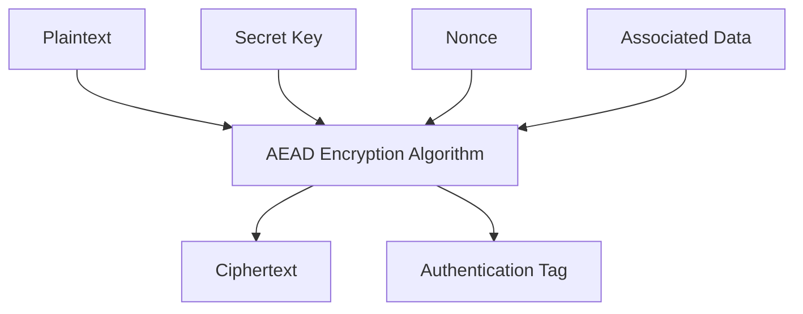
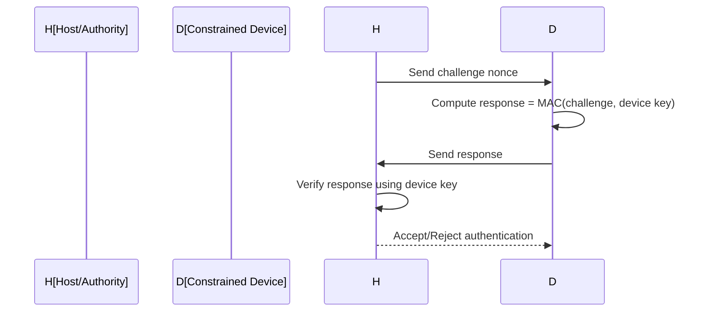
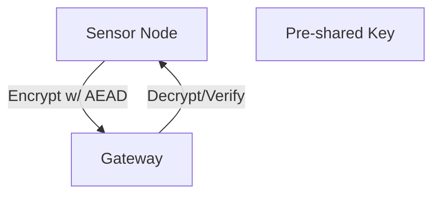

# Lightweight Cryptography: A Technical Primer

## Introduction

Lightweight cryptography comprises cryptographic algorithms and protocols specifically engineered to function in resource-constrained environments. These environments ubiquitously include embedded Internet of Things (IoT) devices, RFID tags, sensor networks, and cyber-physical systems, where constraints on computational power, memory, energy, and sometimes even network bandwidth severely restrict the applicability of conventional cryptographic solutions.

This primer provides a comprehensive technical overview of lightweight cryptography, including its motivating factors, design principles, families of primitives, practical deployment considerations, and current standardization initiatives. The presentation assumes familiarity with fundamental cryptographic concepts, such as block ciphers, stream ciphers, and message authentication codes.

## Context and Motivation

### The Growth of Constrained Devices

The exponential proliferation of IoT and low-power embedded devices has created an urgent need for cryptographic solutions that can deliver adequate security while operating within strict resource constraints. The following are typical attributes of such environments:

- **Low processing capability:** 8-bit, 16-bit, or low-end 32-bit CPUs
- **Small RAM footprint:** 1–16 KB (often much less than general-purpose systems)
- **Limited program ROM:** 8–128 KB for all code, including cryptography
- **Severe energy constraints:** battery-powered or energy-harvested systems
- **Intermittent connectivity and unreliable power supply**

In these contexts, standard cryptographic algorithms such as AES (Advanced Encryption Standard), RSA, or even ECC (Elliptic Curve Cryptography) can be prohibitively expensive due to code size, computational workload, or energy requirements.

### Security Requirements

Despite limited resources, these constrained systems often perform security-critical tasks (authentication, integrity protection, confidentiality, anti-counterfeiting). Lightweight cryptography aims to provide:

- **Comparable security guarantees to mainstream counterparts**
- **Simplicity and compactness**
- **Robustness against implementation attacks**, such as side-channel attacks

## Core Concepts and Architectural Principles

### Design Criteria for Lightweight Cryptography

At the architectural level, lightweight cryptographic primitives and protocols differentiate themselves in several key aspects:

| Constraint                 | Implications                      | Example Design Response         |
|----------------------------|-----------------------------------|---------------------------------|
| Limited code/data memory   | Smaller S-boxes, simple algorithms| Use of bit-serial operations    |
| Low computational power    | Less complex rounds, fewer rounds | Merged round functions          |
| Energy limitations         | Minimized RAM access, few cycles  | Substitution-permutation networks|
| Physical attack resilience | Simple hardware masking           | Algebraic simplicity            |

### Security vs. Performance Tradeoffs

A central practical consideration is the need to balance minimal resource consumption with sufficient cryptographic strength. Reduced state size or fewer rounds can expose lightweight primitives to cryptanalytic risks if not carefully designed. Formal security proofs and extensive cryptanalysis are just as critical for lightweight ciphers as for their traditional counterparts.

> [!alert]  
> **Warning:** Trade-offs in lightweight cryptographic design can lead to unexpected vulnerabilities. A minimal implementation must _not_ come at the cost of unquantified reductions in security margin.

### Typical Target Environments

- **RFID tags/NFC chips:** <2kB memory, no battery, operates via energy harvesting
- **Sensor nodes:** ultra-low voltage operation, extremely limited code storage
- **Embedded controllers:** Communication security in home automation, vehicles
- **Medical implants:** Data confidentiality, authentication under energy and computation constraints

---

## Families of Lightweight Cryptographic Primitives

Lightweight cryptography mirrors conventional cryptography in offering primitives for confidentiality, authenticity, and integrity, but within stringent size and power budgets.

### Block Ciphers

#### Characteristics

- Typically smaller state/block size (e.g., 64 bits) to reduce resource usage.
- Simplified round functions, often based on substitution-permutation networks (SPNs) or Feistel structures with simple S-boxes or ARX (Add-Rotate-XOR) operations.

#### Notable Examples

| Cipher     | Block Size | Key Size | Type     | Reference/Standard         |
|------------|------------|----------|----------|----------------------------|
| PRESENT    | 64         | 80/128   | SPN      | ISO/IEC 29192-2            |
| LED        | 64         | 64–128   | SPN      | Proposal, NIST LWC         |
| SIMON      | 32–128     | 64–256   | Feistel  | NSA, academic              |
| SPECK      | 32–128     | 64–256   | ARX      | NSA, academic              |
| GIFT       | 64/128     | 128      | SPN      | NIST LWC, ISO/IEC 29192-2  |

#### Mermaid Diagram: PRESENT Block Cipher, High-Level Flow

#### Integration Points

- Useful for encryption in smartcards, RFID authentication, lightweight VPN
- Can be implemented efficiently in both hardware (gate count, power) and software (RAM/code size)

### Stream Ciphers

Stream ciphers are preferred where low latency and small block size are required or where communication granularity is at the bit or byte level.

| Cipher     | Key Size | IV Size | Description        | Reference                   |
|------------|----------|---------|--------------------|-----------------------------|
| Trivium    | 80       | 80      | Bit-oriented, HW/SW| ECRYPT eSTREAM, ISO/IEC 29192-3   |
| Grain      | 80–128   | 64–96   | Hardware focus     | eSTREAM, ISO/IEC 29192-3    |
| MICKEY     | 80–128   | 0–128   | Flexible           | eSTREAM                     |

**Applications:** sensor data streaming, data links, radio protocols.

### Authenticated Encryption with Associated Data (AEAD)

AEAD schemes combine confidentiality and integrity in a single primitive, which is now considered best practice for protocol security.

| Scheme     | Basis       | Features                      | Status                |
|------------|-------------|-------------------------------|-----------------------|
| ASCON      | Sponge      | NIST LWC winner, AEAD/Hash    | ISO/IEC 29192-6, NIST LWC |
| ACORN      | Stream      | Hardware-friendly, NIST LWC   | NIST LWC Finalist     |
| Elephant   | Permutation | Designed for low memory       | NIST LWC Finalist     |

#### Mermaid Diagram: AEAD Workflow in Constrained Device

**Engineering Note:**  
> [!alert]  
> **Tip:** AEAD usage ensures integrity and authenticity are always coupled to confidentiality, reducing developer error and protocol weaknesses (e.g., lack of replay or tampering protection).

### Hash Functions and MACs

Lightweight secure hash and message authentication primitives are vital for resource-limited devices needing to authenticate data or support digital signatures.

| Hash Function | Output Size | Structure   | Status           |
|---------------|-------------|-------------|------------------|
| PHOTON        | Variable    | Sponge      | ISO/IEC 29192-5  |
| SPONGENT      | Variable    | Sponge      | ISO/IEC 29192-5  |
| ASCON Hash    | 256         | Sponge      | NIST LWC         |

Message Authentication Code (MAC): LightMAC, Chaskey (ARX-based MAC), etc.

---

## Engineering Lightweight Cryptography

### Implementation Constraints

- **Code footprint:** Strict upper bounds on ROM (sometimes less than 2 KB for full stack)
- **RAM usage:** Data and buffers must fit, especially for ciphers operating on small data blocks
- **Cycle count:** Algorithms must finish within a fixed number of clock cycles, especially if radio must be powered only briefly
- **Hardware footprint:** When implemented as silicon IP, gate count, power, and physical area are constrained

#### Common Engineering Decisions

| Design Choice        | Reason/Trade-off                  |
|----------------------|-----------------------------------|
| Use of bitwise ops   | Smaller hardware, reduced power   |
| Static lookup tables | Trade speed for memory            |
| Block vs. stream     | Latency vs. throughput            |

#### Attack Surface

- **Side-channel attacks:** Power analysis, EM analysis, timing (especially when logic is simple)
- **Fault injection:** Low-complexity control logic sensitive to glitches or environmental conditions
- **Protocol misuse:** E.g., using unauthenticated ciphers in AEAD contexts

> [!alert]  
> **Caution:** Even when the cipher is formally sound, implementation details such as table access, conditional branches, and power supply can leak cryptographic material.

---

### Practical Workflows

#### 1. Device Provisioning

Lightweight cryptography is a key enabler for secure provisioning (key injection, device authentication).

#### Typical Flow: Provision/Authenticate IoT Device

#### 2. Secure Communication Session

Low-energy sensor node exchanges encrypted data with secure gateway.

> [!alert]  
> **Note:** Key exchange is often pre-shared (for lowest resource use), but lightweight asymmetric options (ECDH, lattice-based schemes) are emerging in the post-quantum era, albeit with higher resource demands.

---

## Standards and Protocols

### ISO/IEC 29192 – Lightweight Cryptography Suite

- **Part 1:** General overview and framework
- **Part 2:** Block ciphers (e.g., PRESENT, GOST, LED)
- **Part 3:** Stream ciphers (e.g., Trivium, Grain)
- **Part 4:** MACs
- **Part 5:** Hash-functions (e.g., PHOTON, SPONGENT)
- **Part 6:** AEAD (e.g., ASCON)

### NIST Lightweight Cryptography Standardization

- **Context:** NIST initiated a multi-year project (2018–2023) to evaluate new AEAD and hash-function candidates for lightweight contexts.
- **Winner:** ASCON (2023) recommended for AEAD and hashing in constrained environments.
- **Finalists:** Provides guidance for future applications needing higher assurance or distinct operational characteristics.

### Others

- EPCglobal Class-1 Generation-2 standard (UHF RFID) uses its own lightweight authentication primitives.
- IETF RFC 9154 covers DTLS profiles for constrained environments.

---

## Case Studies

### 1. RFID Tag Authentication with PRESENT

PRESENT cipher has been widely adopted for passive RFID tag authentication because of:

- Hardware implementation requiring under 2000 GE (Gate Equivalents)
- Low power operation (<10 μW)
- Security comparable to larger block ciphers when used with sufficient rounds and key size

### 2. IoT Sensor Data Protection Using ASCON

ASCON provides both AEAD and hashing, making it a versatile primitive for authenticated telemetry in LoRaWAN or 802.15.4 sensor networks. Its low memory requirements and resistance to timing attacks make it well-suited for platforms with <10 KB RAM.

---

## Threats and Risk Considerations

### Typical Threat Model

- **Adversary capabilities:** Passive eavesdropping; active tampering; replay attacks; physical proximity (side-channel and fault attacks)
- **Attack surface:** Crypto primitive, implementation leakage, protocol logic

## Modern Trends and Directions

### Post-Quantum Lightweight Cryptography

Emerging protocols increasingly incorporate post-quantum cryptography (PQC) primitives for key establishment (lattice-based, hash-based), which must also be made efficient for constrained environments. NIST's ongoing competition reports on the need for trade-offs between key sizes and computational feasibility.

### Hardware-Software Co-Design

- Many lightweight ciphers are conceived with both ASIC (application-specific integrated circuit) and low-level software in mind.
- Efficient software implementations require minimal RAM usage (e.g., in-place permutations, no table lookups).
- Hardware implementations are measured in gate equivalents and power per operation; e.g., PRESENT's round-based architecture can be serialized for ultra-low area.

### Protocol-Level Simplification

Protocols for constrained devices often eliminate unnecessary exchange (e.g., handshake reduction) and maximize the duration for which cryptographic keys and states remain reusable, within acceptable security limits.

---

## Common Pitfalls and Practical Advice

- **Choice of primitive:** Avoid homegrown or outdated ciphers (e.g., TEA, RC4); prefer ISO/IEC or NIST-standardized or well-reviewed algorithms only.
- **Key management:** Static keying is common due to resource issues—design for infrequent re-keying or use group-based keys with care.
- **Side-channel mitigation:** Consider adding noise, simple masking, or balancing circuits to disrupt leakage.
- **Update mechanisms:** Ensure there is some path for field updates or migration as stronger primitives/parameters become needed.
- **Parameter configuration:** Default to strong key lengths (at least 80 or 128 bits for symmetric keys), even at minor cost, for meaningful futureproofing.

> [!alert]  
> **Alert:** The most frequent cause of cryptographic breakage in lightweight devices is not primitive failure, but protocol misuse, insecure keying, or information leakage through poorly designed code/data flows.

---

## Summary Table: Lightweight Crypto at a Glance

| Primitive   | Example Algorithm | Typical Environment   | Reference                    |
|-------------|------------------|----------------------|------------------------------|
| Block cipher| PRESENT, LED     | RFID, MCU            | ISO/IEC 29192-2              |
| Stream cipher| Trivium, Grain  | Sensors, radio links | ISO/IEC 29192-3              |
| AEAD        | ASCON, ACORN     | IoT/embedded comms   | NIST LWC, ISO/IEC 29192-6    |
| Hash        | PHOTON, SPONGENT | MAC/auth, hashing    | ISO/IEC 29192-5              |

---

## Conclusion

Lightweight cryptography seeks to extend security assurances to environments that otherwise lack the capacity for conventional cryptographic primitives. This involves new engineering approaches that jointly consider algorithm complexity, resource usage, and resistance to physical attacks. Adopting lightweight primitives must be done within a risk-managed, standards-driven context, always emphasizing robustness, review, and practical deployment usability.

Standardization initiatives (ISO/IEC, NIST LWC) play an essential role in shaping which lightweight cryptographic primitives reach widespread adoption by the industry. For practitioners, the careful application of these standards, supported by robust protocol designs and defensive implementation, is essential for deploying secure systems in an era of ubiquitous, constrained computing.