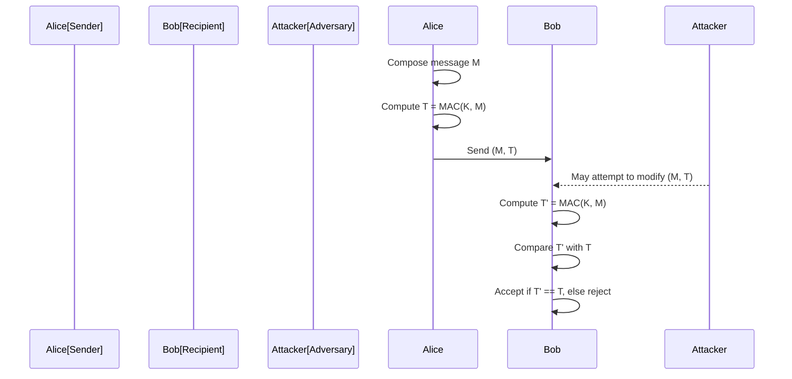
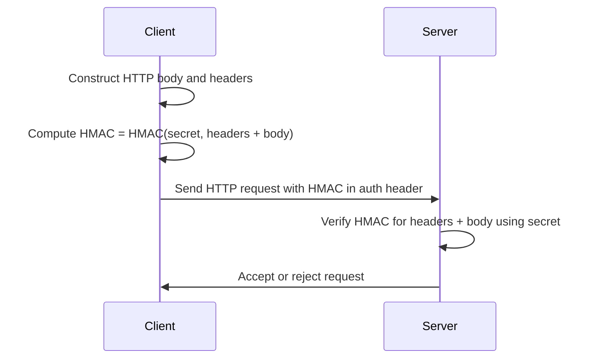

# Message Authentication Codes

## Introduction and Context

Message Authentication Codes (MACs) are a foundational cryptographic construct used for ensuring both the integrity and authenticity of messages exchanged over insecure channels. In contrast to public key digital signatures, MACs rely on symmetric (shared secret) cryptography, wherein the same key is used for both generating and verifying the code. They are widely deployed in network protocols, secure storage, financial systems, and any context where authenticated communication is necessary between trusted parties.

The primary objective of a MAC is to detect modifications and spoofing attempts. If the MAC accompanying a message does not match the expected value computed using the shared secret, the recipient can confidently reject the message as either tampered with or from an untrusted source.

## Core Concepts and Definitions

### Basic Definition

A Message Authentication Code (MAC) is a short piece of information—a cryptographic checksum—that accompanies a message and provides assurance to the recipient regarding both:

- **Integrity**: The message has not been altered in transit.
- **Authenticity**: The message originated from a party that possesses the secret key.

Formally, a MAC can be expressed as a tuple of algorithms:
- **Key Generation (Gen)**: An algorithm that produces a secret key *K*.
- **MAC Generation (Mac)**: An algorithm that, given a message *M* and key *K*, outputs a tag *T* = Mac(K, M).
- **Verification (Ver)**: An algorithm, given *M*, *K*, and *T*, determines if *T* is a valid MAC for *M* under key *K*.

### Security Goals

The primary security goal for a MAC is **existential unforgeability under chosen message attacks** (EUF-CMA): an adversary should not be able to generate a valid (message, tag) pair—even after seeing tags for messages of their choice—without knowledge of the secret key.

### Contrast with Hash Functions and Signatures

- **Hash Functions**: Alone, hash functions do not provide authenticity—anyone can compute the hash.
- **Digital Signatures**: Support non-repudiation via asymmetric keys, but at higher computational cost than MACs.
- **MACs**: Symmetric, efficient, but only provide authenticity/integrity between mutually trusted parties.

## High-Level Workflow

A typical scenario for MAC usage:



## Underlying Algorithms and Constructions

### Standard MAC Constructions

Several schemes are standardised and widely used in practice, most notably:

#### 1. HMAC (Hash-Based MAC)

HMAC (RFC 2104, FIPS 198-1) is a construction that uses a cryptographic hash function (such as SHA-256) and a secret key. It is the most widely deployed MAC due to its security proofs, performance, and ease of integration with hash function primitives.

The computation is as follows:
- `HMAC(K, M) = H((K' ⊕ opad) || H((K' ⊕ ipad) || M))`

Where:
- `H` is a cryptographic hash function
- `K'` is the secret key, zero-padded to the hash block size
- `opad` and `ipad` are outer and inner padding constants

#### 2. CBC-MAC

CBC-MAC builds a MAC from a block cipher (e.g., AES) in Cipher Block Chaining mode. The final block of the cipher output serves as the MAC. Its security depends on message lengths—**do not use CBC-MAC naively with variable-length messages**.

#### 3. CMAC

CMAC (NIST SP 800-38B) improves upon CBC-MAC to securely handle variable-length messages and is suitable for use with modern block ciphers like AES.

#### 4. Poly1305

Poly1305 is a MAC designed for high performance and modern cryptography, often paired with the ChaCha20 cipher (see RFC 8439). It provides strong security and excellent efficiency on contemporary hardware.

### Architecture and Integration

The architecture of a system using MACs is determined by the requirements for performance, interoperability, and security assurance.

```mermaid
flowchart LR
    Sender[Sender Application]
    SubK[Shared Secret Key]
    MacAlg[MAC Algorithm (e.g., HMAC, CMAC)]
    Network[Insecure Network]
    Receiver[Receiver Application]

    Sender -->|Message M| MacAlg
    SubK --> MacAlg
    MacAlg -->|Message M, Tag T| Network
    Network --> Receiver
    SubK --> Receiver
    Receiver -->|Verifies (M, T)| "MAC Algorithm"
```

**Key Points:**
- Both sender and receiver must securely share the same secret key ahead of time.
- Key agreement/exchange and key management are **not** provided by the MAC algorithm itself.

## Security Properties, Assumptions, and Limitations

### Security Assumptions

- **Key Secrecy:** The secret key must remain confidential. Disclosure compromises all authenticity and integrity guarantees.
- **No Non-Repudiation:** Since all parties share the same key, none can prove to a third party who generated a given MAC. Digital signatures are required for non-repudiation.
- **Collision Resistance:** If a MAC is constructed from a hash function, care must be taken against weaknesses (e.g., MD5, SHA-1 are no longer recommended).

### Cryptographic Properties

A secure MAC should satisfy:
- **Pseudorandomness:** The tags are indistinguishable from random, given the key is secret.
- **Resistance to Replay:** MACs alone do not provide replay protection unless combined with nonces, counters, or sequence numbers.
- **Domain Separation:** Use a unique key (or context prefix) per protocol to prevent cross-protocol attacks.

### Common Pitfalls

> :warning: **Warning**
> - Never reuse keys across different cryptographic primitives (e.g., between encryption and MAC).
> - Do not use plain hash functions (like SHA256) as a MAC—prefix or length extension attacks may apply.
> - CBC-MAC is only secure for fixed-length messages unless appropriately corrected (e.g., CMAC).
> - Avoid truncating MAC tags arbitrarily—security degrades exponentially with shorter MACs.

### Implementation Considerations

- **Key Generation:** Keys should be generated using secure random sources and be of sufficient length for the MAC construction used (e.g., 128–256 bits).
- **State Protection:** Guard against side-channel attacks (timing, memory observation) during MAC computation and comparison.
    > :bulb: **Tip**
    > Always use constant-time comparison for MAC tags to prevent timing-based attacks (e.g., `hmac.compare_digest` in Python).

- **API Contracts:** Explicitly specify which fields are covered by the MAC (e.g., headers, payload, metadata). Do not allow for ambiguous message encoding.
- **Key Rotation:** Design for periodic key rotation to limit risk from long-term exposure.

## Usage in Protocols and Systems

MACs are integral to a wide range of security protocols and standards:

- **Transport Layer Security (TLS):** Prior to TLS 1.3, MACs (e.g., HMAC) were used in record authentication; newer ciphers use authenticated encryption that incorporates MACs.
- **IPsec (ESP/AH):** Uses HMAC for packet authentication and integrity.
- **OAuth, JWT:** HMAC is a standard algorithm option for token signing (HS256, HS512, etc.).
- **Payment and Banking Systems:** MACs are mandated for transaction message integrity (e.g., ISO 8583 for financial messaging).

### Example: HTTP Message Authentication

The use of HMAC for HTTP headers can be illustrated as follows:



**Key Concern:** 
- The precise data inputs to the MAC must be canonicalised; otherwise, different representations (e.g., whitespace, header order) may result in different MACs.

## Variations and Advanced Topics

### Authenticated Encryption with Associated Data (AEAD)

Modern secure messaging typically employs **Authenticated Encryption with Associated Data (AEAD)**, which combines encryption and MAC into a single construct (e.g., GCM, ChaCha20-Poly1305). AEAD modes provide both confidentiality and authenticity in a unified way and are recommended for new designs.

### MAC-then-Encrypt vs. Encrypt-then-MAC

Different protocol designs compose authentication and encryption in varying orders:
- **Encrypt-then-MAC:** Encrypt message, compute MAC over ciphertext. Preferred for security and compositionality.
- **MAC-then-Encrypt:** Compute MAC over plaintext, then encrypt everything. Used in some legacy protocols but less robust.
    > :warning: **Warning**  
    > Prefer Encrypt-then-MAC as it has well-understood security proofs and better compositional properties.

### Keyed Hash vs. MAC

Methods such as `SHA256(key || message)` do **not** provide adequate security and are susceptible to extension attacks. Always utilise properly constructed and reviewed MAC algorithms (e.g., HMAC, CMAC).

## Standardisation and Specifications

- **HMAC:** [RFC 2104](https://tools.ietf.org/html/rfc2104), [FIPS 198-1](https://csrc.nist.gov/publications/detail/fips/198/1/final)
- **CMAC:** [NIST SP 800-38B](https://nvlpubs.nist.gov/nistpubs/SpecialPublications/NIST.SP.800-38b.pdf)
- **Poly1305:** [RFC 8439](https://datatracker.ietf.org/doc/html/rfc8439)
- **CBC-MAC:** Historical, standardised per cipher (not recommended for new designs).

## Practical Engineering Considerations

- **Performance:** HMAC is highly efficient and widely supported in software and hardware; Poly1305 is even faster on many platforms and suitable for high-performance protocols.
- **Integration Points:** Cryptographic libraries (e.g., OpenSSL, libsodium, BoringSSL) expose MAC primitives. Choose routinely audited, widely adopted libraries for implementation.
- **API Choices:** Some APIs combine MAC generation and verification into a single function, while others split them. Document expected use to avoid misuse leading to vulnerabilities.

> :bulb: **Tip**
> Always securely erase keys from memory after use, and restrict access (least privilege principle).

> :warning: **Caution**
> Avoid rolling your own MAC implementation. Subtle errors can lead to catastrophic compromise.

## Summary Table: Major MAC Algorithms

| Algorithm     | Primitive       | Security                                                      | Notes                |
| ------------- | --------------- | ------------------------------------------------------------- | -------------------- |
| HMAC          | Hash Function   | Strong under standard assumptions; widely used                | Prefer SHA-2 or SHA-3|
| CMAC          | Block Cipher    | Secure for variable-length messages                           | Use AES              |
| Poly1305      | Stream Cipher   | High performance, strong modern security                      | Use with ChaCha20    |
| CBC-MAC       | Block Cipher    | Secure *only* for fixed-length messages (not recommended)     | Legacy only          |

## Conclusion

Message Authentication Codes (MACs) are a critical mechanism for enforcing message integrity and authenticity in symmetric-key systems. Understanding the limitations and correct use of MAC constructions is essential for security engineers, as improper implementation or integration can result in severe vulnerabilities. As the landscape of authenticated encryption advances, AEAD modes are replacing traditional "encryption+MAC" composition, but separate MAC algorithms remain widely used in legacy systems and certain authentication-only applications. Always rely on peer-reviewed, standardised algorithms and best security practices for MAC usage in any system design.