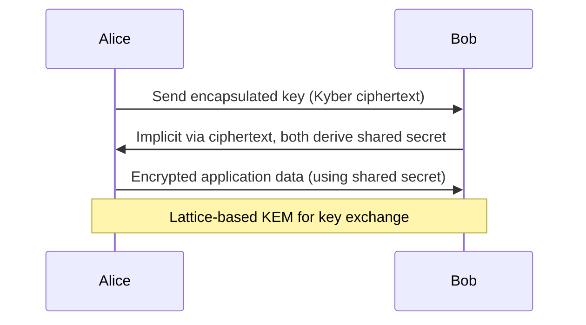
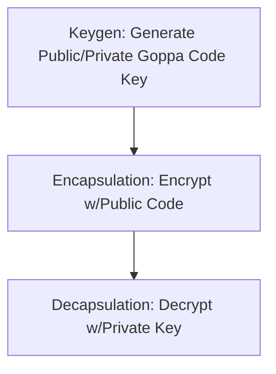

# Post-quantum Cryptography: Technical Primer

## Introduction and Technical Context

**Post-quantum cryptography (PQC)** encompasses cryptographic primitives, algorithms, and protocols specifically constructed to withstand attacks from *quantum computers*, which threaten to compromise many widely deployed classical cryptosystems. Unlike incremental improvements to existing systems, PQC reconsiders foundational mathematical assumptions and algorithmic choices, primarily due to two pivotal quantum algorithms:

- **Shor’s Algorithm** (1994): Permits efficient quantum factoring and computation of discrete logarithms, endangering RSA, DSA, DH, ECDSA, and elliptic curve-based systems.
- **Grover’s Algorithm** (1996): Quadratically accelerates brute-force search in symmetric cryptography, impacting symmetric-key sizes but not fundamentally breaking them.

Current public-key cryptography predominately relies on number-theoretic problems (integer factorization, discrete log, elliptic curve discrete log) that quantum computers can solve efficiently. PQC explores new hardness assumptions, primarily in mathematical areas unaffected by known quantum speedups: lattices, error-correcting codes, hash-based constructions, multivariate polynomial systems, and isogenies.

## Core Concepts and Architectural Overview

### Quantum Threat Model

Classically, we model adversaries as computationally bounded Turing machines. The quantum threat model instead assumes adversaries possess large, general-purpose, fault-tolerant quantum computers able to execute quantum algorithms such as Shor’s or Grover’s against cryptographic protocols. This has several major consequences:

- **Public-key primitives** (PKI, signatures, key exchange) based on integer factorization or discrete logarithms lose all meaningful security when attacked by a sufficiently large quantum computer.
- **Symmetric primitives** (block ciphers, hash functions) are weakened by Grover’s algorithm, necessitating doubling key sizes for similar classical strength.

### Security Goals

PQC targets equivalent or stronger definitions of classical security under quantum adversary models, e.g.:

- **IND-CCA / IND-CPA** for encryption,
- **EUF-CMA** for signatures,
- **KEM/DEM hybrid constructions** for key exchange.

Security proofs frequently involve reductions to conjectured hard problems resistant to both classical and quantum attacks.

### Architectural Placement

PQC algorithms can replace classical algorithms in core crypto system components:

```mermaid
flowchart TD
    A[Application Layer] 
    B[TLS/SSL Session Establishment]
    C[Key Exchange / Agreement]</br>(e.g., PQC KEM)
    D[Authentication]</br>(Signature Scheme)
    E[Symmetric Encryption]
    A --> B
    B --> C
    B --> D
    C --> E
```

- **Key Exchange**: Replaces protocols like RSA key transport or (EC)DH with PQC KEMs.
- **Digital Signatures**: Replaces RSA/ECDSA signatures in code-signing, certificates, etc.
- **Hybrid Approaches**: Combines classical and PQC algorithms during a transition period.

## Mathematical Foundations

### Hard Problems in PQC

Each major family of PQC schemes is based on a well-known, hard mathematical problem:

| Family                | Example Problem                       | Description |
|-----------------------|---------------------------------------|-------------|
| Lattice-based         | Learning With Errors (LWE)            | Solve noisy linear equations over lattices. |
| Code-based            | Syndrome Decoding, e.g., McEliece     | Distinguish codewords from random vectors in error-correcting codes. |
| Hash-based            | Collision resistance in hash functions| Finding hash tree collisions (e.g., Merkle trees). |
| Multivariate          | Multivariate Quadratic (MQ) equations | Solve systems of nonlinear equations over finite fields. |
| Isogeny-based         | Supersingular Isogeny Diffie–Hellman (SIDH) | Hardness of finding isogenies between elliptic curves. |

## Detailed Algorithmic Families

### 1. Lattice-based Cryptography

#### Overview

Currently the leading candidate for widespread PQC deployment due to performance, security, and versatility. "Lattices" are discrete, multi-dimensional periodic grid structures in Euclidean space; cryptographic hardness relies on the presumed classical and quantum infeasibility of certain lattice problems.

Key problems:

- **Learning With Errors (LWE)** & **Ring-LWE**: Given a set of linear equations with small random "errors," find the secret. Variants enable efficient encryption and signatures.
- **Short Integer Solution (SIS)**: Find short integer vectors satisfying modular linear constraints.

#### Major Algorithms

- **Kyber (KEM):** Selected by NIST (2022) for standardization ([FIPS 203](https://csrc.nist.gov/projects/post-quantum-cryptography/finalists)).
- **Dilithium (Signature):** Based on CRYSTALS-Dilithium; also standardized.
- **FALCON (Signature):** Fast Fourier sampling approach, compact signatures.

#### Architecture and Flow



#### Implementation Considerations

- **Key sizes:** Moderate (public keys ~1-3 KB for NIST-level security).
- **Performance:** Efficient (encryption, decryption, signing, verification).
- **Side-channel resistance:** Vulnerable, careful constant-time implementations required.
- **Parameter selection:** Security depends on parameter choices; improper selection may result in vulnerabilities.

> **Note**
> Parameters must be chosen to prevent both classical and quantum attacks; only use vetted parameters from standards (e.g., NIST PQC).

#### Deployment Examples

- TLS 1.3 hybrid key exchange ciphersuites (see [RFC 8410](https://datatracker.ietf.org/doc/html/rfc8410), IETF CFRG PQC draft ciphersuites).
- SSH key exchange prototypes.
- Code and firmware signing.

### 2. Code-based Cryptography

#### Overview

Older than lattice-based schemes, code-based crypto relies on the difficulty of decoding general linear error-correcting codes.

- Most prominent: **McEliece** encryption (1978), based on the hardness of decoding Goppa codes.

#### Major Algorithms

- **Classic McEliece (KEM):** 40+ years without successful cryptanalysis.
- **BIKE, HQC:** NIST-alternate code-based KEM candidates.

#### Implementation Considerations

- **Key sizes:** Large public keys (~250 KB for NIST security), making deployment challenging for some use cases.
- **Ciphertext expansion:** Moderate.

#### Architectural Flow



> **Warning**
> The very large key sizes render code-based schemes less practical for constrained or embedded devices, but they remain attractive for long-term secure email or VPN authentication.

### 3. Hash-based Signatures

#### Overview

Hash-based digital signatures use Merkle trees and one-time signatures (OTS), relying only on the security of cryptographic hash functions. They are among the few signature schemes with well-understood post-quantum security reductions.

#### Major Algorithms

- **XMSS (eXtended Merkle Signature Scheme):** IETF standardized (RFC 8391).
- **SPHINCS+:** Stateless, more practical for general use; NIST alternate candidate.

#### Implementation Considerations

- **Signature sizes:** Moderately larger than ECDSA, but predictable.
- **Key management:** XMSS variants are *stateful* (must track key usage); stateless (SPHINCS+) avoids this but has larger signatures.
- **Performance:** Relatively slower signing and verification than ECDSA.

#### Architecture Flow

```mermaid
flowchart TD
    Keypair[Generate Keypair (OTS/Merkle tree)]
    Sign[Sign message with OTS and Merkle Auth Path]
    Verify[Verify signature (hash operations)]
    Keypair --> Sign
    Sign --> Verify
```

> **Caution**
> Accidental reuse of XMSS private key elements can compromise security. Use SPHINCS+ or robust key management for stateless variants.

### 4. Multivariate Polynomial Cryptography

#### Overview

These schemes depend on the hardness of solving large multivariate quadratic systems over finite fields, a known NP-hard problem even for quantum algorithms. Historically popular, but many proposals have been broken; survivors remain, primarily as signature schemes.

#### Major Algorithms

- **Rainbow:** NIST alternate signature candidate (later broken for reduced parameters).
- **GeMSS:** Multivariate-based candidate.

#### Implementation Considerations

- **Signature sizes:** Moderate to large.
- **Key sizes:** Variable; often large for high security.
- **Security history:** Many multivariate systems failed under attack; thorough vetting mandatory.

> **Note**
> Multivariate signature schemes have been less favored due to security surprises during cryptanalysis.

### 5. Isogeny-based Cryptography

#### Overview

The most "exotic" family, isogeny-based crypto, relies on the hardness of finding isogenies (structure-preserving maps) between supersingular elliptic curves.

- **SIKE (Supersingular Isogeny Key Encapsulation):** Once a promising candidate for lightweight PQC, but broken by 2022 attacks.
- **CSIDH:** Alternate isogeny scheme.

#### Implementation Considerations

- **Key and ciphertext sizes:** Very compact.
- **Performance:** Slow (especially on embedded hardware).
- **Security status:** Theory evolving; significant cryptanalytic advances have occurred recently.

> **Warning**
> Many isogeny-based schemes have fallen to new attacks. Avoid production use unless security is thoroughly established and parameters are up to date.

## Practical Workflows: Integration Patterns

### 1. Hybrid Key Exchange

Many standards and implementations use *hybrid* approaches, combining classical and post-quantum cryptography to provide both classical and future-proof security.

```mermaid
flowchart TD
    KEM1[Classical Key Exchange<br>(ECDHE)]
    KEM2[PQC KEM<br>(e.g., Kyber)]
    Derive[Combine secrets, derive session key]
    KEM1 --> Derive
    KEM2 --> Derive
```

Session keys are derived by concatenating or mixing secrets from both a classical and PQC primitive; communication is secure if at least one remains unbroken.

> **Tip**
> Most modern TLS 1.3 PQC implementations (e.g., Google’s CECPQ2/CECPQ3) use parallel hybrid KEM negotiation.

### 2. Certificate Lifecycles

- PQC signatures can be used to sign X.509 certificates (see draft standards in CA/B Forum and IETF [Lamps WG](https://datatracker.ietf.org/wg/lamps/about/)).
- Hybrid certificates: Combine classical (e.g., ECDSA) and PQC signatures for transitional phases.

### 3. API and Protocol Adaptations

Protocols and APIs must accommodate potentially larger key sizes, signature sizes, and ciphertext sizes, possibly exceeding maximum field lengths or buffer sizes. For example:

- SSH `ssh-ed25519` -> `ssh-ed25519-pqc` (proposed)
- TLS ciphersuites: `TLS_PQ_KYBER_SHA384` (notional example)

## Engineering Considerations and Pitfalls

### Key Size and Performance Trade-offs

- **Lattice-based schemes**: Modest performance hit, moderate key and ciphertext expansion.
- **Code-based schemes**: Key size can exceed hundreds of KB, impacting embedded or constrained deployments.
- **Hash-based signatures**: Much larger than ECDSA but deterministic and non-interactive.
- **Isogeny-based schemes**: Attractive key size, potentially impractical speed.

### Implementation Hazards

- **Side-channel resistance**: PQC implementations must be constant-time, with no secret-dependent branching or memory accesses.
- **Interoperability**: Standard formats and representations (byte ordering, padding) are still stabilizing; mismatches can cause subtle bugs.
- **Parameter selection**: Imperative to use well-vetted, standardized parameter sets, as custom variants may be weak to unforeseen attacks.
- **Cryptanalysis status**: Many new attacks surface during PQC migration; close adherence to reputable open-source implementations and timely updates are essential.

### Transition and Migration Planning

- **Cryptographic agility**: Protocols, software, and hardware should be designed to easily swap cryptographic primitives with minimal disruption.
- **Data-at-rest**: To protect against *harvest now, decrypt later* (HNLDL) attacks, long-lived and sensitive data must be encrypted with PQC algorithms before quantum computers mature.
- **Regulatory compliance**: NIST, ETSI, and other organizations will define compliance frameworks for PQC adoption.

## Standards, Protocols, and Current Deployment

### NIST PQC Standardization Project

NIST launched its PQC competition in 2016; as of 2023, final selections are:

- **Encryption/key establishment:** Kyber (CRYSTALS-Kyber)
- **Signatures:** Dilithium (CRYSTALS-Dilithium), FALCON, SPHINCS+

Draft FIPS documents: [FIPS 203-205](https://csrc.nist.gov/projects/post-quantum-cryptography/finalists).

### Other Standards and Efforts

- **IETF/LAMPS**: Extending PKIX, TLS, and X.509 for PQC; new protocols and OIDs for PQC algorithms.
- **ISO/IEC JTC1/SC27** and **ETSI**: International PQC standard development.
- **OpenSSH, OpenSSL, BoringSSL**: Prototypical PQC support in mainstream cryptographic libraries.

### Common Integration Points

```mermaid
flowchart TB
    App[Application/Service]
    lib[PQC-enabled Crypto Library]
    proto[Protocol Stack (e.g. TLS, SSH)]
    net[Network]
    hardware[Hardware Accelerator (optional)]
    App --> lib
    lib --> proto
    proto --> net
    lib --> hardware
```

- **Libraries**: Embeddable C, Rust, and Go implementations are maturing for Lattice-based PQC.
- **Hardware**: PQC operations can benefit from hardware acceleration, but many algorithms are still software optimized.

## Typical Engineering Decisions

### Algorithm Selection

- **Performance requirements**: Lattice/KEMs for speed; code-based for legacy compatibility.
- **Key management**: Stateless hash-based signature schemes for distributed systems.
- **Footprint**: Code-based or isogeny-based for constrained keys, though performance trade-offs exist.

### Migration Strategies

- **Hybrid deployments**: Ensure backward compatibility during migration.
- **Gradual rollout**: Start with PQC in internal systems; monitor cryptanalysis developments.

## Research frontiers and Open Challenges

- **Security proofs**: Unconditional PQ security remains hard; most schemes rely on plausible hardness conjectures.
- **Quantum attacks**: New quantum algorithms may erode existing hardness assumptions.
- **Usability**: Balancing size, speed, and security—especially in mobile, IoT, and legacy infrastructure.
- **Standardization and Interoperability**: Evolving rapidly, with multiple overlapping efforts.

## Conclusion

Post-quantum cryptography is an urgent, foundational transformation in information security. It affects protocols, systems, and infrastructure across all sectors. Security engineers must understand the quantum threat model, the mathematical underpinnings of PQC, the algorithms being standardized, and practical challenges of integrating, deploying, and migrating large-scale systems to new cryptographic primitives.

Staying aligned with ongoing standardization, monitoring cryptanalytic developments, enforcing robust engineering practices—especially regarding parameter choices, side-channel resistance, and cryptographic agility—are critical for secure and effective adoption in a post-quantum security landscape.