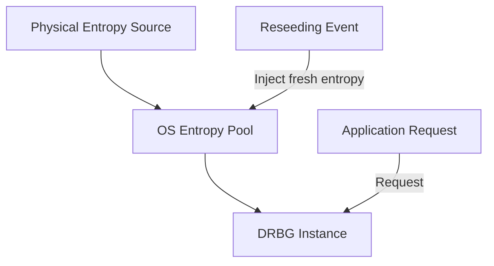
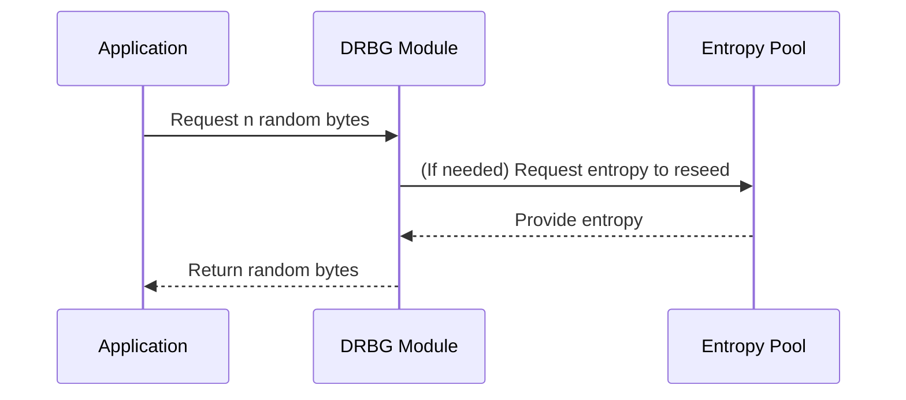

# Random Number Generation: Technical Primer

## Overview and Context

Random number generation is essential to the field of cryptography and secure systems engineering. Random values underpin cryptographic keys, nonces, initialization vectors, salts, and other critical parameters. The unpredictability and quality of these values directly impacts the confidentiality, integrity, and availability of secure systems.

In the context of security and cryptography, random number generation must fulfill rigorous requirements. Failure to produce sufficiently unpredictable values can render cryptographic algorithms and protocols vulnerable, often catastrophically so.

Two principal approaches to random number generation exist:

- **True Random Number Generators (TRNGs)** – Derive randomness from inherently unpredictable physical processes (hardware-based).
- **Deterministic Random Bit Generators (DRBGs), also known as Pseudorandom Number Generators (PRNGs)** – Use algorithmic means to expand a smaller amount of true random data (seed/entropy) into a much larger stream of unpredictable data.

The architecture for secure random number generation thus depends on a careful combination of hardware and cryptographic software components.

---

## Core Concepts

### 1. Entropy

**Entropy** measures the unpredictability or randomness present in a source or dataset. For random number generation in security contexts:

- High entropy implies high unpredictability.
- Low entropy means that outputs may be predictable or subject to brute-force attacks.

#### Quantifying Entropy

Entropy is typically measured in bits. For a source that can output `n` equally likely values, entropy is `log2(n)` bits. In practical cryptography, standards often require at least 128 bits of entropy for operations such as key generation.

Entropy sources include:

- Electronic noise (thermal, avalanche, etc.)
- Keyboard timings, mouse movement
- Dedicated hardware (e.g., chaos-based circuits)

#### Entropy Pool

Operating systems and libraries often aggregate entropy from disparate sources into a pool, which is then used to feed DRBGs.

> [!TIP]
> Entropy estimation is an open research area. Overestimation of entropy is a common vulnerability.

### 2. Types of Random Number Generators

#### a. True Random Number Generators (TRNGs)

- **Hardware-based**
- Harvests unpredictability from a physical process (thermal noise, radioactive decay, photonic shot noise).
- Output is non-deterministic.
- May require post-processing or whitening to correct for biases or imperfections in physical phenomena.

#### b. Deterministic Random Bit Generators (DRBGs)

- **Algorithmic**
- Given an initial seed of high-entropy bits, generate a stream of bits that is computationally indistinguishable from truly random data.
- Output is predictable if the internal state and seed are known.
- Typically used to expand the limited entropy collected by the seed mechanism.

##### DRBG Families

- **Hash-based DRBG:** Uses cryptographic hash functions (e.g., Hash_DRBG from NIST SP 800-90A).
- **Block cipher-based DRBG:** Uses block ciphers in counter or feedback mode.
- **HMAC-based DRBG:** Uses HMAC constructions.

#### c. Pseudorandom Number Generators (PRNGs)

- A broad term; “PRNG” is often used for non-cryptographically secure generators, e.g., `rand()` in C.
- **Cryptographically Secure PRNGs (CSPRNGs)** – PRNGs that meet strict unpredictability requirements against adversaries.

---

## System Architecture and Typical Workflow

Random number generation in modern operating systems and platforms usually follows a layered architecture, composed as follows:

```mermaid
flowchart TD
  A[Entropy Sources<br/>(hardware, OS events)]
  B[Entropy Pool<br/>(gathering, mixing)]
  C[DRBG/CSPRNG<br/>(algorithmic expansion)]
  D[Application Interface<br/>(/dev/urandom, getrandom(), API call)]
  A --> B
  B --> C
  C --> D
```
**Figure: Layered Random Number Generation Architecture**

#### Detailed Workflow

1. **Entropy Harvesting**
   - The platform collects entropy from physical and system events.
2. **Entropy Pooling and Estimation**
   - The collected raw entropy is mixed, estimated, and accumulated in the system entropy pool.
3. **Seeding**
   - DRBGs/CSPRNGs are seeded from the entropy pool.
4. **Expansion**
   - The DRBG algorithm outputs a stream of pseudorandom bits for use by applications.
5. **Reseeding (refreshing the DRBG state)**
   - At configured intervals or after a given number of outputs, the DRBG is reseeded from the system entropy pool.

---

## Standards and Specifications

Cryptographically secure random number generation is governed by several industry standards:

- **NIST SP 800-90 Series** (SP 800-90A, 800-90B, 800-90C): Defines DRBG mechanisms, entropy source validation, and instantiation requirements.
- **FIPS 140-3**: Security requirements for cryptographic modules, including DRBG validation.
- **RFC 4086**: "Randomness Requirements for Security".
- **ISO/IEC 18031**: International standard for random bit generation.
- **ANSI X9.82**: American financial-industry standard for random number generation.

---

## Security Goals and Requirements

### 1. Unpredictability

- **Forward Security**: After observing any number of outputs, an attacker cannot predict future outputs.
- **Backward Security**: Even after compromise of the RNG state, attacker should not reconstruct previous outputs.

### 2. Proper Seeding

- High-quality, unpredictable seed (at least 128 bits entropy recommended).
- Early boot challenges: Ensuring system has collected sufficient entropy before first use.

### 3. Reseeding and Re-Keying

- DRBGs must be periodically reseeded to limit the effect of state compromise.
- Reseeding interval and entropy coverage are specified by standards.

### 4. Robust Failures

- RNGs should fail closed (block or return errors) if insufficient entropy is available, not return low-entropy or predictable output.

---

## Practical Implementations

### A. Operating System RNG Facilities

#### Linux

- **/dev/random**: Blocks reads when entropy is low. Designed for high-quality seeds.
- **/dev/urandom**: Non-blocking; can deliver PRNG output even if low on entropy.
- **getrandom() syscall**: Preferred API post-Linux 3.17; can be configured to block until pool is initialized.

#### Windows

- **CryptGenRandom (deprecated)**: Legacy API.
- **BCryptGenRandom**: Current CSPRNG interface.
- Internally leverages system entropy and gathers from multiple sources.

#### macOS and iOS

- **SecRandomCopyBytes**: Preferred API.

> [!CAUTION]
> Always use the system-provided CSPRNG/DRBG interfaces. Implementing your own is highly discouraged unless following established standards and with expert review.

### B. Library Interfaces

- **OpenSSL:** `RAND_bytes()`, `RAND_priv_bytes()`
- **libgcrypt:** `gcry_create_nonce()`, `gcry_random_bytes()`
- **Java:** `SecureRandom`
- **Python:** `secrets` and `os.urandom()`

---

## Engineering Considerations

### A. Integration Points

- **Application Usage:** All cryptographic key generation, per-message nonces/IVs, challenge tokens, salts, and protocol randomness should be sourced from a CSPRNG.

- **Embedded Devices:** May lack hardware entropy sources; require special care for secure seeding. Use hardware (TRNG), if available, or external entropy.

### B. Performance

- High-quality entropy is expensive; expanding entropy efficiently with DRBGs enables practical throughput.
- Parallelism: Multiple parallel DRBG instances or contexts may be needed for high-throughput or multi-tenant systems.
- Reseeding tradeoffs: Frequent reseeding improves robustness but may introduce latency.

### C. Boot-Time and Virtualization

- **VM Cloning**: Cloned virtual machines may have identical RNG state post-clone, causing catastrophic key/nonce reuse.
- **Headless/Cloud:** Systems may boot without sufficient entropy; delayed entropy gathering is common in cloud environments.

> [!WARNING]
> Crypto failures due to poor boot-time entropy, especially in embedded/cloud systems, have historically led to widespread cryptographic key reuse vulnerabilities.

### D. State Management

- Securely erase RNG state on shutdown or migration to minimize information leakage.
- Protect entropy pools and DRBG state from unauthorized access with OS/hardware mechanisms.

### E. Hardware RNGs

- Requires careful validation – quality and bias of physical entropy sources vary.
- Should always be combined with a DRBG for output whitening and forward/backward security.

---

## Security Pitfalls and Common Failures

### 1. Insufficient Entropy at Startup

Systems that perform cryptographic operations before collecting enough initial entropy risk generating predictable keys or nonces.

### 2. Overreliance on Hardware RNGs

- Hardware entropy sources *(e.g., Intel RDRAND)* have suffered from reliability, implementation bugs, and lack of transparency.
- Standard best practice: Combine hardware source output with software-based entropy and post-processing.

### 3. Use of Non-Cryptographic PRNGs

General-purpose PRNGs (e.g., `rand()`, linear congruential generators) are unsuitable for security purposes.

### 4. Reseeding and State Exposure

Failing to reseed a DRBG over long periods or after system migration increases the risk of state compromise.

---

## Design and Implementation Patterns

### Seed Generation: Recommended Workflow


**Figure: Secure Random Number Generation with Reseeding**

### In-process vs. Out-of-process RNG

- **In-process:** Generator state lives in application process memory; performance advantage, but may risk exposure on crash or core dump.
- **Out-of-process:** Generator managed by system daemon (e.g., `rngd`), reducing exposure but potentially introducing IPC latency.

---

## Testing and Validation

### Entropy Assessment

- NIST SP 800-90B specifies statistical test suites to estimate entropy and validate sources.
- Regular testing: Run continuous health checks and failover if an entropy source is compromised.

### DRBG Validation

- DRBG implementations should be validated against NIST test vectors (e.g., from CAVP).
- FIPS 140-3 validated modules required in regulated industries.

> [!NOTE]
> For many security certifications, use of a FIPS-validated DRBG is mandatory.

---

## Example: DRBG Expansion Process


**Figure: Sequence of Random Number Generation with DRBG Reseeding**

---

## Best Practices and Recommendations

- Always use system-provided secure random APIs; do not implement your own DRBG unless absolutely necessary.
- Ensure sufficient entropy for initial seeding, especially before generating any cryptographic keys.
- Regularly patch and update RNG components in your cryptographic stack; RNG vulnerabilities can have severe systemic impact.
- For hardware RNGs, validate entropy with an independent software-based estimator.
- In virtualized or cloud environments, implement mechanisms to ensure unique, high-entropy seeding for each instance.

---

## Advanced Topics and Variations

### Derivation from RNG Output

RNG output is commonly post-processed for domain-specific use:

- **Key Derivation Functions (KDFs):** Derive multiple cryptographic keys from a single master random value.
- **Splitting entropy:** Use extract-then-expand (e.g., `HKDF`) as a best practice to avoid randomness reuse.

### Non-blocking vs. Blocking APIs

- **Blocking:** Wait until sufficient entropy is available (e.g., `/dev/random`, `getrandom()` with `GRND_RANDOM`).
- **Non-blocking:** Expand from DRBG; may risk lower entropy if used before pool initialization.

> [!WARNING]
> Use blocking APIs for cryptographic key generation during early boot to avoid race-to-crypto-vulnerability conditions.

### RNG in FIPS Mode

- Strict algorithms and configurations must be enforced when operating in FIPS-140-3 mode.
- Non-validated RNG algorithms, or use outside approved operational modes, can result in certification invalidation.

---

## Conclusion

Robust, secure, and carefully implemented random number generation is foundational to trustworthy cryptographic systems. Architects and engineers must understand entropy sources, DRBG design, seeding, operational constraints, and their respective standards. By adhering to best practices and platform-provided secure facilities, the engineer ensures the randomness assumptions underpinning security protocols remain valid and unexploitable.

Random number generation is a subtle and challenging aspect of security engineering; missteps can have system-wide consequences. For all cryptographic applications, it must be treated as a first-class responsibility in both implementation and deployment.