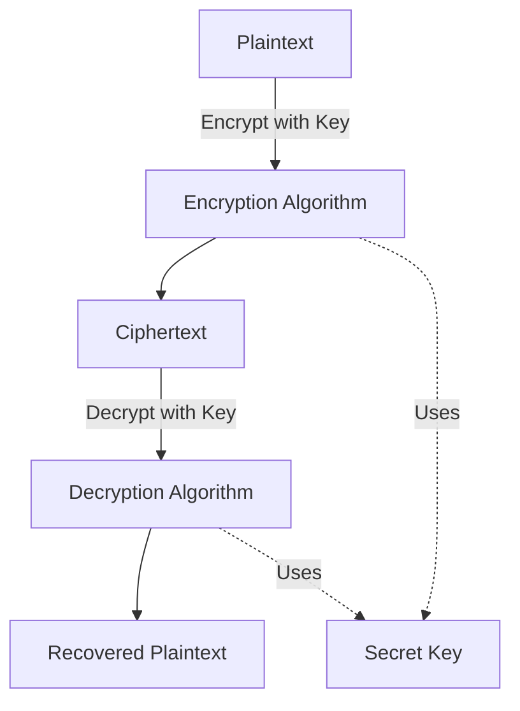
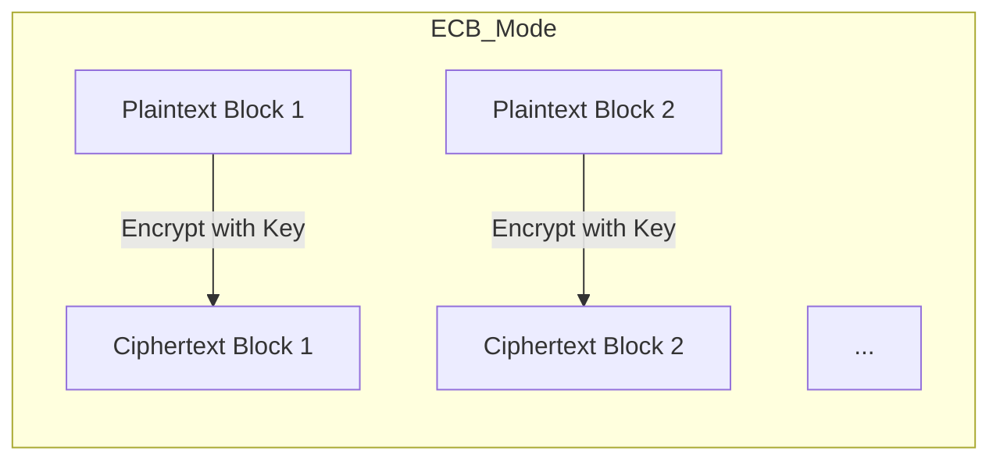
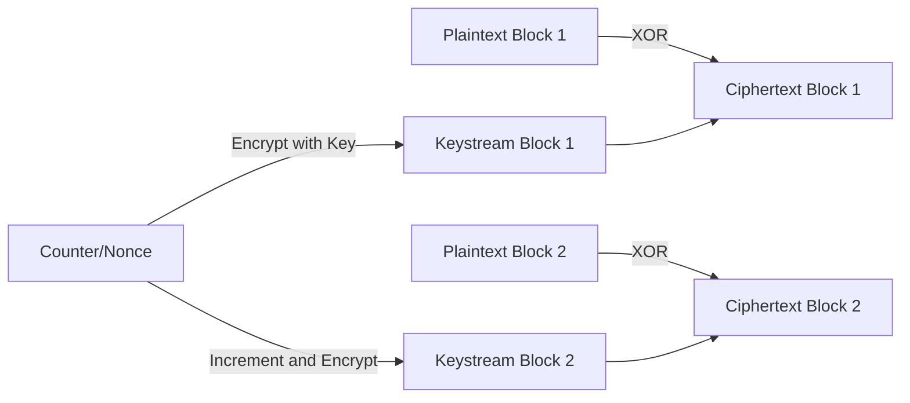
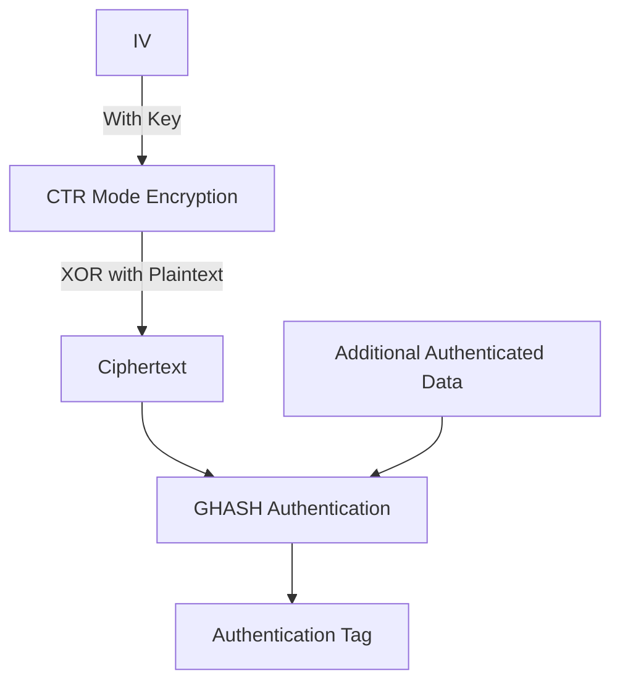
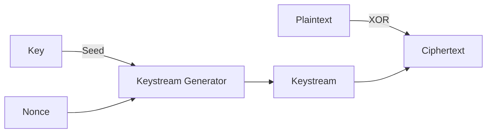
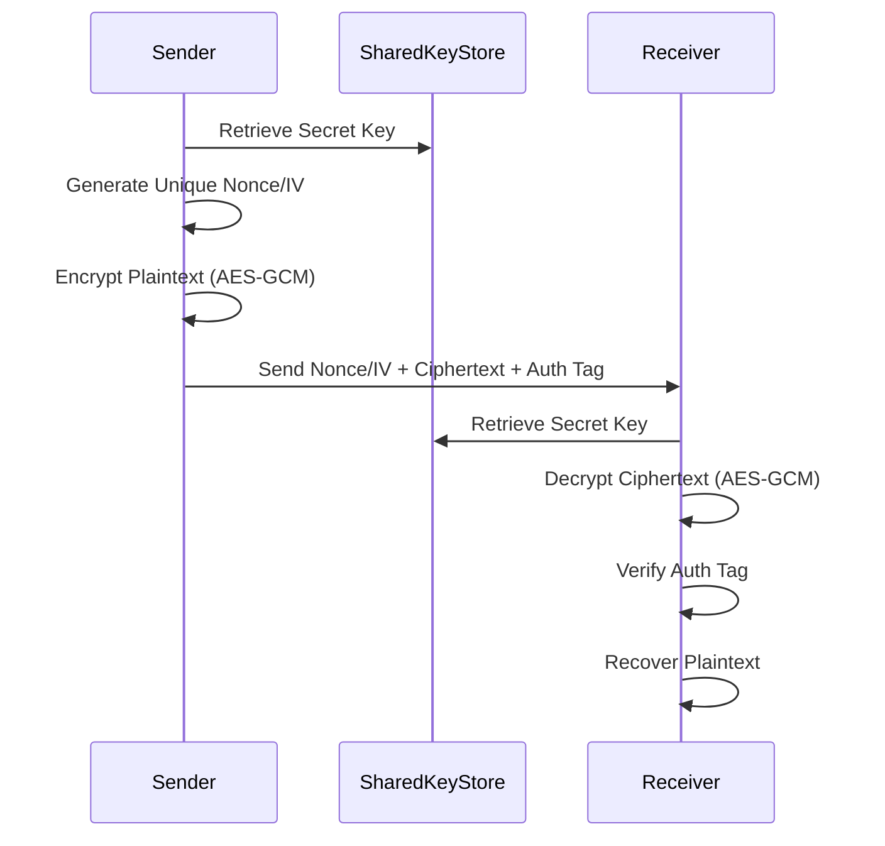

# Symmetric Cryptography

## 1. Introduction

Symmetric cryptography, also known as secret-key cryptography, refers to a class of cryptographic algorithms where encryption and decryption processes are performed using the same secret key. This is in direct contrast with asymmetric (public-key) cryptography, where key pairs (public and private) are distinct. Symmetric algorithms are foundational to modern data protection, being employed in protocols for data confidentiality, secure communications, disk encryption, and more.

This primer aims to provide security engineers with a comprehensive technical understanding of symmetric cryptography, including its foundations, construction, typical uses, and engineering considerations in practice.

---

## 2. Core Concepts and Terminology

### 2.1 Plaintext, Ciphertext, and Keys

- **Plaintext**: The original, readable data or message to be encrypted.
- **Ciphertext**: The transformed, unreadable output of the encryption process.
- **Key**: A secret value required for both encryption and decryption. Key secrecy is fundamental to security.

### 2.2 Symmetry in Cryptography

In symmetric encryption, both sender and receiver must possess the same secret key. The algorithm itself is typically public, with security relying entirely on the secrecy and unpredictability of the cryptographic key.

### 2.3 Types of Symmetric Ciphers

Symmetric ciphers can be broadly categorized as:

- **Block Ciphers**: Operate on fixed-size blocks of data (e.g., 128 bits). Example: AES.
- **Stream Ciphers**: Encrypt data as a continuous stream, often bit-by-bit or byte-by-byte. Example: RC4 (deprecated), ChaCha20.

---

## 3. Symmetric Cipher Architecture

### 3.1 Generic Symmetric Encryption/Decryption Process



### 3.2 Key Features

- **Key Confidentiality**: Both parties require secure key exchange/storage.
- **Speed**: Symmetric ciphers are typically much faster than asymmetric counterparts.
- **Data Volume**: Suited for encrypting large volumes of data.

---

## 4. Block Ciphers: Theory and Modes

### 4.1 Block Cipher Overview

Block ciphers (e.g., AES, DES, 3DES, Camellia) divide plaintext into blocks of a specified size and transform each using a deterministic algorithm and the secret key. Block ciphers are 'deterministic' (identical plaintext-block/key pairs yield identical ciphertexts) unless randomized by a mode of operation.

### 4.2 Block Cipher Modes of Operation

Modes of operation define how block ciphers are applied to data of arbitrary length and how blocks interact. Selection of the mode directly affects security properties, such as error propagation and authenticity.

#### 4.2.1 Electronic Codebook (ECB)

Each block of plaintext is encrypted independently. Not recommended for most purposes due to direct pattern leakage.



> **GitHub Alert**
> :warning: **Warning:** ECB mode should *never* be used for encrypting sensitive data; patterns in plaintext are reflected in ciphertext, allowing information leakage.

#### 4.2.2 Cipher Block Chaining (CBC)

Each block is XOR'ed with the previous ciphertext block before encryption; the first block uses an Initialization Vector (IV).

```mermaid
flowchart LR
    IV[IV] -->|XOR| X1[XORed Block 1]
    P1[Plaintext Block 1] -->|XOR with IV| X1 -->|Encrypt with Key| C1[Ciphertext Block 1]
    C1 -->|XOR| X2[XORed Block 2]
    P2[Plaintext Block 2] -->|XOR with C1| X2 -->|Encrypt with Key| C2[Ciphertext Block 2]
    C2 -->|...|
```

- **IV**: Must be unique and unpredictable for each encryption session.

> **GitHub Alert**
> :information_source: **Tip:** Never reuse IVs with the same key; this can lead to serious vulnerabilities.

#### 4.2.3 Counter (CTR)

Treats the block cipher as a stream cipher. Encrypts a counter value, XORs the result with the plaintext block.



Advantages:
- Supports parallelization.
- Errors affect only the corresponding block.

#### 4.2.4 Galois/Counter Mode (GCM)

Provides authenticated encryption (confidentiality + integrity). Combines CTR-mode encryption with a Galois field-based message authentication code (MAC).



- Widely used in TLS and VPN protocols.
- Provides protection against tampering (authenticity/integrity).

> **GitHub Alert**
> :information_source: **Note:** Authenticated encryption (e.g., GCM, CCM) is highly recommended over basic confidentiality-only modes like CBC or ECB.

#### 4.2.5 Other Modes

- **CFB (Cipher Feedback)**
- **OFB (Output Feedback)**
- **CCM (Counter with CBC-MAC):** Combines CTR for encryption and CBC-MAC for authentication.

---

## 5. Stream Ciphers

Unlike block ciphers, stream ciphers generate a pseudo-random keystream, typically by seeding with a key and a nonce/IV, and XOR this keystream with the plaintext.

- Common algorithms: **RC4** (deprecated), **Salsa20/ChaCha20** (preferred in modern protocols).
- Applications: Encryption of low-latency streams (e.g., real-time voice, video).



> **GitHub Alert**
> :warning: **Caution:** Avoid RC4 and other legacy stream ciphers due to known vulnerabilities; use ChaCha20 or other cryptographically secure algorithms.

---

## 6. Key Management

Secure key management is critical for symmetric cryptography:

### 6.1 Key Distribution

- **Pre-shared keys**: Distributed out-of-band or provisioned during setup.
- **Key exchange protocols**: Derive a shared key using asymmetric cryptography (e.g., Diffie-Hellman key exchange in TLS).

### 6.2 Key Lifetimes

- Shorter key lifetimes reduce exposure if a key is compromised.
- Key rotation policies are important for long-term security.

### 6.3 Key Storage

- Never store keys in plaintext.
- Use hardware security modules (HSMs), secure enclaves, or trusted platform modules (TPMs) for sensitive key storage.

### 6.4 Key Derivation

- Key Derivation Functions (KDFs) expand or harden keys for different purposes (e.g., PBKDF2, HKDF, bcrypt, scrypt).

---

## 7. Engineering Constraints and Considerations

### 7.1 Performance

- Symmetric ciphers generally offer greater throughput and lower latency compared to asymmetric algorithms.
- Hardware acceleration (e.g., AES-NI) is widely available.
- Choice between block and stream ciphers depends on application needs (block ciphers for storage, stream ciphers for real-time streams).

### 7.2 Integration Points

- **Software integration**: Symmetric algorithms are widely available in cryptographic libraries (e.g., OpenSSL, Crypto++, libsodium).
- **Programmable hardware**: Implemented in smart cards, TPMs, and embedded devices.

### 7.3 Implementation Challenges

- Random IV/nonce generation is a frequent source of errors.
- Correct padding in block cipher modes (e.g., PKCS#7 for CBC).
- Proper use of authenticated encryption to prevent confidentiality and integrity breaches.

### 7.4 Common Pitfalls

- Key reuse across different data sets or protocols.
- Insecure mode selection (using ECB or static IV/nonce).
- Failure to authenticate encrypted data (leaving systems open to active attacks).

> **GitHub Alert**
> :warning: **Warning:** Many high-profile cryptographic failures in industry are due to misconfigured modes, weak keys, or reuse of nonces/IVs.

---

## 8. Security Assumptions and Attack Models

### 8.1 Assumptions

- **Secret Key**: All security derives from the secrecy and unpredictability of the key.
- **Algorithmic Soundness**: Security proofs often assume a strong, non-broken underlying block/stream cipher.

### 8.2 Attack Types

- **Brute-force attacks**: Try all possible keys; mitigated by sufficient key size (AES-128 minimum).
- **Chosen-plaintext/ciphertext attacks**: Modern ciphers/modes are designed to resist these in defined threat models.
- **Side-channel attacks**: Exploit implementation leakage (e.g., timing attacks).
- **Related-key attacks**: Weak KDFs or key derivation logic.

---

## 9. Standards and Protocols

Symmetric cryptography is incorporated in numerous standards and protocols. The most notable include:

- **NIST SP 800-38A**: Recommendation for block cipher modes.
- **FIPS 197**: Defines AES.
- **RFC 5116**: Authenticated encryption modes for the Internet.
- **ISO/IEC 18033-3**: Block cipher specifications.
- **TLS**: Uses AES-GCM, ChaCha20-Poly1305.
- **IPsec**: Employs AES-CBC, AES-GCM.
- **IEEE 802.11i (WPA2/WPA3)**: Uses CCMP (AES-CCM).

---

## 10. Example Workflow: Secure Message Transmission



---

## 11. Advanced Topics and Emerging Trends

### 11.1 Authenticated Encryption (AE/AEAD)

- Combines confidentiality (encryption) and authenticity (message integrity).
- AEAD modes (e.g., GCM, OCB, ChaCha20-Poly1305) are modern best practice.

### 11.2 Post-Quantum Considerations

- Symmetric key sizes (e.g., AES-256) are not as susceptible to quantum advances as asymmetric algorithms, though Grover's algorithm theoretically halves the effective key size.

### 11.3 Side-channel Resistance

- Hardware and software implementations must guard against timing, power analysis, and cache side-channel attacks.

---

## 12. Visual Summary

```mermaid
graph TD
    A[Symmetric Cryptography]
    A --> B[Block Ciphers]
    A --> C[Stream Ciphers]
    B --> D[AES]
    B --> E[DES/3DES (legacy)]
    C --> F[RC4 (deprecated)]
    C --> G[ChaCha20]
    B --> H[Modes of Operation]
    H --> I[ECB]
    H --> J[CBC]
    H --> K[CTR]
    H --> L[GCM]
    A --> M[Use Cases]
    M --> N[Data Confidentiality]
    M --> O[Disk Encryption]
    M --> P[Network Protocols]
```

---

## 13. Conclusion

Symmetric cryptography is essential to the secure operation of nearly all modern information systems. Its speed, efficiency, and mathematical robustness make it ideal for data-at-rest and data-in-motion. However, operational security relies not just on cryptographic primitives but also on secure key management, appropriate algorithm/mode selection, and careful system implementation.

Security engineers must be aware of both the underlying concepts and the practical nuances to effectively design, implement, and maintain cryptographically secure systems. Adherence to current standards and cryptographic best practices is critical to defending against evolving threats.