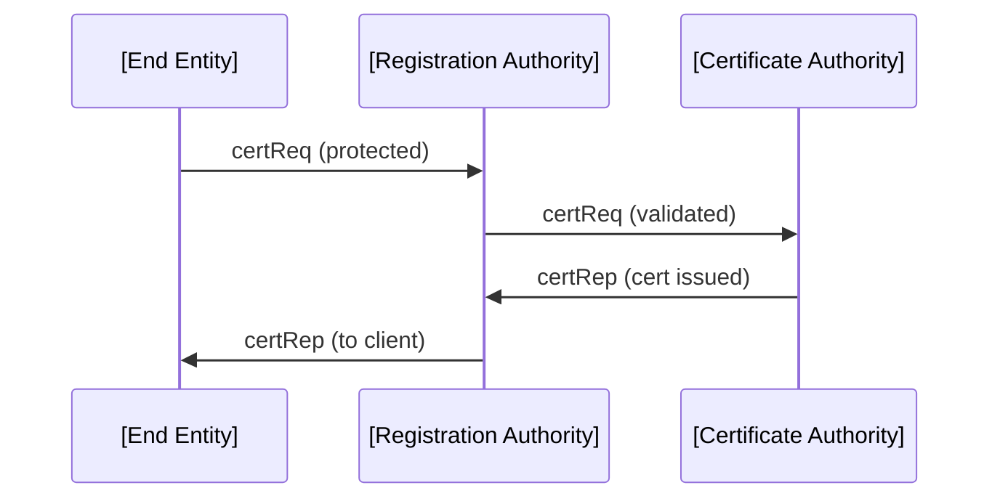
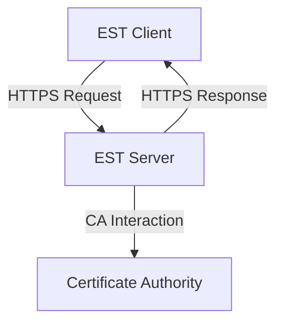
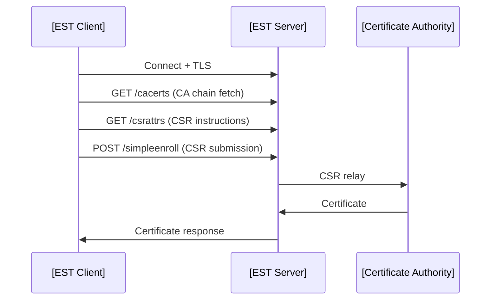

# Introduction

Automated certificate enrollment protocols are fundamental to secure device onboarding in scalable environments, especially within Public Key Infrastructure (PKI) ecosystems. In this context, two protocols—Certificate Management Protocol (CMP) and Enrollment over Secure Transport (EST)—play crucial roles. Both are standardized mechanisms designed to replace manual X.509 certificate request and provisioning procedures with automated, interoperable, and secure workflows.

In this document, we provide a comprehensive, technical overview of CMP and EST in the context of PKI-based device provisioning. The discussion covers protocol architecture, operational flow, security considerations, practical deployments, points of integration, as well as differences and typical use cases.

# Automated Certificate Enrollment: Technical Context

## The Challenge

PKI-enabled infrastructures require all devices (clients) to hold X.509 certificates for cryptographic identities supporting authentication, digital signatures, and confidentiality. Manual certificate management is error-prone, inefficient, and unscalable, especially for:

- Fleet onboarding (IoT, enterprise endpoints)
- Dynamic cloud workloads
- Supply chain equipment
- Large-scale VPNs and 802.1X deployments

To address these challenges, standardized, interoperable, and automatable protocols—CMP and EST—were developed and widely adopted, each optimized for different operational environments and use cases.

## Positioning and Scope

Both CMP and EST serve to automate the secure end-to-end lifecycle of X.509 certificates with a Certificate Authority (CA), including:

- Initial certificate enrollment (bootstrapping identity)
- Certificate renewal/rekeying
- Certificate update
- Revocation and management

While sharing common objectives, they differ markedly in architectural choices, message encoding, security models, transport mechanisms, extensibility, and target use cases.

# CMP: Certificate Management Protocol

## Definition and Standards

Certificate Management Protocol (CMP) is a versatile protocol standardized by the IETF in [RFC 4210](https://datatracker.ietf.org/doc/html/rfc4210) and updated in [RFC 9483](https://datatracker.ietf.org/doc/html/rfc9483). CMP enables comprehensive PKI operations over potentially untrusted networks, designed to operate on top of various transport mechanisms.

### Core Concepts and Protocol Architecture

- **ASN.1 Encoding**: CMP is built on ASN.1 DER-encoded payloads following PKIX standards.
- **Transport-independent**: CMP can operate over TCP, HTTP, or custom transports. Security is usually provided at the protocol layer (e.g., through message signatures/MACs).
- **Operational Flexibility**: Supports all major PKI functions—initial registration, certificate updates, key recovery, revocation, and status queries.
- **Authentication**: Relies on mechanisms such as shared secret (password-based MAC), pre-issued certificates (signature-based), or out-of-band authentication.

### Components

- **End Entities (Clients):** Devices or users requesting certificate operations.
- **Registration Authority (RA):** Optional. Intermediates between client and CA, performing policy enforcement and vetting.
- **Certificate Authority (CA):** Entity that validates requests and issues certificates.

#### CMP Operational Overview

```mermaid
flowchart LR
    A[End Entity] -->|PKIRequest| B[RA]
    B -->|PKIRequest (optional)| C[CA]
    C -->|PKIResponse| B
    B -->|PKIResponse| A
```

### Protocol Workflow

1. **Initialization**: The end entity generates a key pair and a certificate signing request (CSR).
2. **Protection**: The request is cryptographically protected (MAC/authenticated signature).
3. **Transport**: The CMP message is sent to the RA or CA (transport-agnostic).
4. **Validation**: RA/CA authenticates, verifies, and authorizes the request.
5. **Issuance**: CA issues the certificate, which is returned via a protected response.
6. **Follow-up**: Optional operations (revocation, key update, status inquiry).

#### Example CMP Message Exchange (Enrollment)



## CMP Protection Mechanisms

CMP enforces integrity, authenticity, and optional confidentiality:

- **Password-based MAC**: For initial enrollment, a shared secret may be used.
- **Digital Signatures**: Preferred for certificate-based mutual authentication.
- **Cryptographic Binding**: Requests and responses are bound using transaction IDs, nonces, and explicit cryptographic protection.

### Integration and Deployment Considerations

- **Transport Flexibility**: Adapts to different network architectures and security PPE requirements.
- **RA Placement**: RAs can be organizational (internal) or public, affecting trust and policy.
- **Message Size**: ASN.1 DER encoding leads to compact binaries but requires ASN.1 parsing libraries.
- **Complexity**: Versatile but non-trivial to implement; best suited for environments needing flexible PKI workflows (e.g., telecom, military, enterprise, IoT with custom constraints).

> [!CAUTION]
> CMP's cryptographic complexity and extensive ASN.1 requirements can introduce integration challenges when implementing in constrained environments or with limited PKI stack support.

### Key Extensions and Enhancements

CMP is often extended via CMPv2 features:

- **Key Escrow and Recovery**: Built-in support
- **Cross-certification and PKI Provisioning**: For complex trust federations
- **Proof-of-Possession (PoP)**: Strong, standardized methods

# EST: Enrollment over Secure Transport

## Definition and Standards

Enrollment over Secure Transport (EST) is defined in [RFC 7030](https://datatracker.ietf.org/doc/html/rfc7030), offering a streamlined, HTTP/HTTPS-based X.509 certificate enrollment protocol. EST leverages existing web infrastructure (TLS and HTTP) to lower deployment complexity, especially for automated device enrollment.

### Core Concepts and Protocol Architecture

- **RESTful over HTTPS**: EST uses well-defined RESTful endpoints (URLs) and leverages HTTPS.
- **Security Model**: Relies on TLS for transport-level security; strong mutual authentication is encouraged.
- **Encoding**: Messages are typically encoded in PKCS#10 (CSRs), X.509 (certificates), and ASN.1/DER (for requests and responses).
- **Simplicity and Integration**: Designed to be lighter-weight and easier to integrate, especially where HTTP stacks are available.

### Components

- **EST Client**: Device or software component initiating enrollment.
- **EST Server**: Typically an HTTP(S) server acting as RA or sitting in front of a CA.

#### EST System Overview



### Protocol Workflow

1. **Bootstrap/Discovery**: The client discovers/contacts EST endpoints (e.g., `/.well-known/est/` URLs).
2. **TLS Channel Establishment**: Client and server mutually authenticate over TLS (using certificates or username/password for bootstrap).
3. **Simple Enrollment**: The client sends a PKCS#10 CSR to the server’s `/simpleenroll` endpoint.
4. **Certificate Issuance**: Server validates and proxies the request to the CA, returning the signed certificate to the client.
5. **Renewal/Rekey**: Handled over specific endpoints (e.g., `/simplereenroll`).
6. **CA Certificates and Trusted Roots**: EST provides mechanisms to retrieve CA and intermediate certificates (`/cacerts`).
7. **CSR Attributes Discovery**: Clients may fetch required CSR attributes (`/csrattrs`).

#### Canonical EST Enrollment Sequence



## EST Security and Mutual Authentication

- **Channel Security**: All transactions are over HTTPS, ensuring confidentiality and authenticity.
- **Bootstrap Auth**: Initial enrollment may use TLS with anonymous, one-time, or manufacturer certificates; more protected flows require client authentication.
- **Credential Provisioning**: EST can support the "bootstrapping" problem, possibly via certificate-less TLS or temporary authentication.

> [!WARNING]
> Initial trust establishment ("bootstrap problem") remains a critical vulnerability. It is essential to ensure the authenticity of client bootstrap credentials to mitigate machine-in-the-middle and rogue device attacks.

## Engineering and Deployment Considerations

- **RESTful Integration**: EST is amenable to modern web-based environments, leveraging proxy, load balancing, and web security infrastructure.
- **TLS Infrastructure**: EST's reliance on TLS puts the onus on building and maintaining a robust PKI-backed TLS infrastructure.
- **Simplicity of Client Implementation**: The use of HTTP(S) and reduced ASN.1 parsing complexity make EST client implementations more tractable for constrained environments.
- **Extensibility**: EST was designed with extensibility via new endpoints and headers; myriad profiles for device onboarding, including lightweight EST (LES), are in development or already standardized (see [RFC 8954](https://datatracker.ietf.org/doc/html/rfc8954)).
- **Certificate Renewal/Update**: Renewals and re-keys occur over secure endpoints, following similar workflows as initial enrollment.
- **Threat Surfaces**: EST depends strongly on web security best practices; improper web server configuration, weak TLS ciphersuites, or mismanaged CA roots can compromise enrollment processes.

# Comparative Analysis: CMP vs. EST

CMP and EST target overlapping domains, but their respective virtues and disadvantages are well-characterized.

| Feature                | CMP                                      | EST                                      |
|------------------------|------------------------------------------|------------------------------------------|
| Standards              | RFC 4210, RFC 9483                       | RFC 7030, RFC 8954                       |
| Encoding               | ASN.1/DER (PKIMessage)                   | PKCS#10 (CSR), ASN.1, X.509, base64      |
| Transport              | Flexible: TCP, HTTP, custom              | Strict: HTTP(S)                          |
| Security Layer         | Protocol/Message cryptography            | HTTPS/TLS session                        |
| RA Functionality       | Fully integrated and fine-grained         | Typically via EST server                 |
| Extensibility          | High (complex PKI/HSM integration)       | Medium (other endpoints via REST)         |
| Implementation Effort  | High (ASN.1 + crypto state machine)      | Lower (HTTP-centric, RESTful)            |
| Target Environments    | Telecom, enterprise, federations, IoT    | Web native, IoT, cloud/edge onboarding   |

## Architectural Overview

```mermaid
graph TD
    A1[Device (Client)] -->|CMP| B1[CMP Server]
    B1 --> C1[RA/CA]
    A2[Device (Client)] -->|EST (HTTPS)| B2[EST Server]
    B2 --> C2[CA]
```

# Typical Workflows in Practice

## Device Onboarding via CMP

- Devices provisioned with a one-time password (OTP) or shared secret for the initial MAC-protected enrollment.
- CMP client generates key pair, signs a CSR, encapsulates it in a PKIMessage, and submits it.
- RA/CA validates OTP (possibly out-of-band), issues certificate, and returns it in PKIMessage.
- For re-enrollment, devices use their newly provisioned certificate to sign subsequent requests.

## Device Onboarding via EST

- Device is shipped with a manufacturer root or a one-time authentication credential.
- The EST client connects via HTTPS, performs bootstrap authentication, fetches CA roots, obtains CSR attributes.
- Device submits a CSR via `/simpleenroll`; certificate issued and returned.
- Subsequent renewals: Now device uses its certificate for mutual TLS (mTLS), automating renewal flows securely.

## Key Constraints and Engineering Decisions

1. **Initial Trust Anchors**: How does the device establish trust in the first CA interaction? Both protocols require careful provisioning of bootstrap secrets or CA roots.
2. **Scalability**: EST is generally easier to scale within existing web infrastructure but may lack protocol-level protection in some edge cases.
3. **Interoperability**: CMP’s ASN.1 base and broad feature set can create interop issues between implementations.
4. **Policy Enforcement**: In CMP, the RA is explicitly formalized, allowing for detailed policy checks before CA operations; EST may require such logic at the EST server/gateway.

> [!TIP]
> When selecting between CMP and EST, consider: the technical environment (web/REST vs. legacy), available cryptography stacks, typical device constraints, required policy enforcement, and the sophistication of organizational PKI operations.

# Limitations, Potential Pitfalls, and Implementation Challenges

## Bootstrap Security

The most common vulnerability in automated certificate enrollment is the initial trust/identity assertion phase. Strong out-of-band validation, hardware-protected key storage, or manufacturer-anchored credentials (*e.g.,* IDevID for 802.1AR) significantly reduce risk.

## PKI Stack Complexity

CMP's ASN.1 machinery can create operational friction; debugging, upgrading, or cross-vendor PKI integrations may require significant testing.

EST is simpler but not immune; strict adherence to TLS best practices and correct parsing of ASN.1 data (CSR/CA certs) remains critical.

## Key Management

Both protocols assume robust local key management—private key material must be generated and protected on-device, ideally using secure elements or TPMs.

## RA Trust Boundaries

In architectures with a Registration Authority, integrity and authorization of the RA are paramount. Compromised or misconfigured RAs can enable unauthorized device enrollment or privilege escalation.

# Emerging Trends and Variations

- **Lightweight EST (LES):** Targeting IoT and constrained environments ([RFC 8954]).
- **BRSKI Extensions:** Extension to EST to support automated bootstrapping using voucher-based trust anchors ([RFC 8995](https://datatracker.ietf.org/doc/html/rfc8995)).
- **CMP over HTTP**: Recent updates in CMP recommend HTTP/S as a preferred transport for broader compatibility (see RFC 9483).
- **Integration With MDM and Device Management Platforms:** Both protocols are now core to modern device management and mobile device management (MDM) products.

# Summary Table: Use Case Fit

| Use Case                        | CMP Suitability    | EST Suitability    |
|----------------------------------|-------------------|-------------------|
| Telecom PKI                     | High              | Low               |
| IoT Secure Bootstrapping        | High              | Medium–High (LES) |
| Enterprise Web App Provisioning  | Medium            | High              |
| Cloud Device/VM Enrollment      | Medium            | High              |
| Heterogeneous/Legacy Environments| High              | Medium            |

# Conclusion

CMP and EST are foundational protocols that enable secure, scalable, and automated device enrollment into PKI infrastructures. CMP provides maximum flexibility, completeness, and protocol-level cryptographic protection, making it suitable for environments requiring fine-grained control and expansive PKI features. EST, by adopting web-native paradigms, simplifies integration, especially in cloud, enterprise, and modern edge/IoT deployments.

The selection between CMP and EST must reflect operational needs, device capabilities, infrastructure design, and security requirements. The protocols are not mutually exclusive; hybrid PKI architectures often leverage both depending on context. Understanding their technical nuances enables security engineers to architect robust device onboarding pipelines tailored to high-assurance, large-scale deployments.

> [!NOTE]
> Diagram to be added later: Detailed PKI bootstrapping flow for constrained IoT device using EST with BRSKI.

# End of Document