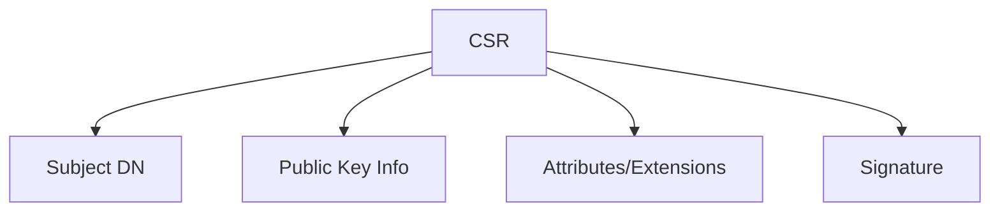
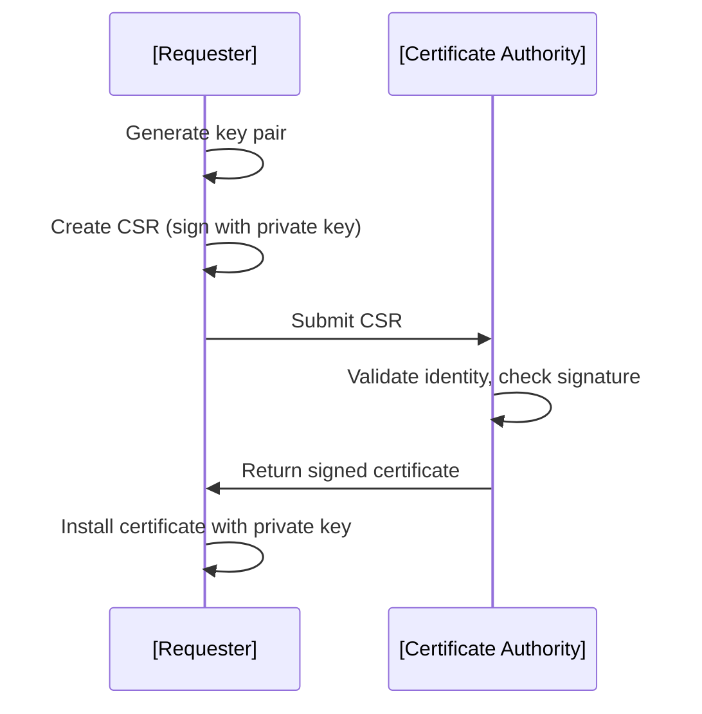
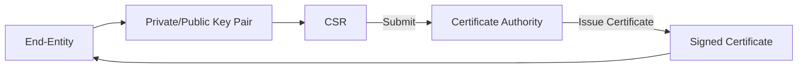

# Certificate Signing Requests (CSRs)

## 1. Introduction

Certificate Signing Requests (CSRs) are fundamental artifacts in Public Key Infrastructure (PKI) workflows. They serve as a standard way to request the issuance of a digital certificate from a Certificate Authority (CA) by securely conveying the applicant's public key and identity information. CSRs play a pivotal role in establishing trust, confidentiality, and integrity in digital communications.

## 2. Technical Context and Purpose

In PKI systems, the process of issuing a certificate begins with a request generated by an entity (e.g., server, user, device). The CSR encapsulates the entity’s public key and identity in a cryptographically verifiable format, ensuring that only the legitimate owner can request certification for their own key. The CSR is subsequently sent to a CA, which validates the requester's identity, signs the certificate, and returns it to the requester or makes it available for download.

This process is central to most usages of X.509 certificates, including TLS/SSL, code-signing, email protection, and client authentication.

## 3. Core Concepts and Components

### 3.1 Structure of a CSR

A CSR is most commonly formatted according to the PKCS #10 standard (RFC 2986). The main fields include:

- **Subject Distinguished Name (DN):** Identity information such as Common Name (CN), Organization (O), Country (C), etc.
- **Subject Public Key Information:** The public key and associated algorithm parameters.
- **Optional Attributes:** Fields such as Subject Alternative Names (SAN), key usage extensions, and other metadata.
- **Signature:** A digital signature over the preceding data, generated using the requester’s private key.

#### CSR Structure Overview



A typical PKCS #10 CSR is encoded in ASN.1 and usually presented in PEM or DER formats.

### 3.2 CSR Signing Process

The digital signature in the CSR serves two purposes:
1. Demonstrates possession of the private key corresponding to the included public key.
2. Ensures the integrity of the identity and key data.

The CA, upon receipt, verifies the signature before processing the request.

### 3.3 Relevant Standards

- **PKCS #10 (RFC 2986):** CSR format specification.
- **X.509 (ITU-T Rec. X.509):** Certificate standard that includes definitions for DNs and certificate extensions.
- **RFC 5280:** Profiles the use of X.509 certificates in the Internet PKI.

## 4. CSR Generation and Submission Workflow

### 4.1 Typical Workflow

1. **Key Pair Generation:** The requester generates a private and public key. Private key remains local.
2. **CSR Creation:** Using the public key and identity information, a CSR is created and signed with the private key.
3. **Submission to CA:** CSR is transmitted to the CA by secure means.
4. **Validation:** CA verifies the submitted data and checks the signature.
5. **Certificate Issuance:** Upon successful validation, the CA signs and issues a certificate containing the submitted public key.
6. **Retrieval and Installation:** The issued certificate is retrieved by the requester and installed alongside the private key.

#### End-to-End CSR Process Flow



### 4.2 Submission Methods

CSRs may be transmitted through various channels:

- Web portals (manual upload)
- Automated APIs (e.g., ACME protocol, SCEP)
- Email or secure file transfer

**GitHub Alert**
> ⚠️  **Caution:** Never transmit private keys to the CA. Only the CSR (containing the public key) is submitted.

## 5. Anatomy of a CSR: Example

Below is an example of a PEM-encoded CSR:

```
-----BEGIN CERTIFICATE REQUEST-----
MIICmzCCAYMCAQAwgYkxCzAJBgNVBAYTAlVTMQswCQYDVQQIDAJDQTESMBAGA1UE
BwwJU2FuIFJhZmFlbDETMBEGA1UECgwKU2VjdXJpdHkgQ28xEjAQBgNVBAsMCVRF
U1QgT1VUMRQwEgYDVQQDDAtleGFtcGxlLmNvbTEfMB0GCSqGSIb3DQEJARYQaW5m
b0BleGFtcGxlLmNvbTCCASIwDQYJKoZIhvcNAQEBBQADggEPADCCAQoCggEBAKM7
...
-----END CERTIFICATE REQUEST-----
```

This request can be decoded using tools such as OpenSSL to examine its fields.

## 6. Lifecycle of a CSR

### 6.1 Creation

- Initiated by applicants seeking certification for a new public key.

### 6.2 Submission & Validation

- Sent to CA for validation, which may include:
  - Domain ownership proofs (for SSL/TLS)
  - Organizational validation (for OV/EV certificates)
  - Manual vetting or automated challenge-response (e.g., ACME challenges)

### 6.3 Certificate Issuance

- CA signs the certificate upon successful validation.

### 6.4 Post-Issuance

- The CSR has no further use after certificate issuance, but may be retained for audit or troubleshooting.

**GitHub Alert**
> 💡  **Tip:** Retain CSRs for future reference or troubleshooting, especially in regulated environments requiring audit trails.

## 7. Constraints, Assumptions, and Engineering Variations

### 7.1 Security Constraints

- The private key must never be shared or transmitted outside the generating environment.
- The CSR signature algorithm (e.g., SHA-256, SHA-384) should align with security requirements and CA policies.

### 7.2 Common Variations

#### a. Extensions and Attributes

Subject Alternative Names (SANs), key usage, and other extensions can be embedded in CSRs as attributes. Some CAs require SANs for multi-domain or wildcard certificates.

#### b. Protocol Variations

- **ACME (Automatic Certificate Management Environment; RFC 8555):** Enables automated issuance and renewal of certificates, carrying CSRs over REST APIs.
- **SCEP (Simple Certificate Enrollment Protocol):** Used primarily for device enrollment in enterprise PKI.
- **Enrollment over Secure Transport (EST; RFC 7030):** Modern replacement for SCEP providing certificate enrollment over HTTPS.

**GitHub Alert**
> ℹ️  **Note:** Some protocols (notably ACME) permit automated validation and renewal, significantly reducing operational overhead.

### 7.3 Specialized CSR Types

- **Certificate Renewal:** Automated processes may create new CSRs for certificate renewals, key rotation, or algorithm upgrades.
- **Attribute Certificates:** Sometimes, CSRs are used to request non-traditional X.509 certificates such as attribute certificates conveying roles or privileges.

### 7.4 Implementation Considerations

#### a. CSR Generation Tools

Widely used tools:
- **OpenSSL:** Most common in Linux/Unix environments.
- **certreq:** Native to Windows.
- **Java keytool:** For Java-based environments.
- **Vendor SDKs/APIs:** For IoT, embedded, or specialized devices.

#### b. Validation Policies

CA validation procedures depend on certificate type (DV, OV, EV), jurisdiction, and applicable standards. Custom policies may require customized CSR fields.

#### c. Error Handling

- CAs may reject CSRs for format errors, unsupported extensions, weak algorithms, or mismatched identity information.
- Requesters should implement robust error logging and feedback for failed requests.

#### d. Auditing and Compliance

In regulated environments, tracking the lifecycle of CSRs and associated certificates may be mandatory.

## 8. Practical Engineering Pitfalls

- **Key Compromise:** If the private key used for generating the CSR is leaked or lost after CSR submission but before certificate issuance, the entire process must be restarted with a new key pair.
- **CSR Misconfiguration:** Failing to specify required SANs or using incorrect subject names can result in unusable certificates.
- **Algorithm Deprecation:** Using outdated algorithms (e.g., SHA-1, RSA < 2048 bits) can lead to CA rejection.
- **CA Policy Mismatch:** Not all CAs support all possible CSR extensions or attributes. Check CA documentation carefully.

**GitHub Alert**
> ⚠️  **Warning:** A certificate is only as secure as its private key. Any compromise before or after CSR submission invalidates the entire trust chain.

## 9. CSR in the PKI Architecture

Below is a simplified architecture diagram showing where CSRs fit in a PKI system.



## 10. Summary

A Certificate Signing Request is a critical artifact that enables secure, authenticated certificate issuance in PKI systems. Security engineers must understand CSR structure, signature mechanisms, and supported protocols. Attention to workflow, compliance, and technical constraints is required to avoid common pitfalls and ensure robust, secure certificate management.

---

**End of Document**