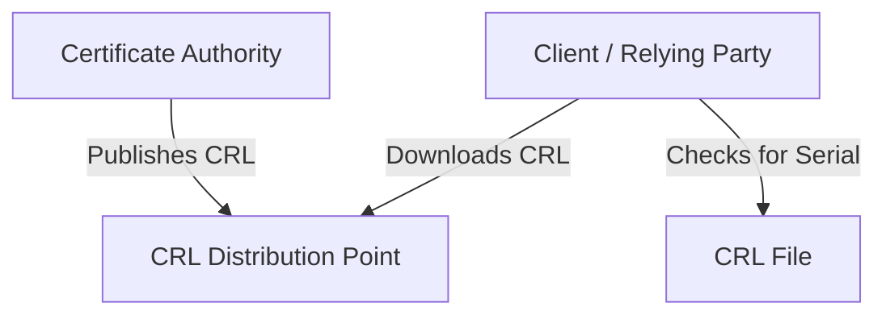
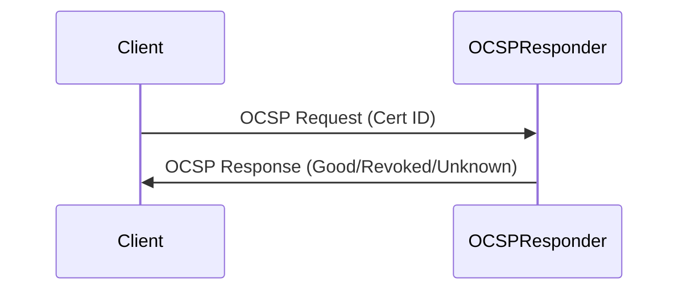
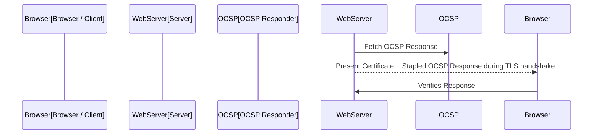
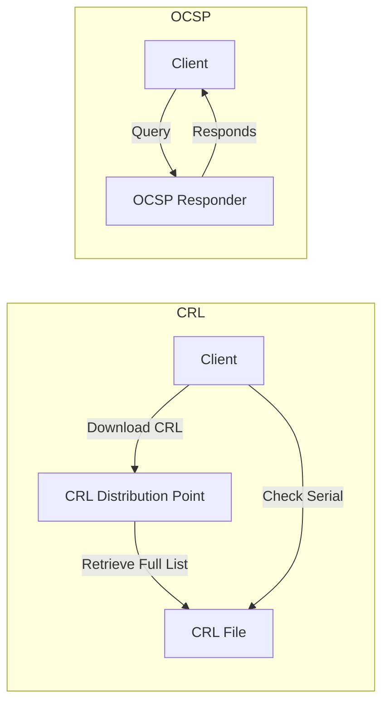

# OCSP and CRLs

## 1. Introduction: Context and Motivation

Public Key Infrastructures (PKIs) are foundational to modern security architectures, providing mechanisms for secure digital identity validation, encrypted communications, and data integrity. Central to PKI is the concept of digital certificates—typically X.509 certificates—which bind a public key to an entity (person, device, or service). However, certificates are sometimes rendered invalid before their designated expiration dates, most commonly due to private key compromise, CA (Certificate Authority) error, or change of ownership. As a result, relying parties require robust mechanisms to determine whether a given certificate remains trustworthy at the time of use.

Two primary mechanisms exist for this certificate status checking:

- Certificate Revocation Lists (CRLs)
- Online Certificate Status Protocol (OCSP)

Both are vital in ensuring the ongoing trustworthy operation of PKI systems, each with its distinct operational implications, strengths, and limitations.

---

## 2. Certificate Revocation: The Problem and Its Stakes

Certificates may need to be revoked for a range of reasons:

- **Key compromise**: The private key associated with the certificate is leaked, stolen, or exposed.
- **CA compromise or error**: The PKI itself issues a certificate in error, or is compromised.
- **Change in relationship**: For example, an employee leaves an organization or a subject's responsibilities change.
- **Superseding or reissuing certificates**: Operational upgrades and changes necessitate new certificates.

Relying parties (clients, servers, devices, etc.) must ensure they do not trust certificates that have been revoked, or they risk accepting communications from malicious actors or compromised systems.

---

## 3. Certificate Revocation Lists (CRLs)

### 3.1. Definition and Structure

A **Certificate Revocation List (CRL)** is a time-stamped, digitally signed list produced and periodically published by a CA, enumerating certificates that are no longer valid.

- **Format**: CRLs are defined by [RFC 5280](https://datatracker.ietf.org/doc/html/rfc5280) (Section 5). 
- **Contents**: Each CRL includes:
  - The issuing CA’s identifier
  - CRL number (for versioning)
  - ThisUpdate and NextUpdate timestamps
  - A list of revoked certificate serial numbers and their revocation dates
  - (Optional) reason codes for each revocation
  - The digital signature over the list

### 3.2. Distribution and Retrieval

- CRLs are typically obtained from locations specified in a certificate’s CRL Distribution Points (CRLDP) extension.
- Distribution methods include HTTP, LDAP, or file-based access.
 
 

### 3.3. Validation Process

Upon receiving a certificate, a relying party fetches the latest applicable CRL and checks whether the certificate’s serial number appears on the list. If present, the certificate is considered revoked.

### 3.4. Parameters & Constraints

- **Timeliness**: CRLs are published at intervals (e.g., hourly, daily). There is a natural lag between revocation and propagation to all clients.
- **Size and Scalability**: Large PKI deployments generate large CRLs, increasing bandwidth and processing requirements.
- **Caching**: Clients often cache CRLs for the duration specified in `NextUpdate`, potentially missing urgent revocations until the cache is refreshed.

> ⚠️ **Caution:** Relying on infrequent CRL updates may expose organizations to risk from recently revoked (e.g. compromised) certificates until all relying parties refresh their CRL caches.

### 3.5. Types of CRLs

- **Full CRL**: Comprehensive, listing all currently revoked certificates.
- **Delta CRL**: Contains only recent changes since the last full CRL.
- **Indirect CRL**: Signed by an entity other than the CA that issued the certificate, e.g., in large PKIs with distributed authority.

### 3.6. Revocation Reason Codes

Common reason codes include:

- Unspecified
- Key compromise
- CA compromise
- Affiliation changed
- Superseded
- Cessation of operation
- Certificate hold

### 3.7. Standards Reference

- **Primary specification**: [RFC 5280: Internet X.509 Public Key Infrastructure Certificate and Certificate Revocation List (CRL) Profile](https://datatracker.ietf.org/doc/html/rfc5280)

---

## 4. Online Certificate Status Protocol (OCSP)

### 4.1. Definition and Core Purpose

The **Online Certificate Status Protocol (OCSP)**, defined in [RFC 6960](https://datatracker.ietf.org/doc/html/rfc6960), is a real-time, client-server protocol by which a relying party queries an OCSP responder to obtain the revocation status of a specific X.509 certificate.

### 4.2. Protocol Overview

Whereas CRL approaches are batch-oriented, OCSP is transactional and certificate-specific.

- **Request**: The client sends an OCSP request containing the certificate’s serial number and the issuer identifier to the OCSP responder.
- **Response**: The OCSP responder provides a signed response indicating the status:
  - **good**
  - **revoked**
  - **unknown**
- **Response signature**: Ensures the result’s authenticity.

### 4.3. Architecture

- **OCSP Responder**: A network service, potentially operated by the CA or by a delegated authority, answering status requests.
- **Location**: The OCSP URI is typically embedded in the certificate’s Authority Information Access (AIA) extension.

### 4.4. Response Types and Caching

- **Basic**: A single response for a single certificate.
- **Batch requests**: Some extensions permit batching multiple status queries in one request.

To minimize load, OCSP responses may contain validity intervals (`thisUpdate`, `nextUpdate`) and can be cached by clients (or via proxies commonly called “OCSP stapling,” see below).

> 💡 **Tip:** Tuning `nextUpdate` intervals helps balance between up-to-dateness and responder resilience against DoS or high traffic.

### 4.5. Security Mechanisms

- **Signed responses**: Each OCSP response is cryptographically signed.
- **Nonce**: To defend against replay attacks, the protocol supports nonces, allowing clients to ensure that a response is fresh.
- **Delegated Responders**: A CA can issue a special certificate to a responder, enabling scalability and separation of duties.

### 4.6. OCSP Stapling (RFC 6066)

OCSP stapling improves performance and privacy. Instead of having each client connect to the OCSP responder, the server itself fetches a fresh OCSP response from the responder and “staples” it to the TLS handshake.

- Reduces responder load and latency
- Improves user privacy (clients do not leak browsing information to respondents)
- Standardized as **TLS Certificate Status Request extension** ([RFC 6066], section 8)

> ℹ️ **Note:** OCSP Must-Staple is an X.509 extension requesting endpoints to present OCSP responses in handshake (enforced mainly by browsers).

---

## 5. Comparative Analysis: OCSP vs. CRL

| Aspect                     | CRL                                     | OCSP                                 |
|----------------------------|-----------------------------------------|--------------------------------------|
| Granularity                | List of revoked certs                   | Single certificate (per request)     |
| Freshness                  | Determined by CRL publishing schedule   | Near real-time                       |
| Distribution               | Downloaded (HTTP, LDAP, etc.)           | Queried online (HTTP)                |
| Bandwidth                  | Large lists, affects initial connection | Small queries/responses              |
| Privacy                    | Client reveals certificates of interest | (Without stapling) exposes usage     |
| Offline use                | Yes, once CRL cached                    | No, except for stapling/caching      |
| Performance impact         | High for large CRLs                     | High under responder load            |
| Deployability in large PKIs| May become unwieldy                     | More scalable, supports delegation   |
| Immediate revocation       | Limited by update interval               | Possible, responder controlled       |

---

## 6. Architecture & Workflow Diagrams

### 6.1. End-to-End Revocation Check (CRL vs OCSP)

---

## 7. Engineering Considerations

### 7.1. Integration Points

- **Browsers and OS**: Most major browsers and OS trust stores natively support both CRL and OCSP, but their default certificate validation strategies differ (see below).
- **Web servers**: Must be configured for OCSP stapling (and to fetch & refresh stapled responses).
- **Enterprise PKIs**: May require on-premises CRL distribution points and/or local OCSP responders.

### 7.2. Performance and Latency

- **CRL**: Downloading large CRLs can slow initial connection setup, especially on constrained links. Subsequent CRL checks are local and fast.
- **OCSP**: Adds live network round trips on first connection; failures to contact the responder may delay or prevent connection.

### 7.3. Fault Tolerance and Failures

- Browsers and clients vary in their treatment of revocation check failures (“soft-fail” vs. “hard-fail”).
- Many browsers default to “soft-fail” for OCSP (i.e., if the responder is unreachable, the certificate is considered valid).
- “Hard-fail” approaches can cause operational outages if CRL or OCSP infrastructure is unavailable.

> 🚨 **Warning:** Be aware that some platforms (notably Windows and Chrome as of 2024) may disregard revocation failures by default, undercutting some threat mitigation unless additional policies are enforced.

### 7.4. Privacy and Information Leakage

When clients query OCSP responders, they potentially reveal browsing patterns and targeted certificates. OCSP stapling and local OCSP peers mitigate this privacy risk.

### 7.5. Availability and Resilience

CRL and OCSP availability are both critical. A loss of access (network, DDoS, or misconfiguration) can disrupt certificate validation and thus the availability of critical services.

- For OCSP, cached responses and stapling reduce responder load and improve fault tolerance.
- For CRLs, ensure distribution points are highly available and use CDNs or redundant infrastructure.

### 7.6. Revocation Effectiveness

Both mechanisms have real-world limitations:

- CRLs: “Window of vulnerability” between CRL issue times.
- OCSP: Risk of responder downtime and “soft-fail” mitigations leading to ignored revocations.

OCSP stapling and “Must-Staple” extensions reduce these limitations but depend on end-to-end implementation.

---

## 8. Implementation Pitfalls and Best Practices

- **Don’t neglect failover**: OCSP and CRL distribution points must be redundant and resilient.
- **Shorten intervals mindfully**: Setting short `NextUpdate` times for CRLs and OCSP responses increases currency but also infrastructure load.
- **Guard against replay**: Enforce OCSP nonce usage, especially for high-risk PKIs.
- **Enable and test stapling**: For TLS, always enable OCSP stapling and “Must-Staple” where supported; test server-side for correct behavior.
- **Monitor for failures**: Logging and alerting on revocation check failures is a baseline operational requirement.
- **Document policy**: Define and enforce certificate revocation policies, including when and why to revoke.

> :warning: **Warning:** Do not assume all clients perform revocation checking consistently. Some embedded or legacy clients may not support either OCSP or CRL, or may fail “open” on errors; explicit platform testing is required.

---

## 9. Relevant Standards and Protocol Specifications

- **CRL (Certificate Revocation List) Definitions**: RFC 5280 (Internet X.509 PKI Certificate and CRL Profile)
- **OCSP (Online Certificate Status Protocol)**: RFC 6960
- **TLS Certificate Status Request (OCSP Stapling)**: RFC 6066, Section 8

---

## 10. Future Directions

### 10.1. OCSP Improvements and Extensions

Work continues to address operational limitations, including:

- _OCSP Must-Staple_ (RFC 7633): an extension requesting servers to staple OCSP responses to TLS handshakes.
- _Short-Lived Certificates_: Reducing dependency on revocation checks by issuing certificates valid for days, or even hours, thus reducing window-of-exposure if compromised.
- Expansion of privacy-preserving revocation status mechanisms.

### 10.2. Alternative Schemes

Emerging distributed PKI models and transparency logs (e.g., Certificate Transparency per RFC 6962) are expected to complement, not fully replace, CRLs and OCSP in the near-term.

---

## 11. Summary

Certificate revocation is essential to maintaining trust in PKI ecosystems. CRLs are traditional, batch-oriented mechanisms suitable for simple or offline-optimized deployments but present timeliness and scalability challenges as ecosystems grow. OCSP, designed for real-time validation, offers higher precision and operational flexibility but at the cost of privacy considerations and increased reliance on highly available online infrastructure. 

Modern best practices incorporate OCSP stapling, monitoring, and periodic policy updates to mitigate the limitations of both approaches. Security engineers must carefully weigh revocation strategy choices in the context of threat models, infrastructure capabilities, and the requirements of their users and relying parties, always confirming actual client implementation behavior in target environments.

---

> [!INFO]
> **Diagram to be added later:** Example for integration into a distributed enterprise environment with redundant OCSP responders and CRL distribution via CDN.