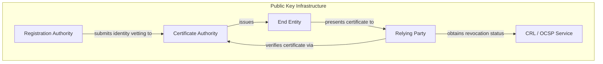
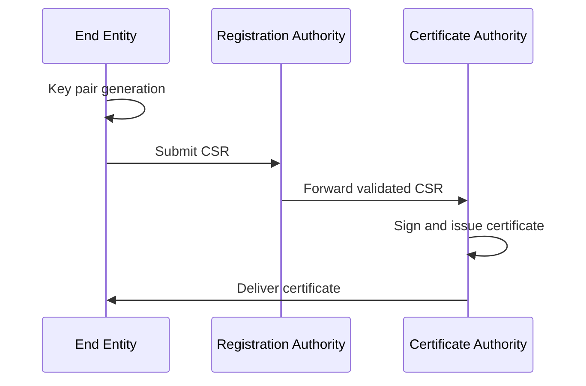
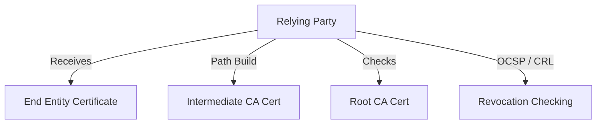
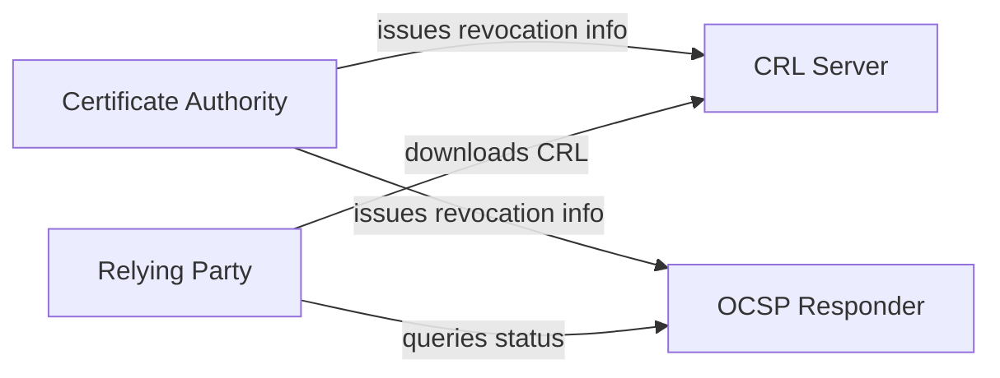
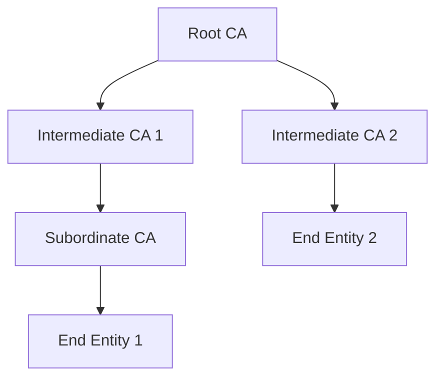
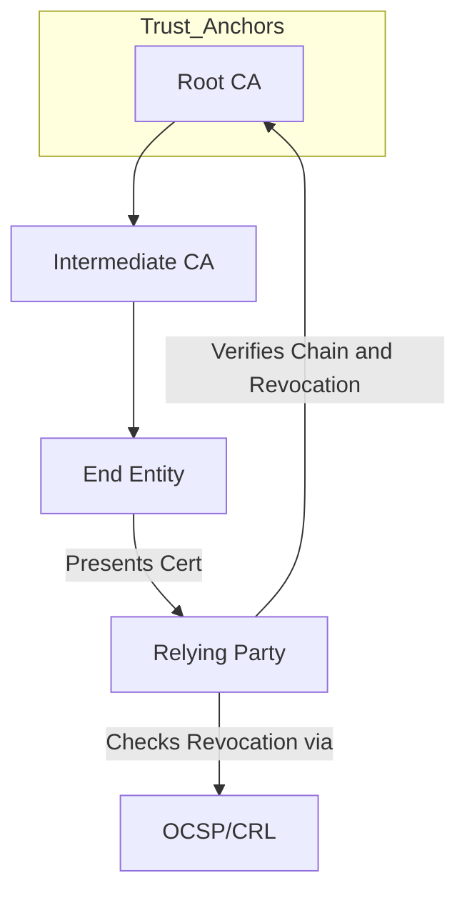

# Public Key Infrastructure (PKI): Cryptographic Architecture and Trust Model

## Introduction

Public Key Infrastructure (PKI) is the foundational trust architecture that enables entities in digital systems to securely identify one another, authenticate interactions, and establish encrypted communications over untrusted networks. PKI achieves this by leveraging asymmetric cryptography and a structured system of digital certificates, authorities, and supporting protocols. Contemporary applications of PKI include web security (SSL/TLS X.509), software code-signing, secure email (S/MIME), VPNs, IoT, and more.

## Core Concepts and Definitions

### Asymmetric Cryptography

At the heart of PKI are cryptographic key pairs: a **public key** (widely distributed) and a **private key** (kept secret by the owner). These pairs enable:

- **Encryption/Decryption:** Encrypt with the recipient’s public key, decrypt with their private key.
- **Digital Signatures:** Sign with the sender’s private key, verify with their public key.

### Digital Certificates

A **digital certificate** is a data structure that binds an entity’s public key to its identity, validated by a trusted third party. The de-facto standard for these certificates is **X.509** (ITU-T X.509; also referenced in RFC 5280), which specifies fields such as Subject, Issuer, Validity Period, Public Key Info, and extensions.

### Trust Anchors and Certificate Authorities (CAs)

PKI establishes hierarchical or mesh trust relationships via **Certificate Authorities (CAs)** that vouch for the identity of subjects. A **Root CA** serves as the highest trust anchor, while **Intermediate CAs** delegate trust.

- **Trust Anchor:** A public key and certification path start point, universally regarded as trustworthy.
- **CA Hierarchy:** Enables delegation, scalability, and management of trust chains.

### Certification Path

A **certification path** is a sequence of certificates, each certifying the next, starting from a trust anchor (Root CA) down to the end-entity (leaf node).

### Registration Authority (RA)

An **RA** acts as a front-end to the CA and performs identity vetting and enrollment assistance but does not actually sign certificates.

### Relying Parties

**Relying Parties** are entities (clients, servers, humans, devices) that consume certificates and act on their authenticity.

### Certificate Revocation

Certificates can be revoked before expiration due to key compromise or policy violations. Revocation is signaled through:

- **Certificate Revocation Lists (CRLs):** Enumerations of revoked certificates, signed and published by the CA.
- **Online Certificate Status Protocol (OCSP):** Real-time, per-certificate status checks (defined in RFC 6960).

---

## PKI Architecture Overview

The following diagram expresses the high-level trust and communication architecture of a typical PKI.

---

## Certificate Life Cycle and Workflow

PKI sustains a certificate through its lifecycle: creation, storage, use, possible revocation, and eventual expiration.

### 1. Certificate Enrollment and Issuance

#### Steps:

1. **Key Generation:** End entity generates a key pair (public/private). Key is generated client-side for highest security.
2. **Certificate Signing Request (CSR):** The entity creates a CSR, bundling their public key and identity information, and submits it to an RA/CA.
3. **Identity Validation:** The RA/CA validates the requestor’s identity (manual or automated processes).
4. **Certificate Issuance:** The CA generates, signs, and returns the certificate.

#### Standards:
- X.509 (certificate format)
- PKCS #10 (CSR structure)
- Enrollment over Secure Transport (EST, RFC 7030)
- Certificate Management Protocol (CMP, RFC 4210)

### 2. Certificate Validation

A relying party (e.g., client verifying a server certificate) performs:

1. **Path Building:** Recursively follow certificate chains up to a trusted root.
2. **Path Validation:** Check digital signatures, valid timeframes, and policy constraints.
3. **Revocation Status:** Ensure the certificate is not revoked (via CRL or OCSP checks).

#### Important Parameters:

- **Validity Period:** Not before/after dates
- **Extended Key Usage (EKU):** Application scope (e.g., TLS Server Auth, Code Signing)
- **Name Constraints/Policy:** Limitations on acceptable names or usages

### 3. Certificate Revocation

Certificates may be revoked before their scheduled expiration. Common causes include:

- Private key compromise
- CA policy violations
- Subject ceases to exist or changes status

#### Mechanisms

- **CRL (RFC 5280):** Signed lists containing serial numbers of revoked certificates
- **OCSP (RFC 6960):** Real-time status protocols for certificate validity

---

## PKI Components and Roles

### Certificate Authorities

- **Root CA:** Ultimate trust anchor, kept offline for security.
- **Intermediate/Subordinate CA:** Signs subordinate certificates, often online.
- **Issuing CA:** Final authority that signs end-entity certificates.

#### Characteristics

- Stores private keys with highest possible security measures (e.g., Hardware Security Modules, strict physical controls).
- Operates audit, logging, and compliance processes per regulatory requirements.

### Registration Authorities

- Decouple authentication/authorization processes from cryptographic issuance.
- Essential in environments where human identity vetting is necessary.

### End Entities

- Individuals, machines, services, applications, IoT devices that possess and use certificates for authentication and/or encryption.

### Repositories

- Store and publish public-key certificates and revocation data.
- Includes LDAP/HTTP(s) endpoints for CRLs or OCSP.

---

## PKI Trust Models

### Hierarchical PKI (Tree Model)

Classic, widely adopted. Root CA delegates to one or more intermediate CAs, which may delegate further.

### Mesh (Web of Trust)

Multiple CAs cross-sign one another. Common in PGP ecosystems, rare in X.509/Pubic PKI.

### Bridge PKI

Bridges multiple PKI hierarchies for interoperability (e.g., Federal Bridge CA in government PKIs).

### Single CA

Simplest, often used in isolated, small-scale, or legacy environments.

---

## Standards and Protocols

- **X.509:** ITU-T standard for public key certificates (see also RFC 5280).
- **PKCS #10:** Certification Signing Request (CSR) specification.
- **PKCS #7 / CMS:** Signed/Encrypted data containers.
- **OCSP:** Online Certificate Status Protocol (RFC 6960).
- **CRL:** Certificate Revocation List format (X.509/RFC 5280).
- **CMP:** Certificate Management Protocol (RFC 4210).
- **EST:** Enrollment over Secure Transport (RFC 7030).
- **SCEP:** Simple Certificate Enrollment Protocol (largely obsolete).

---

## Engineering Considerations

### Secure Key Management

- Root and Intermediate CA private keys must be generated and stored in tamper-resistant Hardware Security Modules (HSMs), preferably air-gapped for offline roots.
- End-entity private keys should never be exported or stored insecurely; client-side generation is best.

### CA Compromise

- Root CA compromise undermines the entire PKI; response mandates catastrophic revocation (root key rollover, cross-signing, mass certificate replacement).
- Intermediate CA compromise enables fraudulent issuance and requires rapid detection and response.

> **Warning**
> CA private key compromise is a critical security event that requires revoking all subordinate certificates and a full trust reset.

### Revocation and Availability

- CRLs can become unwieldy as more certificates are revoked, impacting bandwidth and latency.
- OCSP stapling (used in TLS) addresses performance and privacy issues but requires server and protocol support.
- Failure to honor revocation leads to potential MITM or replay attacks.

### Expiration and Renewal

- Short-lived certificates (e.g., 90-day Let’s Encrypt model) reduce reliance on revocation and limit exposure.
- Automated renewal mechanisms must be resistant to unauthorized certificate issuance (ACME protocol for strict validation).

### Path Building and Policy

- PKI clients (Relying Parties) implement path-building algorithms to verify certificate chains and policy constraints.
- Multiple candidate chains may be possible, including cross-signed intermediates.

### Deployment Models

- **Enterprise PKI:** Internal-only, typically for Windows AD environments (using Microsoft Active Directory Certificate Services - AD CS).
- **Public PKI:** Used for public-facing services (e.g., SSL/TLS), must meet public root program requirements (Mozilla, Apple, Microsoft, etc.).
- **Private/Device PKI:** IoT, wireless authentication (EAP-TLS), VPNs.

---

## Constraints, Assumptions, and Risks

### Trust Assumptions

- The Relying Party has securely obtained a list of trusted CA root certificates (trust anchors).
- CAs and RAs operate securely and per policy throughout their lifetime.

### Constraints

- **Scale:** PKI scales hierarchically but may introduce operational complexity.
- **Policy:** Strict certificate policies are required for interoperability and security.

### Known Challenges and Pitfalls

- **Over-provisioned Trust:** Excessive trust in rarely-audited public CAs amplifies the impact of compromise.
- **Revocation Failures:** Relying parties may skip revocation checks for performance (“fail-open”).
- **Key Management Error:** Weak key protection or poor randomness during key generation can undermine the system.

> **Alert**
> Always enforce strict separation between Root and Intermediate CAs; never allow online Root CAs.

---

## PKI in Practice

### Web PKI (Browser Ecosystem)

In the browser trust model:

- Browsers vendors maintain trust stores containing hundreds of root CAs.
- Websites use certificates validated to these roots.
- Browsers enforce revocation and policy through a combination of inline checks and local BLs.

### Enterprise PKI

Used for secure email, EAP-TLS authentication, internal HTTPS services. Commonly integrates with Windows AD CS, OpenSSL-based CAs, or commercial PKI solutions. Enrollment and lifecycle automation are paramount for operational sustainability.

### Automation and Certificate Transparency

- **Certificate Transparency (RFC 6962):** Requires all publicly-trusted certificate issuance to be logged in cryptographically-auditable public append-only logs.
- **ACME (RFC 8555):** Automated domain-validated certificate issuance for web services.

### IoT and Device Identity

Scalability, lightweight protocols, and constrained environments are typical. Device onboarding and renewal workflows often leverage EST or custom lightweight bootstrapping.

---

## Policy and Governance

- Formal Certificate Policies (CP) and Certificate Practice Statements (CPS) document requirements for all PKI participants.
- Regular auditing, compliance reporting, and incident handling are integral, enforced by regulatory bodies (e.g., CA/Browser Forum Baseline Requirements for public CAs).

---

## Future Directions and Variations

- **Decentralized PKI:** Blockchain-based trust models, still emerging, promise mitigation of single-point CA risk.
- **Post-Quantum PKI:** Evaluation of new algorithms (KYBER, Dilithium, etc.) for root and end-entity cryptography.
- **Short-lived and Zero-Trust paradigms:** Migration toward ephemeral credentials and continuous adaptive authentication.
- **Automated PKI Orchestration:** Move toward seamless self-service enrollment, renewal, and revocation management (e.g., in cloud-native environments).

---

## Summary Diagram: PKI End-to-End Overview

---

## Concluding Notes

Public Key Infrastructure is an indispensable architectural pillar for trustworthy digital communications. Its correct implementation and management require unwavering adherence to best practices in cryptography, operational security, process automation, and governance. Security engineers must pay particular attention to key management, separation of duties, certificate lifecycle automation, revocation semantics, and policy compliance to maintain the integrity and reliability of PKI in any context.

> **Tip**
> For large environments, invest early in automated certificate management platforms and audit key PKI operations continuously.