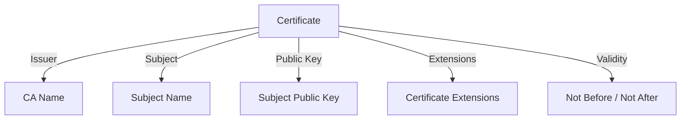
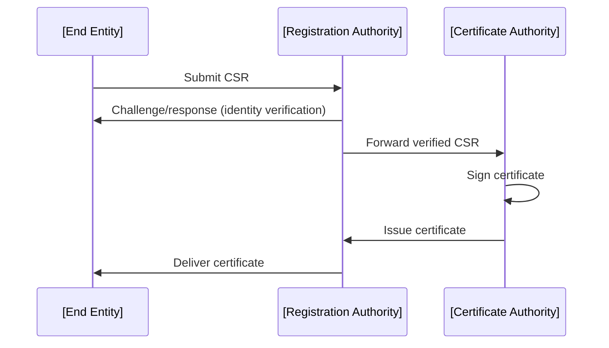
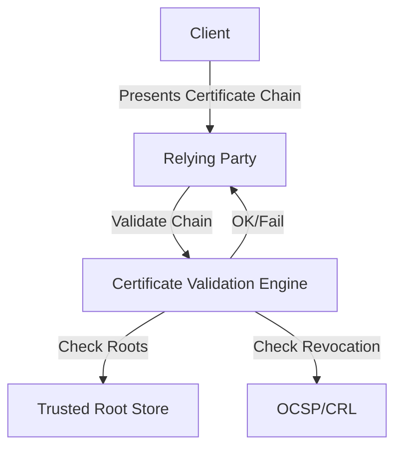
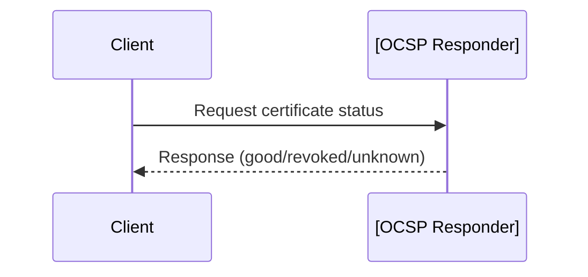
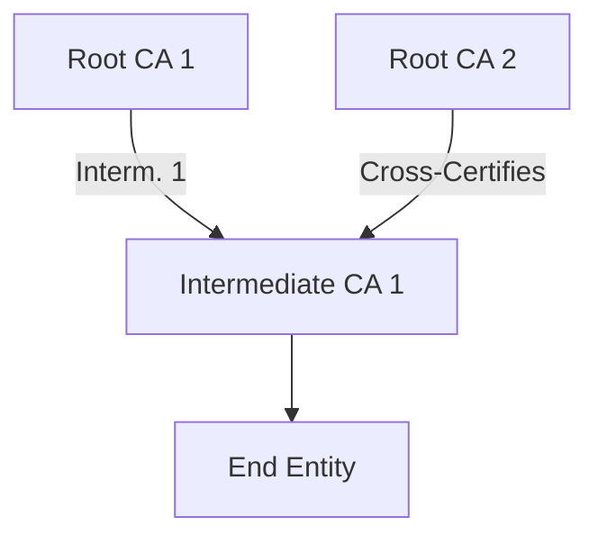

# X.509 Certificates: Technical Primer

## 1. Introduction to X.509

### 1.1 Definition and Context

**X.509** is a formal standard (ITU-T Recommendation X.509) specifying the format of public key certificates and related data structures for verifying the association between identities and public keys. It is the foundational model for digital certificate issuance and validation in **Public Key Infrastructures (PKI)**. X.509 certificates are used to establish trust relationships in numerous security protocols, such as TLS/SSL, S/MIME, and IPsec.

### 1.2 Standards and Evolution

Key standards:
- **ITU-T X.509** (original, latest revision)
- **RFC 5280**: Internet X.509 Public Key Infrastructure Certificate and Certificate Revocation List (CRL) Profile
- Additional RFCs: RFC 2986 (PKCS #10—CSR), RFC 3647 (CP/CPS), RFC 6960 (OCSP)

> **Note:** X.509 is not itself a protocol but a data format and semantic model that protocols may rely upon.

## 2. Certificate Roles in PKI

A typical PKI involves multiple entities:

| Entity               | Role                                               |
|----------------------|----------------------------------------------------|
| Certificate Authority (CA) | Issues X.509 certificates                      |
| Registration Authority (RA)| Verifies identity before CA signs certificate  |
| End Entity (subject)       | Uses the certificate (e.g., server, user)      |
| Relying Party              | Verifies certificate and acts upon its validity|

### 2.1 Trust Model

X.509 is designed around a **chain of trust**, rooted in a **Root CA** whose public key is inherently trusted. Intermediate CAs may issue certificates on behalf of the root, allowing for scalable, hierarchical delegation of trust.

```mermaid
graph TD
    A[Root CA Certificate] --> B[Intermediate CA Certificate]
    B --> C[End Entity Certificate]
    C --> D[Relying Party (e.g. browser)]
```
*Mermaid: X.509 PKI Trust Chain Overview*

## 3. X.509 Certificate Structure

X.509 certificates are represented in ASN.1 (Abstract Syntax Notation One) and typically serialized as DER (Distinguished Encoding Rules) or PEM (Base64-encoded DER).

### 3.1 High-Level Layout

The certificate comprises the following fields:

| Field                  | Description                                              |
|------------------------|---------------------------------------------------------|
| `Version`              | X.509 version (v1, v2, v3). v3 is widely used.          |
| `Serial Number`        | CA-unique identifier for the certificate                |
| `Signature Algorithm`  | Algorithm used by CA to sign the certificate            |
| `Issuer`               | Name of CA issuing the certificate                      |
| `Validity`             | `Not Before` and `Not After` timestamps                 |
| `Subject`              | Name of entity to whom the certificate is issued        |
| `Subject Public Key Info`| Public key and associated algorithm info              |
| `Extensions`           | (v3 only) Extra data, policies, constraints             |
| `Signature`            | CA's digital signature over the certificate             |

ASN.1 structure (simplified):

```
Certificate ::= SEQUENCE  {
     tbsCertificate          TBSCertificate,
     signatureAlgorithm      AlgorithmIdentifier,
     signatureValue          BIT STRING  }
```

### 3.2 Key Components

#### 3.2.1 Subject and Issuer Names

Both are **Distinguished Names (DN)**, typically in X.500 notation:

```
CN=example.com,O=Example Corp,C=US
```

#### 3.2.2 Subject Public Key Info

Contains:
- The public key (typically RSA, ECDSA, EdDSA, etc.)
- The key algorithm identifier

#### 3.2.3 Extensions (X.509 v3)

Extensions provide powerful capabilities for policy enforcement and constraints, including:

- **Key Usage**: Specifies acceptable key purposes (digital signature, key encipherment, etc.).
- **Extended Key Usage (EKU)**: Narrower purposes (TLS server auth, client auth, code signing).
- **Basic Constraints**: Indicates if certificate is a CA and maximum path length.
- **Subject Alternative Name (SAN)**: Lists additional identities, e.g., DNS names, IPs.
- **Certificate Policies**, **CRL Distribution Points**, **Authority Key Identifier**, etc.


*Mermaid: Logical Structure of an X.509 Certificate*

## 4. Certificate Workflow: Issuance, Validation, and Revocation

### 4.1 Certificate Issuance

#### 4.1.1 Certificate Signing Request (CSR)

Entities generate a public-private key pair, then create a **CSR** (typically PKCS#10, RFC 2986), which includes:
- Subject DN
- Subject public key
- Extensions
- Optional attributes
- Requester signature (using private key)

The CSR is submitted to the CA (often via an RA for verification). The CA verifies identity, applies policy, and signs a new certificate.

#### 4.1.2 Issuance Process Sequence


*Mermaid: Certificate Issuance Sequence*

> **GitHub Alert**
> :warning: **Tip**  
> Always safeguard private keys during key generation and CSR—compromise at this step undermines the certificate entirely.

### 4.2 Certificate Validation

#### 4.2.1 Trust Chain Construction

To validate an X.509 certificate:
- Construct the path to a trusted root
- Verify digital signatures at each link
- Confirm that each certificate is valid (dates, revocation status, key usages)

#### 4.2.2 Common Validation Steps

1. **Signature Check**: Each certificate’s signature is valid with respect to the issuer’s public key.
2. **Validity Period**: Current time falls within `Not Before` and `Not After`.
3. **Constraints and Policies**: All required extensions and usages present and permissible.
4. **Revocation Status**: Via CRL (Certificate Revocation List) or OCSP (Online Certificate Status Protocol).
5. **Root Trust**: The root certificate is present and explicitly trusted.

#### 4.2.3 Validation Call Flow


*Mermaid: X.509 Certificate Validation Flow*

> **GitHub Alert**
> :warning: **Warning**  
> Failure to properly check revocation (e.g., OCSP or CRLs) is a common misconfiguration and can expose users to active threats.

### 4.3 Certificate Revocation

#### 4.3.1 Methods

- **CRL**: Certificate Revocation List (batch list of revoked certs, signed by the CA)
- **OCSP**: Online Certificate Status Protocol (per-certificate real-time status, RFC 6960)

**Revocation Reasons**: Key compromise, CA compromise, superseded, cessation of operation, etc.

#### 4.3.2 OCSP Query Flow



> **GitHub Alert**
> :warning: **Important Note**  
> OCSP responses must be signed and timely to prevent replay or substitution attacks. Consider OCSP stapling (server caches and presents signed OCSP response) for performance and reliability.

## 5. Usage Scenarios and Protocol Bindings

### 5.1 TLS/SSL (HTTPS)

X.509 enables server (and optionally client) authentication. The relying party constructs a trust chain from the server’s certificate up to a root CA in its trust store.

[Diagram to be added later: handshake sequence including certificate exchange]

### 5.2 S/MIME

X.509 provides binding of user identity to public keys for secure email, enabling both signature and encryption.

### 5.3 Code Signing

Used in code-signing infrastructure (Microsoft Authenticode, Java JAR signatures, etc.) to authenticate the origin and integrity of software.

### 5.4 Device and IoT Authentication

X.509 certificates are embedded in smart cards or device firmware, enabling mutual authentication.

> **GitHub Alert**
> :bulb: **Tip**  
> Select appropriate key algorithm and length (e.g., RSA 2048+, ECDSA P-256+) to match security requirements and device constraints. ECC can provide better performance on constrained devices.

## 6. Certificate Path Building and Validation Challenges

### 6.1 Path Discovery

The validator must build a trust path from the end entity to a trusted root. Multiple intermediates and cross-certification can complicate validation.


*Mermaid: Path Building with Cross-Certification*

### 6.2 Name Constraints

Name constraints in intermediate CA certificates may restrict allowable subjects in child certificates. Incorrect constraint expression or enforcement is a frequent cause of validation errors.

### 6.3 Policy Constraints

CAs may enforce policy OIDs in certificate fields, and relying parties may require specific policies.

## 7. Engineering and Operational Considerations

### 7.1 Certificate Lifecycle Management

- **Key Management**: Secure generation, storage, and rotation of private keys.
- **Expiration Handling**: Automated renewal and deployment to minimize service disruption.
- **Revocation Checking**: Performance impact of CRL/OCSP queries; consider caching or stapling.

### 7.2 Certificate Pinning

For additional security, some clients may "pin" expected certificates or public keys (HPKP, Expect-CT, or local policy), defending against CA compromise or misissuance.

### 7.3 Trust Store Management

- Regularly update trusted root stores to remove compromised or expired roots.
- Root store proliferation (OS, browser, application) may cause inconsistency.

### 7.4 Common Pitfalls

- Incorrect use of CA: Basic Constraints extension (non-CA certificates as CAs).
- Omitting SAN for hosts: **Browser policy** now requires SAN for domain validation; CN is deprecated for this use.
- Deprecated algorithms (MD5, SHA-1): Always use secure hash and signature algorithms.
- Leaked private keys: Any exposure requires prompt revocation and reissuance.

## 8. Example: PEM-encoded X.509 Certificate

```
-----BEGIN CERTIFICATE-----
MIIB4TCCAYqgAwIBAgIUdWIRy6C1f5bdbEw...
...
-----END CERTIFICATE-----
```

- PEM: Base64 DER, delimiters `-----BEGIN CERTIFICATE-----`
- DER: Binary ASN.1 encoding (used for storage and transport)

## 9. Extensibility and Advanced Features

### 9.1 Custom Extensions

Organizations can use OID-based custom extensions for proprietary data. Relying parties must tolerate unknown non-critical extensions (per RFC 5280).

### 9.2 Attribute Certificates

Separate X.509 data structure allowing additional authorization attributes not tied to a key pair. Rare in practice.

### 9.3 Alternative Schemes

- **Short-Lived Certificates**: Reduces need for revocation but requires rapid reissuance.
- **Self-signed Certificates**: No external trust anchor—valid for internal or testing use, but dangerous if misused in production.

## 10. Summary

X.509 certificates are the globally recognized model for digital identity in networks, critical for secure communications, electronic signatures, device authentication, and software trust. Their issuance, validation, and revocation workflows require careful engineering, robust policy enforcement, and stringent lifecycle management.

Security engineers must understand the components, lifecycle, constraints, and path validation mechanisms of X.509 certificates to design, implement, and troubleshoot secure systems. Proper use of standards, algorithms, and validation strategies directly impacts the reliability and safety of PKI-backed infrastructure.

---

*End of technical primer.*