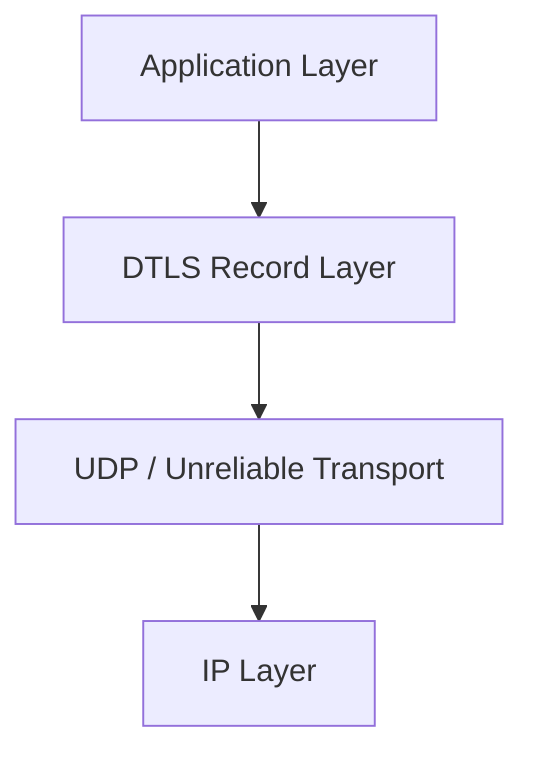
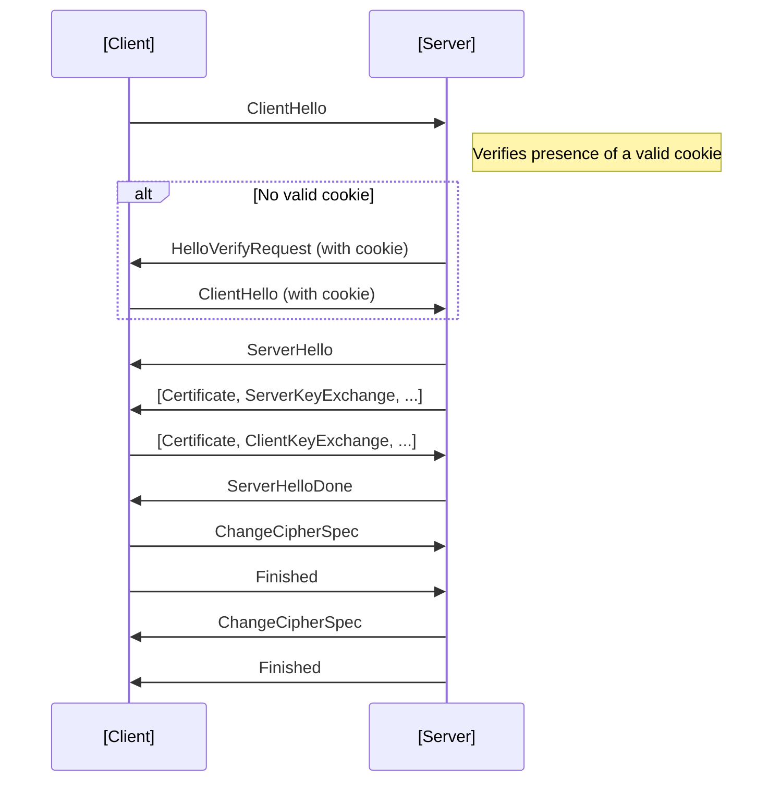
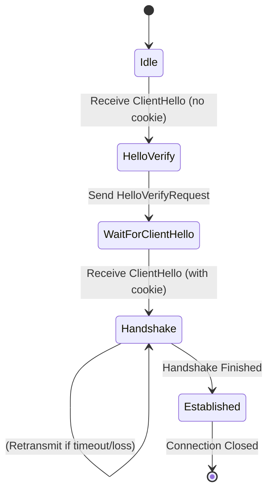
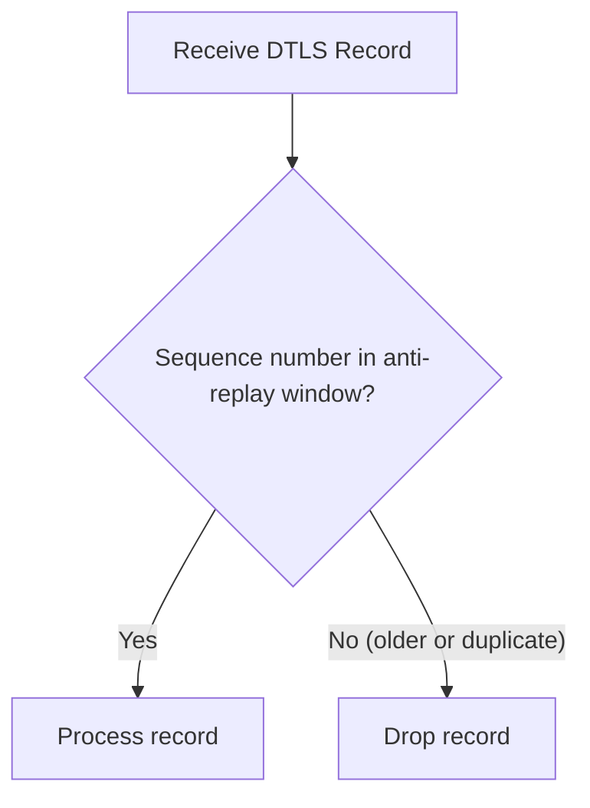
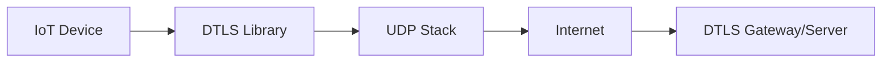
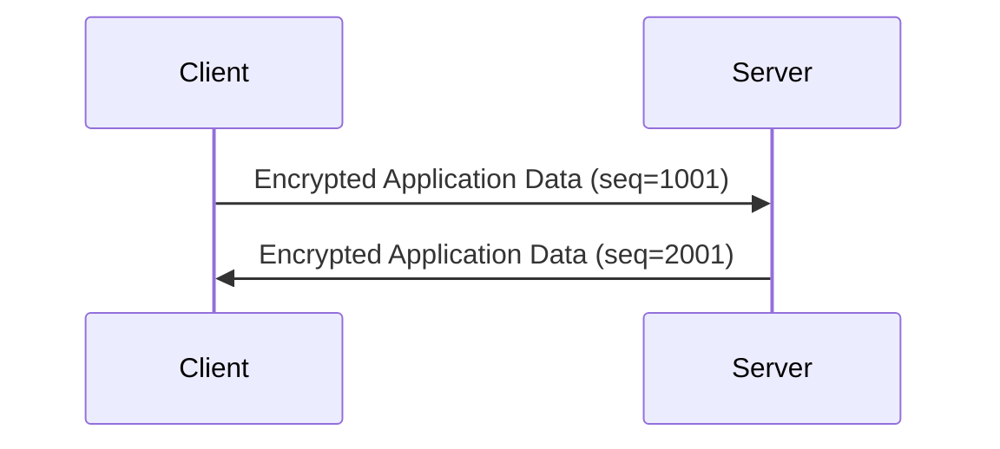

# DTLS (Datagram Transport Layer Security): Formal Protocol Explainer

## Introduction and Technical Context

Datagram Transport Layer Security (DTLS) is a cryptographic protocol that provides communication privacy for datagram protocols. It is designed to offer confidentiality, authentication, and integrity guarantees equivalent to those of TLS (Transport Layer Security), but specifically for packet-oriented, unreliable transports such as UDP (User Datagram Protocol).

Whereas classic TLS operates over reliable, connection-oriented transports like TCP, the need for security over UDP and similar transports arises in applications such as real-time communications, media streaming, IoT networks, and protocols like CoAP and LwM2M. The DTLS protocol is formally specified in RFC 6347 (DTLS 1.2), with notable updates and extensions in RFC 9147 (DTLS 1.3), closely paralleling the evolution of TLS.

DTLS achieves its security goals while accommodating the unreliability, unordered delivery, and potential reordering or loss of datagrams. This requires significant architectural adaptations compared to stream-oriented TLS.

## Core Concepts and Key Components

### High-Level Architecture Overview

DTLS retains the layered approach of TLS, providing security services over the underlying transport—most commonly UDP—but augments this with mechanisms to tolerate missing, duplicated, or re-ordered packets.

#### Architecture Layers

**Legend**: DTLS operates between the application and the unreliable datagram transport (e.g., UDP).

### Mapping TLS Concepts to DTLS

**Similarities with TLS:**
- Uses X.509 certificates (or similar mechanisms)
- Supports strong cipher suites, perfect forward secrecy, and standard TLS key exchange mechanisms
- Record-oriented encryption/integrity
- Follows similar handshake phases (negotiation, key establishment, authentication)

**DTLS-Specific Adaptations:**
- Message fragmentation and explicit sequence numbers
- Timeout and retransmission of handshake messages
- Replay protection and anti-replay windows
- Stateless cookie exchange to counter resource exhaustion attacks

## Protocol Operation and State Machine

DTLS closely mirrors the TLS handshake and record protocols, with key modifications to account for the unreliable, unordered, and possibly lossy nature of the underlying transport.

### Connection Establishment and Handshake

The DTLS handshake must be robust against:

- Loss of handshake messages (requiring retransmission logic)
- Reordering or duplication of handshake messages (needing explicit sequence numbers and message fragmentation/assembly)
- Denial-of-Service (DoS) attacks exploiting the cost of handshake computation (mitigated with stateless cookie exchanges during handshake initiation)

#### DTLS 1.2 Handshake Call Flow

**Legend**: The HelloVerifyRequest serves as a stateless DoS mitigation unique to DTLS.

#### State Machine Overview

DTLS introduces handshake timeouts, retransmissions, anti-replay, and message assembly logic not present in the classic TLS state machine.

### Record Protocol and Replay Protection

Each DTLS record is individually protected (encrypted and authenticated), and incorporates an explicit sequence number for replay protection. The protocol maintains a sliding window to detect and discard replayed packets.

#### DTLS Record Structure

| Field          | Description                                   |
|----------------|-----------------------------------------------|
| Content Type   | E.g., Handshake, Application Data             |
| Version        | Protocol version                              |
| Epoch          | Key usage context                             |
| Sequence No    | Monotonic, per-epoch sequence number          |
| Length         | Payload length                                |
| Payload        | Encrypted/authenticated data                  |

## Detailed Technical Features

### Stateless Cookie Exchange

A critical addition to DTLS (absent in standard TLS) is the HelloVerifyRequest phase. This phase addresses amplification attacks and resource exhaustion by requiring the client to demonstrate reachability from their apparent source address before the server allocates state.

- Upon receiving a initial ClientHello, the server replies with HelloVerifyRequest, including a cookie.
- The client must re-send ClientHello including the cookie.
- The cookie is cryptographically generated using a server secret and client/source info, enabling stateless validation.

### Record Layer Fragmentation and Re-assembly

Datagram transports have strict size limits (e.g., UDP datagram MTU). DTLS allows handshake messages to be fragmented at the record layer and supports out-of-order receipt and reassembly of fragments.

#### Handshake Fragmentation Example

- Each handshake message is assigned a unique sequence number and can be split into fragments with explicit fragment offsets and lengths.
- Recipients store fragments until the full message can be reassembled, protecting against missing/out-of-order arrival.

### Timeout, Retransmission and Loss Recovery

Because underlying datagram protocols offer no delivery guarantees, both handshake and data records may be lost. DTLS implementations maintain handshake timeouts and implement message retransmission.

- Each handshake message is resent after a timeout unless acknowledged/advanced.
- Application data is not retransmitted by DTLS (as ordered reliable delivery is not provided).

### Replay Protection

DTLS employs a sliding window mechanism for replay protection. Each record contains an epoch and sequence number; records outside the current window or duplicates are discarded.

### Cipher Suites and Crypto Flexibility

DTLS supports the same cipher suites as TLS, including authenticated encryption with associated data (AEAD) ciphers (e.g., AES-GCM, ChaCha20-Poly1305), elliptic curve and post-quantum key exchange options (where supported), and a variety of available certificate-based and pre-shared key (PSK) authentication options.

With DTLS 1.3 (RFC 9147), only AEAD ciphers are allowed, reflecting best cryptographic practices and aligning with TLS 1.3.

## Practical Application Scenarios

DTLS is predominantly used where low-latency, unreliable, or connectionless transport is essential and TLS is unsuitable:

- **IoT Protocols:** CoAP (Constrained Application Protocol), LwM2M.
- **Real-Time Communications:** Secure RTP (SRTP), WebRTC (datagram media channels).
- **VPNs/Tunneling:** Datagram-based VPNs such as OpenVPN in UDP mode.
- **Gaming and Multimedia:** Game server protocols, media streaming datapaths.

Its adoption is broad in environments where UDP is favored to avoid strict reliability or head-of-line blocking costs of TCP.

## Integration Points and Design Considerations

### Implementation and API

DTLS is supported in many cryptographic libraries such as OpenSSL, mbedTLS, NSS, wolfSSL, and via system APIs in some embedded and OS environments. Its interface closely tracks TLS, easing migration or switch between the two in dual-protocol applications.

- Commonly, the developer configures the protocol stack to use DTLS if the application intends to run over UDP or requires datagram semantics.
- Some implementations allow configuration of cookie parameters, retransmission policies, and key/certificate configuration.

### Performance Implications

- **Latency:** Handshake may require extra round-trips due to stateless cookie exchange.
- **Throughput:** Unlike TCP/TLS, DTLS does not smooth packet delivery, and application performance may be influenced by transport loss, reordering, and jitter.
- **Overhead:** Per-record headers and explicit sequence numbers consume extra bytes compared to TLS over TCP.

### Engineering Challenges

- **MTU and Fragmentation:** Naive DTLS usage may lead to application-layer fragmentation exceeding network MTU, resulting in UDP-level fragmentation and packet loss. Care must be taken to respect MTU, often via application or stack configuration.
- **Retransmission Timers:** Choice of reasonable retransmission and timeout intervals is crucial to balance handshake completion times and network congestion sensitivity.
- **Resource Exhaustion:** Servers must conservatively allocate state, relying on cookie exchanges and stateless validation to avoid reflection/amplification and DoS attacks.
- **Replay Windows:** Design of replay window sizes and anti-replay logic can affect both security and resource consumption.

### Common Pitfalls

> **Warning**
> 
> Failing to respect network MTU can lead to massive handshake failures or silent data loss because UDP fragments may be silently discarded in transit. Field test or set conservative handshake fragment sizes.

> **Note**
> 
> Many DTLS stacks default to minimal handshake retransmission policies. In lossy or high-latency networks, tuning these defaults or providing application-level feedback is important for robustness.

> **Caution**
> 
> Do not assume perfect message ordering; application protocols on top of DTLS must either tolerate out-of-order arrival or implement their own re-sequencing.

## Standards, Versions, and Compatibility

### Version Evolution

- **DTLS 1.0 (RFC 4347, obsoleted):** Closely modeled on TLS 1.1.
- **DTLS 1.2 (RFC 6347):** Tracks TLS 1.2, allows AEAD ciphers.
- **DTLS 1.3 (RFC 9147):** Updates protocol to track TLS 1.3, introduces 0-RTT, enforces AEAD, removes vulnerable features (renegotiation, compression).

Compatibility between versions can require negotiation, and some application protocols require explicit version signaling to avoid downgrade attacks.

### Noteworthy DTLS-Related RFCs

- **RFC 4347:** DTLS 1.0
- **RFC 6347:** DTLS 1.2
- **RFC 9147:** DTLS 1.3
- **RFC 5238 (SRTP Extensions), RFC 7252 (CoAP over DTLS), RFC 7925 (DTLS for IoT)**

## Security Considerations

DTLS aims to deliver security guarantees matching those of TLS, with the following important caveats:

- **DoS Resistance:** Stateless cookie exchange is essential but not foolproof; servers must keep validation logic fast and state-minimal.
- **Replay Resistance:** Adequate configuration of anti-replay windows is essential to maintain protection without resource exhaustion.
- **Key Agreement Security:** With DTLS 1.3, ephemeral key exchange (e.g., ECDHE) is mandatory, and deprecated algorithms are removed.

> **Alert**
> 
> Unlike TCP/TLS, application-level message truncation, loss, and duplication are possible. Applications must be designed to deal with these explicitly.

## Example Deployment Architecture

**Legend**: Typical DTLS deployment with devices operating over UDP to a centralized DTLS server/gateway.

## Protocol Workflows: Application Data Exchange

Once the handshake completes:

1. **Epoch Increment:** Both sides generate new keys for the "application data" epoch.
2. **Record Sending:** Each application data message is packed into a record with an explicit sequence number, encrypted, and pushed to the transport.
3. **Replay Filtering:** Receivers check each record against their current anti-replay window.
4. **Record Decryption/Validation:** On acceptance, data is decrypted, integrity authenticated, and passed to the application.

## Future Developments and Alternatives

As DTLS 1.3 adoption grows and new constrained/IoT and real-time scenarios emerge, implementation practices continue to improve. For some cases (e.g., QUIC-based transports), application-layer security provides an alternate model, but DTLS remains the primary general-purpose solution for UDP-based security.

## Summary

DTLS is a robust, widely standardized security protocol providing TLS-equivalent security guarantees for datagram-oriented, unreliable transports such as UDP. By introducing handshake retransmission, message fragmentation, stateless cookie-based DoS defenses, and replay protection, it enables secure communications in real-time, IoT, and low-latency contexts where traditional TLS is infeasible.

Security engineers adopting DTLS must consult protocol specifications (RFC 6347, RFC 9147), rigorously test boundary conditions such as MTU and retransmission policies, and design application protocols with the necessary tolerance for datagram loss, replay, and out-of-order delivery. When correctly implemented and tuned, DTLS is a cornerstone protocol for secure, efficient, and scalable datagram communications.