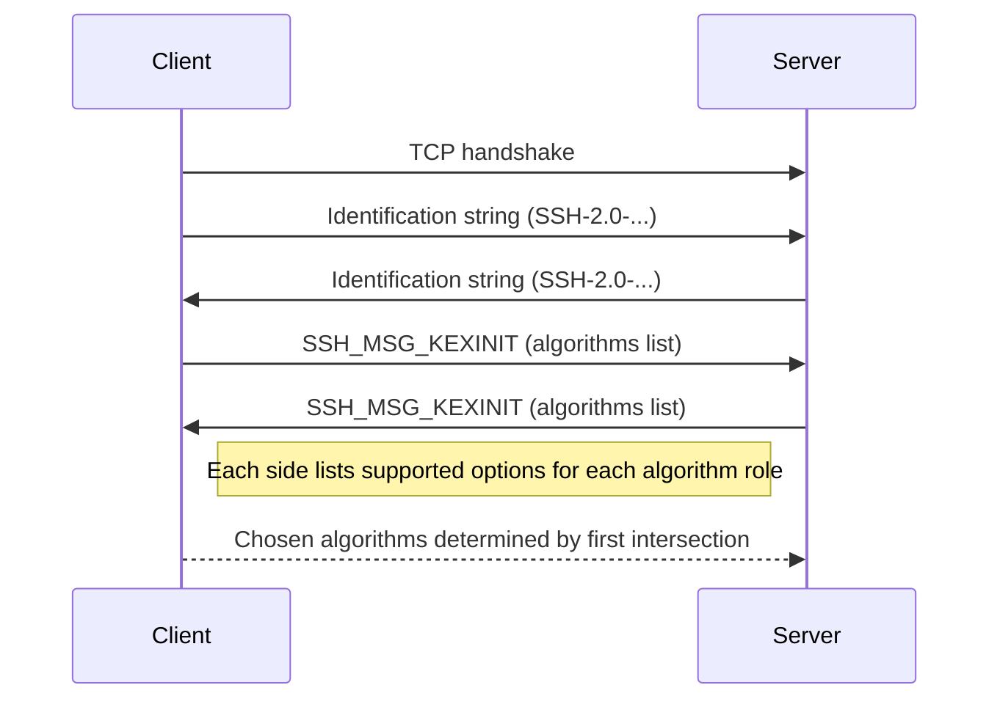
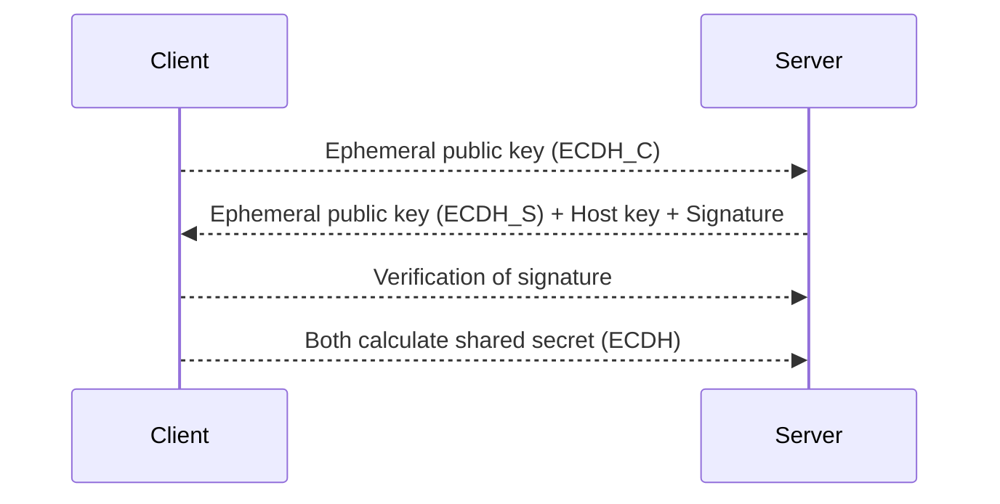
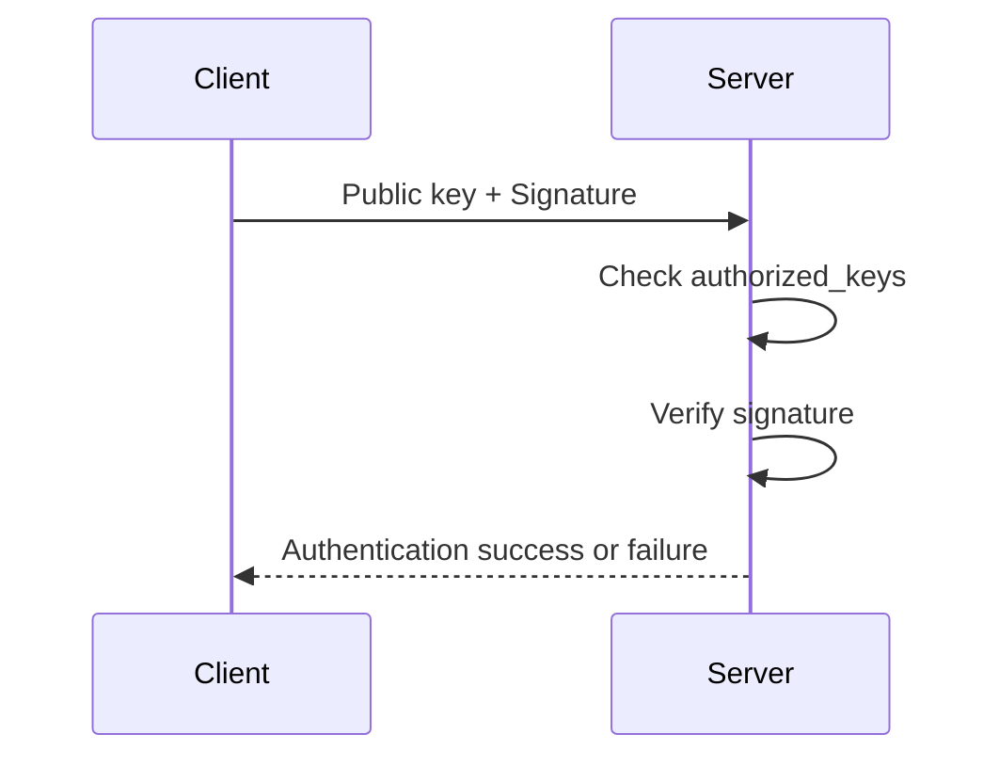

# SSH Cryptography

## Introduction

Secure Shell (SSH) is a cryptographic protocol designed to enable secure network services over an insecure network. Originally proposed to replace insecure terminal protocols such as Telnet and rlogin, SSH provides encrypted communication, strong authentication, and data integrity. Its primary use cases include secure remote shell access, secure file transfer (SFTP, SCP), tunneling, and port forwarding.

SSH cryptography encompasses the protocols, algorithms, and message flows involved in facilitating secure authentication, key exchange, confidentiality, and integrity assurance. This document examines the architectural components and cryptographic primitives that underpin SSH security, focusing primarily on SSH-2, the version standardized by the IETF in [RFC 4251](https://datatracker.ietf.org/doc/html/rfc4251) and its companion documents.

## Cryptographic Foundations and Design Goals

SSH uses a combination of asymmetric (public-key), symmetric (secret-key), and cryptographic hash functions to achieve several goals:

- Confidentiality: Preventing eavesdropping on session data.
- Integrity: Detecting message tampering.
- Authentication: Verifying identities of connecting parties.
- Forward Secrecy: Preventing compromise of session keys if long-term keys are exposed.
- Protection against replay, man-in-the-middle, and active attacks.

The SSH cryptographic protocol stack consists of three layered components:

1. **Transport Layer Protocol** ([RFC 4253](https://datatracker.ietf.org/doc/html/rfc4253)): Negotiates algorithms, authenticates the server, provides key exchange and establishes a secure, encrypted channel.
2. **User Authentication Protocol** ([RFC 4252](https://datatracker.ietf.org/doc/html/rfc4252)): Authenticates the client to the server.
3. **Connection Protocol** ([RFC 4254](https://datatracker.ietf.org/doc/html/rfc4254)): Multiplexes channels for shell access, file transfers, port forwarding, etc.

This document centers on how cryptography secures the SSH transport and authentication layers.

## SSH Protocol Architecture and Message Flow

The following diagram illustrates the high-level SSH protocol stack and the main interaction points.

```mermaid
flowchart TD
    Client[SSH Client]
    Server[SSH Server]
    KeyEx[Key Exchange & Encryption Negotiation]
    Auth[Authentication]
    Conn[Connection Channels (Shell, Exec, SFTP, Port Forward)]
    Client -- "1. TCP/IP connection" --> Server
    Client -- "2. Algorithm negotiation" --> KeyEx
    KeyEx -- "3. Key exchange" --> Server
    Client -- "4. Authentication" --> Auth
    Auth -- "5. User authenticated" --> Server
    Client -- "6. Encrypted session" --> Conn
    Conn -- "7. Application data" --> Server
    style KeyEx fill:#eef,stroke:#333,stroke-width:1px
    style Auth fill:#eef,stroke:#333,stroke-width:1px
    style Conn fill:#eef,stroke:#333,stroke-width:1px
```

## Key Cryptographic Primitives and Concepts

SSH primarily employs the following cryptographic tools:

- **Asymmetric encryption / digital signatures:** For server (and optionally client) authentication.
- **Diffie-Hellman key exchange variants:** For establishing session keys with forward secrecy.
- **Symmetric encryption algorithms:** For bulk data encryption (e.g., AES, ChaCha20).
- **Message Authentication Codes (MAC):** For data integrity.
- **Hash functions:** For fingerprints, MAC calculation, and parts of KDF.

SSH is designed to be algorithm-agile: multiple algorithms may be supported and negotiated at connection setup for each of the functional roles above.

## 1. Algorithm and Parameter Negotiation

### Algorithm Negotiation Workflow

Upon establishing a TCP/IP connection, client and server exchange identification strings and protocol banners, set out in [RFC 4253, Section 4.2](https://datatracker.ietf.org/doc/html/rfc4253#section-4.2). Next, both sides exchange `SSH_MSG_KEXINIT` packets listing supported algorithms for:

- Key exchange
- Server host key
- Encryption (client-to-server, server-to-client)
- MAC (integrity)
- Compression

Each party selects their preferred algorithms, and the connection proceeds using the first mutually-agreed entry from each list.



## 2. Key Exchange Protocol and Forward Secrecy

### Purpose

The SSH key exchange (KEX) protocol serves several objectives:

- Establishes shared secret session keys resistant to passive eavesdropping.
- Provides forward secrecy: session compromise does not endanger other sessions.
- Enables server authentication and optional client authentication.
- Negotiates further protocol parameters (encryption, MAC, compression algorithms).

### Key Exchange Mechanisms

The most widely used key exchange mechanisms are based on **Diffie-Hellman (DH)** or its variants:

- **Finite Field DH** (RFC 4253, RFC 4419): Classic DH over integers modulo a large prime; group parameters may be fixed or negotiated.
- **Elliptic Curve DH (ECDH)** (RFC 5656): Uses elliptic curves for stronger security per bit and faster operation.
- **Curve25519/Curve448**: Modern, high-security, high-performance curves standard in recent deployments.

Legacy RSA key exchange (without forward secrecy) is now deprecated due to its security drawbacks.

#### Example: ECDH Key Exchange

Assume Curve25519 is negotiated. The protocol proceeds as follows:

1. **Ephemeral Key Generation:**
   - Both client and server generate temporary (ephemeral) private/public key pairs.
2. **Key Exchange Messages:**
   - The client sends its ephemeral public value.
   - The server responds with its ephemeral public value and signs the handshake transcript using its persistent host key.
3. **Shared Secret Derivation:**
   - Both parties compute the shared secret using ECDH.
   - Session keys are derived from the shared secret and handshake hash.
4. **Server Authentication:**
   - The server proves possession of the long-term host key by signing the exchange, providing channel authentication and protection against MITM, assuming the host key is authentic.



#### Key Exchange Packet Flow (Simplified)

- `SSH_MSG_KEXINIT`
- Exchange ephemeral public keys (algorithm-specific message)
- Server sends host public key and signature
- Both compute shared secret and derive keys
- `SSH_MSG_NEWKEYS` signals switch to encrypted transport

## 3. Server Authentication and Host Keys

### Host Keys

SSH authenticates the server using a **host key**, a long-term cryptographic identity whose public part is distributed out-of-band (e.g., via DNS, certificate authorities, or pre-shared via file systems). Supported public key algorithms include:

- RSA
- DSA (deprecated)
- ECDSA (NIST curves)
- ED25519 (modern, preferred)
- Ed448

Host keys are critical binding elements of trust in SSH. Compromise of a host key permits credential theft and session interception.

### Trust Models

- **User-based trust (Trust on First Use, TOFU):** The client, upon first connection to a host, stores the server’s public key fingerprint (e.g., in `~/.ssh/known_hosts`). On subsequent connections, mismatches trigger warnings or failures.
- **Explicit trust (Preloaded keys):** Clients are pre-configured to trust specific host keys.
- **Certificate-based (OpenSSH CA):** Newer OpenSSH versions support signing host keys with certificate authorities for easier rotation and revocation, closer to PKI.

```mermaid
graph LR
    C[Client]
    S[Server]
    KH[Known Host Key?]
    C -->|Connect| S
    S -->|Presents Host Key| C
    C -->|Check| KH
    KH -->|Yes| C
    KH -->|No| C
    C -->|Store Host Key (TOFU)| KH
```

## 4. Client Authentication

SSH provides several mechanisms for client authentication, negotiated during the session:

- **Public key authentication:** The most common/secure; the client proves possession of a private key corresponding to a registered public key on the server.
- **Password authentication:** The client provides a password; weak unless combined with strong policies and encrypted transport.
- **Host-based authentication:** Rare; authentication based on the client's system identity.
- **Keyboard-interactive:** Flexible support for multifactor, OTP, or challenge-response mechanisms.
- **Certificate-based (OpenSSH CA):** Allows scalable deployment via centralized CA issuance.

### Public Key Authentication Flow

1. Client generates a signature on a session identifier (trusted context).
2. Signature and public key are sent to the server for verification.
3. Server matches the public key to its authorized users.
4. If verification passes, authentication succeeds.



> **Alert**
> Password authentication over SSH is encrypted but vulnerable to brute force and credential reuse. Public key authentication is strongly recommended for production security.

## 5. Session Key Derivation and Rekeying

### Session Key Derivation

After key exchange, both parties derive symmetric encryption and MAC keys for each direction:

- Secret key = KDF(shared secret, session hash, negotiated parameters)
- Core KDF methods are based on cryptographic hash functions (currently SHA-2 family for modern algorithms)

This compartmentalizes each session’s confidentiality, even when host keys are long-lived.

### Rekeying

SSH triggers periodic rekeying to limit data leakage in case of partial compromise and to accommodate underlying cipher constraints (e.g., maximum allowed ciphertext per key). Rekeying repeats the original key exchange process on the existing secure channel.

> **Alert**
> Rekeying intervals should be chosen conservatively. Too frequent rekeying adds computational load; too infrequent exposes large amounts of ciphertext to compromise in the event of a key leak.

## 6. Bulk Data Encryption and Integrity

After successful key exchange, all further protocol traffic is encrypted and authenticated.

- **Symmetric encryption**: Common ciphers include AES (CTR, CBC, or GCM modes), ChaCha20-Poly1305, and deprecated ciphers (e.g., 3DES, ARCFOUR). CBC mode is deprecated due to padding oracle vulnerabilities.
- **MAC Algorithms**: HMAC with SHA-1, SHA-2, or Poly1305 (AEAD). AEAD ciphers like chacha20-poly1305 do not require separate MAC.

Algorithm agility permits timely deprecation of weak primitives and adoption of post-quantum ciphers in the future.

## 7. Protocol Message Structure

All SSH protocol messages share a consistent framing:

- 4-byte packet length prefix
- 1-byte padding length field
- Payload data (encrypted, optionally compressed)
- Padding (to reach cipher block size)
- MAC, if required by cipher suite

```mermaid
flowchart LR
    Len[Packet Length (4B)]
    PadLen[Padding Length (1B)]
    Payload[Payload (variable)]
    Padding[Padding (variable)]
    MAC[MAC (variable)]
    Len --> PadLen
    PadLen --> Payload
    Payload --> Padding
    Padding --> MAC
```

Some implementations enable compression, negotiated during the handshake phase.

## 8. Practical Engineering Considerations

### Implementation Pitfalls

- **Key management**: Proper rotation, revocation, and permission management of private host keys is crucial.
- **TOFU Caveats**: Users often ignore host key mismatch warnings, opening avenues for man-in-the-middle (MITM) attacks, unless a stronger PKI or CA-based model is used.
- **Algorithm choices**: Legacy support for insecure algorithms (e.g., SHA-1, CBC, DSA, 1024-bit RSA) risks session compromise; ensure up-to-date, secure configurations.
- **User key distribution**: Out-of-band key distribution can be error-prone and subject to social engineering.
- **Side-channel attacks**: Protect key handling routines from timing, cache, and other side-channel leakages, especially in shared server environments.

### Integration with Systems and Automation

- **Bastion hosts**: SSH often underpins jump/bastion hosts; proper cryptographic separation and authentication management are vital.
- **Agent forwarding**: The `ssh-agent` protocol forwards authentication keys; misuse may expose private keys if an attacker attains control of a remote host.
- **Hardware tokens**: Support for FIDO2 or PIV smartcards allows private keys to be stored in hardware, restricting extraction.
- **Certificate authorities (CA)**: OpenSSH's CA support enables enterprise-scale user and host identity management, including expiry and revocation control.

> **Alert**
> Always disable unused authentication methods and deprecated ciphers. Audit server configurations regularly to maintain cryptographic hygiene.

### Performance and Scalability

- **Modern key exchange (e.g., curve25519-sha256)** is computationally efficient and secure; avoid large, slow classic DH groups where possible.
- **Compression**: May improve throughput on slow links, but can introduce security risks (e.g., "compression oracle" attacks like CRIME in TLS). Disable unless necessary.
- **Concurrency and multiplexing**: SSH multiplexes multiple channels over a single connection. Each channel is encrypted and isolated per negotiated session keys.

## 9. Variations and Extensions

The SSH protocol standard permits extensions, including:

- **Connection multiplexing**: `ControlMaster` and `ControlPath` in OpenSSH enable session reuse.
- **Subsystems**: SFTP, X11 forwarding, port forwarding leverage established cryptographic channels.
- **Jump hosts and proxies**: Compound host key verification and credentials validation is critical in chained connections.
- **Post-quantum cryptography (PQ-SSH)**: Ongoing research aims to extend SSH with PQ key exchange algorithms as standardized by NIST and IETF.

## 10. Comparison and Related Protocols

SSH’s use of session forward secrecy, layered authentication, and host key trust models distinguishes it from other protocols like:

- **TLS 1.3** ([RFC 8446]): Stronger focus on X.509 PKI, mutual authentication is optional, session resumption concepts differ.
- **Public Key Infrastructure (PKI)**: SSH does not mandate use of hierarchical CA-based PKI but increasingly supports it via OpenSSH CA extensions.

## Conclusion

SSH cryptography reliably secures critical connections in modern infrastructure using a layered protocol architecture and an evolving suite of strong cryptographic primitives. Recent best practices require the disablement of legacy algorithms, strong host key and user key management, and use of forward-secure key exchange. As threat models and cryptography advance, SSH adapts through algorithm agility and support for new specification updates.

By understanding SSH's cryptographic internals—negotiation, authentication, key exchange, encryption, and session management—security engineers can effectively design, audit, and operate secure remote access and automation within their infrastructure.