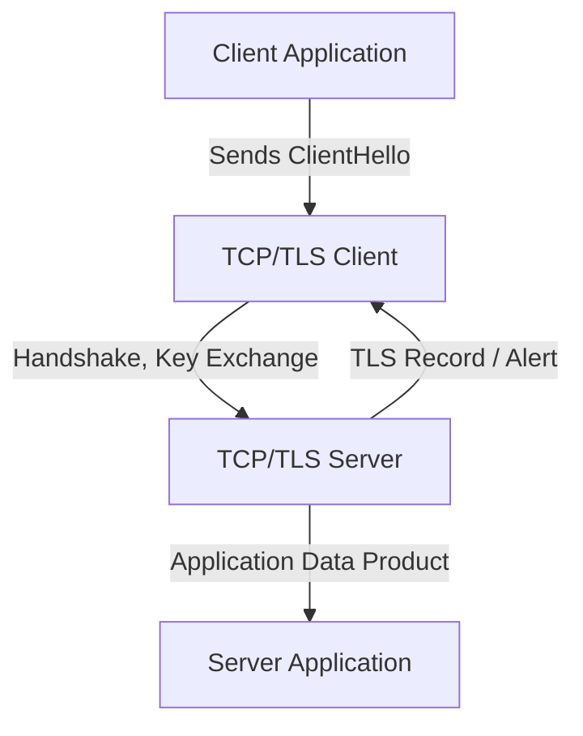
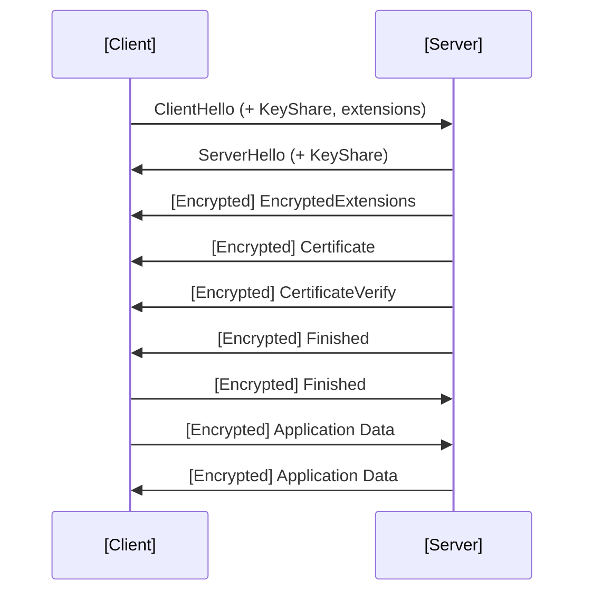
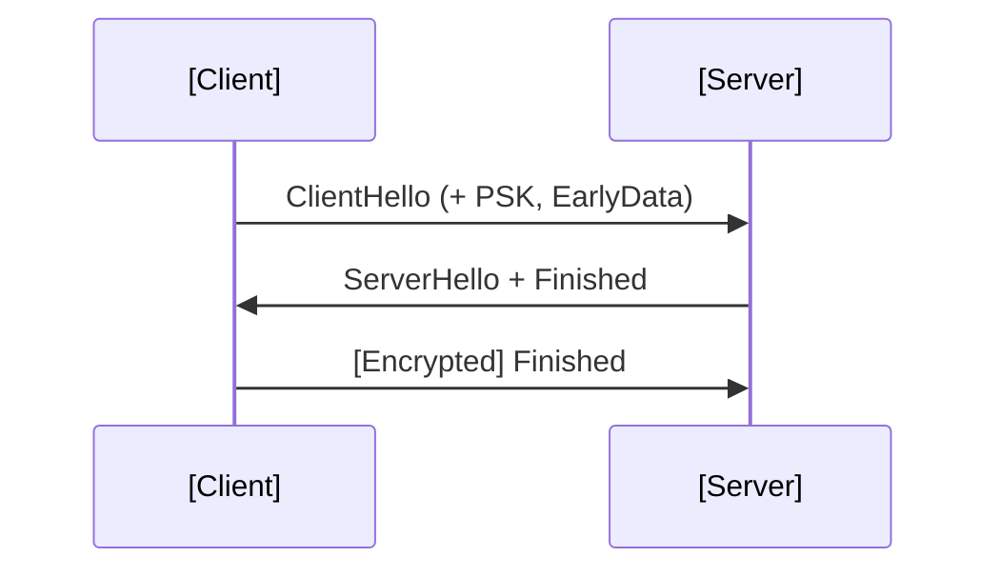
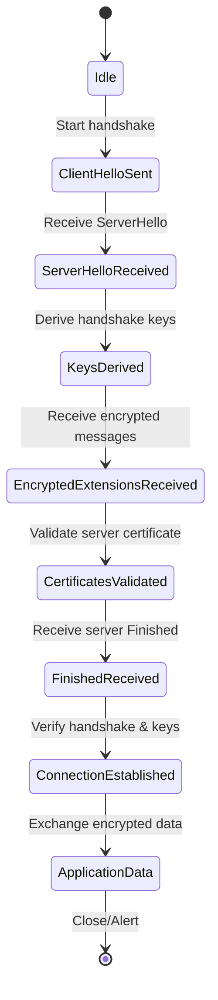

# TLS 1.3: Modern Transport Layer Security

## 1. Introduction and Technical Context

Transport Layer Security (TLS) 1.3, formally defined in [RFC 8446](https://datatracker.ietf.org/doc/html/rfc8446), is the latest major revision of the TLS protocol. TLS protects data in transit across untrusted networks, establishing encrypted, authenticated channels primarily over TCP, but with extensions for other transports (e.g., DTLS for UDP). TLS 1.3 was published by the IETF in August 2018, succeeding TLS 1.2 (RFC 5246) after more than a decade.

TLS 1.3 seeks to address and resolve architectural, cryptographic, and implementation weaknesses present in earlier versions, providing robust security against a wide spectrum of known attack vectors. It significantly refines the protocol by offering a streamlined handshake, enhanced forward secrecy by default, reduced round-trips, and eliminates support for outdated, vulnerable ciphers and features.

TLS is foundational to web security (HTTPS), secure email, VPNs, and many other encrypted protocols.

## 2. Protocol Definition and Applicability

TLS 1.3 standardizes a secure communications channel between two endpoints in a client-server architecture. The protocol is layered above the transport layer (most commonly TCP) and below the application layer.

### Primary Objectives

- **Confidentiality**: Ensures that plaintext data in transit cannot be read by third parties.
- **Integrity**: Guarantees that data exchanged cannot be altered or forged without detection.
- **Authentication**: Enables endpoints to authenticate each other (typically server authentication, optionally mutual).
- **Forward Secrecy**: Ensures that compromise of long-term keys does not compromise session keys of previous sessions.

### Applicability

- **Web communications (HTTPS)**
- **Email transport (SMTP over TLS, IMAP/POP over TLS)**
- **VPN tunnels**
- **Any application requiring transport-level security**

## 3. High-Level Architecture and Major Components

Core components of TLS 1.3 include:

- **Handshake Protocol**: Negotiates security parameters, performs authentic key exchange, and establishes shared secrets.
- **Record Protocol**: Secures application data records using negotiated keys and cryptographic algorithms.
- **Alert Protocol**: Conveys error and session management signals.
- **Extensions Framework**: Allows protocol evolution via optional features.

### Key Architectural Differences from TLS 1.2

- Only support for AEAD (Authenticated Encryption with Associated Data) cipher suites.
- Removal of legacy and insecure features (e.g., static RSA key exchange, renegotiation, compression).
- Enforced perfect forward secrecy (no resumption without ephemeral keys).
- Simplified handshake—only one round-trip in common cases.

### High-Level Protocol Structure



## 4. Cryptography and Cipher Suites

TLS 1.3 only supports strong, modern cryptographic algorithms:

- **Key Exchanges**: Ephemeral ECDHE (Elliptic Curve Diffie-Hellman Ephemeral) is the only supported method, providing forward secrecy.
- **Authentication Algorithms**:
  - **Server Authentication**: X.509 certificates; supports RSA and ECDSA signatures.
  - **Client Authentication**: Optional; via client certificates.
- **Cipher Suites** (as of RFC 8446):
  - **AES-128-GCM-SHA256**
  - **AES-256-GCM-SHA384**
  - **CHACHA20-POLY1305-SHA256**
- **Hash Algorithms**: SHA-256, SHA-384 (for HMAC, PRF, and handshake transcript hashes).
- **Signature Algorithms**: `rsa_pss_rsae_*`, `ecdsa_secp256r1_sha256`, etc.

> [!TIP]
> Cipher suite negotiation in TLS 1.3 involves only symmetric ciphers and hash functions; key exchange and signature algorithms are negotiated separately via dedicated extension fields.

## 5. TLS 1.3 Handshake Protocol

The handshake is the core sequence for establishing secure communications. TLS 1.3 streamlines the handshake to just one round-trip for the full handshake (assuming no client authentication), and supports "0-RTT" data for returning clients (with security trade-offs).

### Full 1-RTT Handshake

Below is a detailed sequence diagram illustrating messages in the typical handshake for initial session establishment.



#### Message Overview

- **ClientHello**: Proposes protocol versions, cryptographic parameters, supported extensions, and sends an ephemeral public key.
- **ServerHello**: Selects parameters, returns its ephemeral key, and signals key derivation switch.
- **EncryptedExtensions**: Carries additional negotiated parameters; sent encrypted.
- **Certificate/CertificateVerify**: Used for server (and optionally client) authentication via digital signature; transmitted encrypted.
- **Finished**: Proves possession of the negotiated key; message integrity check of the handshake.

#### Key Points

- Only one round-trip (1-RTT) is required for a fully encrypted, mutually agreed connection.
- All handshake messages after the ServerHello are encrypted with a handshake-specific key.
- Certificate transmission and validation are protected under encryption.
- Only ephemeral key exchanges are allowed; no static DH or RSA key exchange.

### 0-RTT (Early Data)

TLS 1.3 permits clients that have previously connected to a server and possess a valid PSK (Pre-Shared Key) to send application data in the first handshake flight, reducing latency further. Early data is protected but vulnerable to replay attacks.

> [!WARNING]
> 0-RTT data **does not offer full replay protection** and should not be used for sensitive or non-idempotent operations.



0-RTT is opt-in, must be offered by the server, and should be explicitly enabled by applications after careful analysis.

## 6. Key Derivation and Secrets

TLS 1.3 utilizes the HMAC-based Extract-and-Expand Key Derivation Function (HKDF, RFC 5869) throughout the handshake.

### Secret Tree

Several secrets are derived, each keyed to minimizing cross-session and forward risk:

- **Early Secret**: For 0-RTT data, derived from PSK.
- **Handshake Secret**: For encrypting handshake messages post-ServerHello.
- **Master Secret / Application Traffic Secrets**: For application record encryption.
- **Resumption Secret**: To allow PSK-based future resumptions.

This hierarchical derivation ensures strong compartmentalization of key material.

### Key Derivation Flow

```mermaid
flowchart TD
    PSK[Pre-Shared Key (if used)]
    ECDHE[Ephemeral ECDHE Secret]
    Root[HKDF Initial Input]
    Early[Early Secret]
    Handshake[Handshake Secret]
    Master[Master Secret]
    App[Application Traffic Keys]
    Resume[Resumption Secret]
    
    Root -->|HKDF Extract| Early
    Early -->|+ECDHE, HKDF| Handshake
    Handshake -->|HKDF Expand| Master
    Master --> App
    Master --> Resume
```

## 7. TLS 1.3 Record Protocol

All variable-length application data is fragmented, optionally compressed (compression now deprecated), padded, and encrypted in discrete records.

- **Encryption scheme:** AEAD ciphers only; all records are both encrypted and authenticated.
- **Record headers:** Reduced in size; encrypted length and type fields where possible.
- **Replay protection:** Ensured for post-handshake data (not for 0-RTT).

## 8. Extensions and Protocol Evolution

TLS 1.3 enforces modularity and extensibility with its extension framework. Some widely adopted extensions include:

- **Server Name Indication (SNI):** Allows hosting multiple domains on one IP.
- **Application-Layer Protocol Negotiation (ALPN):** Negotiates application protocols (e.g., HTTP/2, QUIC).
- **Session Tickets:** For efficient session resumption.
- **Key Share:** Negotiates key exchange algorithms and public keys.

Extensions are signaled in the `ClientHello` and `ServerHello` messages as needed.

## 9. Authentication Model and Certificate Handling

TLS 1.3 maintains X.509-style certificate-based authentication, usually authenticating only the server (client authentication is optional):

- **Certificate Validation:** Still subject to certificate authority (CA) trust, revocation checking, and hostname validation.
- **Client Certificates:** Can be requested post-handshake via the `CertificateRequest` message.

> [!CAUTION]
> Improper certificate verification or incomplete revocation handling remains a major source of protocol downgrade, MITM, and impersonation attacks.

## 10. Performance and Engineering Implications

### Latency and Handshake Speed

The main performance highlight is the reduction of handshake round-trips. Most sessions achieve encryption with a single round-trip; resumption and 0-RTT can eliminate handshake round-trips altogether.

### Throughput and Cipher Performance

AEAD ciphers and hardware support (AES-NI, ChaCha20 on mobile CPUs) result in high throughput and efficient operation for modern workloads.

### Engineering Trade-offs

- **0-RTT data:** Use only for idempotent, non-sensitive actions due to replay risks.
- **Session resumption state:** Deciding between session tickets (stateless) and server-maintained session caches.
- **TLS record size tuning:** Impacts fragmentation, latency, and network congestion behavior.

## 11. Common Pitfalls and Attack Surfaces

- **Misconfiguration:** Allowing negotiation of legacy versions weakens guarantees.
- **Library defaults and API use:** Failure to restrict algorithm choices; not verifying certificates or hostnames.
- **0-RTT misuse:** Not restricting early data to replay-safe transactions.
- **Middlebox compatibility:** Some legacy infrastructure may interfere with or break TLS 1.3 traffic (e.g., DPI devices).

> [!WARNING]
> Do not rely on fallback protocols or support "downgrade dance" extensions such as TLS_FALLBACK_SCSV unless strictly required, and never without understanding the risk of protocol downgrade attacks.

## 12. Interoperability and Variations

### Browser and Library Support

Major modern browsers, OpenSSL (from 1.1.1), BoringSSL, LibreSSL, and most mainstream platforms support TLS 1.3.

### Variants

- **DTLS 1.3:** Datagram TLS for UDP; similar handshake principles, includes optimizations for unreliable transport.
- **QUIC:** Next-generation transport protocol developed by Google uses TLS 1.3 for its handshake and authentication layer.

## 13. Integration and Deployment Guidance

When integrating TLS 1.3:

- Prefer libraries with mature, well-tested TLS 1.3 implementations (OpenSSL 1.1.1+, BoringSSL, NSS, Go crypto/tls, Rustls).
- Disable support for all legacy protocol versions and cipher suites not required for backward compatibility.
- Periodically audit configuration and protocol negotiation paths.
- Implement certificate revocation and pinning policies where feasible.
- Use ALPN and SNI as appropriate for modern multi-tenant applications.

> [!TIP]
> Employ automated scanning (e.g., testssl.sh, SSL Labs) to validate and harden your deployment.

## 14. Protocol State and Flow Overview

Below is a simplified state machine for a TLS 1.3 handshake and connection lifecycle.



## 15. Summary Matrix: TLS 1.3 Improvements Over TLS 1.2

| Category                | TLS 1.2                                | TLS 1.3                                     |
|-------------------------|----------------------------------------|---------------------------------------------|
| Handshake RTT           | 2-RTT                                  | 1-RTT (0-RTT for session resumption)        |
| Forward Secrecy         | Optional (depends on key exchange)     | Required (ephemeral key exchange only)      |
| Cipher Suites           | Late AEAD support, many obsolete ciphers | Only AEAD, limited to modern ciphers      |
| Client/Server Auth      | Insecure fallback (static RSA), signature before key validation | Always signed ephemeral key; certificates sent under encryption |
| Protocol Flexibility    | Many extensions, but complexity        | Simpler, extension-friendly                 |
| Legacy Features         | Compression, renegotiation, non-AEAD, weak ciphers | All removed                             |

## 16. Engineering Checklist

- [ ] Support only TLS 1.3 and, if required, 1.2 for compatibility.
- [ ] Enforce strong key exchange and cipher suite policies.
- [ ] Implement/require certificate validation, revocation, and hostname checking.
- [ ] Carefully consider use of 0-RTT data.
- [ ] Regularly audit and test protocol configuration.

## 17. Conclusion

TLS 1.3 delivers a major leap forward in practical, protocol-level confidentiality, integrity, and performance for modern networked applications. By minimizing legacy complexity, enforcing forward secrecy, and providing robust cryptographic guarantees, TLS 1.3 is a substantially safer and faster foundation for secure transport-layer communications.

For security engineers, deep protocol understanding can inform correct, secure integration and ongoing risk management—vital as cryptographic and architectural threats continue to evolve.