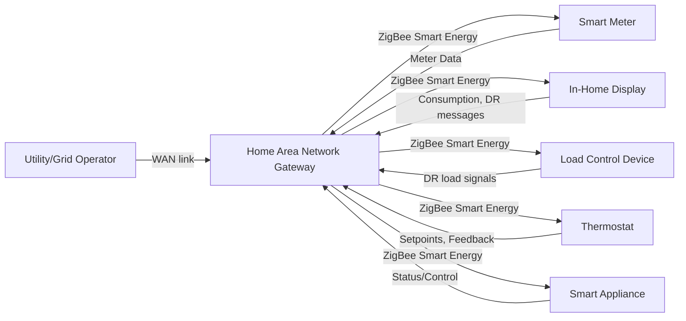
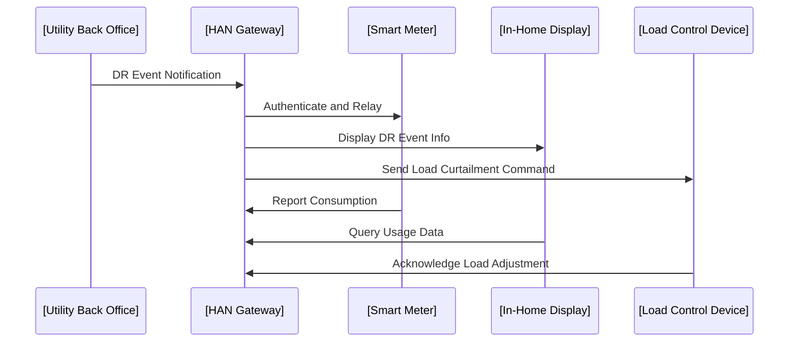
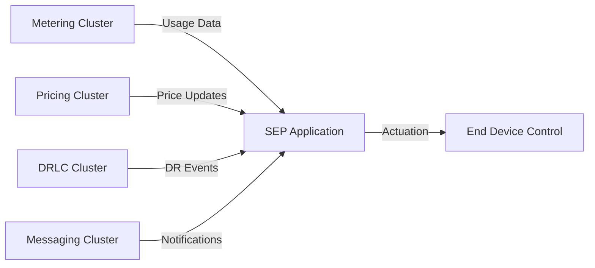
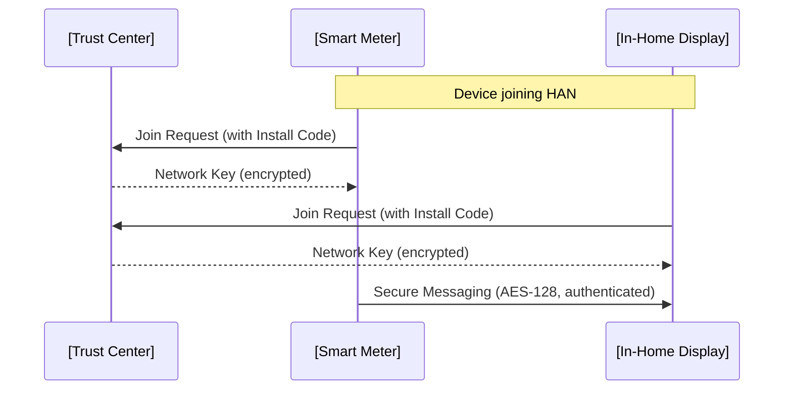
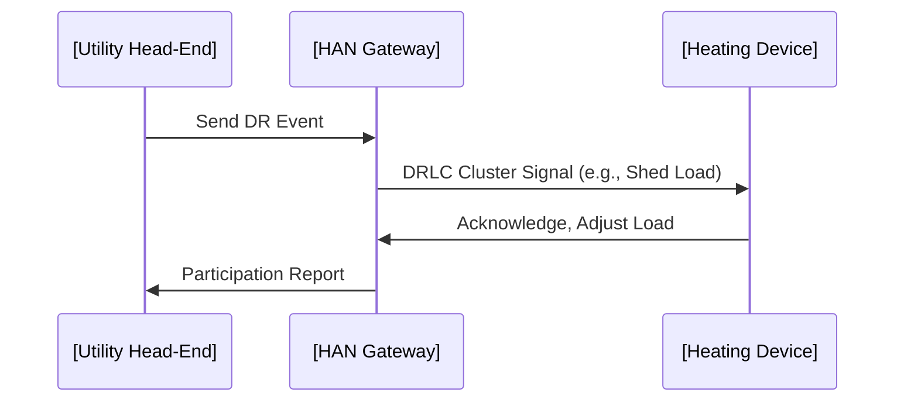

# ZigBee Smart Energy: A Standards Overview for Utility Engineers

## Introduction

ZigBee Smart Energy is a widely adopted communications profile built atop the ZigBee wireless protocol stack, specifically designed to support smart metering, demand response (DR), load control, and home area network (HAN) energy management functions. Formally referred to as the Smart Energy Profile (SEP), it aligns with energy utilities’ requirements for secure, interoperable, and scalable wireless networks in both residential and commercial environments.

As global energy infrastructures transition to smart grids, achieving secure, standards-complaint interoperability from endpoint (meters, in-home displays, appliances) to utility back office is imperative. ZigBee Smart Energy, via the SEP, provides this interoperability framework and remains prominent in numerous large-scale Advanced Metering Infrastructure (AMI) and demand management deployments, notably in North America, Europe, and Asia-Pacific.

This overview is intended for utility engineers seeking to understand the operational, architectural, and technical specifics of ZigBee Smart Energy, its key standards and design considerations, and its practical integrations with metering, demand response, and energy management systems.

---

## 1. Technical Context and Standards Alignment

### 1.1 ZigBee Foundations

**ZigBee** is an IEEE 802.15.4-based wireless communication protocol targeting low-power, low-data-rate, and short-range networking. ZigBee defines:

- Physical (PHY) and Medium Access Control (MAC) layers (inherited from IEEE 802.15.4)
- Network and application layers (specific to ZigBee Alliance specifications)
- Application profiles for targeted verticals (such as Smart Energy)

**Smart Energy Profile (SEP)** delineates the logical architecture, messaging, security, device roles, and service models required for electric, gas, and water utility HANs and their secure connection with utility backend systems.

#### 1.1.1 Relevant Standards and Organizations

- **IEEE 802.15.4**: Low-rate WPAN PHY & MAC (basis for ZigBee stack)
- **ZigBee Alliance**: Maintainer of ZigBee specifications, including SEP
- **ZigBee Smart Energy Profile v1.x**: Delivers an application profile for utility metering, load control, messaging, and DR on ZigBee PRO networks
- **ZigBee Smart Energy Profile v2.x (SEP 2.0, 2.1)**: IP-based (IEEE 802.15.4g, 6LoWPAN, CoAP), supports broader device ecosystem and network types
- **DLMS/COSEM, SMETS2, GBCS**: Typical companion specs for metering payloads/interfacing in European deployments

---

## 2. ZigBee Smart Energy Architectural Model

The Smart Energy ecosystem consists of interconnected devices forming HAN clusters (premises-level mesh networks), eventually connecting to utility backend systems via WAN (Wide Area Network) gateways.

### 2.1 SEP v1.x vs SEP v2.x

SEP v1.x and v2.x share objectives but differ architecturally:

- **SEP v1.x**: ZigBee PRO-based, non-IP, application profile running over ZigBee-specific stacks.
- **SEP v2.x**: Protocol agnostic, based on IPv6/6LoWPAN, extends support to Wi-Fi, Ethernet, PLC, and other media.

**Key architectural distinctions:**

| Feature            | SEP v1.x                | SEP v2.x (2.0/2.1)           |
|--------------------|------------------------|------------------------------|
| Network Stack      | ZigBee PRO (non-IP)    | IPv6 / 6LoWPAN (IP-based)    |
| Device Discovery   | ZigBee mechanisms      | IP/CoAP/HTTP mechanisms      |
| Security           | APS (AES-128)          | TLS/DTLS (AES-128)           |
| Integration        | Native ZigBee          | Broader (Wi-Fi, PLC, etc.)   |
| Addressing         | ZigBee (16/64-bit)     | IPv6 (128-bit)               |
| Interoperability   | ZigBee-only            | Multivendor, multi-medium    |

SEP v1.x deployments remain common, but new projects in regions such as North America, UK, and continental Europe are increasingly adopting SEP 2.0+.

### 2.2 System Overview Diagram

A functional overview of a typical ZigBee Smart Energy HAN is as follows:



**Diagram explanation:**  
All end devices communicate via ZigBee Smart Energy within a HAN, with the HAN Gateway (often co-located in the meter) relaying necessary data to the utility (e.g., via cellular or broadband WAN).

---

## 3. Core Concepts and Functional Components

### 3.1 Device Types and Roles

#### 3.1.1 Coordinators, Routers, and End Devices

- **Trust Center**: Central entity for network security (key management, provisioning).
- **ZigBee Coordinator**: Manages network formation; may overlap with Trust Center.
- **Routers**: Forward ZigBee messages, extend mesh range; typically smart meters or repeaters.
- **End Devices**: Battery-powered endpoints (e.g., displays, sensors, controllable loads).

##### Example Device Roles

| Device Type        | Primary Role                                     |
|--------------------|--------------------------------------------------|
| Smart Meter        | Metering, network coordination, Trust Center      |
| In-Home Display    | Displays usage, pricing, DR/event messages        |
| Load Control Switch| Actuates load curtailment, responds to DR signals|
| Thermostat         | Acts on DR, exposes/setpoints, reports feedback  |
| HAN Gateway        | Connects HAN to WAN/utility, often in meter      |

#### 3.1.2 Example HAN Interaction Diagram



---

## 4. SEP Application Layer and Functional Clusters

ZigBee SEP organizes functionality into application clusters—modular logical groupings based on the ZigBee Cluster Library (ZCL).

### 4.1 Key Clusters

- **Metering Cluster**: Energy usage reporting, consumption history, tariffing.
- **Demand Response and Load Control (DRLC) Cluster**: DR signaling, load actuation, event scheduling.
- **Pricing Cluster**: Dynamic price broadcasts, tariff schedules.
- **Messaging Cluster**: Utility-to-customer messaging (alerts, notifications).
- **Prepayment Cluster**: Token management, advance credit consumption, disconnect/reconnect triggers.
- **Home Automation Clusters**: Appliance control, setpoint management, energy management.

Clusters define input/output commands, attribute sets, and reporting mechanisms.

#### 4.1.1 Cluster Interaction Example



---

## 5. Protocol Stack and Messaging Workflow

### 5.1 Protocol Stack Layering (SEP v1.x)

SEP v1.x builds on the classic ZigBee stack, with explicit application profile support for Smart Energy.

```mermaid
graph TD
    PHY[IEEE 802.15.4 PHY Layer] --> MAC[IEEE 802.15.4 MAC Layer]
    MAC --> NWK[ZigBee NWK Layer]
    NWK --> APS[ZigBee APS Layer]
    APS --> SEProfile[Smart Energy Application Profile]
    SEProfile --> ZCL[ZigBee Cluster Library (ZCL)/Clusters]
```

- **PHY/MAC**: Sub-GHz or 2.4 GHz, supporting >100 nodes per HAN.
- **NWK**: Mesh routing, address assignment, network formation.
- **APS**: Security (APS-layer encryption), endpoint addressing.
- **SE Profile**: Message dictionary, device roles, services.
- **ZCL/Clusters**: Attribute/command definitions per service.

### 5.2 SEP v2.0 Stack (IP-Based)

SEP v2.x is architected around IPv6, typically as follows:

```mermaid
graph LR
    PHY[IEEE 802.15.4g PHY] --> MAC[IEEE 802.15.4e MAC]
    MAC --> Adapt[6LoWPAN Adaptation]
    Adapt --> NET[IPv6 Stack]
    NET --> TL[Transport Layer (UDP/DTLS)]
    TL --> App[CoAP/SEP 2.0 Application]
    App --> Svc[SEP Clusters/Services]
```

- IP gives SEP 2.0 broader device and network compatibility, protocol flexibility, and easier integration with utility IT infrastructure.

---

## 6. Security Architecture and Implementation

### 6.1 Cryptography and Trust

ZigBee Smart Energy employs robust security for link-layer, transport, and application protection.

#### 6.1.1 SEP v1.x Security

- AES-128 link-layer encryption (typical)
- Network keying (Trust Center-based)
- APS-layer authentication/signing
- Key establishment: Symmetric keys or certificate-based (optional)
- Device commissioning: Out-of-band keys (Install Codes), join permissions, device whitelisting

#### 6.1.2 SEP v2.x Security

- DTLS/TLS over IP transport
- Public key cryptography (ECDSA, certificates)
- Secure bootstrapping (ECDH, PKI or pre-shared keys)
- End-to-end object security for DR, metering, pricing payloads

> **:warning: Security Note**
> Inadequate key provisioning or Trust Center misconfiguration can result in device spoofing, unauthorized HAN joins, or compromise of usage/DR events. Test key management and operational policies rigorously.

### 6.2 Security Workflow Example



---

## 7. Device Commissioning and Network Formation

### 7.1 Pairing, Joining, and Provisioning

Device onboarding entails secure joining (forming, authenticating, and authorizing new HAN members), maintaining network health, and ensuring device replacement can be achieved with minimum risk.

**Common commissioning steps:**

1. **Initiation:** New device requests to join the ZigBee HAN; provides pre-shared Install Code or certificate.
2. **Authentication:** Trust Center verifies device authenticity.
3. **Key Exchange:** Secure distribution of network keys/devices and session establishment.
4. **Service Discovery:** Identification of available clusters/services on the device.
5. **Configuration:** Assignment of reporting intervals, DR thresholds, price table allocations.

> **:information_source: Commissioning Tip**
> Use protected physical access (installer buttons, secure NFC) to minimize risk of unauthorized joining during commissioning.

---

## 8. Typical Workflows and Example Scenarios

### 8.1 Demand Response (DR) Event

A standard DR event in ZigBee Smart Energy proceeds as follows:

1. **Utility Issues DR Command:** Utility backend triggers DR event via head-end.
2. **WAN Distribution:** Event relayed to HAN Gateway.
3. **SEP DRLC Cluster Message:** Gateway broadcasts/sends DR command to HAN devices.
4. **Device Actuation:** Participating devices (e.g., controllable loads, smart thermostats) adjust loads or change setpoints.
5. **Feedback:** Devices report event participation/response status.
6. **Event Resolution:** At event end, normal operation resumes; event logs collected.

#### DR Event Call Flow Diagram



### 8.2 Meter Reading and Tariff Update

- **Meter** periodically reports consumption data to HAN Gateway.
- **Gateway** relays to utility backend.
- **Utility** may publish new tariff via the Pricing cluster.
- **Gateway** updates all HAN endpoints (IHD, appliances).
  
---

## 9. Integration Points and Interoperability

### 9.1 Integrating with Utility Systems

- **WAN Gateways**: Interface between ZigBee HAN and utility systems (cellular, broadband, PLC).
- **Protocol Translation**: For coexistence with DLMS/COSEM (Europe), GBCS (UK), multi-protocol smart meters.
- **IT Security**: End-to-end security beyond HAN—integration with PKI, access control, credential revocation.

### 9.2 Interoperability Challenges

> **:warning: Implementation Challenge**
> Heterogeneous implementations (variation in cluster support, non-standard extensions, firmware lag) are frequent pitfalls—mandate certification to ZigBee Alliance test profiles for all HAN devices.

---

## 10. Performance, Environmental, and Engineering Considerations

### 10.1 Mesh Networking and Range

- Real-world range is typically 10–30 meters indoors, up to 100 meters LOS (2.4 GHz).
- Mesh topology extends HAN coverage across large homes/premises.
- Signal attenuation: Walls, electrical interference, installation location matter.

### 10.2 Scalability and Reliability

- ZigBee HANs can support 50+ devices; practical scaling is usually lower due to traffic and radio coexistence.
- Network healing: Self-routing around failed links/devices is default, but multi-hop latency increases.
- Firmware updates: Over-the-Air (OTA) mechanisms specified but were sometimes undersupported in early device generations.

> **:information_source: Engineering Tip**
> Design for multipath mesh redundancy; never rely solely on the smart meter as mesh backbone for mission-critical HAN communications.

### 10.3 Latency and Throughput

- ZigBee PRO stack typically supports several tens of kilobits per second—adequate for metering/DR, not for high-volume data.
- SEP applications are event-driven, not latency-sensitive, but insufficient for real-time or high-fidelity telemetry.

### 10.4 Power and Resilience

- End devices (e.g., battery-powered displays) should optimize sleep cycles and radio wakeups for network participation.
- Mains-powered devices (e.g., meters, relays) can serve as mesh routers, boosting overall resilience.

---

## 11. Evolution, Extensions, and Future Directions

- SEP 2.0+ introduces full IP compatibility, facilitating direct integration with IPv6 smart grid and IoT backbones.
- Green Power Proxy and ZigBee 3.0 further standardize low-power integrations for batteryless sensors/actuators.
- Coexistence mechanisms—channel agility, spectrum awareness—are critical in dense RF environments (Wi-Fi, Bluetooth coexistence).
- Migration and interworking frameworks allow utilities to maintain existing SEP 1.x infrastructure while adopting IP-based HAN extensions.

---

## Conclusion

ZigBee Smart Energy provides a mature, standards-driven solution for in-premises interoperability of smart meters, demand-response endpoints, HAN appliances, and utility operational platforms. Its multi-layered architecture, security-centric mechanisms, and application-driven cluster model position it as a foundational element of modern smart grid deployments.

Practical implementation requires a thorough understanding of ZigBee network architecture, device commissioning/security, performance constraints, and integration points with utility IT and operational systems. Evolving standards such as SEP 2.0+ are expanding the protocol’s reach and interoperability, ensuring relevance for next-generation smart grid, energy management, and IoT ecosystems.

---