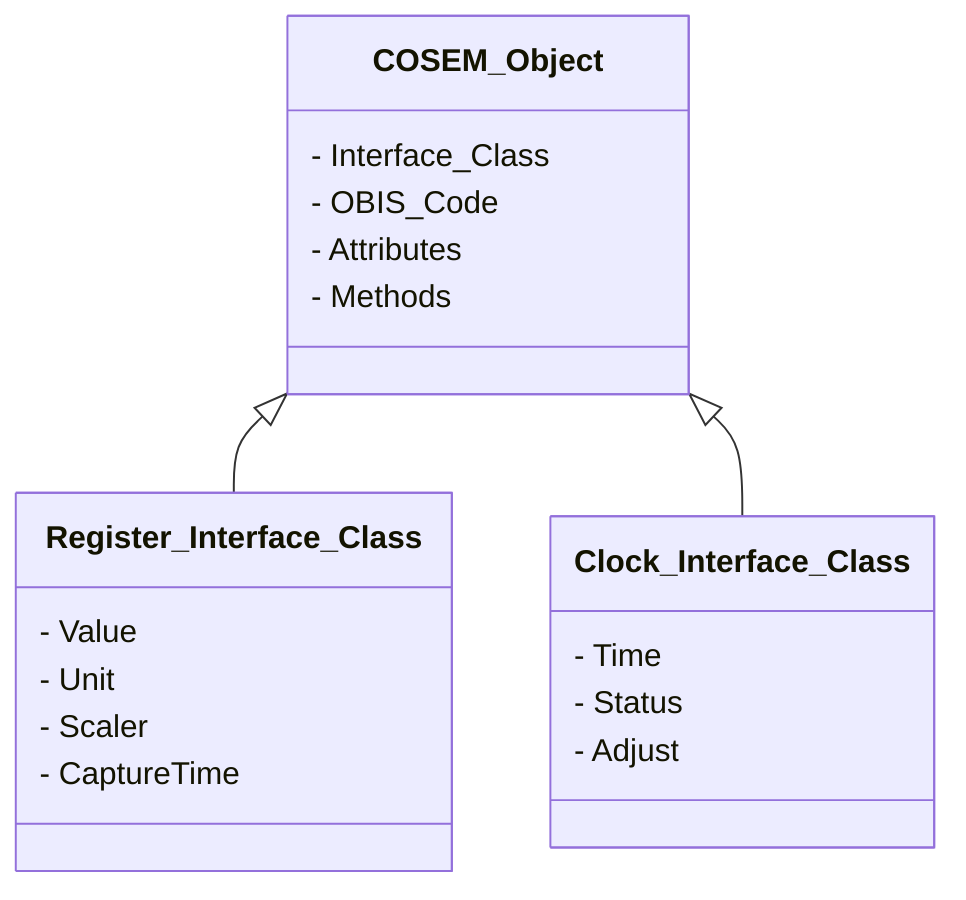
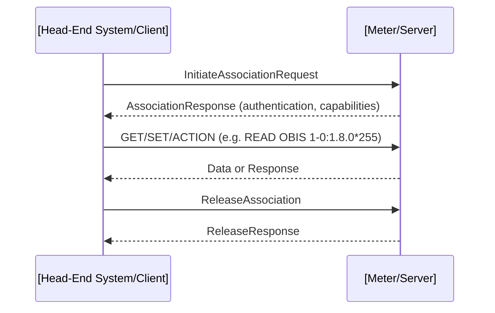
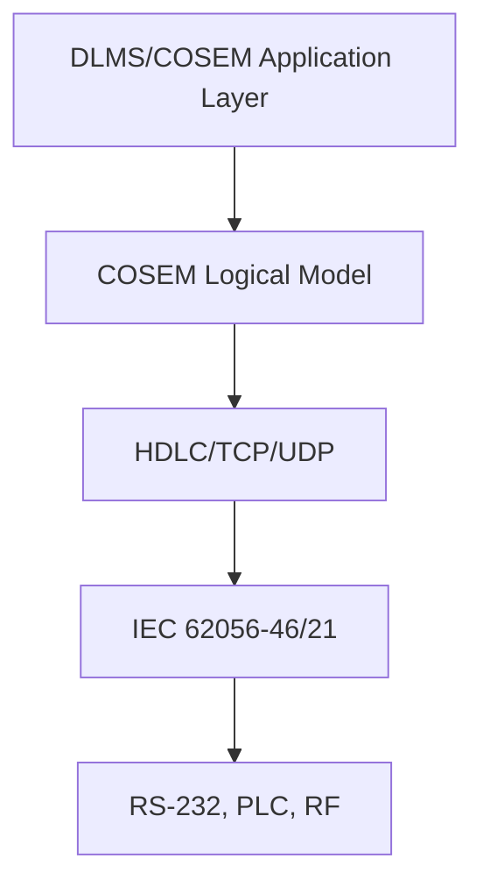
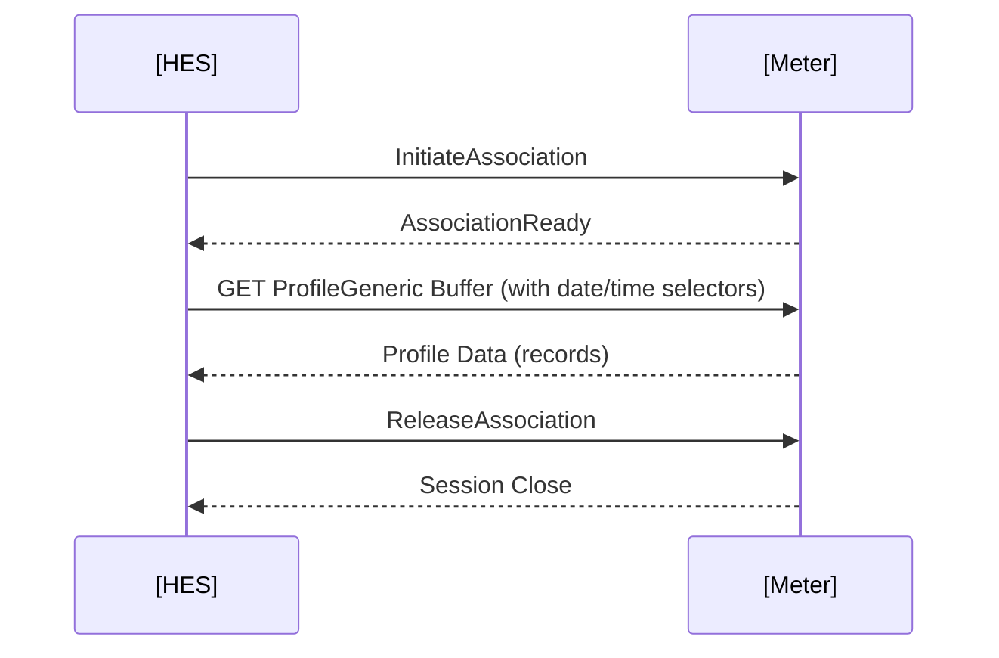

# DLMS/COSEM: The International Standard for Metering Data Modelling and Secure Communication

## 1. Introduction

DLMS/COSEM is the de facto international standard for the modelling, communication, and management of utility metering data. It provides a comprehensive framework widely adopted by electricity, gas, heat, and water utilities for the secure exchange of data between metering devices and backend systems. Its full title, **Device Language Message Specification / Companion Specification for Energy Metering** (`DLMS/COSEM`), references its two main constituent standards:

- **DLMS**: Defines the application-layer messaging for device data exchange.
- **COSEM**: Specifies the object model for metering functions and data.

This overview describes in detail the technical composition of DLMS/COSEM, its protocol stack, object modelling approach, security capabilities, implementation workflows, integration strategies, and relevant standards context.

---

## 2. Technical Context and Standardization

DLMS/COSEM is ratified by the International Electrotechnical Commission (IEC) as:

- **IEC 62056** series: Electric metering data exchange
- It is maintained by the **DLMS User Association (DLMS UA)**.

Its relevance extends across:

- **Smart Electric Meters** (primary domain)
- **Gas, Water, and Heat Meters** (with domain-specific profiles)
- **Home Energy Management Systems**, DCUs, and gateways
- **Smart Grid infrastructure** and utility backend integration

DLMS/COSEM is technology-agnostic regarding communication medium; it operates over:

- Serial (RS-232/485)
- PLC (Power Line Communication)
- RF, GSM/GPRS, Ethernet, HDLC, TCP/IP, and more

---

## 3. Core Concepts and Architecture

### 3.1 Overview

DLMS/COSEM is fundamentally grounded in the concept of object-oriented modelling, where all measurable and controllable aspects of a meter are represented as standardized objects (**COSEM objects**), and access to these objects is managed by a robust, secure application-layer messaging framework (**DLMS**).

### 3.2 Layered Architecture

DLMS/COSEM follows a clean, layered architecture closely corresponding to the OSI reference model in the context of metering:

```mermaid
flowchart TD
    A1[Application Process]
    A2[DLMS/COSEM Application Layer]
    A3[Transport Layer (TCP/UDP/HDLC/Serial...)]
    A4[Data Link Layer (IEC 62056-46, 21, HDLC)]
    A5[Physical Layer (RS-232, PLC, RF, etc.)]

    A1 --> A2
    A2 --> A3
    A3 --> A4
    A4 --> A5
```

**Legend:**
- **A1**: Meter data consumers and producers: utility backend, head-end systems (HES), smart meters, etc.
- **A2**: DLMS messaging and COSEM data modelling
- **A3**: Transport medium (can be network or serial-based)
- **A4**: Framing and addressing for metering protocols
- **A5**: Physical medium (wires, wireless, etc.)

---

## 4. COSEM: Companion Specification for Energy Metering

### 4.1 Object Modelling

**COSEM** defines a rich object model by which all metering functions are encapsulated as *COSEM interface classes* (IC) and *objects*.

#### 4.1.1 Interface Classes (IC)

- Each IC defines:
  - A set of data attributes (static or dynamic)
  - A set of methods (actions the object can perform)
- Each instance of an IC is an **object** identified by an **OBIS code**.

#### 4.1.2 OBIS Codes

- **OBIS** (*Object Identification System*; IEC 62056-61/62) codes uniquely identify every data point/function in a meter.
- Format: `A-B:C.D.E*F` (six fields encode metering context, channel, measurement type, attribute, etc.)

#### 4.1.3 COSEM Classes Examples

- Register (value storage)
- Clock (timestamp and synchronization)
- Data (generic data containers)
- Profile Generic (time-stamped historical data/ load profiles)
- Demand Register
- Action Scheduler
- Device Control

**Example OBIS Code:** `1-0:1.8.0*255` = Active energy import, total

---

### 4.2 COSEM Object Model Diagram



---

## 5. DLMS: Device Language Message Specification

### 5.1 Application Layer Protocol

DLMS specifies how metering applications communicate over a range of physical and transport layers, focusing on:

- Object access services (GET, SET, ACTION)
- Secure association establishment
- Messaging session control
- Authentication and access rights
 
#### 5.1.1 Messaging Workflow

- Initialization (logical name, short name referencing)
- Association negotiation
- Secure channel setup (if applicable)
- Data/service exchange (read/write/invoke methods)
- Session teardown

### 5.2 DLMS Services

- **GET**: Retrieve attribute value
- **SET**: Modify attribute value
- **ACTION**: Execute a method

### 5.3 Referencing Methods

- **Logical Name (LN) referencing** (by OBIS code)
  - Dominant in modern deployments
- **Short Name (SN) referencing**
  - Used in legacy devices, high performance/compact implementations

---

### 5.4 DLMS Messaging Sequence Diagram

**Typical Association and Data Exchange:**



---

## 6. Protocol Stack and Communication Technologies

### 6.1 IEC 62056 Protocol Suite

DLMS/COSEM is encapsulated over various physical and data link/transport mechanisms:

- **HDLC (High-level Data Link Control)**
  - IEC 62056-46: Wide adoption for both serial and optical ports
- **TCP/IP, UDP/IP**
  - IEC 62056-47: For Ethernet or IP-based links
- **IEC 62056-21**
  - For local optical / serial interface

### 6.2 Stack Diagram



### 6.3 Communication Modes

- **Unicast** (point-to-point, e.g., HES to meter)
- **Multicast/Broadcast** (seldom used due to security/access control)
- **Client/Server**
  - Meter = **Server**
  - HES/DCU = **Client**

---

## 7. Security Model

### 7.1 Authentication and Association

DLMS/COSEM defines multiple association mechanisms with increasing strengths:

- **Low Level Security (LLS)**: Password-based
- **High Level Security (HLS)**: Challenge-response using shared keys or public-key cryptography

### 7.2 Communication Security

- **Encryption**: AES, DES (AES-GCM, AES-CBC; DES deprecated in new installations)
- **Integrity Protection**: Message authentication codes (MAC)
- **Replay Protection**: Timestamps, sequence numbers

### 7.3 Security Context Diagram

```mermaid
flowchart TD
    A[Client (HES)]
    B[Meter]
    A -->|Association Request (credentials)| B
    B -->|Challenge if HLS| A
    A -->|Authentication Response| B
    B -->|Encrypted/Secured Session| A
```

---

> **Warning**
> Ensure keys and authentication credentials are managed and provisioned according to national and utility-specific cyber security policies and compliance requirements. Poor key management is a significant operational risk.

---

## 8. Implementation Workflows

### 8.1 Meter Data Acquisition

#### Typical Workflow

1. **Session Initialization:** HES establishes secure association with meter.
2. **Data Request:** HES issues GET/SET/ACTION requests for desired OBIS codes.
3. **Data Capture/Response:** Meter collects, optionally processes, and responds with requested data.
4. **Event/Alarm Notification:** Some meters proactively send push events (if provisioned).
5. **Session Termination:** Clean teardown of communications channel.

### 8.2 Load Profile Retrieval

- Load profiles are stored in **COSEM Profile Generic** objects.
- Data structure: time-stamped measurements, customizable capture periods.

#### Fetching Load Profiles Sequence



---

## 9. Practical Engineering Considerations

### 9.1 Integration Points

- **HES/MDM backend**
  - Must support configurable OBIS codes, security profiles, and error handling
- **Field Devices/DCUs**
  - Device firmware must conform to relevant IEC 62056 subset(s)
- **Gateways, Routers, PLC Concentrators**
  - Must route/translate multiple protocol variants, including HDLC and TCP/IP encapsulations

### 9.2 Performance and Scalability

- **Session Overhead:** Each association has setup/teardown cost. Batch reads advisable for minimizing sessions.
- **Data Volume:** Frequent polling of broad OBIS code sets strains device resources and network bandwidth.
- **Push vs. Poll:** Configurable push schedules (alarms, events, periodic data) reduce read latency but increase configuration complexity.

> **Tip**
> Use selective reading (by data range or selector) and cache profiles when possible to optimize load management.

---

### 9.3 Implementation Pitfalls

- **OBIS Code Mapping:** Inconsistent implementation of manufacturer-specific/extended OBIS codes can break interoperability.
- **Time Synchronization:** Unsynchronized meters yield inconsistent profile data; ensure COSEM Clock object is managed.
- **Security Gaps:** Not enabling HLS/cryptography for field deployments exposes data to interception and tampering.
- **Legacy vs. Modern Mode:** Legacy short-name referencing is not always forward-compatible with logical-name (OBIS) implementations.

---

## 10. Common Variations and Profiles

- **Regional Profiles:** 
  - E.g., IEC 62056-53 defines country-specific requirements, e.g., UK SMETS, French Linky, German FNN.
- **Interface-Specific Profiles:**
  - Subsets optimized for GPRS, NB-IoT, PLC, etc.
- **Custom Manufacturer Implementations:**
  - Proprietary objects, vendor extensions (should default to generic COSEM when possible for interoperability)

> **Note**
> [diagram to be added later: Comparative table of regional/protocol profiles and supported OBIS classes.]

---

## 11. DLMS/COSEM Interoperability and Test Certification

### 11.1 Conformance Testing

- **DLMS UA maintains a conformance test suite and certified logo program.**
- Devices passing certification are eligible for use in multi-vendor, cross-utility environments.

### 11.2 Data Exchange Scenarios

- **Meter Reading:** Periodic extraction of billing/usage data
- **Demand Response:** Remote load control/management actions
- **Firmware Updates and Configuration:** Managed using secure actions and authenticated command channels
- **Event/Alarm Reporting:** Automatic notifications on threshold events or tampering attempts

---

## 12. Related Standards

### 12.1 IEC 62056 Series

- **IEC 62056-5-3:** DLMS/COSEM Application layer
- **IEC 62056-6-1:** OBIS (object identification)
- **IEC 62056-46:** HDLC profiles for data link layer
- **IEC 62056-21:** Local data exchange via serial/optical
- **IEC 62056-47:** TCP/UDP transport profiles

### 12.2 Interoperability with Other Standards

- **ZigBee Smart Energy:** Used for HAN device integration; bridging to DLMS/COSEM via gateways
- **SMETS2/GBCS (UK):** Utilizes DLMS/COSEM as part of their metering infrastructure (MEGs, device specifications)
- **DNP3, Modbus:** Used in some upstream/bulk data aggregation networks; conversion or adaptation is often necessary

---

## 13. DLMS/COSEM: Future Evolution

- **Increased Security Requirements:** Ongoing migration toward full AES cryptography, post-quantum algorithms.
- **IPv6 and Smart Grid Integration:** Seamless operation over modern IP-based MES networks.
- **Enhanced Object Models:** Support for prosumer, DER, distributed generation, and EV charging data.
- **Cloud and IoT Integration:** Lightweight endpoint stacks for edge/IoT environments.

---

# 14. Summary Diagram: DLMS/COSEM End-to-End Metering Data Exchange

```mermaid
flowchart LR
    HES[Head End System]
    Gateway[Data Concentrator / Gateway]
    Meter[Smart Meter (DLMS/COSEM Server)]
    Comm[Communication Network]

    HES -- DLMS/COSEM Client --> Gateway
    Gateway -- DLMS/COSEM Proxy --> Meter
    Meter -- OBIS Data / Responses --> Gateway
    Gateway -- Meter Data --> HES
    Gateway --|Protocol Adaption| Meter
    HES --|Integration API| Utility Backend

    Comm -.-> Meter
    Comm -.-> Gateway
    Comm -.-> HES
```

---

## 15. Conclusion

DLMS/COSEM remains the cornerstone of global utility metering systems architecture, providing the only well-maintained international standard for secure, object-modelled, multi-utility data exchange. Engineers tasked with deploying, integrating, or maintaining metering infrastructure should develop proficiency with the protocols and object models of DLMS/COSEM. Careful consideration of object registration (OBIS), security, transport choices, and workflow integration is critical for full interoperability, cybersecurity compliance, and scalable operations.

---

> **Note**
> This document has covered the technical architecture, workflows, modelling constructs, practical pitfalls, and standards relationships essential to understanding DLMS/COSEM for modern utility engineering. For precise implementation or project-specific guidance, always refer to the latest IEC 62056 documentation and official test/certification resources.