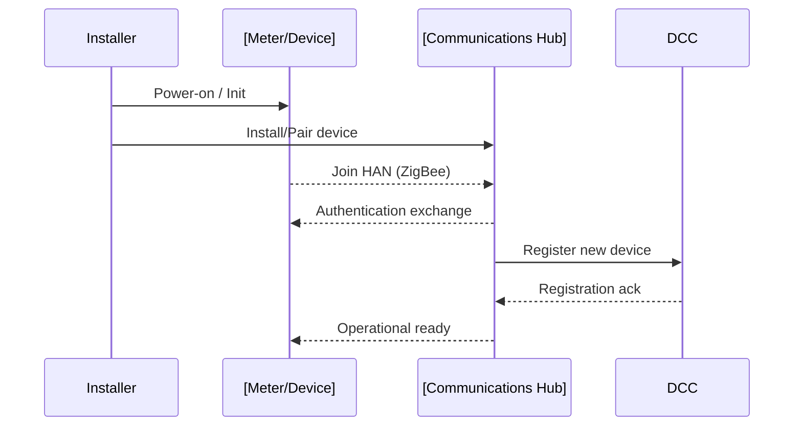
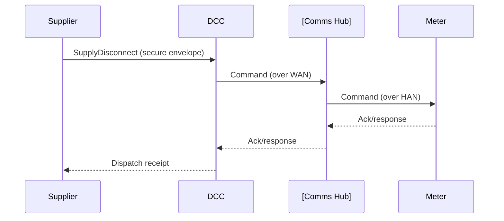
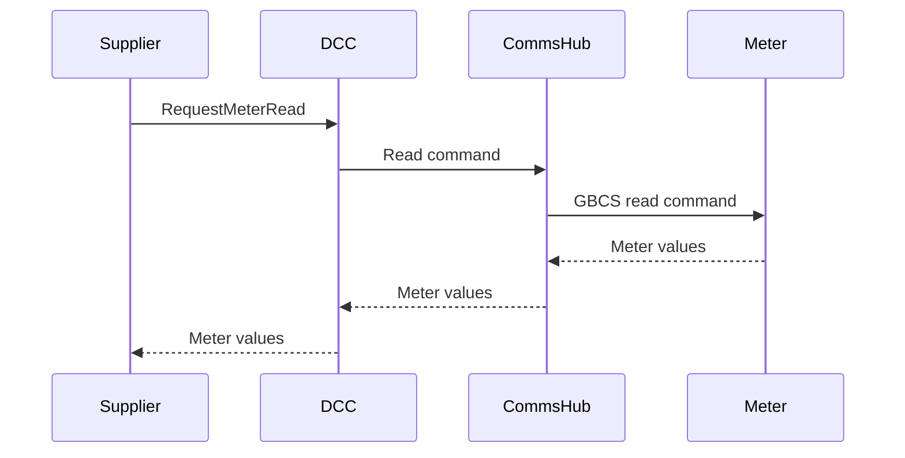

# SMETS2 and GBCS: UK Smart Metering Protocols for Secure Energy Metering

## 1. Introduction

Smart metering in the United Kingdom is underpinned by a suite of technical and security standards designed to enable interoperable, secure, and scalable data collection and control for electricity and gas meters. Two of the central standards in this regime are the **Smart Metering Equipment Technical Specifications (SMETS2)** and the **Great Britain Companion Specification (GBCS)**.

This document provides an in-depth, engineering-focused explanation of SMETS2 and GBCS as they relate to the UK smart metering landscape. Engineers tasked with the design, implementation, or integration of smart metering solutions in Great Britain must become proficient in the underlying principles, architecture, and operational detail set forth in these specifications.

---

## 2. Context and Rationale

### 2.1 Background

The transition to smart metering in the UK is a national infrastructure programme, enabling:

- Remote collection, transmission, and management of electricity and gas meter data
- Real-time, secure bidirectional control and configuration
- National scalability, interoperability, and data privacy
- Support for demand-side response, time-of-use tariffs, and energy efficiency measures

The UK smart metering program is distinct in its centralised architecture, with the **Data Communications Company (DCC)** serving as a secure intermediary between devices and authorised parties.

### 2.2 Core Documents

- **SMETS2**: The technical requirements for compliant devices and their interfaces.
- **GBCS**: Defines the application-level protocol, messaging, and data modelling ensuring secure, interoperable device communication.
- **Supporting Standards**: DLMS/COSEM (metering data modelling), ZigBee Smart Energy (Home Area Network), and others.

---

## 3. SMETS2: Smart Metering Equipment Technical Specifications (Second Generation)

### 3.1 Scope and Purpose

**SMETS2** defines the minimum technical, functional, and security requirements for smart metering systems deployed in Great Britain. It standardises:

- Device types, roles, and functions
- Interface protocols (HAN, WAN)
- Interoperability, device behaviour, and compliance criteria
- Security requirements

All devices installed under the national roll-out must be SMETS2 compliant for mandatory DCC interoperability.

### 3.2 Core Device Roles

| Acronym | Device Name           | Description                                                                 |
|---------|----------------------|-----------------------------------------------------------------------------|
| ESME    | Electricity Smart Meter| Responsible for measuring and reporting electricity consumption.            |
| GSME    | Gas Smart Meter       | Responsible for measuring and reporting gas consumption.                    |
| CHTS    | Combined Heat/Supply | Not commonly used; concept for combined metering.                           |
| CHPETS  | Combined Heat and Power Meter | Support for micro-generation scenarios.                            |
| IHD     | In-Home Display       | Consumer-facing device for real-time energy usage display.                  |
| CAD     | Consumer Access Device| Enables third-party services via the HAN.                                   |
| HCALCS  | Home Area Network Controller| Central hub for device communication; tightly coupled with comms module.  |
| WHC     | WAN Communications Hub| Enables Wide Area Network connectivity (WAN) to DCC; hosts the HAN controller. |

### 3.3 Architecture Overview

The SMETS2 system operates with a layered architecture, generally comprising:

- **Metering Equipment**: Electricity/Gas Smart Meters (ESME/GSME)
- **Consumer Devices**: IHD, CAD
- **Communications Hub**: Core HAN-WAN gateway
- **DCC**: Secure intermediary between devices and market participants

#### Mermaid Diagram: SMETS2 Device Architecture

```mermaid
flowchart TD
    subgraph Home
        ESME[Electricity Smart Meter]
        GSME[Gas Smart Meter]
        IHD[In-Home Display]
        CAD[Consumer Access Device]
        comms_hub[Communications Hub (HCALCS + WHC)]
    end
    DCC[Data Communications Company]
    Market[Market Participant (Supplier/Network/Other)]
    
    ESME -- ZigBee HAN --> comms_hub
    GSME -- ZigBee HAN --> comms_hub
    IHD -- ZigBee HAN --> comms_hub
    CAD -- ZigBee HAN --> comms_hub
    comms_hub -- WAN (Cellular/RF) --> DCC
    DCC -- Secure Link --> Market
```

---

## 4. GBCS: Great Britain Companion Specification

### 4.1 Purpose and Positioning

While SMETS2 specifies device behaviour and capabilities, **GBCS** defines the **application-level protocol** governing secure messaging, data model semantics, and command-and-control transactions in the UK environment. GBCS ensures:

- **Interoperability**: A uniform message set and object model for all SMETS2 devices, irrespective of manufacturer.
- **Security**: Use of cryptographic controls and message integrity mechanisms.
- **Robustness**: Explicit handling of device state, failure modes, and edge cases.

GBCS is layered above lower-level transport and security protocols (e.g., ZigBee Smart Energy Profile 1.4 for HAN, TLS/IPsec for WAN).

### 4.2 GBCS Structure

GBCS is structured as a series of command and response messages grouped by *service domain* (metering, prepayment, device management, event notification, etc.).

Key elements:

- **Service request/response pairs** (e.g., ReadMeter, IssueSupplyDisconnect)
- **Payload definition and field semantics** (DLMS/COSEM or equivalent object model)
- **Security wrappers**, including message authentication codes (MAC) and encryption
- **Error and exception handling** uniformly defined

---

## 5. SMETS2 System Architecture and Integration

### 5.1 Logical Layers

The SMETS2 system is best viewed as a layer cake:

1. **Physical Layer**: ZigBee SE over 2.4 GHz (HAN), cellular (WAN), or other DCC-mandated networks
2. **Transport Layer**: ZigBee, DLMS/COSEM, GBCS XML
3. **Security Layer**: Link-level and message-level encryption, authentication protocols
4. **Application Layer**: GBCS commands, events, meter data, and device management

#### Mermaid Diagram: SMETS2 Protocol Stack

```mermaid
flowchart TB
    App[GBCS Application Layer]
    Sec[Security Layer]
    Trans[Transport Layer]
    Phys[Physical Layer]
    App --> Sec --> Trans --> Phys
    note right of App: (GBCS service commands)
    note right of Sec: (Message encryption, signing)
    note right of Trans: (ZigBee SEP / DLMS/COSEM)
    note right of Phys: (HAN / WAN media)
```

### 5.2 Device Bootstrapping and Onboarding

#### Workflow: Bootstrapping a New Device

1. **Manufacture & Initialisation**: Devices are provisioned with cryptographic material and unique identifiers at factory.
2. **Installation**: On-site engineer or installer commissions meter, connecting it to the HAN via pairing.
3. **Authentication**: Meter and Comms Hub authenticate via certificate challenge/response or pre-shared keys.
4. **Secure Join**: End devices join HAN (ZigBee) and are enrolled in the local trust domain.
5. **WAN Registration**: Communications Hub establishes a secure channel with the DCC over the WAN, registering devices.
6. **Operational Service**: Devices become operational; can receive GBCS commands.

#### Mermaid Diagram: Device Onboarding Sequence



---

## 6. Secure Messaging in GBCS

### 6.1 Security Fundamentals

- **End-to-End Security**: Crypto protections from the originating market participant ("requester") to the end device, via the DCC.
- **Keys and Credentials**: Unique device keys (install, transport, master), managed and rotated according to SMETS2 requirements.
- **Cryptographic Algorithms**: Typically AES-128 for HAN, TLS for WAN.
- **Replay and Integrity Protection**: Message counters, MAC, and time-stamping.

### 6.2 Command Workflows

#### Example: Remote Supply Disconnect Command

1. **Command Creation**: Supplier creates GBCS-formatted command (SupplyDisconnect).
2. **Security Envelope**: Command is cryptographically signed/encrypted.
3. **Transport to DCC**: Sent over secure WAN to DCC.
4. **Relay to Device**: DCC forwards command to HAN via Communications Hub.
5. **Device Execution**: Meter executes command if valid (with anti-coercion checks where appropriate).
6. **Acknowledgement Chain**: Response/receipt propagates back upstream.

#### Mermaid Diagram: Remote Command Workflow



---

## 7. Key Protocols, Standards, and Data Models

### 7.1 Relevant Standards

- **SMETS2**: Published and maintained by BEIS and the SEC (Smart Energy Code)
- **GBCS**: Defined as part of the SEC documentation suite
- **DLMS/COSEM**: IEC 62056 series; meters' data model and communication standard
- **ZigBee Smart Energy Profile**: ZigBee SEP 1.4 over 2.4 GHz, for HAN
- **ISO/IEC 15118**: Electric vehicle integration (future relevance)
- **TLS, IPsec**: Security over WAN; mandatory DCC interfaces

### 7.2 Data Modelling (DLMS/COSEM)

Meters employ the **DLMS/COSEM** object model for defining registers, event logs, and profiles, which is used to structure data payloads within GBCS messaging.

| Information Object        | Object Type | Example Use                                                           |
|--------------------------|-------------|-----------------------------------------------------------------------|
| Meter Reading            | Register    | Current usage, historic profiles                                      |
| Load Profile             | Profile     | Time-stamped interval readings                                        |
| Event Log                | Log         | Tamper, supply interruption, firmware update records                  |
| Tariff Table             | Table       | Configuration of time-of-use and pricing structures                   |
| Supply Control           | Control     | Enable/disable supply, limit power, manage reconnect policies         |

---

## 8. System Security and Trust Architecture

### 8.1 Trust Model

- **End Devices**: Each is cryptographically identifiable and isolated.
- **Comms Hub**: Functions as a trust anchor for the HAN; bridges secure domains between HAN and DCC.
- **DCC**: A central trust intermediary; controls certificate/credential lifecycle for all endpoints.

### 8.2 Credential Handling

- **Device Credentials**: Installed at manufacture; rotated via secure procedures.
- **HAN Network Keys**: Transient; subject to re-keying on device join/leave events.
- **DCC Credentials**: Issued and managed under strict operational controls.

> :warning: **Caution**
>
> Credential compromise at any node (especially Comms Hub or DCC) jeopardises the integrity of all devices in that network domain.

### 8.3 Security Event Handling

- **Tamper Detection**: Devices report physical or protocol tampering as explicit events.
- **Anti-Coercion Features**: Supply disconnection requests may require physical confirmation or time delay to protect vulnerable consumers.
- **Audit Logging**: All critical events, command invocations, and security-relevant changes are logged.

---

## 9. Operations, Workflows, and Maintenance

### 9.1 Core Operations

- **Meter Reads**: Periodic, scheduled, or on-demand via GBCS commands; applies to both electricity and gas meters.
- **Tariff and Configuration Updates**: Remotely issuable by suppliers/participants via DCC.
- **Demand Side Management**: Includes remote load control, pre-payment updates, and direct load limiting.
- **Firmware Updates**: Managed by secure download channels as part of SMETS2/GBCS provisions.

### 9.2 Typical Workflow: Periodic Meter Reading

1. **DCC Receives Scheduled Read Command**
2. **Command Relayed to Device via Communications Hub**
3. **Device Captures Current Register(s)**
4. **Encapsulates Reading in Secure Response**
5. **Transmits Upstream via DCC to Requesting Party**
6. **Exception/Event Handling as Needed**

#### Mermaid Diagram: Meter Read Flow



### 9.3 Exception and Failure Handling

- **Timeouts**: Predefined thresholds for device or network response lapses.
- **Retries**: Managed per protocol to avoid flooding or repeated device stress.
- **Fallback Contingencies**: Critical for scenarios where HAN/WAN communication is down (e.g., store readings until re-connect, or flag alarms).

> :information_source: **Tip**
>
> Engineers must ensure devices gracefully handle WAN or HAN outages, preserving operational data consistency and minimising end-user disruption.

---

## 10. Engineering Best Practices and Pitfalls

### 10.1 Implementation Considerations

- **Interoperability Testing**: Mandatory with all DCC-mandated device types. Even minor protocol deviations trigger field failures.
- **Security Updates**: Rollout of firmware, certificate updates, and security patching must occur within the strict lifecycle outlined in SMETS2.
- **Resource Constraints**: Meters are highly constrained embedded systems (typically ARM Cortex-Mx scale or smaller); efficient protocol implementations are essential.

### 10.2 Common Pitfalls

- **Poor Clock Synchronisation**: Meter profile logging and event tracing depend on accurate timekeeping.
- **Weak Cryptographic Practices**: Never hardcode keys or neglect routine credential rotation.
- **Error Handling Gaps**: Failure to fully support GBCS error and exception semantics may result in devices being isolated by DCC.

### 10.3 Integration Points

- **DLMS/COSEM Stack**: Ensure proper mapping between the device object model and GBCS payloads.
- **ZigBee SE Profile**: HAN configuration and security must adhere strictly to ZigBee Smart Energy 1.4 specs.
- **DCC API**: All upstream market-side integration passes through well-defined DCC APIs, subject to security and audit controls.

---

## 11. Implementation Variations and Constraints

### 11.1 Device Variants

- **SMETS1 Devices**: Legacy; limited DCC interoperability; being phased out
- **SMETS2 Devices**: Full compliance; required for new installations
- **UK Dual-Fuel Installations**: Typical home contains one ESME, one GSME, a single communications hub, and optionally IHD/CAD

### 11.2 Network Constraints

- **WAN Black Spots**: Devices in remote areas may default to 'offline' or 'store-and-forward' operations when WAN is unavailable.
- **HAN Limitations**: ZigBee range and mesh limitations may affect large or distributed premises.

### 11.3 Regulatory and Compliance Constraints

- **SEC Compliance**: Devices and implementations must pass Security Assurance and Interoperability Testing, per Smart Energy Code (SEC) mandates.
- **Privacy Requirements**: All consumer data is subject to GDPR; device data minimisation and secure storage are mandated.

---

## 12. Upgrades, Future Directions, and Interoperability

### 12.1 Firmware Upgrades

Devices must support secure, over-the-air firmware upgrades, signed and validated by DCC and device-internal controls.

### 12.2 Evolution of GBCS and SMETS

Ongoing revisions address new use cases (e.g., electric vehicles, micro-generation), updated crypto standards, and lessons learned from field operations.

### 12.3 Interoperability with Emerging Protocols

- **DLMS/COSEM upgrades (IEC 62056-6-2)**
- **Cross-border harmonisation efforts** (with EU or ISO standards)
- **Integration with demand-response, grid-edge, and IoT adjuncts**

> :bulb: **Note**
>
> Diagram to be added later: High-level future-proofing and interoperability architecture.

---

## 13. Summary Table: Key Elements

| Component                | Specification/Protocol | Interface/Network     | Security Base         |
|--------------------------|-----------------------|----------------------|-----------------------|
| Electricity Smart Meter  | SMETS2 + GBCS         | HAN (ZigBee SE)      | AES-128, Certs        |
| Gas Smart Meter          | SMETS2 + GBCS         | HAN (ZigBee SE)      | AES-128, Certs        |
| Communications Hub       | SMETS2                | HAN/WAN (cellular/RF)| PKI, Symmetric Crypto |
| DCC                      | DCC User Gateway Spec | WAN                  | TLS, IPsec, PKI       |

---

## 14. Conclusion

SMETS2 and GBCS together form the technical backbone of the UK's smart metering infrastructure. They deliver robust, scalable, and secure interoperability between heterogeneous energy metering devices, the consumer premises, and centralised market services via the DCC. Success in engineering, integration, and deployment within this ecosystem demands a deep understanding of layered protocols, device trust boundaries, cryptographic life cycles, and the precise application-level semantics prescribed by GBCS.

Proper attention to security, compliance, and longevity is paramount, as these systems constitute critical national infrastructure. Field implementation is non-trivial but highly structured; all engineering work must rigorously adhere to the specified standards, paying close attention to integration and update mechanisms and evolving requirements.

---

**Document version: June 2024. Content generated programmatically; check SEC and DCC documentation for normative references.**