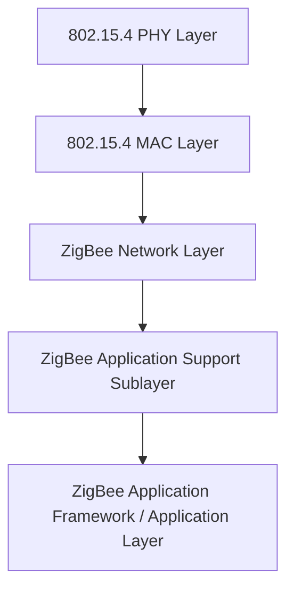
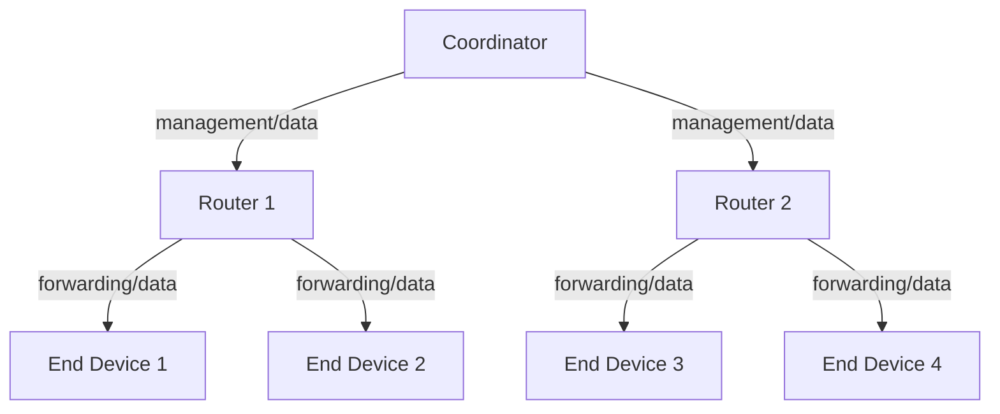
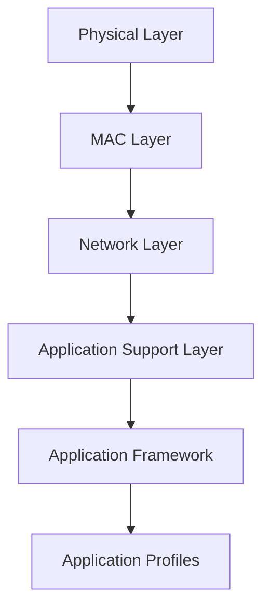
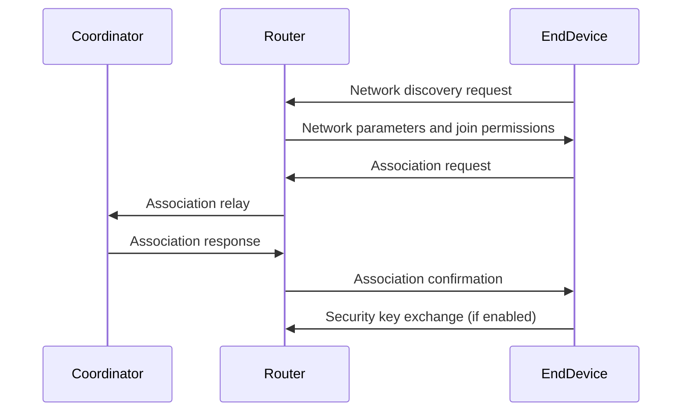
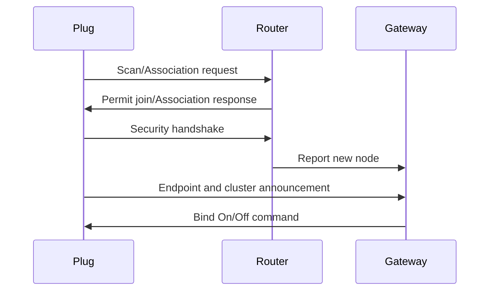

# ZigBee: A Technical Primer

## Introduction and Context

ZigBee is a specification for a suite of high-level communication protocols using low-power wireless mesh networking, targeting low-data-rate, short-range, and low-cost transmission needs. It is designed primarily for applications such as home automation, smart energy, wireless sensor networks, and Internet of Things (IoT) deployments. The ZigBee specification is developed and maintained by the ZigBee Alliance (now the Connectivity Standards Alliance, CSA).

Operating primarily in the 2.4 GHz ISM (Industrial, Scientific, and Medical) band, with some profiles supporting 868 MHz (Europe) and 915 MHz (USA), ZigBee provides a standardized protocol stack built atop the IEEE 802.15.4 physical and media access control (MAC) layers. It enables robust, scalable, and secure solutions for device-to-device and device-to-gateway communications.

## Core Concepts

### IEEE 802.15.4 Foundation

ZigBee sits atop the IEEE 802.15.4 standard, which defines the PHY and MAC layers for low-rate wireless personal area networks (LR-WPANs). IEEE 802.15.4 offers raw data rates of 250 kbps at 2.4 GHz, supporting low power consumption and simple networking requirements.

#### IEEE 802.15.4 and ZigBee Layering



- **PHY Layer:** Handles modulation, demodulation, radio transmission, and reception.
- **MAC Layer:** Responsible for medium access, frame validation, and transmission reliability.
- **ZigBee Network Layer (NWK):** Provides mesh networking, addressing, routing, and network formation.
- **ZigBee Application Support Sublayer (APS):** Manages binding, group addressing, and message filtering.
- **ZigBee Application Framework:** Hosts application objects, endpoints, clusters, and device profiles.

### Mesh Networking

A key architectural feature of ZigBee is its support for mesh networking, allowing device-to-device, multi-hop communication and enhancing coverage, reliability, and redundancy.

#### Node Types

ZigBee networks comprise three device types:

1. **Coordinator:** The root node that initiates, configures, and manages the network. There is only one coordinator per ZigBee network.
2. **Router:** Forwards packets among devices, extends network coverage, and may also run applications.
3. **End Device:** Communicates with parent routers or the coordinator; optimized for low power, can sleep to conserve energy, provides application endpoints.



#### Network Topologies

ZigBee supports multiple topologies, primarily:

- **Star:** Centralized around the coordinator.
- **Tree:** Routers connect in hierarchical branches.
- **Mesh:** Arbitrary, robust multi-hop links.


## ZigBee Stack Architecture

ZigBee architecture is divided into several logical layers:

1. **Physical Layer (PHY):** Defined by 802.15.4, specifying modulation, frequency, symbol rate, and channelization.
2. **MAC Layer:** Handles channel access, collision avoidance, and frame validation.
3. **Network Layer (NWK):** Responsible for device addressing, network formation, routing, and security primitives.
4. **Application Support Layer (APS):** Offers services for binding, group messaging, and message delivery.
5. **Application Framework (AF):** Hosts endpoints, clusters, and application objects.
6. **Application Profiles:** Define interoperable device behavior for specific use cases (e.g., lighting, metering, security).



### Application Profiles and Clusters

- **Application Profiles** define sets of standardized devices and their behaviors for interoperability (e.g., Home Automation, Smart Energy).
- **Clusters** are collections of attributes and commands for particular device capabilities (e.g., On/Off cluster, Temperature Measurement cluster).

Each physical device exposes **logical endpoints** to which specific profiles and clusters are bound.

```mermaid
flowchart TB
    Device[Physical Device]
    Device --> EP1[Endpoint 0 (ZigBee Device Object)]
    Device --> EP2[Endpoint 1 (Lighting Control)]
    Device --> EP3[Endpoint 2 (Temperature Sensor)]
    EP2 --> C1[OnOff Cluster]
    EP3 --> C2[Temperature Measurement Cluster]
```

## How ZigBee Works in Practice

### Network Formation and Joining

1. **Network Formation:** The coordinator selects a channel and PAN (Personal Area Network) ID according to IEEE 802.15.4. Routers and end devices discover available networks and request to join.
2. **Address Assignment:** Upon joining, devices are given a 16-bit short address (for routing) and retain a unique 64-bit extended address (EUI-64).
3. **Security Key Exchange:** Devices may be authenticated using pre-shared, distributed, or unique installation keys (see Security).
4. **Network Operation:** Devices communicate as per their assigned roles; routers extend the topology, end devices attach to parents.

#### Network Joining Sequence (Simplified)



### Device Communication

- **Unicast:** Device-to-device direct addressing.
- **Multicast/Groupcast:** Messages targeting multiple devices in a group.
- **Broadcast:** Delivered to all devices within transmission range.

The APS and NWK layers provide mechanisms for message delivery, fragmentation, and addressing, including support for grouped device actions (e.g., turning all lights off).

### Power Management

ZigBee is optimized for low-power, battery-operated devices:

- **End devices** can sleep for extended periods.
- **Routers/Coordinators** must remain active to forward traffic.

This power management model is critical for devices such as sensors, switches, and remotes.

```mermaid
flowchart TD
    Sleep[End Device (Sleep)]
    Wake[End Device (Awake)]
    Parent[Parent Router]
    Sleep -->|wakes up| Wake
    Wake -->|data poll| Parent
    Parent -->|data if pending| Wake
    Wake -->|sleeps| Sleep
```

### Application Layer Interoperability

Application Profiles determine interoperability across vendors and implementations. For example, a ZigBee-certified lightbulb using the Home Automation profile can be controlled by any compliant controller.

Each profile specifies:
- Standard **Device Types** (e.g., On/Off Light, Thermostat)
- Supported **Clusters**
- Expected **Attributes** and **Commands**

### Security Considerations

ZigBee specifies AES-128-based security at the NWK and APS layers. Security primitives include:

- **Key Management:** Network keys (shared), link keys (per device pair), and master keys.
- **Authentication:** During joining, keys are exchanged and devices authenticated.
- **Encryption and Frame Integrity:** NWK and APS layers can encrypt and authenticate frames end-to-end or hop-by-hop.

> **:warning: Warning:** Security is highly dependent on the key management and device commissioning methodology. Pre-shared keys, if exposed, can compromise the security of the entire network.

#### Security Model (Simplified)


## Standards and Specifications

Key standards and documents defining ZigBee operation include:

- **IEEE 802.15.4:** PHY and MAC layers for LR-WPANs.
- **ZigBee Document 053474r20 (ZigBee PRO, 2012/2015):** Core network and application specifications.
- **ZigBee Cluster Library (ZCL):** Standardized library of clusters used by application profiles.
- **ZigBee Smart Energy Profile 1.x / 2.0:** Advanced metering infrastructure and energy management profiles.
- **Application Profiles:** Home Automation, Light Link, Building Automation, etc.

> **:bulb: Tip:** Profiles are critical for interoperability. Devices following only the base ZigBee specification (without conforming to a profile) may not interoperate properly.

## Key Technical Features

### Mesh Routing

ZigBee uses mesh multi-hop routing algorithms to enable robust packet delivery and self-healing networks. The ZigBee PRO specification introduces enhancements such as:

- **Source Routing:** Coordinator/applications can specify explicit paths.
- **Many-to-One Routing:** Optimized for sensor-to-coordinator communication.
- **Route Discovery and Maintenance:** Dynamic adaptation to topology changes (e.g., node mobility or power cycles).

> **:bulb: Tip:** Dense ZigBee networks benefit from mesh resilience, but too many routers can result in unnecessary route discovery flooding and increased overhead.

### Device Discovery and Binding

- **Service Discovery:** Devices announce available endpoints and supported clusters.
- **Binding:** Logical association between clusters (e.g., a switch device bound to a lighting cluster).


### Addressing

- **EUI-64:** Each device is globally unique.
- **Short Address:** 16-bit for efficient routing (assigned by the parent router/coordinator).
- **Group and Broadcast Addresses:** Enable group-based and whole-network messaging without specifying individual nodes.

### Over-the-Air (OTA) Upgrades

ZigBee supports firmware upgrades over the air, enabling in-field maintenance and improvement without physical access.

> **:warning: Caution:** OTA upgrades require careful key management and robust fallbacks to avoid bricking devices during failures.

## Practical Engineering Considerations

### Integration Points

- **Gateways:** Many cloud-integrated smart home solutions rely on ZigBee-to-Ethernet/Wi-Fi gateways.
- **Bridges:** Translation bridges enable interoperability between ZigBee and protocols like Z-Wave, Bluetooth, or Thread.
- **API & SDK Support:** Chipset vendors and stack implementers provide APIs such as ZigBee Cluster Library (ZCL), ZigBee Device Objects (ZDO), or ZigBee Device Profiles.

### Performance Implications

- **Throughput:** Max 250 kbps (2.4 GHz), less in noisy environments.
- **Latency:** Normally low at small scales, but increases with dense mesh, long sleep intervals, or heavy route maintenance.
- **Range:** Typically 10-100 meters per hop, with mesh extending overall coverage.

### Implementation Challenges

- **Channel Interference:** 2.4 GHz ZigBee channels can overlap with Wi-Fi; channel planning is essential.
- **Resource Constraints:** End devices require minimal RAM and flash (16-128kB typical).
- **Power Profiles:** Device role selection (router vs. end device) has significant power/availability implications.
- **Commissioning:** Secure, user-friendly joining and exclusion processes are often major UX and security pain points.

> **:warning: Warning:** Misconfigured networks (e.g., too few routers, excessive sleeping, or uncoordinated channel selection) can result in coverage holes, unreliable communication, and security vulnerabilities.

### Common Pitfalls

- **Incomplete Profile Support:** Devices not implementing all mandatory clusters or attributes may appear non-compliant.
- **Failed Network Healing:** Devices hardcoded for specific parent nodes can fail if that parent goes offline.
- **OTA Upgrade Failures:** Insufficient memory or poor power management during upgrades risks device bricking.

### Engineering Decisions

- **Router Placement:** Strategic router deployment balances mesh density, coverage, and latency.
- **Key Management:** Hardware-accelerated key storage and rotated install keys mitigate device compromise risks.
- **Binding Model:** Static binding simplifies implementation; dynamic binding increases flexibility but may introduce complexity.

## Variations and Ecosystem

- **ZigBee PRO:** Enhanced version with improved routing features, security, and scalability. Most modern profiles and installations use ZigBee PRO.
- **Green Power:** Enables ultra-low-power, energy harvesting devices (e.g., no-battery switches) to transmit within ZigBee networks.
- **Light Link:** Specialized for simple, low-latency lighting networks, commonly deployed in consumer lighting products.
- **ZigBee 3.0:** Unifies ZigBee profiles to a single interoperable stack for home automation, lighting, metering, and other domains.

## Applications

ZigBee’s versatility and low-power characteristics make it ideal for:

- **Home Automation:** Lighting, security, smart plugs, HVAC control.
- **Smart Metering/Energy:** Electricity/gas/water meters, demand-response appliances, In-Home Displays (IHDs).
- **Building Automation:** HVAC, access control, fire/smoke detection.
- **Industrial Monitoring:** Environmental, process, and safety sensors.
- **Health and Fitness:** Personal monitoring devices (though less common than Bluetooth).

## ZigBee in Standards-Driven Environments

### Smart Energy and Metering

The ZigBee Smart Energy Profile (SEP 1.x, SEP 2.0) is widely used in utility metering, demand response, and energy management. In some regions, such as the UK, ZigBee is specified within the Smart Metering Equipment Technical Specifications (SMETS2) and integrated with the Great Britain Companion Specification (GBCS), providing interoperability for meters, in-home displays, and communications hubs.

### Interoperability with DLMS/COSEM

While ZigBee handles transport and local networking, communication with utility backends and external services may leverage application-layer protocols like DLMS/COSEM for metering data exchange and security.

## Example Workflow: Onboarding a ZigBee Smart Plug

1. **Factory Reset:** User powers up device; plug enters association mode.
2. **Network Discovery:** Plug scans for open ZigBee networks.
3. **Joining:** Plug sends association request; gateway/router authenticates.
4. **Commissioning:** Keys are provisioned, security confirmed.
5. **Service Discovery:** Plug announces endpoints (e.g., On/Off cluster) to gateway.
6. **Binding:** Home controller binds the plug’s cluster to UI controls or scenes.
7. **Operation:** User toggles smart plug remotely via ZigBee commands.
8. **Firmware Updates:** Periodically applied with OTA mechanisms when necessary.



## Conclusion

ZigBee is a mature, well-specified, and widely adopted low-power mesh networking technology designed for scalable, robust, and interoperable wireless device communication in home automation and IoT environments. Its layered architecture, standard protocol stack, and rich application profiling facilitate reliable integration for a broad array of devices, from battery-powered sensors to always-on gateways. Engineers deploying ZigBee systems must carefully consider mesh topology, power management, security, and channel planning to ensure robust and scalable solutions.

---

> **:construction: Note:** For physical layer characteristics, RF performance, and regulatory considerations, consult IEEE 802.15.4 documentation and relevant national radio regulations. Diagram to be added later: "ZigBee and Wi-Fi Channel Overlap Matrix".

---

