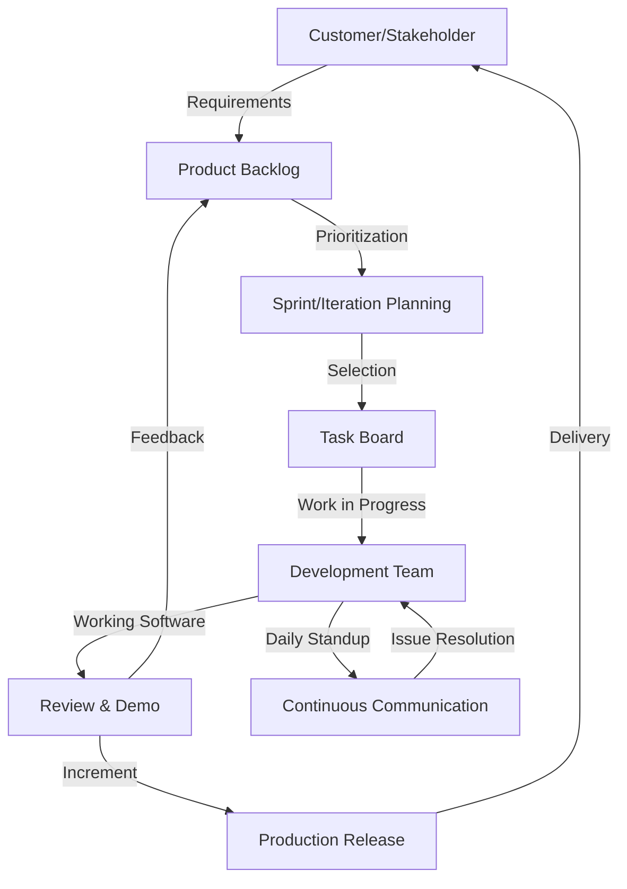
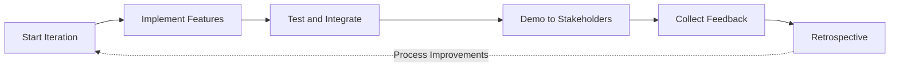
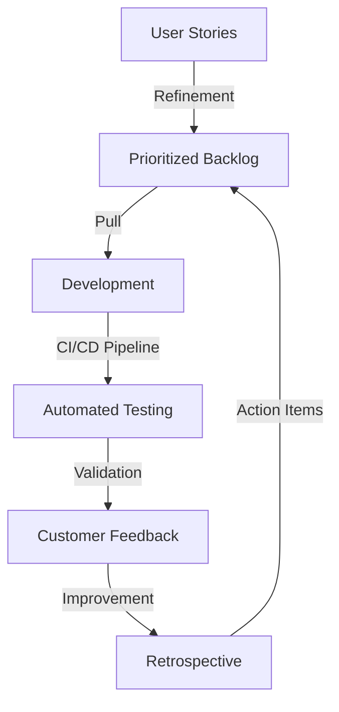

# Agile Overview

## Definition and Context

**Agile software development** is a group of methodologies and guiding principles that prioritize adaptive planning, iterative development, collaboration, and continual improvement, in response to the rising demand for more flexible and responsive approaches to software delivery. Agile approaches emerged as a direct response to the rigidity and sequential nature of traditional “waterfall” methodologies, enabling teams to adapt to changing requirements, reduce delivery risk, and improve product-market fit.

The origin of Agile is commonly traced to the publication of the **Manifesto for Agile Software Development** in 2001, which was authored by a group of software practitioners seeking to codify a lightweight, people-centered alternative to prescriptive software processes.

Agile does not denote a single process; rather, it encompasses a family of methods—including but not limited to **Scrum**, **Kanban**, **Extreme Programming (XP)**, and **Lean Software Development**—all of which instantiate the same foundational values and principles.

## Core Principles

At its foundation, Agile software development is characterized by a set of four core values and twelve guiding principles stated in the Agile Manifesto:

### Agile Manifesto: The Four Core Values

1. **Individuals and interactions over processes and tools**
2. **Working software over comprehensive documentation**
3. **Customer collaboration over contract negotiation**
4. **Responding to change over following a plan**

### Twelve Principles of Agile

The twelve principles provide operations-level guidance, such as:

- Satisfying the customer through early and continuous delivery of valuable software
- Welcoming changing requirements, even late in the development process
- Delivering working software frequently (from a couple of weeks to a couple of months)
- Collaborating closely with business stakeholders and developers
- Building projects around motivated individuals
- Using face-to-face conversation as the primary means of communication
- Measuring progress primarily through working software
- Encouraging sustainable and maintainable development pace
- Continuously focusing on technical excellence and good design
- Keeping things simple
- Empowering self-organizing teams
- Regularly reflecting on how to become more effective

## Typical Agile Process Architecture

Agile implementations are highly contextual, but most share certain fundamental architectural elements. The below diagram illustrates a generic Agile process architecture at the team level:

### Components Breakdown

- **Product Backlog**: An ordered list of features, technical tasks, and fixes, maintained and prioritized based on business value and technical need.
- **Sprint/Iteration Planning**: Regular planning sessions (often every 1–4 weeks), during which teams select and commit to a set of backlog items.
- **Task Board**: A visible tracking mechanism (physical or digital) displaying statuses such as To Do, In Progress, In Review, and Done.
- **Development Team**: A cross-functional group (developers, testers, analysts) responsible for implementing backlog items.
- **Review & Demo**: A recurring review session where completed work is demonstrated to stakeholders for feedback.
- **Production Release**: Releasing completed, value-adding increments to the live environment.
- **Continuous Communication**: Daily standups or similar interactions to surface impediments and synchronize progress.

## Iterative Development and Feedback Loops

Agile methodologies are characterized by **iterative development cycles** (generally 1–4 weeks, called sprints or iterations), which foster rapid feedback, facilitate changes in requirements, and promote continual alignment with stakeholder needs.

### Note
> The above feedback loop diagram specifically represents a generic Scrum or Kanban-based iteration; variants exist but typically retain this cyclical structure.

## Roles and Responsibilities

The Agile mindset establishes a collaborative, team-oriented structure, with defined (yet flexible) roles. Common roles include:

- **Product Owner**: Responsible for maximizing product value, backlog priority, clarifying requirements, and stakeholder engagement.
- **Development Team**: Cross-functional implementers who self-organize to achieve sprint goals; collectively responsible for delivering potentially releasable increments.
- **Scrum Master / Agile Coach**: Facilitator responsible for removing impediments, supporting adherence to Agile practices, and fostering continuous improvement.  
- **Stakeholders**: Business users, sponsors, or external parties providing requirements, feedback, and funding.

Multiple frameworks extend or refine these roles as suited (e.g., Kanban eschews fixed roles, XP emphasizes discipline-specific roles).

## Key Agile Practices

Agile encompasses a family of practices, of which the following are particularly widespread in engineering organizations:

- **User Stories & Backlog Grooming**: Emphasis on user-centric requirements, decomposed into small, testable increments.
- **Prioritization**: Continuous (re)prioritization of requirements by business value and technical risk.
- **Continuous Integration (CI)**: Shortening feedback cycles through automated builds, tests, and integrations.
- **Test-Driven Development (TDD)** and **Automated Testing**: Driving engineering quality and resilience.
- **Pair Programming / Code Reviews**: Encouraging collaboration, knowledge sharing, and quality assurance.
- **Retrospectives**: Dedicated sessions for process reflection and improvement.

## Constraints and Assumptions

- **Requirements Volatility**: Agile presupposes that requirements will evolve, thus mandates adaptive planning and modular design.
- **Team Size**: Small, cross-functional teams (typically 5–9 members) optimize communication and accountability.
- **Stakeholder Availability**: Frequent engagement and feedback from stakeholders are critical; their inaccessibility can impede the process.
- **Tooling & Automation**: Effective Agile requires robust tooling for backlog management, CI/CD, and collaboration.
- **Incrementality**: Features should be subdivided into valuable, independently deployable increments.

## Common Agile Variations

While Scrum and Kanban are the dominant named frameworks:

- **Scrum** emphasizes fixed-length sprints, clearly defined roles, timeboxed ceremonies, and strict commitment to sprint goals.
- **Kanban** is characterized by continuous (rather than iterative) flow, minimal prescriptive roles, WIP limits, and visualization of workflow via Kanban boards.
- **Extreme Programming (XP)** focuses on engineering practices such as TDD, pair programming, and continuous integration.
- **Lean Software Development** borrows and adapts principles from industrial lean manufacturing, with an emphasis on eliminating waste.

## Integration with Organizational Structures

Agile methods may be instantiated in a single team, across multiple “feature teams” in large products, or organization-wide. Scaling frameworks such as **Scaled Agile Framework (SAFe)**, **Large-Scale Scrum (LeSS)**, and **Disciplined Agile Delivery (DAD)** exist to coordinate multiple Agile teams delivering on shared objectives.

## Practical Engineering Considerations

> **:warning: Caution**
> Successful Agile adoption relies on more than process adherence—cultural buy-in, executive sponsorship, and a willingness to inspect and adapt are essential.

- **Integration Points**: Agile workflows must interoperate with upstream (requirements, design) and downstream (testing, release, operations) activities, as well as with non-Agile teams or legacy processes.
- **Performance**: Agile enables early value delivery and rapid iteration, but can introduce overhead if ceremonies are excessive or poorly focused.
- **Implementation Challenges**: Introductions of Agile often fail due to overprescription (“Agilefall”), tooling resistance, lack of experience, or superficial adoption.
- **Common Pitfalls**: These include misaligned incentives, role confusion, absence of empowered Product Owners, and neglecting retrospectives or technical practices.
- **Engineering Decisions**: Choices about iteration length, Definition of Done, investment in test automation, and balancing new feature versus technical debt work are frequent and critical.

## Reference to Standards and Specifications

While Agile is defined by broadly published manifestos, principles, and guides, it is not formally specified by ISO, ANSI, or IETF standards. Notably:

- The [Agile Manifesto](https://agilemanifesto.org/) and its [twelve principles](https://agilemanifesto.org/principles.html) are foundational.
- Specific frameworks such as Scrum are described in formal guides, e.g., the official [Scrum Guide](https://scrumguides.org/).
- XP is outlined in “Extreme Programming Explained” (Kent Beck et al.), and Lean draws from “Lean Software Development” (Mary and Tom Poppendieck).

## Summary

Agile represents a mindset and methodology designed to enhance software delivery adaptiveness, foster stronger collaboration, and increase the consistency and value of output. Its engineering impact is substantial: reshaping team structures, information flows, engineering practices, and risk management for the modern, evolving demands of software products and services.

> **:information_source: Tip**
> Adoption of Agile should focus on underlying principles and continual inspection and adaptation, rather than adherence to rituals alone. Engineering organizations are encouraged to experiment, measure outcomes, and refine processes in pursuit of improved delivery.