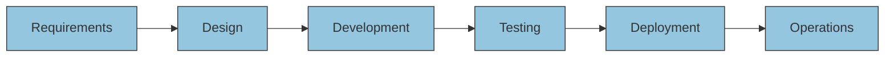
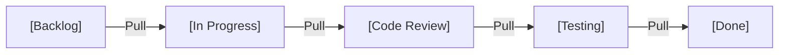
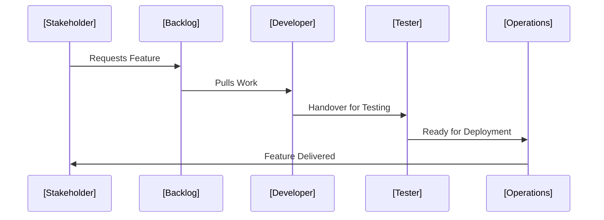
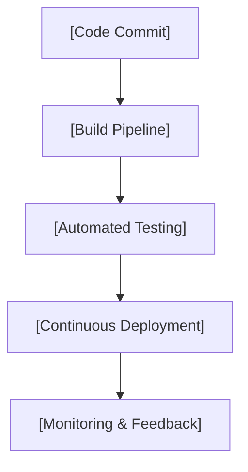
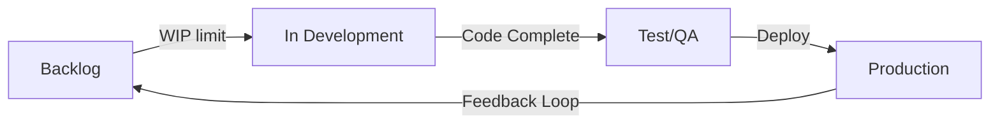

# Lean Principles for Software Delivery

## Introduction

Lean principles, originating from the Toyota Production System, form a methodology and mindset that focuses on delivering value by minimizing waste and maximizing flow throughout a process. In recent decades, the application of lean concepts has extended beyond manufacturing into domains such as healthcare, IT, and notably, software delivery.

Within software engineering, lean thinking provides a structured approach to optimize value creation, continuously improve processes, and deliver software systems more effectively. It intersects with agile methodologies but brings unique focus on flow efficiency, systemic waste reduction, and empiricism across the value stream.

This technical primer presents a comprehensive introduction to lean principles as applied to software delivery, contextualizes its core concepts, and provides guidance for practical engineering implementation.

---

## 1. Foundation and Definitions

### What is Lean?

Lean is a philosophy and set of management practices that aim to optimize the delivery of value by systematically reducing waste and enhancing flow. Key guiding questions in a lean system include:

- What is value, from the customer’s perspective?
- How can value—defined as the desired outcome or product—flow continuously towards the customer?
- Which activities or artifacts add value, and which are waste?
- How can learning and improvement be implemented at every level?

> **Key Definition:**  
> In software delivery, _value_ is typically defined as deployed software that meets a user need or supports a required business process.

### Lean and Agile: Relationship and Boundaries

Lean predates agile frameworks but shares compatible values and principles. Agile places stronger emphasis on team autonomy and iterative delivery; lean complements this with a rigorously systemic, end-to-end view, emphasizing the elimination of non-value-adding activities and optimizing the entire flow from idea to delivery.

Lean thinking influences several agile frameworks, particularly the Kanban Method and elements of Scrum. Lean is also present in scaled frameworks such as SAFe (Scaled Agile Framework).

---

## 2. Core Lean Principles

In the context of software delivery, the "classic" lean principles, adapted from _Lean Thinking_ by Womack & Jones, are typically expressed as follows:

### 2.1 Specify Value

Value must be defined precisely from the end-customer perspective. In software delivery, this requires:

- Direct engagement with stakeholders to understand needs and desired outcomes.
- Avoiding proxy definitions of value (e.g., feature counts, code size).
- Continuous feedback loops to validate assumptions about value during the development lifecycle.

### 2.2 Map the Value Stream

A value stream comprises all activities necessary to deliver a product or service, from concept to deployment. Mapping the value stream involves:

- Visualizing work as it proceeds through stages: ideation, development, testing, deployment, and operations.
- Identifying activities, queues, wait states, and handoffs.
- Highlighting waste and impediments.

#### Example Value Stream Map (Mermaid Diagram)

### 2.3 Create Flow

Ensure work progresses smoothly and without interruption through the value stream:

- Reduce handoff delays, context switching, and batch sizes.
- Remove bottlenecks by addressing resource, process, or knowledge constraints.
- Optimize for cycle time (time for a change to make it from request to production).

### 2.4 Establish Pull

“Pull” systems only allow work to be started or advanced when there is demand and capacity, instead of “pushing” work downstream regardless of readiness. In software delivery, this is commonly implemented via:

- Kanban boards limiting work in progress.
- Policies to trigger work initiation based on downstream availability.
- Just-in-time work elaboration to avoid early commitment.

#### Pull System Example (Mermaid Kanban Board)

### 2.5 Pursue Perfection

Lean advocates continuous improvement (kaizen):

- Use feedback, metrics, and retrospectives to uncover improvement opportunities.
- Engage everyone in systemic problem-solving.
- Embrace incremental changes, experiments, and adaptation.

---

## 3. Identifying and Eliminating Waste in Software Delivery

Lean recognizes seven forms of waste (“muda”) in manufacturing, which map well to software delivery contexts. These include:

| Waste Type      | Software Equivalent                       | Description                                 |
|-----------------|------------------------------------------|---------------------------------------------|
| Inventory       | Partially done work, code branches        | Work not yet delivering value               |
| Overproduction  | Building features before need is proven   | Premature or excessive development          |
| Extra Processing| Overly complex architecture or code       | Unnecessary steps, "gold-plating"           |
| Defects         | Bugs, rework                             | Work needing rework or bug fixes            |
| Motion          | Unnecessary movement between tools        | Context switching, manual transfers         |
| Transportation  | Handoffs across teams                     | Wait states, loss in communication          |
| Waiting         | Idle time for testing, code reviews       | Delay in steps or sign-offs                 |

> **Warning**  
> Failure to systematically identify and eliminate waste can result in substantial delays, increased costs, and low morale among delivery teams.

---

## 4. Flow-Based Thinking in Software Engineering

### 4.1 Flow Efficiency vs. Resource Efficiency

- **Resource efficiency** focuses on keeping people or systems busy at all times, often resulting in multitasking and context switching.
- **Flow efficiency** aims to minimize the total time it takes for a work item to pass through the value stream, even if some resources are idle.

Lean software delivery optimizes for flow efficiency, as delays have a nonlinear impact on value realization.

### 4.2 Measuring Flow

Key Lean metrics for software flow include:

- **Lead Time:** Time from request initiation to delivery.
- **Cycle Time:** Time from start of active work to completion.
- **Throughput:** Number of items delivered per unit of time.
- **WIP (Work In Progress):** Number of items in an unfinished state.

#### Flow Overview (Mermaid Sequence Diagram)

### 4.3 Flow Constraints and Bottlenecks

Common bottlenecks in software delivery include:

- Prioritization delays (unclear product ownership)
- Environment provisioning and CI/CD pipeline problems
- Manual or batch testing and approval gates
- Integration and deployment constraints

> **Caution**  
> Local optimization—improving only one stage—may worsen bottlenecks elsewhere. Focus on systemic changes based on value stream mapping.

---

## 5. Lean System Architecture in Software Delivery

Lean thinking is technology-agnostic, but several architectural choices can enhance lean outcomes:

### 5.1 Modular and Decoupled Architectures

- **Microservices** allow rapid, independent development and deployment, which aligns with reduced batch size and faster flow.
- **Clear APIs and interfaces** minimize wait states and dependencies.

### 5.2 Continuous Delivery and Automation

- **CI/CD pipelines** reduce wait and handoff time, enabling pull-based, just-in-time integration and deployment.
- **Automated testing** ensures rapid feedback and reduces the cost of defects.

#### CI/CD Pipeline Flow (Mermaid Diagram)

### 5.3 Feedback and Telemetry

- **Automated monitoring** and **user telemetry** provide continuous feedback about deployed system health and value realization.
- **Feature toggles** and **canary releases** support incremental experimentation, minimizing batch risk.

---

## 6. Implementing Lean in Practice

### 6.1 Typical Lean Software Workflow

1. **Backlog refinement**: Work items are continuously reviewed for customer alignment and readiness.
2. **Pull-based work selection**: Teams pull work based on WIP limits and capacity, rather than upstream scheduling.
3. **Incremental development**: Deliver value in small, tested, deployable increments.
4. **Continuous integration and deployment**: Streamline the path from commit to production.
5. **Feedback and improvement**: Use telemetry, reviews, and metrics for constant improvement.

#### Lean Workflow Overview (Mermaid Diagram)

### 6.2 Integration Points and Tooling

Lean implementations can leverage a broad set of tools:

- **Kanban boards** (physical or digital, e.g., Jira, Trello, Azure DevOps)
- **CI/CD platforms** (e.g., Jenkins, GitHub Actions, GitLab CI)
- **Monitoring stacks** (e.g., Prometheus, Grafana, New Relic)
- **Feedback integration** (e.g., direct user telemetry, A/B testing frameworks)

> **Tip**  
> Choose integration points that optimize signal-to-noise ratio in your feedback loops. Aim for actionable, high-frequency data over sporadic, low-action feedback.

### 6.3 Organizational Constraints and Variations

- **Governance Requirements**: In regulated industries, WIP limits may conflict with mandated reviews or sign-off workflows.
- **Team Size and Distribution**: Lean works at all scales but requires additional coordination for distributed or cross-functional teams.
- **Cultural Adoption**: Lean improvement relies on high-trust, learning-oriented culture; command-and-control environments may resist the transparency required.

---

## 7. Pitfalls and Engineering Considerations

### Common Challenges

- **Superficial adoption**: Implementing Kanban boards without actual change in workflows or WIP limits.
- **Ignoring waste**: Failing to act on identified value stream blockages due to organizational inertia.
- **Overemphasis on metrics**: Focusing solely on throughput or velocity, neglecting quality or feedback.

### Performance Implications

- **Batch size trade-offs**: Smaller batches accelerate feedback but increase integration and deployment frequency. Automation is crucial for scalability.
- **Tooling synchronization**: Misaligned CI/CD, testing, or monitoring tools can create new bottlenecks.

### Implementation Decisions

- **How to set WIP limits**: Start with current work patterns, then iteratively tune to reduce cycle time.
- **Incremental versus radical change**: Many organizations find evolutionary change less disruptive; radical process redesign can be high-risk.

> **Note**  
> For teams unfamiliar with lean principles, pilot implementation in a single value stream or feature team often provides a manageable learning curve.

---

## 8. Standards, Specifications, and Notable References

While lean itself is not standardized in the form of an RFC or ISO publication, its principles strongly influence modern frameworks:

- **Kanban Method**: David J. Anderson's Kanban is a widely referenced, lean-inspired approach for software.
- **SAFe**: The Scaled Agile Framework includes lean as a foundational basis for its principles.
- **ITIL 4**: The latest version of ITIL incorporates lean concepts for service management.
- **Lean Software Development**: An adaptation by Mary & Tom Poppendieck provides a software-focused treatment of lean thinking.

---

## Conclusion

Lean principles provide a systematic, disciplined approach to software delivery that emphasizes maximizing customer value, reducing waste, and enabling continuous flow. Integrating lean thinking in software engineering requires mapping and optimizing value streams, shifting to pull-based work systems, pursuing continuous feedback and improvement, and making architectural and tooling choices that reinforce flow efficiency.

Careful application of lean concepts can result in shorter lead times, improved quality, lower costs, and higher team morale if adopted holistically across the value stream and supported by automation, feedback mechanisms, and a learning-oriented culture.

---

## Diagram Index

- Value Stream Map: See Section 2.2
- Pull System Kanban: See Section 2.4
- Flow Sequence: See Section 4.2
- CI/CD Pipeline Flow: See Section 5.2
- Lean Workflow Overview: See Section 6.1

---

> **Note**  
> This primer has prioritized the technical engineering perspective. For organizational transformation guidance, refer to methodology handbooks and case studies tailored to your domain.