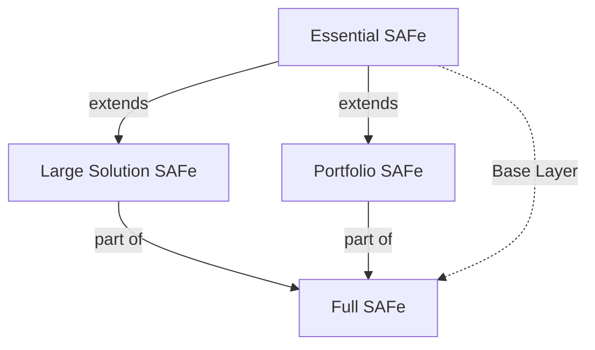
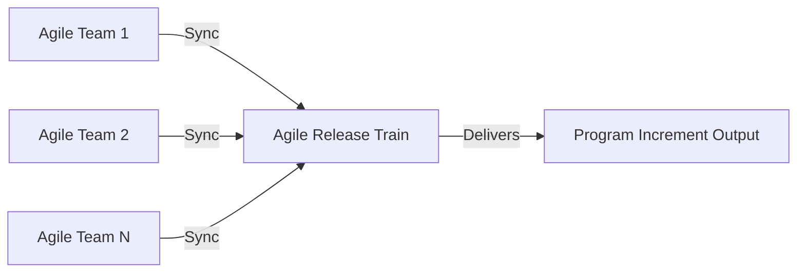
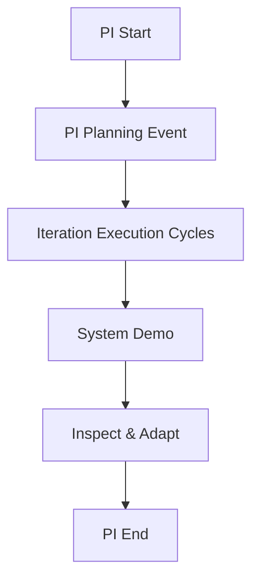
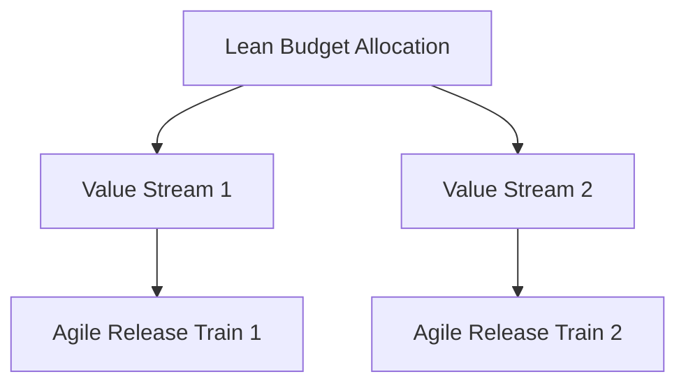
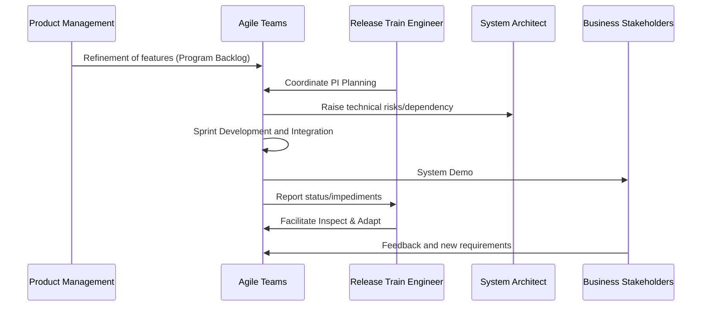

# SAFe (Scaled Agile Framework): An Engineering Overview

## Introduction

The Scaled Agile Framework (SAFe) is a structured, prescriptive, and widely adopted framework designed for scaling Agile, Lean, and DevOps practices across enterprises comprising multiple teams, programs, and portfolios. SAFe addresses challenges frequently encountered in large-scale software delivery, such as cross-team coordination, architectural consistency, governance, and alignment with business objectives. This document aims to provide engineers with a comprehensive medium-depth overview of the SAFe framework, its core principles, components, implementation mechanisms, as well as pertinent engineering considerations.

---

## Context and Rationale

Agile methodologies (notably Scrum and Kanban) are highly effective at the team level but often fall short when applied to large organizations with interdependent teams, shared architectures, and complex delivery pipelines. Typical problems include duplicated effort, misaligned priorities, architectural drift, and bottlenecks in delivery throughput.

SAFe evolves Agile principles to operate cohesively at *scale* by introducing roles, artifacts, workflows, and synchronization constructs that enable hundreds or thousands of individuals to collaborate on integrated deliverables within enterprise constraints.

---

## Core Principles

SAFe is based on ten immutable, Lean-Agile principles, distilled from Agile Manifesto, Lean product development, systems thinking, and flow theory. Key among these are:

- **Taking an economic view**: Optimizing for value delivery, lead time, and return on investment.
- **Applying systems thinking**: Addressing the organization, solution, and technical systems as a whole.
- **Assuming variability and preserving options**: Encouraging experimentation and set-based design.
- **Building incrementally with fast integrated learning cycles**: Using cadence and synchronization.
- **Base milestones on objective evaluation of working solutions**: Assessing progress with demonstrable increments.
- **Apply cadence; synchronize with cross-domain planning**: Aligning multiple teams to regular delivery cycles.
- **Unlock the intrinsic motivation of knowledge workers**: Delegating authority and fostering autonomy.
- **Decentralize decision making**: Empowering teams, reducing lead time.

---

## SAFe Configurations

SAFe offers multiple configurations to suit varying organizational scales and delivery complexities:

1. **Essential SAFe**: Minimal critical elements for successful scaling.
2. **Large Solution SAFe**: For building complex solutions not dependent on portfolio-level coordination.
3. **Portfolio SAFe**: Adds portfolio management and Lean budgeting.
4. **Full SAFe**: All levels—team, program, large solution, portfolio—suitable for the largest enterprises.

The following diagram illustrates these configurations and their hierarchical stacking:



---

## Key Components and Roles

SAFe defines structured levels, each with specific roles, artifacts, and ceremonies. At its core, these are:

### 1. Team Level

- **Agile Teams**: Cross-functional Scrum or Kanban teams that deliver working increments.
- **Scrum Master**: Facilitates the process, removal of impediments.
- **Product Owner**: Defines and prioritizes the team backlog.

### 2. Program Level (Agile Release Train - ART)

- **Agile Release Train (ART)**: A long-lived team of Agile Teams (~50-125 people) delivering value on a fixed cadence.
- **Release Train Engineer (RTE)**: Facilitates ART processes.
- **System Architect/Engineer**: Ensures architectural runway and technical alignment.
- **Product Management**: Specifies and manages program backlog.
- **Business Owners**: Key stakeholder accountability.

### 3. Large Solution Level

- **Solution Train**: Synchronizes multiple ARTs.
- **Solution Train Engineer (STE)**: Analogous to RTE at this level.
- **Solution Architect/Engineer**: Solution-wide technical coherence.
- **Solution Management**: Backlog for solutions spanning multiple ARTs.

### 4. Portfolio Level

- **Lean Portfolio Management (LPM)**: Governs portfolios and value streams.
- **Epic Owners**: Drive business epics through the portfolio Kanban system.
- **Enterprise Architect**: Cross-solution architectural direction.
- **Value Stream**: A sequence of steps delivering value.

---

## ART: The Core Engine

The Agile Release Train (ART) is the primary vehicle for delivering value in SAFe. It binds 5–12 Agile Teams into a synchronized unit, delivering increments of the solution at regular intervals called Program Increments (PIs), typically 8–12 weeks.



**GitHub Alert:**  
> **ℹ️ Note:** All teams on an ART operate on the same PI cadence, facilitating integration, synchronicity, and system demos.

---

## Program Increment (PI) Workflow

A Program Increment is a fixed timebox during which the ART delivers value in the form of working, tested software. The PI contains the following key events:

1. **PI Planning**: Face-to-face (or virtual) event where all ART participants align on PI objectives and plan iterations.
2. **Iteration Execution**: Scrum/Kanban teams deliver stories and features, integrating continuously.
3. **System Demo**: Regular demonstration of integrated work.
4. **Inspect & Adapt (I&A)**: Retrospective for the train, includes problem-solving workshops and improvement planning.



---

## Essential Artifacts and Backlog Management

SAFe prescribes several backlog and planning artifacts:

- **Team Backlog**: Stories and tasks prioritized by Product Owners.
- **Program Backlog**: Features prioritized by Product Management.
- **Solution Backlog**: Capabilities or large features across ARTs.
- **Portfolio Backlog**: Epics governed by portfolio management.

Workflow for backlog management:

```mermaid
flowchart LR
    PortfolioBacklog[Portfolio Backlog (Epics)]
    SolutionBacklog[Solution Backlog (Capabilities)]
    ProgramBacklog[Program Backlog (Features)]
    TeamBacklog[Team Backlog (Stories)]
    PortfolioBacklog -->|Decompose| SolutionBacklog
    SolutionBacklog -->|Decompose| ProgramBacklog
    ProgramBacklog -->|Decompose| TeamBacklog
```

---

## Synchronization and Alignment Mechanisms

SAFe synchronizes multiple teams and programs through:

- **Common cadence** for iterations and PIs.
- **Synchronisation ceremonies** (Joint PI Planning, ART Sync).
- **System and solution demos** with all stakeholders.
- **Inspect & Adapt** events for cross-team retrospectives.

**GitHub Alert:**  
> **⚠️ Caution:** Unsynchronized teams can lead to integration delays, architectural misalignments, and missed business objectives. Establishing and maintaining cadence is critical.

---

## Architectural Runway

SAFe introduces the concept of an **architectural runway**: existing code, components, and infrastructure needed to support near-term features without excessive redesign. The architectural runway is incrementally extended by both teams and dedicated architectural roles.

**Diagram Idea:** Architecture runway can be visualized as a layered architecture view with Solution Intent atop stable foundations.  
> **Note:** Diagram to be added later.

---

## Portfolio Governance and Lean Budgeting

At scale, traditional project management models are replaced by Lean Portfolio Management (LPM), which emphasizes:

- **Value Streams**: Organizing funding around value rather than projects.
- **Epic Kanban**: Governing major investments via WIP-limited Kanban.
- **Guardrails**: Clearly defined policies for decentralized spending.
- **Lean Budgets**: Allocation at the value stream or ART level, not for individual projects.



---

## Integration with DevOps

SAFe embeds a **Continuous Delivery Pipeline** concept, emphasizing:

- **Continuous Exploration**: Hypothesis generation and backlog enrichment.
- **Continuous Integration**: Frequent, automated integration and testing.
- **Continuous Deployment**: Automated deployment to production-like environments.
- **Release on Demand**: Business-driven release, decoupled from development cadence.

**GitHub Alert:**  
> **💡 Tip:** Effective automation (CI/CD, testing, monitoring) is essential to realize the fast feedback cycles SAFe promises. Manual integration or deployment is a common scaling bottleneck.

---

## Engineering Considerations and Practicalities

### Integration Points

- **Tooling interoperability**: Requires coordinated use of Agile ALM tools (e.g., Jira Align, Rally, Azure DevOps).
- **Backlog synchronization**: Consistent structures and field mappings across levels.
- **Automated reporting**: Required for metrics at ART, Value Stream, and Portfolio levels.

### Performance Implications

- **Cycle time**: Synchronization overhead can increase cycle time if not managed (e.g., excessive dependency or centralized control).
- **Throughput**: ARTs are sized to balance efficiency and minimize communication overhead (Dunbar's number applies).

### Implementation Challenges

- **Change management**: Pragmatic transition from project- and functional-based delivery to ART and value streams.
- **Role overload**: Individuals may be expected to fulfill multiple new roles.
- **Architectural alignment**: Legacy architectures may resist continuous integration or incremental design.

### Common Pitfalls

- **Cargo-cult adoption**: Merely renaming program/project meetings to ART ceremonies, without true mindset shift or architectural readiness.
- **Misalignment of incentives**: Persisting project-based funding undermines Lean budgeting gains.
- **Lack of true value alignment**: ARTs without clear value streams produce disconnected outputs.

### Typical Engineering Decisions

- **Sizing ARTs and Value Streams**: Based on product, architecture, and organizational boundaries.
- **Layering of backlogs**: Determining at what level features/capabilities should be managed, given dependencies and release strategies.
- **DevOps automation strategy**: Determining the optimal degree of pipeline standardization.

---

## Variations and Alternatives

While SAFe is one of the most prescriptive frameworks for scaling Agile, organizations may adapt or combine it with:

- **Scrum@Scale**, **LeSS** (Large-Scale Scrum), **Nexus**: Lighter-weight alternatives focusing on multi-team Scrum integration.
- **Hybrid approaches**: Combining SAFe with Spotify’s squad model or custom value delivery frameworks.

**GitHub Alert:**  
> **⚠️ Warning:** Strict adherence to every SAFe role, event, or artifact may generate unnecessary bureaucracy in smaller or less complex organizations. Apply tailoring with intent, retaining focus on Lean-Agile values and outcomes.

---

## Compliance, Standards, and References

Although no central international standard mandates SAFe, it incorporates and aligns with:

- **Agile Manifesto (agilemanifesto.org)**
- **Lean Principles** (as in Lean IT, Lean Software Development)
- **DevOps practices** (Continuous Delivery)
- **Scaled Agile, Inc’s SAFe Specifications** (available at scaledagileframework.com)

Engagement with SAFe often necessitates cross-reference to established Agile, Lean, and DevOps specification documents.

---

## Summary

SAFe is a comprehensive, layered framework for scaling Lean-Agile development across multiple, interdependent teams and organizational strata. It provides robust mechanisms for synchronizing delivery, managing complexity, and governing at scale while maintaining a focus on value, flow, and decentralized decision-making. Successful adoption of SAFe requires commitment to Agile- and Lean-based change, effective technical and organizational integration, and careful, context-driven adaptation.

---

## Appendix: Example SAFe ART Delivery Lifecycle



---

**End of document**