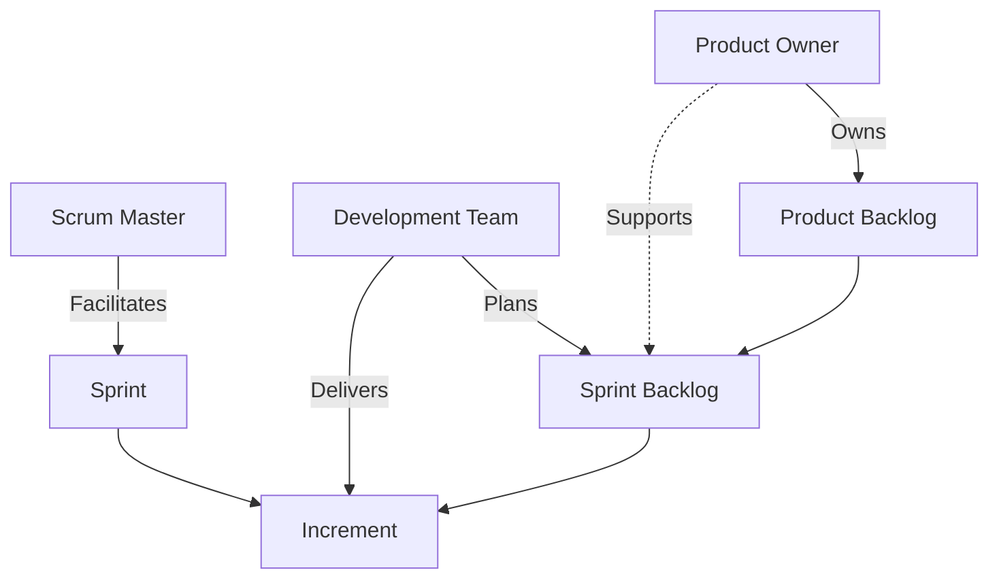
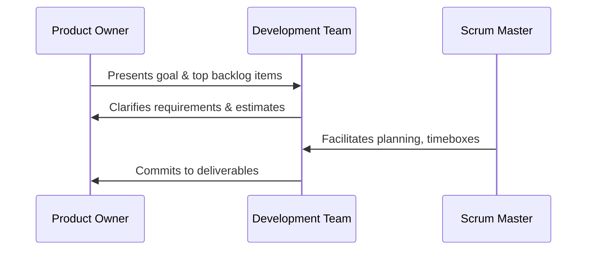
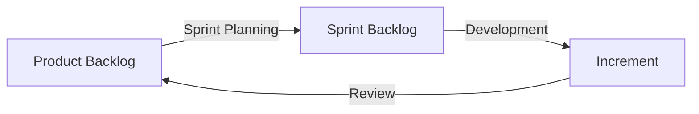
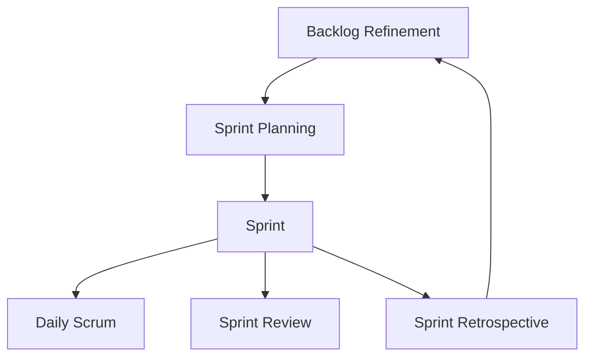

# Scrum Framework

## 1. Introduction

Scrum is a lightweight, empirical process framework designed for managing and completing complex work, originally formulated in the context of software engineering but applicable to a broad range of domains. It provides a structured approach for teams to iteratively and incrementally deliver value, emphasizing adaptability, transparency, and inspection. Scrum forms one of the main pillars of Agile methodologies and is described via the _Scrum Guide_, which standardizes terminology and roles.

Engineers implementing or participating in Scrum should understand its core principles, elements, workflow, and implications. This document provides a comprehensive technical primer, focused on equipping engineering teams and practitioners with the necessary knowledge to apply Scrum in a variety of technical environments.

---

## 2. Technical Context and Key Concepts

### 2.1 Empirical Process Control

Scrum relies on *empiricism*, meaning that decisions are made based on observation, experience, and experimentation, rather than detailed upfront planning or prediction. It leverages the following pillars:

- **Transparency:** Key aspects of the process must be visible and understandable to all participants.
- **Inspection:** Scrum artifacts and progress are frequently inspected against set goals.
- **Adaptation:** The process or work must be adjusted as soon as possible when deviations are observed.

Scrum does not prescribe specific engineering practices, technologies, or workflow tools. Instead, it defines the roles, events, and artifacts required to create an adaptive process that can flexibly respond to change and uncertainty. The framework's boundaries allow for integrating technical best practices as appropriate to the particular engineering context.

### 2.2 Terminology

- **Increment:** The sum of all completed Product Backlog items during a Sprint, representing potentially shippable work.
- **Sprint:** A fixed-length iteration, typically 1-4 weeks, within which a specific work goal is completed.
- **Product Backlog:** An ordered list of all work items, features, enhancements, and fixes required in the product.
- **Task:** A unit of technical work required to complete a larger work item.

---

## 3. Architecture of Scrum

The Scrum framework is structured around three core roles, five events, and three artifacts. The simplest schematic representation is:


*Scrum Framework Overview: Key roles, artifacts, and their relationships.*

---

## 4. Scrum Roles

### 4.1 Product Owner

The Product Owner (PO) is responsible for maximizing the value delivered by the team. This role:

- Owns and manages the Product Backlog, including item ordering and refinement.
- Clearly articulates items and goals to the team.
- Accepts or rejects increments on behalf of stakeholders.
- Is a single individual (not a committee) for accountability.

**Engineering Considerations:**  
The PO must interface closely with business stakeholders, users, and technical teams. Ineffective backlog management is a common source of bottlenecks; POs should be deeply familiar with both business goals and technical constraints.

### 4.2 Scrum Master

The Scrum Master (SM) is a servant-leader responsible for facilitating the Scrum process:

- Coaches the team in Scrum theory and practice.
- Shields the team from impediments or external disruptions.
- Facilitates events as needed.

**Engineering Considerations:**  
A strong Scrum Master enables the team to identify obstacles early (technical debt, integration roadblocks, unclear requirements) and encourages a culture of self-improvement.

### 4.3 Development Team

The Development Team (DT) consists of professionals who do the work of delivering a potentially releasable increment at the end of each sprint:

- Self-organizing: They internally decide how to accomplish work.
- Cross-functional: Team possesses all skills required to deliver the increment.
- No sub-roles: No titles or sub-teams within.

**Note:** For larger products, Scrum teams often scale and coordinate via approaches such as Nexus or LeSS.

---

## 5. Scrum Events (Ceremonies)

Each event in Scrum is designed to enable regular inspection, adaptation, and transparency. 

### 5.1 Sprint

The heart of Scrum is the _Sprint_, a time-boxed iteration (1-4 weeks, commonly 2 weeks for engineering teams). All work to deliver a product increment is performed within the sprint.

- Sprint goal is set at the start and remains unchanged.
- Scope may be renegotiated if necessary but the timebox is immutable.

**Caution**

> Cancelling or stretching sprints erodes predictability and undermines empirical process control.

### 5.2 Sprint Planning

Purpose: Define what can be delivered in the increment and how it will be achieved.

**Inputs:**

- Product Backlog (prepared by Product Owner)
- Team velocity/throughput data (for planning load)
- Past increment feedback

**Outputs:**

- Sprint goal
- Selected Sprint Backlog items (stories/tasks)
- Plan for achieving the increment

**Mermaid:** _Sprint Planning Overview_



### 5.3 Daily Scrum (Standup)

A 15-minute event for the development team to synchronize and plan the next 24 hours.

- Each team member shares what they did, will do, and blockers.
- Promotes self-organization and accountability.

### 5.4 Sprint Review

Held at the end of the sprint, this meeting demonstrates the increment to stakeholders and collects feedback.

- Focus on "what was done", not on individual performance.
- Feedback may impact subsequent backlog prioritization.

### 5.5 Sprint Retrospective

A team-oriented event for process improvement.

- Inspect how the sprint went in terms of people, relationships, process, and tools.
- Identify actionable improvement items for next sprint.

---

## 6. Scrum Artifacts

Artifacts in Scrum serve to provide transparency and opportunities for inspection and adaptation.

### 6.1 Product Backlog

- An emergent, ordered list of all desired work.
- Each item (often called "Product Backlog Item" or PBI) is value-driven, refined, and estimated.
- Maintained solely by the Product Owner.

**Engineering Implication:**  
Teams relying on poorly refined backlogs waste engineering capacity on ambiguity or rework. Continuous backlog refinement (also called "backlog grooming") is crucial.

### 6.2 Sprint Backlog

- Set of selected backlog items committed for implementation in the current sprint.
- Includes a plan for how to deliver them.
- Continually updated by the development team throughout the sprint.

### 6.3 Increment

- The sum of all completed backlog items during a sprint, meeting the "Definition of Done."
- Must be in a usable state, regardless of whether the Product Owner decides to release it.

**Mermaid:** _Scrum Artifact Flow_



---

## 7. Definition of Done (DoD)

The _Definition of Done_ is a shared understanding within the team of what it means for work to be considered complete. It sets quality standards and delivers consistency.

- Typically includes coding, code review, testing, documentation, and deployment criteria.
- May be formalized as a checklist or automated in toolchains (e.g., CI/CD pipelines).

**Practical Tip**

> Explicitly define and automate "Done" criteria in your engineering workflows to reduce ambiguity and technical debt.

---

## 8. Scrum Workflow: End-to-End Example

Below is an end-to-end summarization of the Scrum workflow for a typical engineering team:


*Scrum Iteration Lifecycle*

### 8.1 Typical Steps

1. **Backlog Refinement/Grooming:** Product Owner and team clarify and estimate backlog items.
2. **Sprint Planning:** Selects upcoming work and agrees on sprint goal.
3. **Sprint Execution:** Team works on items, holding Daily Scrums.
4. **Review:** Finished increment is demoed to stakeholders, feedback gathered.
5. **Retrospective:** Team discusses process improvements, closes the loop back to backlog/refinement.

---

## 9. Engineering Implementation Considerations

### 9.1 Tooling and Integration

- *Backlog and Sprint Tracking:* Common tools include Jira, Azure DevOps, Trello, or custom solutions.
- *Continuous Integration/Continuous Deployment (CI/CD):* Integrating DoD with automated pipelines is advised.
- *Metrics/Reporting:* Velocity, burndown charts, cumulative flow diagrams, and defect rates are used for empirical improvement.

**GitHub Alert:**

> Ensure your toolchain does not obscure transparency; avoid tools that make the actual work, workflow, or progress invisible to stakeholders.

### 9.2 Distributed and Remote Teams

- Use synchronous video collaboration for Scrum events.
- Co-located sprint boards may need to be replaced with digital equivalents.

### 9.3 Scaling Scrum

For complex systems or products with multiple teams, Scrum may be scaled using patterns/frameworks such as:

- **Nexus:** Extends Scrum to multiple teams working on a single product.
- **LeSS (Large-Scale Scrum):** Focused on simplicity, minimal roles.
- **SAFe (Scaled Agile Framework):** Incorporates Scrum within a larger delivery model with additional roles/events.

**Note:**  
Diagram to be added later for "Scaled Scrum with Nexus or LeSS".

### 9.4 Technical Debt and Definition of Done

Enforcing a robust Definition of Done is essential to avoid technical debt accumulation. Teams that compromise quality to deliver more backlog items in a sprint often undermine long-term maintainability and predictability.

---

## 10. Common Pitfalls and Anti-Patterns

- **Water-Scrum-Fall:** Upfront requirements/specification followed by sequential (non-iterative) phases under Scrum branding.
- **Role Blurring:** Single person acting as both Scrum Master and Product Owner; PO acting as team manager.
- **Skipping Retrospectives:** Losing opportunities for improvement and adaptation.
- **Over-Planning:** Excessive documentation and planning within sprints, reminiscent of waterfall.
- **Under-Commitment/Over-Commitment:** Misestimation of velocity or team capacity.

---

## 11. Variations and Extensions

Scrum's boundaries are intentionally minimal. Variants and extensions exist:

- **Scrumban:** Hybrid of Scrum and Kanban, allows more flexible work intake.
- **Kanban within Scrum:** Applying Kanban visualization and WIP limits to manage sprint backlog.
- **DevOps Integration:** Close integration with operations, CI/CD, and shift-left quality engineering.

---

## 12. Related Standards and Guides

- *The Scrum Guide* (Ken Schwaber & Jeff Sutherland, latest revision 2020)
- *Agile Manifesto* (2001): Foundation for the Agile movement.
- *ISO/IEC 26515*: Guidelines for Agile development documentation.

---

## 13. Practical Example: Sprint Life Cycle for a Software Feature

The following Mermaid flow details how a feature request moves through the Scrum process:

```mermaid
flowchart LR
    RQ[New Feature Request] --> PO1[Product Owner Reviews]
    PO1 --> PB1[Backlog Inclusion]
    PB1 --> RF[Refinement]
    RF --> SPL[Sprint Planning]
    SPL --> DT1[Development]
    DT1 --> QA[Testing/QA]
    QA --> INC1[Increment (Complete)]
    INC1 --> SR[Sprint Review]
    SR --> D[Deployed/Released]
```

---

## 14. Summary

Scrum provides a simple yet powerful framework for managing and delivering complex engineering projects in a volatile environment. By emphasizing empiricism, clear roles, structured artifacts, and regular events, Scrum enables teams to deliver value iteratively, adapt processes, and improve productivity and quality continuously.

Engineers leveraging Scrum must focus on maintaining transparency, reinforcing inspection and adaptation cycles, and embracing technical discipline through robust definitions of done and integrated tooling. Scrum's framework encourages, but does not enforce, best engineering practices, making it important to supplement Scrum with domain-specific best practices in software engineering, DevOps, or operations as appropriate.

---

**End of Scrum Framework Technical Primer**